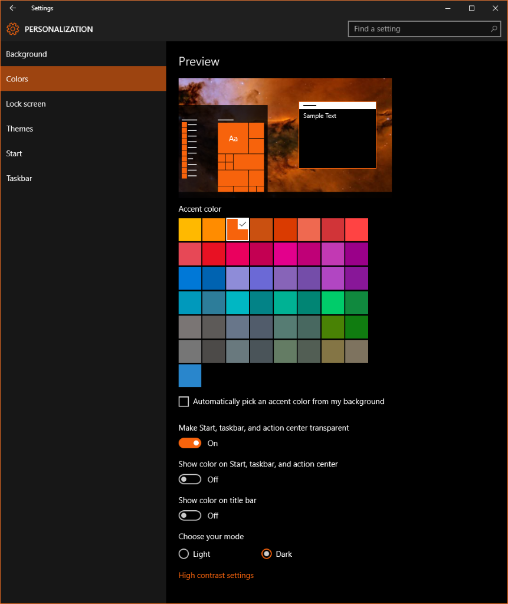
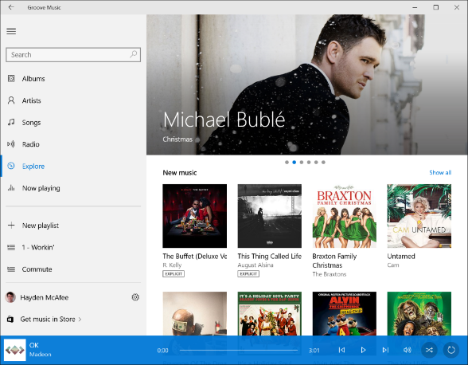
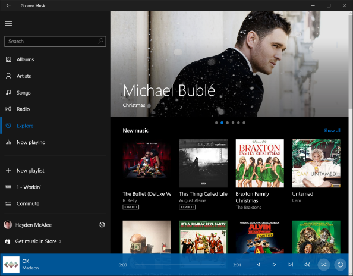

# Set dark mode


This personalization setting for end users allows them to express preference whether to see applications which support the setting in a dark or light mode.



Many Microsoft first party applications apply the setting and it is easy for you to support the functionality in your UWP applications as well.



OEMs can customize themes via Unattend.xml as such:

```
<settings pass=”oobeSystem”> 
        <Themes> 
            <ThemeName>MyOLEDTheme</ThemeName> 
            <DefaultThemesOff>false</DefaultThemesOff> 
            <DesktopBackground>c:\windows\OLEDFriendlyImage.jpg</DesktopBackground> 
            <WindowColor>Lime</WindowColor> 
        </Themes> 
    </settings> 
```

In Windows 10, build 1607, a setting has been added for light/dark mode toggle.

```
<settings pass=”oobeSystem”> 
        <Themes> 
            <ThemeName>MyOLEDTheme</ThemeName> 
            <DefaultThemesOff>false</DefaultThemesOff> 
            <DesktopBackground>c:\windows\OLEDFriendlyImage.jpg </DesktopBackground> 
            <WindowColor>Lime</WindowColor> 
            <UWPAppsUseLightTheme>false</UWPAppsUseLightTheme> 
        </Themes> 
    </settings> 
```

 

 

[Send comments about this topic to Microsoft](mailto:wsddocfb@microsoft.com?subject=Documentation%20feedback%20%5Bp_customize_desktop\p_customize_desktop%5D:%20Set%20dark%20theme%20%20RELEASE:%20%2810/19/2016%29&body=%0A%0APRIVACY%20STATEMENT%0A%0AWe%20use%20your%20feedback%20to%20improve%20the%20documentation.%20We%20don't%20use%20your%20email%20address%20for%20any%20other%20purpose,%20and%20we'll%20remove%20your%20email%20address%20from%20our%20system%20after%20the%20issue%20that%20you're%20reporting%20is%20fixed.%20While%20we're%20working%20to%20fix%20this%20issue,%20we%20might%20send%20you%20an%20email%20message%20to%20ask%20for%20more%20info.%20Later,%20we%20might%20also%20send%20you%20an%20email%20message%20to%20let%20you%20know%20that%20we've%20addressed%20your%20feedback.%0A%0AFor%20more%20info%20about%20Microsoft's%20privacy%20policy,%20see%20http://privacy.microsoft.com/default.aspx. "Send comments about this topic to Microsoft")


