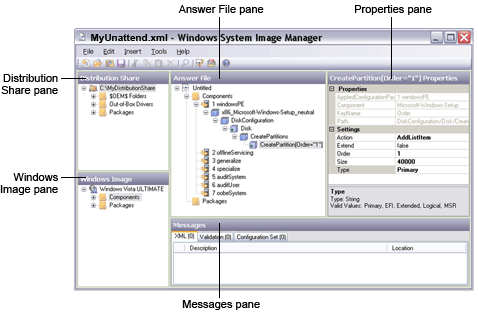

# Windows System Image Manager User Interface Overview

The Windows System Image Manager (Windows SIM) user interface contains a series of panes. You can use these panes to open Windows image (.**wim**) files, create unattended answer files, and then add components and packages to the respective configuration passes in an answer file.

The following screen shot illustrates the Windows SIM user interface.

## In This Section

-   [Windows SIM Panes](#-simpanes)

-   [Windows SIM Menus](#-simmenu)

-   [Windows SIM Buttons](#-simbuttons)

## Windows SIM Panes

### Distribution Share Pane

The **Distribution Share** pane displays the currently open distribution share folder in tree view. You can select, create, explore, and close distribution share folders by selecting the top node and then right-clicking in the pane. You can add items in an open distribution share folder to an answer file by right-clicking the item. For more information, see [Distribution Shares and Configuration Sets Overview](distribution-shares-and-configuration-sets-overview.md).

### Answer File Pane

The **Answer File** pane displays the Windows Setup configuration passes, the settings to apply in each pass, and the packages to install. You can open and change an existing answer file, validate the settings in an answer file against a Windows image, or create a new answer file. For more information, see [Answer Files Overview](answer-files-overview.md).

### Windows Image Pane

The **Windows Image** pane displays the currently open Windows image in tree view. When the tree is expanded, all of the components and packages for the image are visible and available to add to an answer file in the **Answer File** pane. For more information, see [Windows Image Files and Catalog Files Overview](windows-image-files-and-catalog-files-overview.md).

### Properties Pane

The **Properties** pane displays the properties and settings of a selected component or package. You can use the **Properties** pane to change the settings, and, in the case of packages, Windows feature selections. At the bottom of the **Properties** pane, Windows SIM displays the name of the setting and the associated **Microsoft® .NET** type. For more information, see [Component Settings and Properties Reference](component-settings-and-properties-reference.md).

### Messages Pane

The **Messages** pane consists of three tabs: **XML**, **Validation**, and **Configuration Set**. Clicking a tab in the **Messages** pane displays the type of message, a description, and the location of the issue.

The types of messages that the **Messages** pane displays are informational. Messages appear on the **Configuration Set** tab if a configuration set has been created. For more information, see [Distribution Shares and Configuration Sets Overview](distribution-shares-and-configuration-sets-overview.md).

## Windows SIM Menus

### File Menu

<table>
<colgroup>
<col width="50%" />
<col width="50%" />
</colgroup>
<thead>
<tr class="header">
<th>Menu command</th>
<th>Description</th>
</tr>
</thead>
<tbody>
<tr class="odd">
<td>
<strong>New Answer File</strong>
</td>
<td>
Creates a new answer file.
</td>
</tr>
<tr class="even">
<td>
<strong>Open Answer File</strong>
</td>
<td>
Opens an existing answer file.
</td>
</tr>
<tr class="odd">
<td>
<strong>Close Answer File</strong>
</td>
<td>
Closes the currently open answer file.
</td>
</tr>
<tr class="even">
<td>
<strong>Save Answer File</strong>
</td>
<td>
Saves the currently open answer file.
</td>
</tr>
<tr class="odd">
<td>
<strong>Save Answer File As…</strong>
</td>
<td>
Opens a dialog box to enable naming of the answer file with which you are currently working.
</td>
</tr>
<tr class="even">
<td>
<strong>Select Distribution Share</strong>
</td>
<td>
Opens a valid distribution share folder.
</td>
</tr>
<tr class="odd">
<td>
<strong>Close Distribution Share</strong>
</td>
<td>
Closes the currently open distribution share folder.
</td>
</tr>
<tr class="even">
<td>
<strong>Select Windows Image</strong>
</td>
<td>
Browses to and selects a Windows image file.
</td>
</tr>
<tr class="odd">
<td>
<strong>Close Windows Image</strong>
</td>
<td>
Closes the currently open Windows image file.
</td>
</tr>
<tr class="even">
<td>
<strong>Exit</strong>
</td>
<td>
Closes Windows SIM.
</td>
</tr>
</tbody>
</table>

 

### Edit Menu

<table>
<colgroup>
<col width="50%" />
<col width="50%" />
</colgroup>
<thead>
<tr class="header">
<th>Menu command</th>
<th>Description</th>
</tr>
</thead>
<tbody>
<tr class="odd">
<td>
<strong>Cut</strong>
</td>
<td>
Deletes the highlighted text or tree structure (<strong>Unattend</strong> and <strong>Properties</strong>).
</td>
</tr>
<tr class="even">
<td>
<strong>Copy</strong>
</td>
<td>
Copies the highlighted text or tree structure (all panes).
</td>
</tr>
<tr class="odd">
<td>
<strong>Paste</strong>
</td>
<td>
Pastes text or tree structure (<strong>Unattend</strong> and <strong>Properties</strong>).
</td>
</tr>
<tr class="even">
<td>
<strong>Delete</strong>
</td>
<td>
Deletes the currently selected item or text. (This command may be disabled if the item is not removable.)
</td>
</tr>
<tr class="odd">
<td>
<strong>Find</strong>
</td>
<td>
Opens a search dialog box to scan a Windows image and answer file, distribution share, or message for a specific item.
</td>
</tr>
<tr class="even">
<td>
<strong>Revert Change</strong>
</td>
<td>
Reverts the most recent customization.
</td>
</tr>
<tr class="odd">
<td>
<strong>Write Image Value</strong>
</td>
<td>
Writes the value of the setting in the currently open Windows image to the answer file.
</td>
</tr>
<tr class="even">
<td>
<strong>Add to Answer File</strong>
</td>
<td>
For components, a submenu opens that shows the available passes. The item and its children are added to the Unattend.xml answer file. Packages are automatically added to the packages section of the Unattend.xml answer file.
</td>
</tr>
</tbody>
</table>

 

### Insert Menu

<table>
<colgroup>
<col width="50%" />
<col width="50%" />
</colgroup>
<thead>
<tr class="header">
<th>Menu command</th>
<th>Description</th>
</tr>
</thead>
<tbody>
<tr class="odd">
<td>
<strong>Synchronous Command</strong>
</td>
<td>
Adds a synchronous command to a configuration pass. You can select the <strong>windowsPE</strong>, <strong>specialize</strong>, <strong>auditUser</strong>, or <strong>oobeSystem</strong> configuration pass. After you select a configuration pass, a window opens so that you can specify the command line and the order of execution.
</td>
</tr>
<tr class="even">
<td>
<strong>Driver Path</strong>
</td>
<td>
Adds a driver path to a configuration pass. You can use <strong>Driver Path</strong> to select the configuration pass in which to add the driver path. <strong>Driver Path</strong> then opens a window where you can select a file or folder.
</td>
</tr>
<tr class="odd">
<td>
<strong>Package(s)</strong>
</td>
<td>
Opens a window where you can browse to the location of a package. Then, it inserts a package from a file or folder into the currently open answer file.
</td>
</tr>
</tbody>
</table>

 

### Tools Menu

<table>
<colgroup>
<col width="50%" />
<col width="50%" />
</colgroup>
<thead>
<tr class="header">
<th>Menu command</th>
<th>Description</th>
</tr>
</thead>
<tbody>
<tr class="odd">
<td>
<strong>Hide Sensitive Data</strong>
</td>
<td>
Stores local account passwords in an answer file as unreadable text. Domain passwords, product keys, and other sensitive data are not hidden.
</td>
</tr>
<tr class="even">
<td>
<strong>Validate Answer File</strong>
</td>
<td>
Validates the XML and other settings in the answer file. Settings are validated against the currently open Windows image.
</td>
</tr>
<tr class="odd">
<td>
<strong>Create Configuration Set</strong>
</td>
<td>
Generates a new configuration set.
</td>
</tr>
<tr class="even">
<td>
<strong>Explore Distribution Share</strong>
</td>
<td>
Opens a distribution share folder in Windows Explorer or File Explorer view.
</td>
</tr>
<tr class="odd">
<td>
<strong>Create Distribution Share</strong>
</td>
<td>
Creates a distribution share folder and subfolders.
</td>
</tr>
<tr class="even">
<td>
<strong>Import Package(s)</strong>
</td>
<td>
Enables you to browse to a folder that contains a package, and then import it into the currently open distribution share. For more information, see [Add Packages to a Distribution Share](add-packages-to-a-distribution-share.md).
</td>
</tr>
<tr class="odd">
<td>
<strong>Create Catalog</strong>
</td>
<td>
Generates a catalog file. For more information, see [Open a Windows Image or Catalog File](open-a-windows-image-or-catalog-file.md).
</td>
</tr>
</tbody>
</table>

 

### Help Menu

<table>
<colgroup>
<col width="50%" />
<col width="50%" />
</colgroup>
<thead>
<tr class="header">
<th>Menu command</th>
<th>Description</th>
</tr>
</thead>
<tbody>
<tr class="odd">
<td>
<strong>Image Manager Help</strong>
</td>
<td>
Displays the User's Guide.
</td>
</tr>
<tr class="even">
<td>
<strong>Unattended Reference</strong>
</td>
<td>
Displays the Unattended Windows Setup Reference.
</td>
</tr>
<tr class="odd">
<td>
<strong>About</strong>
</td>
<td>
Displays version, copyright, and licensing information.
</td>
</tr>
</tbody>
</table>

 

## Windows SIM Buttons

<table>
<colgroup>
<col width="50%" />
<col width="50%" />
</colgroup>
<thead>
<tr class="header">
<th>Button name</th>
<th>Function</th>
</tr>
</thead>
<tbody>
<tr class="odd">
<td>
<strong>New Answer File</strong>
</td>
<td>
Creates a new answer file.
</td>
</tr>
<tr class="even">
<td>
<strong>Open Answer File</strong>
</td>
<td>
Opens an existing answer file.
</td>
</tr>
<tr class="odd">
<td>
<strong>Close Answer File</strong>
</td>
<td>
Closes the currently selected answer file.
</td>
</tr>
<tr class="even">
<td>
<strong>Save Answer File</strong>
</td>
<td>
Saves the currently open answer file.
</td>
</tr>
<tr class="odd">
<td>
<strong>Cut, Copy, Paste, Delete</strong>
</td>
<td>
Manipulates data.
</td>
</tr>
<tr class="even">
<td>
<strong>Find</strong>
</td>
<td>
Enables you to search through a Windows image and answer file, through a distribution share, or within the <strong>Messages</strong> pane.
</td>
</tr>
<tr class="odd">
<td>
<strong>Validate Answer File</strong>
</td>
<td>
Validates the answer file against the settings in the opened catalog file.
</td>
</tr>
<tr class="even">
<td>
<strong>Create Configuration Set</strong>
</td>
<td>
Creates a configuration set.
</td>
</tr>
<tr class="odd">
<td>
<strong>Help Contents</strong>
</td>
<td>
Displays the User's Guide.
</td>
</tr>
</tbody>
</table>

 

## Related topics

[Windows System Image Manager Scenarios Overview](windows-system-image-manager-scenarios-overview.md)

[Windows System Image Manager Overview Topics](windows-system-image-manager-overview-topics.md)

 

 

[Send comments about this topic to Microsoft](mailto:wsddocfb@microsoft.com?subject=Documentation%20feedback%20%5Bp_wsim\p_wsim%5D:%20Windows%20System%20Image%20Manager%20User%20Interface%20Overview%20%20RELEASE:%20%2810/17/2016%29&body=%0A%0APRIVACY%20STATEMENT%0A%0AWe%20use%20your%20feedback%20to%20improve%20the%20documentation.%20We%20don't%20use%20your%20email%20address%20for%20any%20other%20purpose,%20and%20we'll%20remove%20your%20email%20address%20from%20our%20system%20after%20the%20issue%20that%20you're%20reporting%20is%20fixed.%20While%20we're%20working%20to%20fix%20this%20issue,%20we%20might%20send%20you%20an%20email%20message%20to%20ask%20for%20more%20info.%20Later,%20we%20might%20also%20send%20you%20an%20email%20message%20to%20let%20you%20know%20that%20we've%20addressed%20your%20feedback.%0A%0AFor%20more%20info%20about%20Microsoft's%20privacy%20policy,%20see%20http://privacy.microsoft.com/en-us/default.aspx. "Send comments about this topic to Microsoft")

