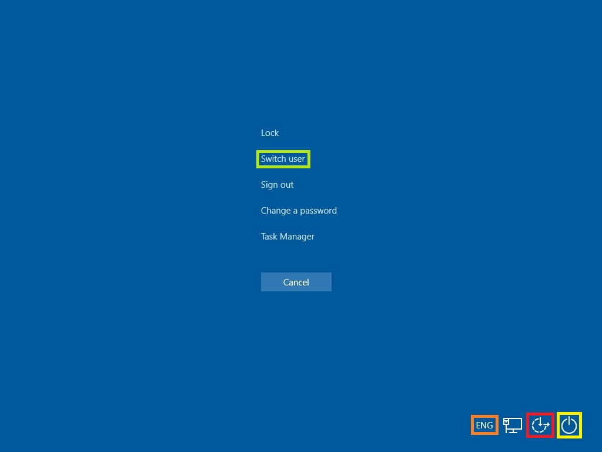

# Complementary features to Custom Logon

You may want to use or change some of the following features in conjunction with Custom Logon to complete the user experience.

### Power button

We recommend that you remove the power button from the Welcome screen and block the physical power button so that a user cannot turn off the device when using assigned access or Shell Launcher.

Go to **Power Options** &gt; **Choose what the power button does**, change the setting to **Do nothing**, and then **Save changes**.

### Welcome screen

**To remove buttons from the Welcome screen**

-   To remove buttons from the Welcome screen, set the appropriate value for **BrandingNeutral** in the following registry key:

    **HKLM\\Software\\Microsoft\\Windows Embedded\\EmbeddedLogon**

The following table shows the possible values. To disable multiple Welcome screen UI elements, combine these values using bitwise exclusive-or logic.

<table>
<colgroup>
<col width="50%" />
<col width="50%" />
</colgroup>
<thead>
<tr class="header">
<th>Action</th>
<th>Registry value</th>
</tr>
</thead>
<tbody>
<tr class="odd">
<td>
Disable all Welcome screen UI elements
</td>
<td>
<strong>static const DWORD EMBEDDED_DISABLE_LOGON_ANCHOR_ALL = 0x1</strong>
</td>
</tr>
<tr class="even">
<td>
Disable the Power button
</td>
<td>
<strong>static const DWORD EMBEDDED_DISABLE_LOGON_ANCHOR_SHUTDOWN = 0x2</strong>
</td>
</tr>
<tr class="odd">
<td>
Disable the Language button
</td>
<td>
<strong>static const DWORD EMBEDDED_DISABLE_LOGON_ANCHOR_LANGUAGE = 0x4</strong>
</td>
</tr>
<tr class="even">
<td>
Disable the Ease of Access button
</td>
<td>
<strong>static const DWORD EMBEDDED_DISABLE_LOGON_ANCHOR_EASEOFACCESS = 0x8</strong>
</td>
</tr>
<tr class="odd">
<td>
Disable the Switch user button.
</td>
<td>
<strong>static const DWORD EMBEDDED_DISABLE_BACK_BUTTON = 0x10</strong>
</td>
</tr>
<tr class="even">
<td>
Disable the Blocked Shutdown Resolver (BSDR) screen so that restarting or shutting down the system causes the OS to immediately force close any open applications that are blocking system shut down. No UI is displayed, and users are not given a chance to cancel the shutdown process
</td>
<td>
<strong>static const DWORD EMBEDDED_DISABLE_BSDR= 0x20</strong>
</td>
</tr>
</tbody>
</table>

 

In the following image of the crtl + alt + del screen, you can see the Switch user button highlighted by a light green outline, the Language button highlighted by an orange outline, the Ease of Access button highlighted by a red outline, and the power button highlighted by a yellow outline. If you disable these buttons, they are hidden from the UI.

You can remove the Wireless UI option from the Welcome screen by using Group Policy.

### Remove Wireless UI from the Welcome screen

**To remove Wireless UI from the Welcome screen**

1.  From a command prompt, run gpedit.msc to open the Local Group Policy Editor.

2.  In the Local Group Policy Editor, under **Computer Configuration**, expand **Administrative Templates**, expand **System**, and then tap or click **Logon**.

3.  Double-tap or click **Do not display network selection UI**.

## Related topics

[Custom Logon](custom-logon.md)

[Troubleshooting Custom Logon](troubleshooting-custom-logon.md)

 

 

[Send comments about this topic to Microsoft](mailto:wsddocfb@microsoft.com?subject=Documentation%20feedback%20%5Bp_enterprise_customizations\p_enterprise_customizations%5D:%20Complementary%20features%20to%20Custom%20Logon%20%20RELEASE:%20%2810/17/2016%29&body=%0A%0APRIVACY%20STATEMENT%0A%0AWe%20use%20your%20feedback%20to%20improve%20the%20documentation.%20We%20don't%20use%20your%20email%20address%20for%20any%20other%20purpose,%20and%20we'll%20remove%20your%20email%20address%20from%20our%20system%20after%20the%20issue%20that%20you're%20reporting%20is%20fixed.%20While%20we're%20working%20to%20fix%20this%20issue,%20we%20might%20send%20you%20an%20email%20message%20to%20ask%20for%20more%20info.%20Later,%20we%20might%20also%20send%20you%20an%20email%20message%20to%20let%20you%20know%20that%20we've%20addressed%20your%20feedback.%0A%0AFor%20more%20info%20about%20Microsoft's%20privacy%20policy,%20see%20http://privacy.microsoft.com/en-us/default.aspx. "Send comments about this topic to Microsoft")

