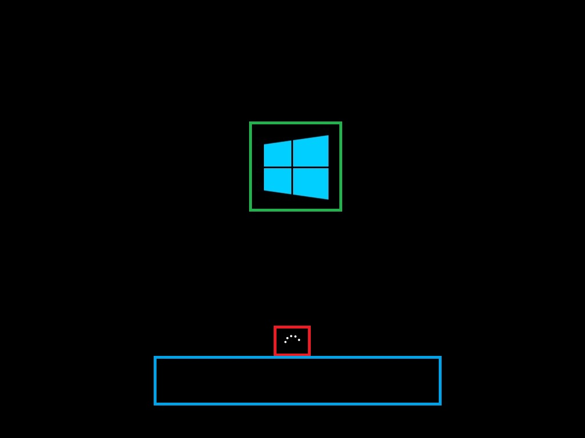

# Unbranded Boot


You can suppress Windows elements that appear when Windows starts or resumes and can suppress the crash screen when Windows encounters an error that it cannot recover from. This feature is known as Unbranded Boot.

**Important**  
The first user to sign in to the device must be an administrator. This ensures that the **RunOnce** registry settings correctly apply the settings. Also, when using auto sign-in, you must not configure auto sign-in on your device at design time. Instead, auto sign-in should be configured manually after first signing in as an administrator.

 

## Requirements


Windows 10 Enterprise, Windows 10 Professional, or Windows 10 Education.

## Terminology


**Turn on, Enable:** To make the setting available to the device and optionally apply the settings to the device. Generally "turn on" is used in the user interface or control panel, whereas "enable" is used for command line.

**Configure:** To customize the setting or sub-settings.

**Embedded Boot Experience:** this feature is called "Embedded Boot Experience" in Windows 10, build 1511.

**Custom Boot Experience:** this feature is called "Custom Boot Experience" in Windows 10, build 1607 and later.

## Turn on Unbranded Boot settings


Unbranded Boot is an optional component and is not enabled by default in Windows 10. It must be enabled prior to configuring. For end-users, Unbranded Boot is available through **Control Panel** &gt; **Programs** &gt; **Programs and Features** &gt; **Turn Windows features on or off**.

If Windows has already been installed you cannot apply a provisioning package to configure Unbranded Boot; instead you must use BDCEdit to configure Unbranded boot if Windows is installed.

BCDEdit is the primary tool for editing the startup configuration and is on your development computer in the %WINDIR%\\System32 folder. You have administrator rights for it. BCDEdit is included in a typical Windows Preinstallation Environment (Windows PE) 4.0. You can download it from the [BCDEdit Commands for Boot Environment](http://go.microsoft.com/fwlink/p/?LinkId=301755) in the Microsoft Download Center if needed.

**Turn on Unbranded Boot by using Control Panel**

1.  In the **Search the web and Windows** field, type Programs and Features and either press Enter or tap or click **Programs and Features** to open it.
2.  In the **Programs and Features** window, click **Turn Windows features on or off**.
3.  For Windows 10, build 1511:

    in the **Windows Features** box, select **Embedded Boot Experience**.

    For Windows 10, build 1607:

    In the **Windows Features** window, expand the **Device Lockdown** node, and check or clear the checkbox for **Unbranded Boot**.

4.  Click **OK**. The **Windows Features** window indicates Windows is searching for required files and displays a progress bar. Once found, the window indicates Windows is applying the changes. When completed, the window indicates the requested changes are completed.
5.  Click **Close** to close the **Windows Features** window.

**To configure Unbranded Boot settings at runtime using BCDEdit**

1.  Open a command prompt as an administrator.
2.  To disable the F8 key during startup to prevent access to the **Advanced startup options** menu, type the following:

    ``` syntax
    bcdedit.exe -set {globalsettings} advancedoptions false
    ```

3.  To disable the F10 key during startup to prevent access to the **Advanced startup options** menu, type the following:

    ``` syntax
    bcdedit.exe -set {globalsettings} optionsedit false
    ```

4.  To suppress all Windows UI elements (logo, status indicator, and status message) during startup, type the following:

    ``` syntax
    bcdedit.exe -set {globalsettings} bootuxdisabled on
    ```

## Configure Unbranded Boot using Unattend


You can also configure the Unattend settings in the [Microsoft-Windows-Embedded-BootExp](https://msdn.microsoft.com/en-us/windows/hardware/commercialize/customize/desktop/unattend/microsoft-windows-embedded-bootexp) component to add Unbranded Boot features to your image during the design or imaging phase. You can manually create an Unattend answer file or use Windows System Image Manager (Windows SIM) to add the appropriate settings to your answer file. For more information about the Unbranded Boot settings and XML examples, see the settings in Microsoft-Windows-Embedded-BootExp.

### Unbranded Boot settings

The following table shows Unbranded Boot settings and their values.

<table>
<colgroup>
<col width="50%" />
<col width="50%" />
</colgroup>
<thead>
<tr class="header">
<th>Setting</th>
<th>Description</th>
</tr>
</thead>
<tbody>
<tr class="odd">
<td>DisableBootMenu</td>
<td><p>Contains an integer that disables the F8 and F10 keys during startup to prevent access to the Advanced startup options menu.</p>
<p>Set to 1 to disable the menu; otherwise; set to 0 (zero). The default value is 0.</p></td>
</tr>
<tr class="even">
<td>DisplayDisabled</td>
<td><p>Contains an integer that configures the device to display a blank screen when Industry 8.1 encounters an error that it cannot recover from.</p>
<p>Set to 1 to display a blank screen on error; otherwise; set to 0 (zero). The default value is 0.</p></td>
</tr>
<tr class="odd">
<td>HideAllBootUI</td>
<td><p>Contains an integer that suppresses all Windows UI elements (logo, status indicator, and status message) during startup.</p>
<p>Set to 1 to suppress all Windows UI elements during startup; otherwise; set to 0 (zero). The default value is 0.</p></td>
</tr>
<tr class="even">
<td>HideBootLogo</td>
<td><p>Contains an integer that suppresses the default Windows logo that displays during the OS loading phase.</p>
<p>Set to 1 to suppress the default Windows logo; otherwise; set to 0 (zero). The default value is 0.</p></td>
</tr>
<tr class="odd">
<td>HideBootStatusIndicator</td>
<td><p>Contains an integer that suppresses the status indicator that displays during the OS loading phase.</p>
<p>Set to 1 to suppress the status indicator; otherwise; set to 0 (zero). The default value is 0.</p></td>
</tr>
<tr class="even">
<td>HideBootStatusMessage</td>
<td><p>Contains an integer that suppresses the startup status text that displays during the OS loading phase.</p>
<p>Set to 1 to suppress the startup status text; otherwise; set to 0 (zero). The default value is 0.</p></td>
</tr>
<tr class="odd">
<td>CrashDumpEnabled</td>
<td><p>Contains an integer that specifies the type of information to capture in a dump (.dmp) file that is generated when the system stops unexpectedly.</p>
<p>The .dmp file is typically saved in %SystemRoot% as Memory.dmp.</p>
<p>The following table shows the possible values.</p>
<table>
<colgroup>
<col width="50%" />
<col width="50%" />
</colgroup>
<thead>
<tr class="header">
<th>Value</th>
<th>Description</th>
</tr>
</thead>
<tbody>
<tr class="odd">
<td>1</td>
<td>Records all the contents of system memory. This dump file may contain data from processes that were running when the information was collected.</td>
</tr>
<tr class="even">
<td>2</td>
<td>Records only the kernel memory. This dump file includes only memory that is allocated to the kernel, kernel-mode drivers, and other kernel-mode programs. It does not include unallocated memory or any memory that is allocated to user-mode programs. For most purposes, this kind of dump file is the most useful because it is significantly smaller than the complete memory dump file, but it contains information that is most likely to have been involved in the issue. If a second problem occurs, the dump file is overwritten with new information.</td>
</tr>
<tr class="odd">
<td>3</td>
<td><p>Records the smallest amount of useful information that may help identify why the device stopped unexpectedly. This type of dump file includes the following information:</p>
<ul>
<li>A list of loaded drivers.</li>
<li>The processor context (PRCB) for the processor that stopped.</li>
<li>The process information and kernel context (EPROCESS) for the process that stopped.</li>
<li>The process information and kernel context (ETHREAD) for the thread that stopped.</li>
<li>The kernel-mode call stack for the thread that stopped.</li>
</ul>
<p>This kind of dump file can be useful when space is limited. However, because of the limited information included, errors that were not directly caused by the thread that was running at the time of the problem may not be discovered by analyzing this file. The date is encoded in the file name. If a second problem occurs, the previous file is preserved and the new file is given a distinct name. A list of all small memory dump files is kept in the %SystemRoot%\Minidump folder.</p></td>
</tr>
<tr class="even">
<td>4</td>
<td>Records the smallest amount of useful information. This value produces the same results as entering a value of 3.</td>
</tr>
<tr class="odd">
<td>7</td>
<td>Records only the kernel memory. This value produces the same results as entering a value of 2. This is the default value.</td>
</tr>
<tr class="even">
<td>Any other value</td>
<td>Disables crash dump and does not record anything.</td>
</tr>
</tbody>
</table>
<p> </p></td>
</tr>
</tbody>
</table>

 

## <a href="" id="custom-boot"></a>Customize the boot screen using Windows ICD and Deployment Image Servicing and Management (DISM)


If Windows has not been installed and you are using Windows ICD to create installation media with settings for Unbranded Boot included in the image or you are applying a provisioning package during setup you must enable Unbranded Boot on the installation media with DISM in order for a provisioning package to successfully apply. First you have to create the image or package.

1.  Build a provisioning package or create a new Windows image in Windows Imaging and Configuration Designer (ICD) by following the instructions in [Build and apply a provisioning package](https://msdn.microsoft.com/library/windows/hardware/dn916107) or [Build and deploy an image for Windows 10 Desktop](https://msdn.microsoft.com/library/windows/hardware/dn916105).
    **Note**  In the **Select Windows Edition** window, choose **Common to all Windows desktop editions**.

     

2.  In the customization page, select **Runtime settings** &gt; **SMISettings** and then set the value for the boot screen settings. The following values are just examples.
    -   **HideAllBootUI**=FALSE
    -   **HideBootLogo**=FALSE
    -   **HideBootStatusIndicator**=TRUE
    -   **HideBootStatusMessage**=TRUE

3.  Once you have finished configuring the settings and building the package or image, you use DISM to apply the settings.
    1.  Open a command prompt with administrator privileges.
    2.  Copy install.wim to a temporary folder on hard drive (in the following steps, it assumes it's called c:\\wim).
    3.  Create a new directory.

        ```
        md c:\wim
        ```

    4.  Mount the image.

        ```
        dism /mount-wim /wimfile:c:\bootmedia\sources\install.wim /index:1 /MountDir:c:\wim
        ```

    5.  Enable the feature.

        ```
        dism /image:c:\wim /enable-feature /featureName:Client-EmbeddedBootExp
        ```

    6.  Commit the change.

        ```
        dism /unmount-wim /MountDir:c:\wim /Commit
        ```

In the following image, the BootLogo is identified by the green outline, the BootStatusIndicator is identified by the red outline, and the BootStatusMessage is identified by the blue outline.



## <a href="" id="replace-logo"></a>Replace the startup logo


The only supported way to replace the startup logo with a custom logo is to modify the Boot Graphics Resource Table (BGRT) on a device that uses UEFI as the firmware interface. If your device uses the BGRT to include a custom logo, it is always displayed and you cannot suppress the custom logo.

## Related topics


[Custom Logon](custom-logon.md)

 

 

[Send comments about this topic to Microsoft](mailto:wsddocfb@microsoft.com?subject=Documentation%20feedback%20%5Bp_enterprise_customizations\p_enterprise_customizations%5D:%20Unbranded%20Boot%20%20RELEASE:%20%2810/17/2016%29&body=%0A%0APRIVACY%20STATEMENT%0A%0AWe%20use%20your%20feedback%20to%20improve%20the%20documentation.%20We%20don't%20use%20your%20email%20address%20for%20any%20other%20purpose,%20and%20we'll%20remove%20your%20email%20address%20from%20our%20system%20after%20the%20issue%20that%20you're%20reporting%20is%20fixed.%20While%20we're%20working%20to%20fix%20this%20issue,%20we%20might%20send%20you%20an%20email%20message%20to%20ask%20for%20more%20info.%20Later,%20we%20might%20also%20send%20you%20an%20email%20message%20to%20let%20you%20know%20that%20we've%20addressed%20your%20feedback.%0A%0AFor%20more%20info%20about%20Microsoft's%20privacy%20policy,%20see%20http://privacy.microsoft.com/en-us/default.aspx. "Send comments about this topic to Microsoft")


