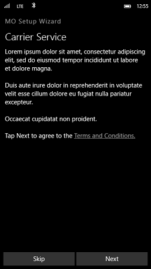
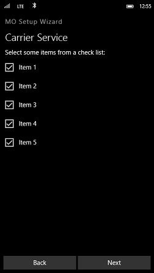
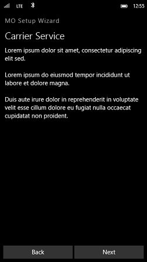
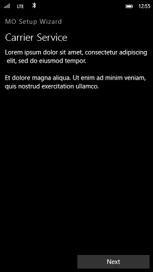
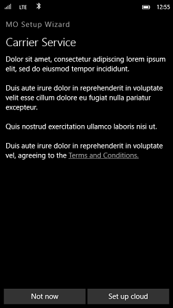
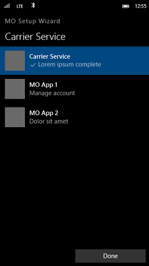
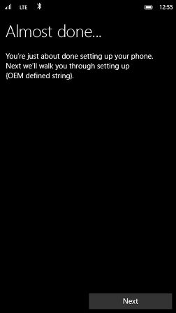

# Partner account configuration during setup


In Windows 10 Mobile, an OEM or mobile operator may specify one preloaded app to be launched at the end of setup to walk users through an OEM or mobile operator account setup.

Optionally, an OEM or mobile operator may also preload an additional 4 apps that can be subroutined and called from a main app. In this case, the partner specifies one of the apps as the hub app (main app), which will be automatically launched at the end of setup. This app can then invoke other spoke apps (subroutined apps) to complete other tasks.

Partners can use this customization to walk users through the process of setting up an OEM or mobile operator-specific account or to enable a multi-page OOBE setup experience. If partners configure this customization, the **All done** screen at the end of setup will be replaced with an **Almost done** screen that contains an introduction to the partner app.

## Limitations and restrictions


Partners must meet the following requirements when configuring this customization:

-   An OEM or mobile operator can run up to five (5) apps at the end of OOBE on Windows mobile devices.

    Only one partner, either the mobile operator or OEM, may have an app that launches at the end of OOBE.

-   All the apps must be installed before the end of OOBE on the mobile device. This enables the hub app to invoke the spoke apps.

-   All existing Windows Phone 8.1 and later customizations for launching an app at the end of OOBE remain in place. This includes the existing limitations and timing for unlocking home buttons.

    -   The app must be preloaded and conform to all guidelines required of preloaded apps.

    -   All text must be fully localized for the display languages that are included on the mobile device.

    -   The app must provide a way for users to skip the task(s) and exit the app. For an example of a recommended UI for each account to configure, see the screen **Sign in with Microsoft account** that is shown during the standard device setup process.

    -   The application can use and embed the browser control, but it cannot launch Microsoft Edge.

    -   All pages and data necessary for the user to complete or skip the task must be included in the app. A data connection is not guaranteed, but an option to prompt the user to enabled network connections is available. For more information, see the *Prompting the user to enable network connections* section below.

    -   The app must look and function like a wizard, and provide buttons for the user to navigate forward and backward through the steps. The hardware keys—Back, Start, and Search—will not be available to the user.

    -   The tasks in the app must not take longer than 5 minutes to complete. After that interval, the OS will resume control and run the final tasks to finish setup, including sending the Welcome SMS and turning on the hardware keys. If the app has not exited by that point, the user can press the Start hardware button to leave the app.

## Customization details


<a href="" id="constraints---none"></a>**Constraints:** None  

<a href="" id="instructions-"></a>**Instructions:**  
1.  Create the partner account setup app that you want to launch at the end of OOBE.

2.  Create a customization answer file to preload your app(s) and follow the steps in the section Configure the customization settings.

    ``` syntax
    <?xml version="1.0" encoding="utf-8" ?>  
    <ImageCustomizations xmlns="http://schemas.microsoft.com/embedded/2004/10/ImageUpdate"  
                         Name="PartnerAccountConfiguration"  
                         Description="Use to specify one preloaded app launched at the end of setup to walk users 
                                      through an OEM or mobile operator account setup. Partners may also preload an
                                      additional 4 apps that may be subroutined and called from the main hub app."  
                         Owner=""  
                         OwnerType="OEM"> 
      
      <Static>  

        <!-- Preload up to 5 apps to use for partner account setup. If you do, one app must be the hub app 
             and the rest are spoke apps. -->
        <Applications>
          <Application Source=""
                       License=""
                       ProvXML="" />
          <Application Source=""
                       License=""
                       ProvXML="" />
          <Application Source=""
                       License=""
                       ProvXML="" />
          <Application Source=""
                       License=""
                       ProvXML="" />
          <Application Source=""
                       License=""
                       ProvXML="" />
        </Applications>

        <Settings Path="SetupWizard">  
          <!-- Set to the GUID or App ID of the partner setup app -->
          <Setting Name="PartnerSetupAppID" Value="" />   

          <!-- Specify the launch parameters for the partner setup app, such as the first page of the wizard -->            
          <Setting Name="PartnerSetupAppParameters" Value="/_default#/accountSetup.xaml" />       

          <!-- Set to 1 to prompt the user to user to enable network connections before the app is run 
          <Setting Name="PartnerSetupAppNetworkPrompt" Value="1" /> 
          -->

          <!-- For one supported phone language, set the value to the localized partner name, account name, and
               the name you want to appear in the Table of Contents. For multiple language support, use the below 
               settings instead as well as the Localization/MUI settings path for the base DLL and language DLL files. -->
          <Setting Name="PartnerSetupAppPartnerName" Value="" />      
          <Setting Name="PartnerSetupAppTaskName" Value="" />  
          <Setting Name="PartnerSetupAppTOCTaskName" Value="" />      

          <!-- For multiple supported phone languages, use these settings and provide the base MUI DLL
          <Setting Name="PartnerSetupAppPartnerName" 
                   Value="@c:\Data\Programs\{00000000-0000-0000-0000-000000000000}\Install\DisplayNames.dll,-101" />      
          <Setting Name="PartnerSetupAppTaskName" 
                   Value="@c:\Data\Programs\{00000000-0000-0000-0000-000000000000}\Install\DisplayNames.dll,-102" /> 
          <Setting Name="PartnerSetupAppTOCTaskName" 
                   Value="@c:\Data\Programs\{00000000-0000-0000-0000-000000000000}\Install\DisplayNames.dll,-103" /> 
          -->   
         
        </Settings>  

        <!-- For multiple supported phone langauges, add your base MUI DLL file and specify the 
             language MUI packages (*.dll.mui) 

        <Settings Path="Localization/MUI">  
          <Asset Name="BaseDll" Source="" />

          <Asset Name="LanguageDll/$(langid)" Source="" />
          <Asset Name="LanguageDll/$(langid)" Source="" />
          <Asset Name="LanguageDll/$(langid)" Source="" />
          <!-- Add as many as you need -->         
        </Settings>  
        -->

      </Static>

    </ImageCustomizations>
    ```

<a href="" id="testing-steps-"></a>**Testing steps:**  
1.  Flash the build containing this customization and relevant display languages to a mobile device.

2.  Verify the **Almost done** screen displays the localized text as expected.

3.  Launch and complete and partner setup app to verify it works appropriately, is localized, calls any other spoke apps, and that the user can exit instead of completing the setup tasks.

## App design considerations and guidelines


When designing your apps, keep the following design considerations in mind:

-   We recommend that you use Universal Windows apps to enable your hub and spoke model.

-   When building a shared partner app, be aware that the app might appear in the Windows Store for every mobile device produced by the OEM, every phone ranged by the mobile operator, and might be downloaded by users that have a different mobile operator. To ensure that users do not end up seeing mobile operator configuration options that do not apply to their phone or network, consider these possible mitigations:

    1.  **Network verification:** The app must verify that the phone is on the specified mobile operator’s network before displaying any account setup functionality for that mobile operator. This can be done by checking the MCC and the MNC of the SIM, or by verifying the registry value `PhoneMobileOperatorName` setting (see [Phone metadata in DeviceTargetingInfo](phone-metadata-in-devicetargetinginfo.md) for more information).

    2.  **System settings app:** The app can be written as a system settings app. This application will appear on the **System** screen in **Settings**, and cannot be pinned to Start. It also will be hidden in the Windows Store so that it cannot be accidentally downloaded. 

-   See [Design basics](http://go.microsoft.com/fwlink/p/?LinkId=708326) to learn more about how you can design a Universal Windows app that suits a variety of devices with different display sizes and other tips for creating an app with a great UI.

    See [Sample app UI](#sample-partner-setup-app-ui) for examples on what your partner setup app's UI might look like.

### MIDL bindings

MIDL bindings allow an app to be launched through a protocol and package family name. The hub and spoke model only works on Universal Windows apps and you must use [Windows.System.Launcher.LaunchUriForResultsAsync](http://go.microsoft.com/fwlink/p/?LinkId=708268).

### Recommended APIs

We recommend that you use the following APIs when implementing your apps:

<table>
<colgroup>
<col width="50%" />
<col width="50%" />
</colgroup>
<thead>
<tr class="header">
<th>API</th>
<th>Usecase</th>
</tr>
</thead>
<tbody>
<tr class="odd">
<td><p>[Windows.System.Launcher.LaunchUriForResultsAsync](http://go.microsoft.com/fwlink/p/?LinkId=708268)</p></td>
<td><p>Allows a parent app to launch a child app. The child app must return to the parent app. This achieves the hub and spoke model requirement for this customization (for partners that want to use this model).</p>
<p>When using this API, keep in mind the memory usage for mobile devices. Every time the API is used, another child app is launched while requesting not to terminate the parent app, which means that it must be kept in memory.</p></td>
</tr>
<tr class="even">
<td><p>[Windows.System.Launcher.LaunchUriAsync](http://go.microsoft.com/fwlink/p/?LinkId=708317)</p></td>
<td><p>Allows forward navigation from App 1 to App 2. The second app is not a child app of the first app.</p></td>
</tr>
</tbody>
</table>

 

## <a href="" id="configure-customization-settings"></a>Configure the customization settings


### Preloading the apps and specifying the first page

1.  Preload the apps to the mobile device using the following code example.

    ``` syntax
        <!-- Preload up to 5 apps to use as the hub and spoke apps -->
        <Applications>
          <Application Source=""
                       License=""
                       ProvXML="" />
          <Application Source=""
                       License=""
                       ProvXML="" />
        </Applications>
    ```

2.  In the MCSF customization answer file:

    -   If your app is a Universal Windows app, set `PartnerSetupAppID` to the AUMID for your app (or to your hub app if you have subroutined apps).

        If your app is not a Universal Windows app, set `PartnerSetupAppID` to the GUID or app ID for your app (or to your hub app if you have subroutined apps).

    -   Set `PartnerSetupAppID` to the GUID or app ID for your app (or to your hub app if you have subroutined apps), and set `PartnerSetupAppParameters` setting to the correct name of the first page of your hub app.

### Prompting the user to enable network connections

If the user selects a **Custom** configuration on the **Settings** screen in setup, and removes the checkmark from the **Allow cellular data usage on your phone** option, your app will not have network connectivity even if a valid SIM is installed. To prompt the user to turn the network connection back on before the partner account configuration application is run, set the `PartnerSetupAppNetworkPrompt` setting to 1.

The values supported by this setting are:

<table>
<colgroup>
<col width="50%" />
<col width="50%" />
</colgroup>
<thead>
<tr class="header">
<th>Value</th>
<th>Description</th>
</tr>
</thead>
<tbody>
<tr class="odd">
<td><p>1 or 'Enable'</p></td>
<td><p>Prompt the user to user to enable network connections before the app is run.</p></td>
</tr>
<tr class="even">
<td><p>0 or 'Disable'</p></td>
<td><p>Do not prompt the user to user to enable network connections before the app is run.</p></td>
</tr>
</tbody>
</table>

 

### Localized strings for partner name, account name, and Table of Contents

Partners must provide three localized strings: partner name, name(s) of the account(s) to configure, and the name to show in the Table of Contents. The strings for the partner name and account name are used to complete the following statement displayed to the user in the screen before the app is launched.

"Almost done..."

"You’re just about done setting up your phone. Next, *PartnerSetupAppPartnerName* will walk you through setting up *PartnerSetupAppTaskName*."

-   If only one display language is included on the device, you can set the values for the `PartnerSetupAppPartnerName` and `PartnerSetupAppTaskName` settings directly to the desired strings.

    You can also set the value for the `PartnerSetupAppTOCTaskName` setting directly. This string will be used for the Table of Contents.

    In the above sample MCSF customization answer file, remove the comments in the section "For one supported phone language…" and set the values to the strings you want to use.

-   If you include support for multiple display languages, you must create a resource-only .dll that contains these three strings localized into every included language. 

    **Note**  This capability is available only through the MCSF framework and will not work if you use the Windows provisioning framework.

     

    In the above sample customization answer file, remove the comments around the section "For multiple supported phone languages…". The sample shows an installed .dll file named DisplayNames.dll, and that the partner name is string 101 and the account names are string 102. The string for the Table of Contents is string 103. Update these values to match your implementation and update the path to the path of your installed application.

## <a href="" id="sample-partner-setup-app-ui"></a>Sample app UI


The following screenshots show what a partner setup app's UI might look like and some of the tasks that the app may walk the user through during account setup.

<table>
<colgroup>
<col width="33%" />
<col width="33%" />
<col width="33%" />
</colgroup>
<tbody>
<tr class="odd">
<td>Screen 1</td>
<td>Screen 2</td>
<td>Screen 3</td>
</tr>
<tr class="even">
<td><p></p></td>
<td><p></p></td>
<td><p></p></td>
</tr>
</tbody>
</table>

 

<table>
<colgroup>
<col width="33%" />
<col width="33%" />
<col width="33%" />
</colgroup>
<tbody>
<tr class="odd">
<td>Screen 4</td>
<td>Screen 5</td>
<td>Screen 6</td>
</tr>
<tr class="even">
<td><p></p></td>
<td><p></p></td>
<td><p></p></td>
</tr>
</tbody>
</table>

 

<table>
<colgroup>
<col width="100%" />
</colgroup>
<tbody>
<tr class="odd">
<td>Screen 7</td>
</tr>
<tr class="even">
<td><p></p></td>
</tr>
</tbody>
</table>

 

 

 

[Send comments about this topic to Microsoft](mailto:wsddocfb@microsoft.com?subject=Documentation%20feedback%20%5Bp_phCustomization\p_phCustomization%5D:%20Partner%20account%20configuration%20during%20setup%20%20RELEASE:%20%289/7/2016%29&body=%0A%0APRIVACY%20STATEMENT%0A%0AWe%20use%20your%20feedback%20to%20improve%20the%20documentation.%20We%20don't%20use%20your%20email%20address%20for%20any%20other%20purpose,%20and%20we'll%20remove%20your%20email%20address%20from%20our%20system%20after%20the%20issue%20that%20you're%20reporting%20is%20fixed.%20While%20we're%20working%20to%20fix%20this%20issue,%20we%20might%20send%20you%20an%20email%20message%20to%20ask%20for%20more%20info.%20Later,%20we%20might%20also%20send%20you%20an%20email%20message%20to%20let%20you%20know%20that%20we've%20addressed%20your%20feedback.%0A%0AFor%20more%20info%20about%20Microsoft's%20privacy%20policy,%20see%20http://privacy.microsoft.com/default.aspx. "Send comments about this topic to Microsoft")


