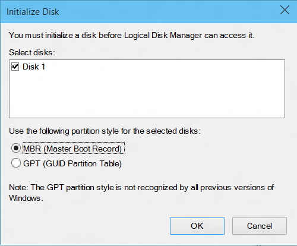

# Hardware Compatibility Specification for Systems for Windows 10, version 1607

This section of the documentation provides specifications for hardware compatibility for systems running Windows 10, version 1607.

 - [System.Client.BluetoothController.Base](#system.client.bluetoothcontroller.base)
 - [System.Client.BluetoothController.NonUSB](#system.client.bluetoothcontroller.nonusb)
 - [System.Client.BluetoothController.USB](#system.client.bluetoothcontroller.usb)
 - [System.Client.BrightnessControls](#system.client.brightnesscontrols)
 - [System.Client.Buttons](#system.client.buttons)
 - [System.Client.Camera](#system.client.camera)
 - [System.Client.Digitizer](#system.client.digitizer)
 - [System.Client.Digitizer.Pen](#system.client.digitizer.pen)
 - [System.Client.Digitizer.PrecisionTouchpad](#system.client.digitizer.precisiontouchpad)
 - [System.Client.Digitizer.Touch](#system.client.digitizer.touch)
 - [System.Client.Firmware.UEFI.GOP](#system.client.firmware.uefi.gop)
 - [System.Client.Graphics](#system.client.graphics)
 - [System.Client.MobileBroadBand](#system.client.mobilebroadband)
 - [System.Client.PCContainer](#system.client.pccontainer)
 - [System.Client.RadioManagement](#system.client.radiomanagement)
 - [System.Client.RadioManagement.ConnectedStandby](#system.client.radiomanagement.connectedstandby)
 - [System.Client.SystemConfiguration](#system.client.systemconfiguration)
 - [System.Client.SystemImage](#system.client.systemimage)
 - [System.Client.SystemPartition](#system.client.systempartition)
 - [System.Client.ScreenRotation](#system.client.screenrotation)
 - [System.Client.Tablet.Graphics](#system.client.tablet.graphics)
 - [System.Client.WLAN.BasicConnectivity](#system.client.wlan.basicconnectivity)
 - [System.Client.WLAN.HangDetectionAndRecovery](#system.client.wlan.hangdetectionandrecovery)
 - [System.Client.WLAN.HostedNetwork](#system.client.wlan.hostednetwork)
 - [System.Client.WLAN.WiFiDirect](#system.client.wlan.wifidirect)
 - [System.Client.WLAN.Miracast](#system.client.wlan.miracast)
 - [System.Fundamentals.DebugPort](#system.fundamentals.debugport)
 - [System.Fundamentals.DebugPort.USB](#system.fundamentals.debugport.usb)
 - [System.Fundamentals.EnergyEstimation](#system.fundamentals.energyestimation)
 - [System.Fundamentals.Firmware](#system.fundamentals.firmware)
 - [System.Fundamentals.Firmware.Boot](#system.fundamentals.firmware.boot)
 - [System.Fundamentals.Firmware.CS](#system.fundamentals.firmware.cs)
 - [System.Fundamentals.Firmware.TPR](#system.fundamentals.firmware.tpr)
 - [System.Fundamentals.Graphics](#system.fundamentals.graphics)
 - [System.Fundamentals.Graphics.DisplayRender](#system.fundamentals.graphics.displayrender)
 - [System.Fundamentals.Graphics.HybridGraphics](#system.fundamentals.graphics.hybridgraphics)
 - [System.Fundamentals.Graphics.InternalDisplay](#system.fundamentals.graphics.internaldisplay)
 - [System.Fundamentals.Graphics.MultipleDevice](#system.fundamentals.graphics.multipledevice)
 - [System.Fundamentals.Graphics.RenderOnly](#system.fundamentals.graphics.renderonly)
 - [System.Fundamentals.HAL](#system.fundamentals.hal)
 - [System.Fundamentals.Input](#system.fundamentals.input)
 - [System.Fundamentals.MarkerFile](#system.fundamentals.markerfile)
 - [System.Fundamentals.Network](#system.fundamentals.network)
 - [System.Fundamentals.NX](#system.fundamentals.nx)
 - [System.Fundamentals.PowerManagement](#system.fundamentals.powermanagement)
 - [System.Fundamentals.PowerManagement.CS](#system.fundamentals.powermanagement.cs)
 - [System.Fundamentals.PXE](#system.fundamentals.pxe)
 - [System.Fundamentals.Reliability](#system.fundamentals.reliability)
 - [System.Fundamentals.Security](#system.fundamentals.security)
 - [System.Fundamentals.ServerNano](#system.fundamentals.servernano)
 - [System.Fundamentals.SignedDrivers](#system.fundamentals.signeddrivers)
 - [System.Fundamentals.SMBIOS](#system.fundamentals.smbios)
 - [System.Fundamentals.StorageAndBoot](#system.fundamentals.storageandboot)
 - [System.Fundamentals.StorageClassMemory](#system.fundamentals.storageclassmemory)
 - [System.Fundamentals.SystemAudio](#system.fundamentals.systemaudio)
 - [System.Fundamentals.SystemPCIController](#system.fundamentals.systempcicontroller)
 - [System.Fundamentals.SystemUSB](#system.fundamentals.systemusb)
 - [System.Fundamentals.TPM20](#system.fundamentals.tpm20)
 - [System.Fundamentals.TrustedPlatformModule](#system.fundamentals.trustedplatformmodule)
 - [System.Fundamentals.USBBoot](#system.fundamentals.usbboot)
 - [System.Fundamentals.USBDevice](#system.fundamentals.usbdevice)
 - [System.Fundamentals.WatchDogTimer](#system.fundamentals.watchdogtimer)
 - [System.Server.Assurance](#system.server.assurance)
 - [System.Server.AzureStack](#system.server.azurestack)
 - [System.Server.AzureStack.Security](#system.server.azurestack.security)
 - [System.Server.AzureStack.BMC](#system.server.azurestack.bmc)
 - [System.Server.Base](#system.server.base)
 - [System.Server.BMC](#system.server.bmc)
 - [System.Server.DynamicPartitioning](#system.server.dynamicpartitioning)
 - [System.Server.FaultTolerant](#system.server.faulttolerant)
 - [System.Server.Firmware.UEFI.GOP](#system.server.firmware.uefi.gop)
 - [System.Server.Firmware.VBE](#system.server.firmware.vbe)
 - [System.Server.Graphics](#system.server.graphics)
 - [System.Server.Manageability.Redfish](#system.server.manageability.redfish)
 - [System.Server.PowerManageable](#system.server.powermanageable)
 - [System.Server.RemoteFX](#system.server.remotefx)
 - [System.Server.SMBIOS](#system.server.smbios)
 - [System.Server.StorageManageability.Smapi](#system.server.storagemanageability.smapi)
 - [System.Server.StorageManageability.Smapi.BlockStorage](#system.server.storagemanageability.smapi.blockStorage)
 - [System.Server.StorageManageability.Smapi.BlockStorage.RemoteReplication](#system.server.storagemanageability.smapi.blockStorage.remotereplication)
 - [System.Server.StorageManageability.Smapi.FileStorage](#system.server.storagemanageability.smapi.filestorage)
 - [System.Server.StorageManageability.Smapi.Smi](#system.server.storagemanageability.smapi.smi)
 - [System.Server.SVVP](#system.server.svvp)
 - [System.Server.SystemStress](#system.server.systemstress)
 - [System.Server.Virtualization](#system.server.virtualization)
 - [System.Server.WHEA](#system.server.whea)
 - [System.Solutions.AzureStack](#system.solutions.azurestack)
 - [System.Solutions.StorageSpacesDirect](#system.solutions.storagespacesdirect)

<a name="system.client.bluetoothcontroller.base"></a>
## System.Client.BluetoothController.Base

*These requirements apply to systems that have generic Bluetooth controllers.*


### System.Client.BluetoothController.Base.4LeSpecification

*If a system includes a Bluetooth enabled controller it must support the Bluetooth 4.0 specification requirements.*

<table>
<tr>
<th>Applies to</th>
<td>
<p>Windows 10 for desktop editions (Home, Pro, Enterprise, and Education) x64</p>
<p>Windows 10 for desktop editions (Home, Pro, Enterprise, and Education) x86</p>
<p>Windows 10 Mobile ARM</p>
<p>Windows 10 Mobile x86</p>
</td></tr></table>

**Description**

The Bluetooth enabled controller must comply with the Basic Rate (BR) and Low Energy (LE) Combined Core Configuration Controller Parts and Host/Controller Interface (HCI) Core Configuration requirements outlined in the Compliance Bluetooth Version 4.0 specifications.


### System.Client.BluetoothController.Base.CS

*Systems that support Connected Standby with Bluetooth enabled controllers must ship with Microsoft's inbox Bluetooth stack.*

<table>
<tr>
<th>Applies to</th>
<td>
<p>Windows 10 for desktop editions (Home, Pro, Enterprise, and Education) x64</p>
<p>Windows 10 for desktop editions (Home, Pro, Enterprise, and Education) x86</p>
<p>Windows 10 Mobile ARM</p>
<p>Windows 10 Mobile x86</p>
</td></tr></table>


**Description**

Systems that support Connected Standby that ship with Bluetooth enabled controllers must ship with Microsoft's inbox Bluetooth stack. 


### System.Client.BluetoothController.Base.HciExtensions (if implemented)

*MSFT Defined HCI extensions support for hardware offload of advertisement and RSSI monitoring.*                                                                                                                                                       

<table>
<tr>
<th>Applies to</th>
<td>
<p>Windows 10 for desktop editions (Home, Pro, Enterprise, and Education) x64</p>
<p>Windows 10 for desktop editions (Home, Pro, Enterprise, and Education) x86</p>
<p>Windows 10 Mobile ARM</p>
<p>Windows 10 Mobile x86</p>
</td></tr></table>


**Description**  

 Radios that support the Microsoft-OSG Defined Bluetooth HCI Extensions must comply with the specification and pass the related HLKWLK tests. The details of the specifications will be shared at a later date. Partners will be notified via Connect.


### System.Client.BluetoothController.Base.LEStateCombinations

*Systems with Bluetooth enabled controllers must support a minimum set of LE state combinations.*

<table>
<tr>
<th>Applies to</th>
<td>
<p>Windows 10 for desktop editions (Home, Pro, Enterprise, and Education) x64</p>
<p>Windows 10 for desktop editions (Home, Pro, Enterprise, and Education) x86</p>
<p>Windows 10 Mobile ARM</p>
<p>Windows 10 Mobile x86</p>
</td></tr></table>


**Description**

The Bluetooth enabled controller must allow the spec LE state combinations (as allowed in section \[Vol 6\] Part B, Section 1.1.1 of the Bluetooth version 4.0 spec).


### System.Client.BluetoothController.Base.LEWhiteList

*Systems with Bluetooth enabled controllers must support a minimum LE allow list size of 25 entries.*

<table>
<tr>
<th>Applies to</th>
<td>
<p>Windows 10 for desktop editions (Home, Pro, Enterprise, and Education) x64</p>
<p>Windows 10 for desktop editions (Home, Pro, Enterprise, and Education) x86</p>
<p>Windows 10 Mobile ARM</p>
<p>Windows 10 Mobile x86</p>
</td></tr></table>


**Description**

The Bluetooth enabled controller on the system must support a minimum of 25 entries in its allow list for remote Low Energy (LE) devices.


### System.Client.BluetoothController.Base.NoBluetoothLEFilterDriver

*Bluetooth LE filter drivers are not allowed to load on BTHLEENUM.SYS.*

<table>
<tr>
<th>Applies to</th>
<td>
<p>Windows 10 for desktop editions (Home, Pro, Enterprise, and Education) x64</p>
<p>Windows 10 for desktop editions (Home, Pro, Enterprise, and Education) x86</p>
<p>Windows 10 Mobile ARM</p>
<p>Windows 10 Mobile x86</p>
</td></tr></table>


**Description**

To ensure a uniform experience across Windows Store Apps using the Bluetooth LE (GATT) WinRT API, filter drivers shall not be loaded on BTHLEENUM.SYS.


### System.Client.BluetoothController.Base.OnOffStateControllableViaSoftware

*Bluetooth enabled controllers’ On/Off state must be controllable via software.*

<table>
<tr>
<th>Applies to</th>
<td>
<p>Windows 10 for desktop editions (Home, Pro, Enterprise, and Education) x64</p>
<p>Windows 10 for desktop editions (Home, Pro, Enterprise, and Education) x86</p>
<p>Windows 10 Mobile ARM</p>
<p>Windows 10 Mobile x86</p>
</td></tr></table>


**Description**

When turning the radio off, Bluetooth enabled controllers shall be powered down to its lowest supported power state and no transmission/reception shall take place. Windows will terminate Bluetooth activity by unloading the inbox protocol drivers and their children, submitting the HCI\_Reset command to the controller, and then setting the controller to the D3 logical power state, allowing bus drivers to power down the radio as appropriate. The radio can be completely powered off if a bus-supported method is available to turn the radio back on. No additional vendor software control components will be supported.

On turning the radio back on, the Bluetooth stack for Windows shall resume the device to D0, allowing bus drivers to restart the device. The Windows Bluetooth stack shall then reinitialize the Bluetooth enabled components of the controller.

Bluetooth Radio Management shall only be enabled for internal Bluetooth 4.0 enabled controllers.

The on/off state of Bluetooth-enabled controllers shall be controllable via software as described in Bluetooth Software Radio Switch. The Off state is defined, at a minimum, as disabling the antenna component of the Bluetooth enabled module so there can be no transmission/reception. There must not be any hardware-only switches to control power to the Bluetooth enabled radio.

The radio must maintain on/off state across sleep and reboot.


### System.Client.BluetoothController.Base.SimultaneousBrEdrAndLeTraffic

*Bluetooth enabled controllers must support simultaneous BR/EDR and LE traffic.*

<table>
<tr>
<th>Applies to</th>
<td>
<p>Windows 10 for desktop editions (Home, Pro, Enterprise, and Education) x64</p>
<p>Windows 10 for desktop editions (Home, Pro, Enterprise, and Education) x86</p>
<p>Windows 10 Mobile ARM</p>
<p>Windows 10 Mobile x86</p>
</td></tr></table>


**Description**

Bluetooth enabled controllers must allow the simultaneous use of both Basic Rate (BR)/Enhanced Data Rate (EDR) and Low Energy (LE) radios.


### System.Client.BluetoothController.Base.WidebandSpeech

<table>
<tr>
<th>Applies to</th>
<td>
<p>Windows 10 Mobile ARM</p>
<p>Windows 10 Mobile x86</p>
</td></tr></table>


**Description**

Wideband speech enables high definition voice quality (audio is sampled at 16 KHz as opposed to only 8 KHz) for telephony audio on Windows devices when the user is communicating via a Bluetooth peripheral that also supports wideband speech.

What this means is that Bluetooth radios must support wideband speech in the hardware as defined by the Bluetooth SIG [Hands-Free Profile (HFP) 1.6 specification](https://www.bluetooth.org/docman/handlers/downloaddoc.ashx?doc_id=238193) and the [Core Specification Addendum (CSA) 2](https://www.bluetooth.org/docman/handlers/downloaddoc.ashx?doc_id=245127) which is included in the [Core Version 4.1](https://www.bluetooth.org/DocMan/handlers/DownloadDoc.ashx?doc_id=282159) Bluetooth specification. At a minimum it must use at least one Bluetooth SIG defined wideband speech codec (currently mSBC).

**Business Justification:**

We want users to experience the best possible quality audio when using Bluetooth peripherals on Windows. Wideband speech is becoming a standard for peripherals that support the HFP profile. Our competition already supports it.


### System.Client.BluetoothController.Base.WLANBTCoexistence

*Windows Systems that support both WLAN and Bluetooth must meet WLAN-BT Co-existence requirements.*

<table>
<tr>
<th>Applies to</th>
<td>
<p>Windows 10 for desktop editions (Home, Pro, Enterprise, and Education) x64</p>
<p>Windows 10 for desktop editions (Home, Pro, Enterprise, and Education) x86</p>
<p>Windows 10 Mobile ARM</p>
<p>Windows 10 Mobile x86</p>
</td></tr></table>


**Description**

Windows systems that support both WLAN and Bluetooth must meet WLAN-BT Co-existence requirements listed below. The requirement is applicable to all WLAN devices across all bus types.

 - Must not drop the connection with WLAN AP when Bluetooth is scanning for new devices.

 - Must be able to scan simultaneously for both WLAN and Bluetooth networks.

<a name="system.client.bluetoothcontroller.nonusb"></a>
## System.Client.BluetoothController.NonUSB

*These requirements apply to systems that have non-USB Bluetooth enabled controllers.*


### System.Client.BluetoothController.NonUSB.NonUsbUsesMicrosoftsStack

*Any platform using a non-USB connected Bluetooth enabled controller must ship with Microsoft’s inbox Bluetooth stack.*

<table>
<tr>
<th>Applies to</th>
<td>
<p>Windows 10 for desktop editions (Home, Pro, Enterprise, and Education) x64</p>
<p>Windows 10 for desktop editions (Home, Pro, Enterprise, and Education) x86</p>
<p>Windows 10 Mobile ARM</p>
<p>Windows 10 Mobile x86</p>
</td></tr></table>


**Description**

Any platform using a non-USB connected Bluetooth enabled controller must ship with *Microsoft’s inbox Bluetooth* stack. 


### System.Client.BluetoothController.NonUSB.ScoSupport

*Any platform with a non-USB connected Bluetooth enabled controller must use a sideband channel for SCO.*

<table>
<tr>
<th>Applies to</th>
<td>
<p>Windows 10 for desktop editions (Home, Pro, Enterprise, and Education) x64</p>
<p>Windows 10 for desktop editions (Home, Pro, Enterprise, and Education) x86</p>
<p>Windows 10 Mobile ARM</p>
<p>Windows 10 Mobile x86</p>
</td></tr></table>


**Description**

Any platform using a Non-USB connected Bluetooth enabled controller must use sideband channel for SCO (such as SCO over an I2S/PCM interface).


<a name="system.client.bluetoothcontroller.usb"></a>
## System.Client.BluetoothController.USB

*These requirements apply to systems that have USB Bluetooth enabled controllers.*


### System.Client.BluetoothController.USB.ScoDataTransportLayer

*Bluetooth enabled host controllers support the SCO data transport layer as specified in the Bluetooth 2.1+EDR specifications.*

<table>
<tr>
<th>Applies to</th>
<td>
<p>Windows 10 for desktop editions (Home, Pro, Enterprise, and Education) x64</p>
<p>Windows 10 for desktop editions (Home, Pro, Enterprise, and Education) x86</p>
<p>Windows 10 Mobile ARM</p>
<p>Windows 10 Mobile x86</p>
</td></tr></table>


**Description**

A System with a Bluetooth enabled controller must comply with the Synchronous Connection Oriented (SCO)-USB requirements that are outlined in the Specification of the Bluetooth System, Version 2.1 + Enhanced Data Rate (EDR), Part A, Section 3.5.


<a name="system.client.brightnesscontrols"></a>
## System.Client.BrightnessControls 

*This section describes requirements systems with brightness controls.*


### System.Client.BrightnessControls.BacklightOptimization

Windows Display Driver Model (*WDDM) 1.2 drivers must enable scenario based backlight power optimization to reduce backlight level used by integrated panel.*

<table>
<tr>
<th>Applies to</th>
<td>
<p>Windows 10 for desktop editions (Home, Pro, Enterprise, and Education) x64</p>
<p>Windows 10 for desktop editions (Home, Pro, Enterprise, and Education) x86</p>
<p>Windows 10 Mobile ARM</p>
<p>Windows 10 Mobile x86</p>
<p>Windows Server 2016 x64</p>
</td></tr></table>


**Description**

 - If WDDM driver supports scenario based backlight power optimization, it must indicate the support by implementing the DXGK\_BRIGHTNESS\_INTERFACE2 interface.

 - When Windows sets the current scenario by using the DxgkDdiSetBacklightOptimization function, the WDDM driver is required to honor the intent of the scenario as follows:

     - DxgkBacklightOptimizationDisable: Driver is required to completely disable all backlight optimization.

     - DxgkBacklightOptimizationDesktop: Driver is required to enable backlight optimization at a lower aggressiveness level. Driver must optimize for scenarios like photo viewing, browser, and Office documents.

     - DxgkBacklightOptimizationDynamic: Driver is required to enable backlight optimization at a higher aggressiveness level. Driver must optimize for scenarios like video playback and gaming.

     -  DxgkBacklightOptimizationDimmed: Driver is required to enable backlight optimization at a higher aggressiveness level. Driver must make sure that the content on the screen is visible but it need not be easily readable.

 - Driver is allowed to dynamically change the aggressiveness level based on the content on the screen.

 - Driver is required to handle Windows requests for change to brightness level (based on user input or ambient light sensor) while keeping backlight optimization enabled.

 - Driver is required to gradually transition between aggressiveness levels:

     - This is important in the case when user briefly invokes playback controls. At that time, Windows will reset the scenario from DxgkBacklightOptimizationDynamic to DxgkBacklightOptimizationDesktop. The transition must not be a step but must be gradual.<br/><br/>

 - WDDM driver is required to provide accurate information when Windows queries DxgkDdiGetBacklightReduction.

 - Connecting additional display devices to the system must not impact the ability to perform backlight optimization on the integrated panel of the system.

 

### System.Client.BrightnessControls.BrightnessControlButtons

*Systems that have built in physical brightness control function keys use standard ACPI events and support control of LCD backlight brightness via ACPI methods in the system firmware.*

<table>
<tr>
<th>Applies to</th>
<td>
<p>Windows 10 for desktop editions (Home, Pro, Enterprise, and Education) x64</p>
<p>Windows 10 for desktop editions (Home, Pro, Enterprise, and Education) x86</p>
<p>Windows 10 Mobile ARM</p>
<p>Windows 10 Mobile x86</p>
<p>Windows Server 2016 x64</p>
</td></tr></table>


**Description**

Windows provides users with an LCD brightness control user interface. If the system implements keys that are invisible to the operating system, these keys must use Advanced Configuration and Power Interface (ACPI) methods. These keys must not directly control the brightness after Bit 2 of the \_DOS method has been set. This requires the implementation of ACPI brightness methods in the system firmware.

The following methods are required:

 - \_BCL
 - \_BCM

Bit 2 of the \_DOS method must be disabled so that the system firmware cannot change the brightness levels automatically.

The following methods are optional:

Support for the \_BQC method is highly recommended but not required. Systems must map keys to the following ACPI notification values:

 - ACPI\_NOTIFY\_CYCLE\_BRIGHTNESS\_HOTKEY 0x85

 - ACPI\_NOTIFY\_INC\_BRIGHTNESS\_HOTKEY 0x86

 - ACPI\_NOTIFY\_DEC\_BRIGHTNESS\_HOTKEY 0x87

 - ACPI\_NOTIFY\_ZERO\_BRIGHTNESS\_HOTKEY 0x88

 
*Design Notes:*

The \_BCL and \_BCM methods in the firmware enable the operating system to query the brightness range and values and to set new values. Refer to the ACPI 3.0 specification for more details.


### System.Client.BrightnessControls.SmoothBrightness

*Driver must support a smooth transition in response to all brightness change requests from Windows.*

<table>
<tr>
<th>Applies to</th>
<td>
<p>Windows 10 for desktop editions (Home, Pro, Enterprise, and Education) x64</p>
<p>Windows 10 for desktop editions (Home, Pro, Enterprise, and Education) x86</p>
<p>Windows 10 Mobile ARM</p>
<p>Windows 10 Mobile x86</p>
<p>Windows Server 2016 x64</p>
</td></tr></table>


**Description**

1.  All Windows systems that support brightness control, are required to support smooth brightness control

2.  All Windows systems are required to report 101 brightness levels to Windows. Brightness is reported as a % so this means 0 to 100 levels, including 0 and 100. Internally the driver might support more granular brightness control.

3.  This is to ensure that Windows has the ability to make fine grained changes to the screen brightness. However, the brightness slider UI might expose fewer levels through the slider because it might be cumbersome for the user to adjust so many levels.

4.  WDDM driver is required to implement smooth brightness control in the driver without depending on the embedded controller (EC) for the smoothness.

5.  WDDM driver is required to indicate support for smooth brightness control using the capability bit defined in the DXGK\_BRIGHTNESS\_INTERFACE2 interface.

6.  WDDM driver must enable/disable smooth brightness control based on state set using DxgkDdiSetBrightnessState.

7.  When Windows requests a change to brightness, driver is required to gradually change the brightness level over time so that the change is not a step.

8.  WDDM driver is allowed to select an appropriate slope for transition. However, the transition must complete in less than 2s.

9.  WDDM driver is allowed to alter the slope based on panel characteristics to ensure smoothness of brightness control.

10. WDDM driver is required to start responding immediately to new brightness level requests. This must be honored even if the system is already in the process of an existing transition. At such a time, the system must stop the existing transition at the current level and start the new transition from the current position. This will ensure that when a user is using the slider to manually adjust the brightness, the brightness control is still responsive and not sluggish.

11. WDDM driver is required to continue supporting smooth brightness control, even if content based adaptive brightness optimization is currently in effect.

12. When WDDM driver is pnp started, it must detect the brightness level applied by the firmware and smoothly transition from that level to the level set by Windows.

13. Connecting additional display devices to the system must not impact the ability to do smooth brightness control on the integrated panel of the system.

14. Brightness levels are represented as a % in Windows. Therefore there is no absolute mapping between brightness % level and physical brightness level. For Windows 8, the following is the guidance.


<table>
<thead>
<tr class="header">
<th>Percent represented to Windows</th>
<th>User Experience</th>
</tr>
</thead>
<tbody>
<tr class="odd">
<td>0%</td>
<td>Brightness level such that the contents of the screen are barely visible to the user</td>
</tr>
<tr class="even">
<td>100%</td>
<td>Max brightness supported by panel</td>
</tr>
</tbody>
</table>


<a name="system.client.buttons"></a>
## System.Client.Buttons


### System.Client.Buttons.HardwareButtons

*Hardware buttons are implemented correctly*

<table>
<tr>
<th>Applies to</th>
<td>
<p>Windows 10 for desktop editions (Home, Pro, Enterprise, and Education) x64</p>
<p>Windows 10 for desktop editions (Home, Pro, Enterprise, and Education) x86</p>
<p>Windows 10 Mobile ARM</p>
<p>Windows 10 Mobile x86</p>
</td></tr></table>


**Description**

This requirement is currently optional and will not be enforced until 2017.

Hardware buttons must be implemented according to the guidance on the following page: <https://msdn.microsoft.com/en-us/library/windows/hardware/dn957423.aspx>

GPIO buttons must be specified using the standardized ACPI generic button device (ACPI0011): <https://msdn.microsoft.com/en-us/library/windows/hardware/dn957422.aspx>

In the case where buttons are not wired through GPIO interrupts, buttons must be reported to Windows as HID collections. HID button report descriptors must follow the report descriptors specified on the following page: <https://msdn.microsoft.com/en-us/library/windows/hardware/dn457881.aspx>


<a name="system.client.camera"></a>
## System.Client.Camera

<!--No content was provided here in the original Word file.-->

### System.Client.Camera.Device

*Systems with integrated cameras must meet camera device requirements.*

<table>
<tr>
<th>Applies to</th>
<td>
<p>Windows 10 for desktop editions (Home, Pro, Enterprise, and Education) x64</p>
<p>Windows 10 for desktop editions (Home, Pro, Enterprise, and Education) x86</p>
<p>Windows 10 Mobile ARM</p>
<p>Windows 10 Mobile x86</p>
</td></tr></table>


**Description**

Each integrated camera on a system must comply with **Device.Streaming.Camera.Base** and all related requirements. If the integrated camera is a USB camera, it must also comply with **Device.Streaming.Camera.UVC** for the system seeking certification.

Note: With regards to ‘**Device.Streaming.Camera.Base.UsageIndicator’** if a system has multiple cameras, then one physical indicator (e.g. LED) is acceptable so long as it indicates usage whenever one or more cameras are in use. Systems without a display must have a physical indicator.


### System.Client.Camera.PhysicalLocation

*Systems with integrated cameras must report the physical location of each camera.*

<table>
<tr>
<th>Applies to</th>
<td>
<p>Windows 10 for desktop editions (Home, Pro, Enterprise, and Education) x64</p>
<p>Windows 10 for desktop editions (Home, Pro, Enterprise, and Education) x86</p>
<p>Windows 10 Mobile ARM</p>
<p>Windows 10 Mobile x86</p>
</td></tr></table>


**Description**

For any camera device that is built into the chassis of the system and has mechanically fixed direction, the firmware must provide the \_PLD method and set the panel field (bits \[69:67\]) to the appropriate value for the panel on which the camera is mounted. For example, "Front" indicates the camera faces the user, while "back" indicates that the camera faces away from the end user.

In addition, bit 143:128 (Vertical Offset), and bits 159:144 (Horizontal Offset) must provide the relative location of the camera with respect to the display. This origin is relative to the native pixel addressing in the display component. The origin is the lower left hand corner of the display, where positive Horizontal and Vertical Offset values are to the right and up, respectively. For more information, see the ACPI version 5.0 Section 6.1.8 "Device Configuration \_PLD (Physical Device Location)."

Camera device orientation with respect to the default system display orientation (also known as native system display orientation) must be specified in the \_PLD rotation field (bits 115-118). When the pixels read out from the camera sensor can be displayed correctly without any rotation, then the camera sensor’s \_PLD rotation value must be set to 0. When the pixels read out from the camera sensor need to be rotated 90 degrees clockwise to display correctly, then the camera sensor’s \_PLD rotation value must be set to 2 and so on.

All other fields in the \_PLD are optional.


### System.Client.Camera.VideoCaptureAndCameraControls

*Systems with integrated cameras meet the requirements of, and can support the Windows Capture Infrastructure.*

<table>
<tr>
<th>Applies to</th>
<td>
<p>Windows 10 for desktop editions (Home, Pro, Enterprise, and Education) x64</p>
<p>Windows 10 for desktop editions (Home, Pro, Enterprise, and Education) x86</p>
<p>Windows 10 Mobile ARM</p>
<p>Windows 10 Mobile x86</p>
</td></tr></table>


**Description**

*System Memory:*

System Memory must be supported.

*Independent Streaming:*

All integrated Cameras must support independent streaming between different pins and different filters (cameras) according to the capabilities listed in the Profiles advertised by the device. If the camera does not support Profiles, then concurrent streaming for *all* system cameras is optional.

*Mirroring:*

The default state for mirroring must be "not mirrored."

*Camera Controls (*If Implemented)*:*

Each of the following camera controls are optional.

 - Region of Interest (ROI)

 - Focus

 - Exposure

 - White Balance

 - Zoom

 - Camera Flash

 - Scene Mode

 - Optimization Hints

 - Optical Image Stabilization

 - Backlight Compensation

 - Brightness

 - Contrast

 - Exposure Compensation

 - Hue

 - Pan

 - Tilt

 - Roll

 - Video Stabilization

 - Variable Frame Rate

 - Face Detection

 - Video HDR

 - Histogram

 - Advanced Photo

If any individual control is implemented in the camera driver, it must comply with the control specification in the WDK.

*Photo Sequence (*If Implemented)*:*

Photo Sequence captures a sequence of photos in response to a single photo click. Capture pipeline would send buffers to the camera driver continuously to capture the photos in sequence. This mode also allows capturing photos from the time before the “user click” thus helping users not to lose a moment.

If camera HW supports Photo Sequence, it must expose the capability through the Photo Mode property and comply with the performance requirements.

Photo Sequence must be enabled by the device and driver to:

 - Support the same resolutions that are exposed in Normal mode

 - Report the current frame rates possible in Photo Sequence Mode based on the current light conditions. Device must honor and not exceed the maximum frame rate set by the application.

 - Support at minimum 4fps measured at lesser of the maximum resolution exposed by the image pin or 8MP.

 - Provide at least 4 frames in the past at lesser of the maximum resolution exposed by the image pin or 8MP.

 - Photo Sequence should be performed independently, regardless preview on/off.

 - Provide frames continuously in Photo Sequence mode at lesser of the maximum resolution exposed by the image pin or 8MP.

 - If the driver outputs JPEG format for Photo Sequence it must also support thumbnails, upon request, at 1/2x, 1/4x, 1/8x, and 1/16x of the width and height of the original image resolution.

 - The JPEG image generated by the camera may optionally have EXIF metadata indicating the “flash fired” information. EXIF information shall not include personally identifiable information, such as location, unique ids, among others.

*Variable Photo Sequence (*If Implemented)*:*

Variable Photo Sequence captures a finite number of images and supports the ability to vary the capture parameters for each of the captured images. If implemented in Camera driver then the driver should be able to return the requested number of images, in order, each with varying capture parameters as instructed by the application. The driver shall be able to preprogram the number of frames needed and set independent capture parameters for each frame before capture is initiated.

It is recommended that the variable photo sequence allows the application to specify the following parameters for each frame, but at least one of these must be implemented if VPS is supported:

 - Exposure

 - ISO

 - Exposure Compensation in EV

 - Focus position

 - Flash

If any parameter is not set in per frame settings the driver shall follow the global settings and 3A locks. For example when EV bracketing is used, the driver shall ensure that exposure related parameters like gain and exposure are set according to EV bracketing settings.  The driver may vary auto white balance settings for image frames unless the per frame settings use manual white balance settings or in case of application uses white balance lock. It not recommended that lens position is automatically changed between the VPS frames (unless manually specified by the application).


<a name="system.client.digitizer"></a>
## System.Client.Digitizer

<!--No content was provided here in the original Word file.-->

### System.Client.Digitizer.Base.SystemDigitizerBase

*System Digitizer Base*

<table>
<tr>
<th>Applies to</th>
<td>
<p>Windows 10 for desktop editions (Home, Pro, Enterprise, and Education) x64</p>
<p>Windows 10 for desktop editions (Home, Pro, Enterprise, and Education) x86</p>
<p>Windows 10 Mobile ARM</p>
<p>Windows 10 Mobile x86</p>
<p>Windows Server 2016 x64</p>
</td></tr></table>


**Description**

The following Digitizer Base device level requirements must be met and verified upon integration into a system. Please refer to the following **Device.Input.Digitizer.Base** requirements for full requirement details:

 - Device.Input.Digitizer.Base.ContactReports
 - Device.Input.Digitizer.Base.HIDCompliant
 - Device.Input.Digitizer.Base.ThirdPartyDrivers


### System.Client.Digitizer.SystemPen

*System Pen*

<table>
<tr>
<th>Applies to</th>
<td>
<p>Windows 10 Mobile ARM</p>
<p>Windows 10 Mobile x86</p>
</td></tr></table>


**Description**

The following Pen device level requirements must be met and verified upon integration into a system. Please refer to the following **Device.Input.Digitizer.Pen** requirements for full requirement details:

 - Device.Input.Digitizer.Pen.Accuracy
 - Device.Input.Digitizer.Pen.Buffering
 - Device.Input.Digitizer.Pen.CustomGestures
 - Device.Input.Digitizer.Pen.Eraser
 - Device.Input.Digitizer.Pen.HoverRange
 - Device.Input.Digitizer.Pen.Jitter
 - Device.Input.Digitizer.Pen.Latency
 - Device.Input.Digitizer.Pen.Pressure
 - Device.Input.Digitizer.Pen.ReportRate
 - Device.Input.Digitizer.Pen.Resolution


### System.Client.Digitizer.SystemTouch

*System Touch*

<table>
<tr>
<th>Applies to</th>
<td>
<p>Windows 10 for desktop editions (Home, Pro, Enterprise, and Education) x64</p>
<p>Windows 10 for desktop editions (Home, Pro, Enterprise, and Education) x86</p>
<p>Windows 10 Mobile ARM</p>
<p>Windows 10 Mobile x86</p>
</td></tr></table>


**Description**

The following Touch device level requirements must be met and verified upon integration into a system. Please refer to the following **Device.Input.Digitizer.Touch** requirements for full requirement details:

 - Device.Input.Digitizer.Touch.Accuracy
 - Device.Input.Digitizer.Touch.Buffering
 - Device.Input.Digitizer.Touch.CustomGestures
 - Device.Input.Digitizer.Touch.FingerSeparation
 - Device.Input.Digitizer.Touch.Jitter
 - Device.Input.Digitizer.Touch.Latency
 - Device.Input.Digitizer.Touch.MinContactCount
 - Device.Input.Digitizer.Touch.ReportRate
 - Device.Input.Digitizer.Touch.Resolution

Microsoft strongly recommends touch solutions capable of reporting 5 or more simultaneous contact points.  This ensures that the platform is compatible with third party applications that rely upon touch input, and that end users are able to invoke all of the system gestures provided by Windows.

Microsoft recognizes that extenuating circumstances exist whereby an extended gesture experience is not necessary.  In order to accommodate this very limited set of systems, we make the following allowances:

Systems that are sold as build to configure, custom enterprise images, or are designed for specific vertical enterprise markets, have the option to ship a touch screen capable of reporting only a single contact point.  Examples include systems designed for health care, military applications, and Point of Sale.

Any system incapable of supporting more than a single contact point will be unable to invoke any system gestures other than generic mouse-like behavior. 

A system reliant upon a keyboard and mouse as the primary input modality, without the capability to convert into a tablet mode device, may choose to integrate a touch solution capable of supporting a minimum of 2 simultaneous contact points.  Examples include: external displays, All-In-One desktop systems. 

Any system incapable of supporting more than 2 simultaneous contact points will be unable to invoke 4 finger accessibility gestures.
All other systems must support a minimum of 5 simultaneous contact points


### System.Client.Digitizer.SystemPrecisionTouchpad

*Precision Touchpad*

<table>
<tr>
<th>Applies to</th>
<td>
<p>Windows 10 for desktop editions (Home, Pro, Enterprise, and Education) x64</p>
<p>Windows 10 for desktop editions (Home, Pro, Enterprise, and Education) x86</p>
<p>Windows Server 2016 x64</p>
</td></tr></table>


**Description**

The following Precision Touchpad device level requirements must be met and verified upon integration into a system. Please refer to the following **Device.Input.Digitizer.PrecisionTouchpad** requirements for full requirement details:

 - Device.Input.Digitizer.PrecisionTouchpad.Accuracy
 - Device.Input.Digitizer.PrecisionTouchpad.Buffering
 - Device.Input.Digitizer.PrecisionTouchpad.Buttons
 - Device.Input.Digitizer.PrecisionTouchpad.ContactTipSwitchHeight
 - Device.Input.Digitizer.PrecisionTouchpad.DeviceTypeReporting
 - Device.Input.Digitizer.PrecisionTouchpad.Dimensions
 - Device.Input.Digitizer.PrecisionTouchpad.FingerSeparation
 - Device.Input.Digitizer.PrecisionTouchpad.Jitter
 - Device.Input.Digitizer.PrecisionTouchpad.Latency
 - Device.Input.Digitizer.PrecisionTouchpad.MinMaxContacts
 - Device.Input.PrecisionTouchpad.Precision.InputResolution
 - Device.Input.Digitizer.PrecisionTouchpad.SelectiveReporting
 
A touchpad may not be marketed as a Precision Touchpad if the device requires a 3<sup>rd</sup> party driver be installed in order to report as a Precision Touchpad.


<a name="system.client.digitizer.pen"></a>
## System.Client.Digitizer.Pen

<!--No content was provided here in the original Word file.-->

### System.Client.Digitizer.Pen.Accuracy

*System Pen Contact Accuracy*

<table>
<tr>
<th>Applies to</th>
<td>
<p>Windows 10 Mobile ARM</p>
<p>Windows 10 Mobile x86</p>
</td></tr></table>


**Description**

The following Pen device level requirement must be met and verified upon integration into a system. Please refer to the **Device.Input.Digitizer.Pen.Accuracy** requirement for full requirement details.


### System.Client.Digitizer.Pen.Buffering

*System Pen Buffering for buses with High Resume latency*

<table>
<tr>
<th>Applies to</th>
<td>
<p>Windows 10 Mobile ARM</p>
<p>Windows 10 Mobile x86</p>
</td></tr></table>


**Description**

The following Pen device level requirement must be met and verified upon integration into a system. Please refer to the **Device.Input.Digitizer.Pen.Buffering** requirement for full requirement details.


### System.Client.Digitizer.Pen.ContactReports

*System Pen Digitizer Reliability*

<table>
<tr>
<th>Applies to</th>
<td>
<p>Windows 10 Mobile ARM</p>
<p>Windows 10 Mobile x86</p>
</td></tr></table>


**Description**

The following Pen device level requirement must be met and verified upon integration into a system. Please refer to the **Device.Input.Digitizer.Pen.ContactReports** requirement for full requirement details.


### System.Client.Digitizer.Pen.CustomGestures

*System Pen Custom Run-Time System Gestures*

<table>
<tr>
<th>Applies to</th>
<td>
<p>Windows 10 Mobile ARM</p>
<p>Windows 10 Mobile x86</p>
</td></tr></table>


**Description**

The following Pen device level requirement must be met and verified upon integration into a system. Please refer to the **Device.Input.Digitizer.Pen.CustomGestures** requirement for full requirement details.


### System.Client.Digitizer.Pen.Eraser

*System Pen Eraser Affordance*

<table>
<tr>
<th>Applies to</th>
<td>
<p>Windows 10 Mobile ARM</p>
<p>Windows 10 Mobile x86</p>
</td></tr></table>


**Description**

The following Pen device level requirement must be met and verified upon integration into a system. Please refer to the **Device.Input.Digitizer.Pen.Eraser** requirement for full requirement details.


### System.Client.Digitizer.Pen.HIDCompliant

*System Pen HID Compliant Device Firmware and/or HID Mini-port Driver*

<table>
<tr>
<th>Applies to</th>
<td>
<p>Windows 10 Mobile ARM</p>
<p>Windows 10 Mobile x86</p>
</td></tr></table>


**Description**

The following Pen device level requirement must be met and verified upon integration into a system. Please refer to the **Device.Input.Digitizer.Pen.HIDCompliant** requirement for full requirement details.


### System.Client.Digitizer.Pen.HoverRange

*System Pen Hover Range*

<table>
<tr>
<th>Applies to</th>
<td>
<p>Windows 10 Mobile ARM</p>
<p>Windows 10 Mobile x86</p>
</td></tr></table>


**Description**

The following Pen device level requirement must be met and verified upon integration into a system. Please refer to the **Device.Input.Digitizer.Pen.HoverRange** requirement for full requirement details.


### System.Client.Digitizer.Pen.Jitter

*System Pen Jitter and Linearity*

<table>
<tr>
<th>Applies to</th>
<td>
<p>Windows 10 Mobile ARM</p>
<p>Windows 10 Mobile x86</p>
</td></tr></table>


**Description**

The following Pen device level requirement must be met and verified upon integration into a system. Please refer to the **Device.Input.Digitizer.Pen.Jitter** requirement for full requirement details.


### System.Client.Digitizer.Pen.Latency

*System Pen Response Latencies*

<table>
<tr>
<th>Applies to</th>
<td>
<p>Windows 10 Mobile ARM</p>
<p>Windows 10 Mobile x86</p>
</td></tr></table>


**Description**

The following Pen device level requirement must be met and verified upon integration into a system. Please refer to the **Device.Input.Digitizer.Pen.Latency** requirement for full requirement details.


### System.Client.Digitizer.Pen.Pressure

*System Pen Pressure Reporting*

<table>
<tr>
<th>Applies to</th>
<td>
<p>Windows 10 Mobile ARM</p>
<p>Windows 10 Mobile x86</p>
</td></tr></table>


**Description**

The following Pen device level requirement must be met and verified upon integration into a system. Please refer to the **Device.Input.Digitizer.Pen.Pressure** requirement for full requirement details.


### System.Client.Digitizer.Pen.ReportRate

*System Pen Report Rate*

<table>
<tr>
<th>Applies to</th>
<td>
<p>Windows 10 Mobile ARM</p>
<p>Windows 10 Mobile x86</p>
</td></tr></table>


**Description**

The following Pen device level requirement must be met and verified upon integration into a system. Please refer to the **Device.Input.Digitizer.Pen.ReportRate** requirement for full requirement details.


### System.Client.Digitizer.Pen.Resolution

*System Pen Input Resolution*

<table>
<tr>
<th>Applies to</th>
<td>
<p>Windows 10 Mobile ARM</p>
<p>Windows 10 Mobile x86</p>
</td></tr></table>


**Description**

The following Pen device level requirement must be met and verified upon integration into a system. Please refer to the **Device.Input.Digitizer.Pen.Resolution** requirement for full requirement details.


### System.Client.Digitizer.Pen.ThirdPartyDrivers

*System Pen Servicing and 3<sup>rd</sup> Party Driver Availability*

<table>
<tr>
<th>Applies to</th>
<td>
<p>Windows 10 Mobile ARM</p>
<p>Windows 10 Mobile x86</p>
</td></tr></table>


**Description**

The following Pen device level requirement must be met and verified upon integration into a system. Please refer to the **Device.Input.Digitizer.Pen.ThirdPartyDrivers** requirement for full requirement details.


<a name="system.client.digitizer.precisiontouchpad"></a>
## System.Client.Digitizer.PrecisionTouchpad

<!--No content was provided here in the original Word file.-->

### System.Client.Digitizer.PrecisionTouchpad.Accuracy

*System Precision Touchpad Accuracy*

<table>
<tr>
<th>Applies to</th>
<td>
<p>Windows 10 Mobile ARM</p>
<p>Windows 10 Mobile x86</p>
</td></tr></table>


**Description**

The following Precision Touchpad device level requirement must be met and verified upon integration into a system. Please refer to the **Device.Input.Digitizer.PrecisionTouchpad.Accuracy** requirement for full requirement details.


### System.Client.Digitizer.PrecisionTouchpad.Buffering

*System Precision Touchpad Buffering for Buses with High Resume Latency*

<table>
<tr>
<th>Applies to</th>
<td>
<p>Windows 10 Mobile ARM</p>
<p>Windows 10 Mobile x86</p>
</td></tr></table>


**Description**

The following Precision Touchpad device level requirement must be met and verified upon integration into a system. Please refer to the **Device.Input.Digitizer.PrecisionTouchpad.Buffering** requirement for full requirement details.


### System.Client.Digitizer.PrecisionTouchpad.Buttons

*System Precision Touchpad Physical Buttons and Button Reporting*

<table>
<tr>
<th>Applies to</th>
<td>
<p>Windows 10 Mobile ARM</p>
<p>Windows 10 Mobile x86</p>
</td></tr></table>


**Description**

The following Precision Touchpad device level requirement must be met and verified upon integration into a system. Please refer to the **Device.Input.Digitizer.PrecisionTouchpad.Buttons** requirement for full requirement details.


### System.Client.Digitizer.PrecisionTouchpad.ContactReports

*System Precision Touchpad Digitizer Reliability*

<table>
<tr>
<th>Applies to</th>
<td>
<p>Windows 10 Mobile ARM</p>
<p>Windows 10 Mobile x86</p>
</td></tr></table>


**Description**

The following Precision Touchpad device level requirement must be met and verified upon integration into a system. Please refer to the **Device.Input.Digitizer.PrecisionTouchpad.ContactReports** requirement for full requirement details.


### System.Client.Digitizer.PrecisionTouchpad.ContactTipSwitchHeight

*System Precision Touchpad Contact Tip Switch Height*

<table>
<tr>
<th>Applies to</th>
<td>
<p>Windows 10 Mobile ARM</p>
<p>Windows 10 Mobile x86</p>
</td></tr></table>


**Description**

The following Precision Touchpad device level requirement must be met and verified upon integration into a system. Please refer to the **Device.Input.Digitizer.PrecisionTouchpad.ContactTipSwitchHeight** requirement for full requirement details.


### System.Client.Digitizer.PrecisionTouchpad.DeviceTypeReporting

*System Precision Touchpad Device Type*

<table>
<tr>
<th>Applies to</th>
<td>
<p>Windows 10 Mobile ARM</p>
<p>Windows 10 Mobile x86</p>
</td></tr></table>


**Description**

The following Precision Touchpad device level requirement must be met and verified upon integration into a system. Please refer to the **Device.Input.Digitizer.PrecisionTouchpad.DeviceTypeReporting** requirement for full requirement details.


### System.Client.Digitizer.PrecisionTouchpad.Dimensions

*System Precision Touchpad Dimensions*

<table>
<tr>
<th>Applies to</th>
<td>
<p>Windows 10 Mobile ARM</p>
<p>Windows 10 Mobile x86</p>
</td></tr></table>


**Description**

The following Precision Touchpad device level requirement must be met and verified upon integration into a system. Please refer to the **Device.Input.Digitizer.PrecisionTouchpad.Dimensions** requirement for full requirement details.


### System.Client.Digitizer.PrecisionTouchpad.FingerSeparation

*System Precision Touchpad Finger Separation*

<table>
<tr>
<th>Applies to</th>
<td>
<p>Windows 10 Mobile ARM</p>
<p>Windows 10 Mobile x86</p>
</td></tr></table>


**Description**

The following Precision Touchpad device level requirement must be met and verified upon integration into a system. Please refer to the **Device.Input.Digitizer.PrecisionTouchpad.FingerSeparation** requirement for full requirement details.


### System.Client.Digitizer.PrecisionTouchpad.HIDCompliant

*System Precision Touchpad HID Compliant Device Firmware and/or HID Mini-port Driver*

<table>
<tr>
<th>Applies to</th>
<td>
<p>Windows 10 Mobile ARM</p>
<p>Windows 10 Mobile x86</p>
</td></tr></table>


**Description**

The following Precision Touchpad device level requirement must be met and verified upon integration into a system. Please refer to the **Device.Input.Digitizer.PrecisionTouchpad.HIDCompliant** requirement for full requirement details.


### System.Client.Digitizer.PrecisionTouchpad.InputResolution

*System Precision Touchpad Input Resolution*

<table>
<tr>
<th>Applies to</th>
<td>
<p>Windows 10 Mobile ARM</p>
<p>Windows 10 Mobile x86</p>
</td></tr></table>


**Description**

The following Precision Touchpad device level requirement must be met and verified upon integration into a system. Please refer to the **Device.Input.Digitizer.PrecisionTouchpad.Input Resolution** requirement for full requirement details.


### System.Client.Digitizer.PrecisionTouchpad.Jitter

*System Precision Touchpad Jitter and Linearity*

<table>
<tr>
<th>Applies to</th>
<td>
<p>Windows 10 Mobile ARM</p>
<p>Windows 10 Mobile x86</p>
</td></tr></table>


**Description**

The following Precision Touchpad device level requirement must be met and verified upon integration into a system. Please refer to the **Device.Input.Digitizer.PrecisionTouchpad.Jitter** requirement for full requirement details.


### System.Client.Digitizer.PrecisionTouchpad.Latency

*System Precision Touchpad Response Latencies*

<table>
<tr>
<th>Applies to</th>
<td>
<p>Windows 10 Mobile ARM</p>
<p>Windows 10 Mobile x86</p>
</td></tr></table>


**Description**

The following Precision Touchpad device level requirement must be met and verified upon integration into a system. Please refer to the **Device.Input.Digitizer.PrecisionTouchpad.Latency** requirement for full requirement details.


### System.Client.Digitizer.PrecisionTouchpad.MinMaxContacts

*System Precision Touchpad Contact Count*

<table>
<tr>
<th>Applies to</th>
<td>
<p>Windows 10 Mobile ARM</p>
<p>Windows 10 Mobile x86</p>
</td></tr></table>


**Description**

The following Precision Touchpad device level requirement must be met and verified upon integration into a system. Please refer to the **Device.Input.Digitizer.PrecisionTouchpad.MinMaxContacts** requirement for full requirement details.


### System.Client.Digitizer.PrecisionTouchpad.ReportRate

*System Precision Touchpad Report Rates*

<table>
<tr>
<th>Applies to</th>
<td>
<p>Windows 10 Mobile ARM</p>
<p>Windows 10 Mobile x86</p>
</td></tr></table>


**Description**

The following Precision Touchpad device level requirement must be met and verified upon integration into a system. Please refer to the **Device.Input.Digitizer.PrecisionTouchpad.ReportRate** requirements for full requirement details.


### System.Client.Digitizer.PrecisionTouchpad.SelectiveReporting

*System Precision Touchpad Selective Reporting*

<table>
<tr>
<th>Applies to</th>
<td>
<p>Windows 10 Mobile ARM</p>
<p>Windows 10 Mobile x86</p>
</td></tr></table>


**Description**

The following Precision Touchpad device level requirement must be met and verified upon integration into a system. Please refer to the **Device.Input.Digitizer.PrecisionTouchpad.SelectiveReporting** requirements for full requirement details.


### System.Client.Digitizer.PrecisionTouchpad.ThirdPartyDrivers

*System Precision Touchpad Servicing and 3<sup>rd</sup> Party Driver Availability*

<table>
<tr>
<th>Applies to</th>
<td>
<p>Windows 10 Mobile ARM</p>
<p>Windows 10 Mobile x86</p>
</td></tr></table>


**Description**

The following Precision Touchpad device level requirement must be met and verified upon integration into a system. Please refer to the **Device.Input.Digitizer.PrecisionTouchpad.ThirdPartyDrivers** requirements for full requirement details.


<a name="system.client.digitizer.touch"></a>
## System.Client.Digitizer.Touch

<!--No content was provided here in the original Word file.-->

### System.Client.Digitizer.Touch.Accuracy

*System Touch Accuracy*

<table>
<tr>
<th>Applies to</th>
<td>
<p>Windows 10 for desktop editions (Home, Pro, Enterprise, and Education) x64</p>
<p>Windows 10 for desktop editions (Home, Pro, Enterprise, and Education) x86</p>
<p>Windows 10 Mobile ARM</p>
<p>Windows 10 Mobile x86</p>
</td></tr></table>


**Description**

The following Touch device level requirements must be met and verified upon integration into a system. Please refer to the following **Device.Input.Digitizer.Touch.Accuracv** requirement for full requirement details.


### System.Client.Digitizer.Touch.Buffering

*System Touch Buffering for Buses with High Resume Latency*

<table>
<tr>
<th>Applies to</th>
<td>
<p>Windows 10 for desktop editions (Home, Pro, Enterprise, and Education) x64</p>
<p>Windows 10 for desktop editions (Home, Pro, Enterprise, and Education) x86</p>
<p>Windows 10 Mobile ARM</p>
<p>Windows 10 Mobile x86</p>
</td></tr></table>


**Description**

The following Touch device level requirements must be met and verified upon integration into a system. Please refer to the following **Device.Input.Digitizer.Touch.Buffering** requirement for full requirement details.


### System.Client.Digitizer.Touch.ContactReports

*System Touch Digitizer Reliability*

<table>
<tr>
<th>Applies to</th>
<td>
<p>Windows 10 for desktop editions (Home, Pro, Enterprise, and Education) x64</p>
<p>Windows 10 for desktop editions (Home, Pro, Enterprise, and Education) x86</p>
<p>Windows 10 Mobile ARM</p>
<p>Windows 10 Mobile x86</p>
</td></tr></table>


**Description**

The following Touch device level requirements must be met and verified upon integration into a system. Please refer to the following **Device.Input.Digitizer.Touch.ContactReports** requirement for full requirement details.


### System.Client.Digitizer.Touch.CustomGestures

*System Touch Custom Run-Time System Gestures*

<table>
<tr>
<th>Applies to</th>
<td>
<p>Windows 10 for desktop editions (Home, Pro, Enterprise, and Education) x64</p>
<p>Windows 10 for desktop editions (Home, Pro, Enterprise, and Education) x86</p>
<p>Windows 10 Mobile ARM</p>
<p>Windows 10 Mobile x86</p>
</td></tr></table>


**Description**

The following Touch device level requirements must be met and verified upon integration into a system. Please refer to the following **Device.Input.Digitizer.Touch.CustomGestures** requirement for full requirement details.


### System.Client.Digitizer.Touch.FingerSeparation

*System Touch Finger Separation*

<table>
<tr>
<th>Applies to</th>
<td>
<p>Windows 10 for desktop editions (Home, Pro, Enterprise, and Education) x64</p>
<p>Windows 10 for desktop editions (Home, Pro, Enterprise, and Education) x86</p>
<p>Windows 10 Mobile ARM</p>
<p>Windows 10 Mobile x86</p>
</td></tr></table>


**Description**

The following Touch device level requirements must be met and verified upon integration into a system. Please refer to the following **Device.Input.Digitizer.Touch.FingerSeparation** requirement for full requirement details.


### System.Client.Digitizer.Touch.HIDCompliant

*System Touch HID Compliant Device Firmware and/or HID Mini-port Driver*

<table>
<tr>
<th>Applies to</th>
<td>
<p>Windows 10 for desktop editions (Home, Pro, Enterprise, and Education) x64</p>
<p>Windows 10 for desktop editions (Home, Pro, Enterprise, and Education) x86</p>
<p>Windows 10 Mobile ARM</p>
<p>Windows 10 Mobile x86</p>
</td></tr></table>


**Description**

The following Touch device level requirements must be met and verified upon integration into a system. Please refer to the following **Device.Input.Digitizer.Touch.HIDCompliant** requirement for full requirement details.


### System.Client.Digitizer.Touch.Jitter

*System Touch Jitter and Linearity*

<table>
<tr>
<th>Applies to</th>
<td>
<p>Windows 10 for desktop editions (Home, Pro, Enterprise, and Education) x64</p>
<p>Windows 10 for desktop editions (Home, Pro, Enterprise, and Education) x86</p>
<p>Windows 10 Mobile ARM</p>
<p>Windows 10 Mobile x86</p>
</td></tr></table>


**Description**

The following Touch device level requirements must be met and verified upon integration into a system. Please refer to the following **Device.Input.Digitizer.Touch.Jitter** requirement for full requirement details.


### System.Client.Digitizer.Touch.Latency

*System Touch Response Latency*

<table>
<tr>
<th>Applies to</th>
<td>
<p>Windows 10 for desktop editions (Home, Pro, Enterprise, and Education) x64</p>
<p>Windows 10 for desktop editions (Home, Pro, Enterprise, and Education) x86</p>
<p>Windows 10 Mobile ARM</p>
<p>Windows 10 Mobile x86</p>
</td></tr></table>


**Description**

The following Touch device level requirements must be met and verified upon integration into a system. Please refer to the following **Device.Input.Digitizer.Touch.Latency** requirement for full requirement details.


### System.Client.Digitizer.Touch.MinContactCount

*System Touch Minimum Simultaneous Reportable Contacts*

<table>
<tr>
<th>Applies to</th>
<td>
<p>Windows 10 for desktop editions (Home, Pro, Enterprise, and Education) x64</p>
<p>Windows 10 for desktop editions (Home, Pro, Enterprise, and Education) x86</p>
<p>Windows 10 Mobile ARM</p>
<p>Windows 10 Mobile x86</p>
</td></tr></table>


**Description**

The following Touch device level requirements must be met and verified upon integration into a system. Please refer to the following **Device.Input.Digitizer.Touch.MinContactCount** requirement for full requirement details.


### System.Client.Digitizer.Touch.ReportRate

*System Touch Report Rate*

<table>
<tr>
<th>Applies to</th>
<td>
<p>Windows 10 for desktop editions (Home, Pro, Enterprise, and Education) x64</p>
<p>Windows 10 for desktop editions (Home, Pro, Enterprise, and Education) x86</p>
<p>Windows 10 Mobile ARM</p>
<p>Windows 10 Mobile x86</p>
</td></tr></table>


**Description**

The following Touch device level requirements must be met and verified upon integration into a system. Please refer to the following **Device.Input.Digitizer.Touch.ReportRate** requirement for full requirement details.


### System.Client.Digitizer.Touch.Resolution

*System Touch Input Resolution*

<table>
<tr>
<th>Applies to</th>
<td>
<p>Windows 10 for desktop editions (Home, Pro, Enterprise, and Education) x64</p>
<p>Windows 10 for desktop editions (Home, Pro, Enterprise, and Education) x86</p>
<p>Windows 10 Mobile ARM</p>
<p>Windows 10 Mobile x86</p>
</td></tr></table>


**Description**

The following Touch device level requirements must be met and verified upon integration into a system. Please refer to the following **Device.Input.Digitizer.Touch.Resolution** requirement for full requirement details.


### System.Client.Digitizer.Touch.ThirdPartyDrivers

*System Touch Servicing and 3<sup>rd</sup> Party Driver Availability*

<table>
<tr>
<th>Applies to</th>
<td>
<p>Windows 10 for desktop editions (Home, Pro, Enterprise, and Education) x64</p>
<p>Windows 10 for desktop editions (Home, Pro, Enterprise, and Education) x86</p>
<p>Windows 10 Mobile ARM</p>
<p>Windows 10 Mobile x86</p>
</td></tr></table>


**Description**

The following Touch device level requirements must be met and verified upon integration into a system. Please refer to the following **Device.Input.Digitizer.Touch.ThirdPartyDrivers** requirement for full requirement details.


<a name="system.client.firmware.uefi.gop"></a>
## System.Client.Firmware.UEFI.GOP

<!--No content was provided here in the original Word file.-->

### System.Client.Firmware.UEFI.GOP.Display

*System firmware must support Graphics Output Protocol (GOP) and Windows display requirements.*

<table>
<tr>
<th>Applies to</th>
<td>
<p>Windows 10 for desktop editions (Home, Pro, Enterprise, and Education) x64</p>
<p>Windows 10 for desktop editions (Home, Pro, Enterprise, and Education) x86</p>
<p>Windows 10 Mobile ARM</p>
<p>Windows 10 Mobile x86</p>
<p>Windows Server 2016 x64</p>
</td></tr></table>


**Description**

Every firmware on a Windows client system must support the GOP as defined in UEFI 2.3.1. 
The display is controlled by the system UEFI before the WDDM graphics driver takes over. GOP must be available when the Windows EFI boot manager loads.  VBIOS is not supported. It is also required for prior UI, such as OEM logo, firmware setup, or password prompt screens to enable GOP. During this time when the firmware is in control, the following are the requirements.

**Topology Selection**

 - UEFI must reliably detect all the displays that are connected to the POST adapter. The Pre-OS screen can only be displayed on a display connected to the POST adapter.

 - In case multiple displays are detected, UEFI must display the Pre-OS screen based on the following logic:

     - System with an Integrated display(Laptop, All In One, Tablet): UEFI must display the Pre-OS screen only on the integrated display.

     - System **without** an Integrated display (integrated display is shut or desktop system): UEFI must display the Pre-OS screen on one display. UEFI must select the display by prioritizing the displays based on connector type. The prioritization is as follows: DisplayPort, HDMI, DVI, HD15, Component, S-Video. If there are multiple monitors connected using the same connector type, the firmware can select which one to use.

**Mode Selection**

 - Once UEFI has determined which display to enabled to display the Pre-OS screen, it must select the mode to apply based on the following logic.

     - System with an Integrated display (Laptop, All In One, Tablet): The display must always be set to its native resolution and native timing.

     - System **without** an Integrated display (desktop):

         - UEFI must attempt to set the native resolution and timing of the display by obtaining it from the EDID.

         - If that is not supported, UEFI must select an alternate mode that matches the same aspect ratio as the native resolution of the display.

         - At the minimum, UEFI must set a mode of 1024 x 768.

         - If the display device does not provide an EDID, UEFI must set a mode of 1024 x 768.

     - The firmware must always use a 32 bit linear frame buffer to display the Pre-OS screen.

     - PixelsPerScanLine must be equal to the HorizontalResolution.

     - PixelFormat must be PixelBlueGreenRedReserved8BitPerColor. Note that a physical frame buffer is required; PixelBltOnly is not supported.  

**Mode Pruning**

 - UEFI must prune the list of available modes in accordance with the requirements called out in EFI\_GRAPHICS\_OUTPUT\_PROTOCOL.QueryMode()  (as specified in the UEFI specification version 2.1)

**Providing the EDID**

 - Once the UEFI has set a mode on the appropriate display (based on Topology Selection), UEFI must obtain the EDID of the display and pass it to Windows when Windows uses the  EFI\_EDID\_DISCOVERED\_PROTOCOL (as specified in the UEFI specification version 2.1 )to query for the EDID:

     - It is possible that some integrated panels might not have an EDID in the display panel itself.  In this case, UEFI must manufacture the EDID. The EDID must accurately specify the native timing and the physical dimensions of the integrated panel.

     - If the display is not integrated and does not have an EDID, then the UEFI does not need to manufacture an EDID.


<a name="system.client.graphics"></a>
## System.Client.Graphics

<!--No content was provided here in the original Word file.-->

### System.Client.Graphics.FullGPU

*A Windows client system must have a "Full" graphics device and that device must be the post device.*

<table>
<tr>
<th>Applies to</th>
<td>
<p>Windows 10 for desktop editions (Home, Pro, Enterprise, and Education) x64</p>
<p>Windows 10 for desktop editions (Home, Pro, Enterprise, and Education) x86</p>
<p>Windows 10 Mobile ARM</p>
<p>Windows 10 Mobile x86</p>
</td></tr></table>


**Description**

WDDM 1.3 introduces multiple driver/device types: Full, Render only, and Display only. For a detailed description of each, refer to the WDDM 1.3 in requirement **Device.Graphics.WDDM13.Base**.
Each of these driver/device types are designed for specific scenarios and usage case. All client scenarios expect a "full" graphics device. Also many applications assume that the post device is the "best" graphics devices and use that device exclusively. For this reason, a Windows client system must have a "full" graphics driver/device that is capable of display, rendering, and video.


### System.Client.Graphics.NoMoreThanOneInternalMonitor

*Graphics driver must not enumerate more than one monitor as internal.*

<table>
<tr>
<th>Applies to</th>
<td>
<p>Windows 10 for desktop editions (Home, Pro, Enterprise, and Education) x64</p>
<p>Windows 10 for desktop editions (Home, Pro, Enterprise, and Education) x86</p>
<p>Windows 10 Mobile ARM</p>
<p>Windows 10 Mobile x86</p>
</td></tr></table>


**Description**

The graphics driver must not enumerate more than one display target of the D3DKMDT\_VOT\_INTERNAL type on any adapter.
*Design Notes:* 
For more information, see the Graphics guide for Windows 7 at [http://go.microsoft.com/fwlink/?LinkId=237084](http://www.microsoft.com/whdc/device/display/graphicsguidewin7.mspx). 


### System.Client.Graphics.WDDM

*All Windows graphics drivers must be Windows Display Driver Model (WDDM).*

<table>
<tr>
<th>Applies to</th>
<td>
<p>Windows 10 for desktop editions (Home, Pro, Enterprise, and Education) x64</p>
<p>Windows 10 for desktop editions (Home, Pro, Enterprise, and Education) x86</p>
<p>Windows 10 Mobile ARM</p>
<p>Windows 10 Mobile x86</p>
</td></tr></table>


**Description**

The WDDM architecture offers functionality to enable features such as desktop composition, enhanced fault Tolerance, video memory manager, scheduler, cross process sharing of D3D surfaces and so on. WDDM was specifically designed for modern graphics devices that are a minimum of Direct3D 10 Feature Level 9\_3 with pixel shader 2.0 or better and have all the necessary hardware features to support the WDDM functionality of memory management, scheduling, and fault tolerance.

WDDMv1.3 is required by all systems shipped with Windows 10.

Table below explains the scenario usage for the Graphic driver types:


<table>
<thead>
<tr class="header">
<th>Mode</th>
<th>Client</th>
<th>Server</th>
<th>Client running in a Virtual Environment</th>
<th>Server Virtual</th>
</tr>
</thead>
<tbody>
<tr class="odd">
<td>Full Graphics</td>
<td>Required as post device</td>
<td>Optional</td>
<td>Optional</td>
<td>Optional</td>
</tr>
<tr class="even">
<td>Display Only</td>
<td>Not allowed</td>
<td>Optional</td>
<td>Optional</td>
<td>Optional</td>
</tr>
<tr class="odd">
<td>Render Only</td>
<td>Optional as non primary adapter</td>
<td>Optional</td>
<td>Optional</td>
<td>Optional</td>
</tr>
<tr class="even">
<td>Headless</td>
<td>Not allowed</td>
<td>Optional</td>
<td>N/A</td>
<td>N/A</td>
</tr>
</tbody>
</table>


### System.Client.Graphics.WDDMSupportRotatedModes

*If accelerometer is present, Windows Display Driver Model (WDDM) driver must support all rotated modes.*

<table>
<tr>
<th>Applies to</th>
<td>
<p>Windows 10 for desktop editions (Home, Pro, Enterprise, and Education) x64</p>
<p>Windows 10 for desktop editions (Home, Pro, Enterprise, and Education) x86</p>
<p>Windows 10 Mobile ARM</p>
<p>Windows 10 Mobile x86</p>
</td></tr></table>


**Description**

On a system with an accelerometer, the WDDM driver is required to support all rotated modes for every resolution enumerated for the integrated panel:
 

 - A WDDM driver is required to enumerate source modes for the integrated display. The WDDM driver must support rotated modes (0, 90, 180 and 270) for every mode that it enumerates for the integrated panel.

 - The rotation is required to be supported even if the integrated panel is in a duplicate or extended topology with another display device. For duplicate mode, it is acceptable to rotate all targets connected to the rotated source. Per path rotation is allowed but not required.

Both the above mentioned requirements are optional for Stereo 3D capable resolutions.


### System.Client.Graphics.WirelessUSBDisplay

*System limitations for wireless and USB connected displays.*

<table>
<tr>
<th>Applies to</th>
<td>
<p>Windows 10 for desktop editions (Home, Pro, Enterprise, and Education) x64</p>
<p>Windows 10 for desktop editions (Home, Pro, Enterprise, and Education) x86</p>
<p>Windows 10 Mobile ARM</p>
<p>Windows 10 Mobile x86</p>
</td></tr></table>


**Description**

 - Display devices (Monitor, LCD, TV, Projectors) are enumerated to Windows only via the WDDM Graphics driver. An Indirect Display is a WDDM driver for the purposes of this document

 - There must be at least one display device physically connected to a full WDDM graphics hardware that supports at least DX 9\_1 in the hardware.

 - Windows only supports a fixed set of display connectors as defined in WDDM as part of the [D3DKMDT\_VIDEO\_OUTPUT\_TECHNOLOGY](http://msdn.microsoft.com/en-us/library/windows/hardware/ff546605%28v=vs.85%29.aspx) enumeration.

 - The WDDM (or Indirect Display) driver is required to accurately report the connection medium used to connect the display device to the system.

 - Windows supports wireless displays via Miracast connection or Indirect Display, via WDDM1.3 or WDDM2.0 display drivers.

 - Systems may connect a display using the USB Type C alternate mode for DisplayPort, and this display should be enumerated as a typical DisplayPort connection.

 - Systems may use an Indirect Display driver to connect a USB display.


<a name="system.client.mobilebroadband"></a>
## System.Client.MobileBroadBand

*These are requirements for Mobile Broadband devices integrated in the systems.*


### System.Client.MobileBroadBand.ClassDriver

*USB-interface-based GSM and CDMA class of Mobile Broadband device firmware must comply with USB-IF's Mobile Broadband Interface Model Specification.*

<table>
<tr>
<th>Applies to</th>
<td>
<p>Windows 10 for desktop editions (Home, Pro, Enterprise, and Education) x64</p>
<p>Windows 10 for desktop editions (Home, Pro, Enterprise, and Education) x86</p>
<p>Windows 10 Mobile ARM</p>
<p>Windows 10 Mobile x86</p>
<p>Windows Server 2016 x64</p>
</td></tr></table>


**Description**

USB-interface-based GSM and CDMA class of Mobile Broadband device firmware implementation must comply with the USB-IF's Mobile Broadband Interface Model (MBIM) Specification. No additional IHV drivers are needed for the functionality of the device and the device must work with Microsoft's Mobile Broadband(MB) class driver implementation. Note that Microsoft generic class driver doesn't support non-USB interface devices. Non-USB-based devices require device manufacturer's device driver compliant with MB driver model specification.

Additional Details: 
 - [Mobile Broadband Interface Model Specification](http://www.usb.org/developers/devclass_docs/MBIM10.zip)
 - [Mobile Broadband Driver Model Specification](http://msdn.microsoft.com/en-us/library/windows/hardware/ff560543.aspx)

Exception: 

 - Device models that are announced as End of life (EOL) as of December, 2011.
 - Device models that are no longer in production line. 

Note that above exceptions are applicable only if:

 - devices are used in Windows 8 Client x86 and Windows 8 Client x64.
 - devices are pre-certified for multiple operators (at least 20).


### System.Client.MobileBroadBand.ConcurrentRadioUsage

*System Builders must ensure that the RF performance is optimized for Mobile Broadband, Wi-Fi and Bluetooth enabled radios running at the same time.*

<table>
<tr>
<th>Applies to</th>
<td>
<p>Windows 10 for desktop editions (Home, Pro, Enterprise, and Education) x64</p>
<p>Windows 10 for desktop editions (Home, Pro, Enterprise, and Education) x86</p>
<p>Windows 10 Mobile ARM</p>
<p>Windows 10 Mobile x86</p>
<p>Windows Server 2016 x64</p>
</td></tr></table>


**Description**

System Builders must ensure that the RF performance is optimized for Mobile Broadband, Wi-Fi and Bluetooth enabled radios running at the same time. Systems that enable internet connection sharing (tethering), multi-homing, and network switching all require multiple radios to be active simultaneously. Systems should ensure high throughput, high reliability, optimal power efficiency and minimum RF interference under these conditions regardless of the system form factor.


### System.Client.MobileBroadBand.MobileBroadBand

*Systems that include Broadband support meet Windows requirements.*

<table>
<tr>
<th>Applies to</th>
<td>
<p>Windows 10 for desktop editions (Home, Pro, Enterprise, and Education) x64</p>
<p>Windows 10 for desktop editions (Home, Pro, Enterprise, and Education) x86</p>
<p>Windows 10 Mobile ARM</p>
<p>Windows 10 Mobile x86</p>
<p>Windows Server 2016 x64</p>
</td></tr></table>


**Description**

Firmware Requirements

USB-based devices for GSM and CDMA technologies (3GPP/3GPP2 standards based) need to be firmware
compliant with the Mobile Broadband Interface Model specification. These devices need to be certified by the
USB Forum for compliance (when it becomes available for MB devices).

In addition to the above, firmware needs to support the features listed below as specified by NDIS.


<table>
<thead>
<tr class="header">
<th>Firmware Feature</th>
<th>Requirement</th>
</tr>
</thead>
<tbody>
<tr class="odd">
<td>No Pause on Suspend</td>
<td>Required</td>
</tr>
<tr class="even">
<td>USB Selective Suspend</td>
<td>Required – If USB based</td>
</tr>
<tr class="odd">
<td>Radio Management</td>
<td>Required</td>
</tr>
<tr class="even">
<td>Wake on Mobile Broadband</td>
<td>Required</td>
</tr>
<tr class="odd">
<td>Fast Dormancy</td>
<td>Required</td>
</tr>
</tbody>
</table>


No additional Connection Manager software is required for the operation of mobile broadband devices.
Value-add Mobile Broadband Connection Managers, if implemented, need to implement the Mobile Broadband
API (<http://msdn.microsoft.com/en-us/library/dd323271(VS.85).aspx)>.

Microsoft strongly recommends USB-based bus interfaces such as analog USB, HSIC (where applicable) and SSIC
(when available). Mobile Broadband stack in Windows 8 is designed to support only USB protocol based bus
interfaces. The following table summarizes the required mobile broadband features.


<table>
<thead>
<tr class="header">
<th>Attribute</th>
<th>Requirement</th>
</tr>
</thead>
<tbody>
<tr class="odd">
<td>Bus</td>
<td>USB-HSCI (preferred) or USB</td>
</tr>
</tbody>
</table>

<ul>
<li><p>Devices MUST support 16 bitmap wake patterns of 128 bytes each.</p></li>
<li><p>Devices MUST wake the system on register state change.</p></li>
<li><p>Devices MUST wake the system on media connect.</p></li>
<li><p>Devices MUST wake the system on media disconnect.</p></li>
<li><p>GSM and CDMA class of Devices MUST wake the system on receiving an incoming SMS message.</p></li>
<li><p>Devices that support USSD MUST wake the system on receiving USSD message.</p></li>
<li><p>Devices MUST support wake packet indication. NIC should cache the packet causing the wake on hardware and pass it up when the OS is ready for receives.</p></li>
<li><p>Mobile Broadband class of devices must support Wake on Mobile Broadband. It should wake the system on above mentioned events. Note that wake on USSD is mandatory only if the device reports that it supports USSD. Else it is optional. See the following MSDN documentation for more information on the SMS and register state wake events.</p>
<ul>
<li><p>NDIS_STATUS_WWAN_REGISTER_STATE</p></li>
<li><p>NDIS_STATUS_WWAN_SMS_RECEIVE</p></li>
</ul>
</li>
</ul>


<a name="system.client.pccontainer"></a>
## System.Client.PCContainer

*Windows is moving towards a device centric presentation of computers and devices.  Elements of the Windows user interface (UI), such as the Devices and Printers folder, will show the computer and all devices that are connected to the computer.  The requirements in this section detail what is required to have the PC appear as a single object in the Windows UI.*


### System.Client.PCContainer.PCAppearsAsSingleObject

*Computers must appear as a single object in the Devices and Printers folder.*

<table>
<tr>
<th>Applies to</th>
<td>
<p>Windows 10 for desktop editions (Home, Pro, Enterprise, and Education) x64</p>
<p>Windows 10 for desktop editions (Home, Pro, Enterprise, and Education) x86</p>
<p>Windows 10 Mobile ARM</p>
<p>Windows 10 Mobile x86</p>
<p>Windows Server 2016 x64</p>
</td></tr></table>


**Description**

Computers must appear as a single object in the Devices and Printers folder. Windows has a platform layer which groups all functionality exposed by the computer into a single object. This object is referred to as the computer device container. The computer device container must contain all of the device functions that are located physically inside the computer chassis. This includes, but is not limited to, keyboards, touch-pads; media control/media transport keys, wireless radios, storage devices, and audio devices. The computer device container is used throughout the Windows platform and is visibly exposed to the user in the Devices and Printers user interface. This requirement ensures a consistent and high quality user experience by enforcing the "one object per physical device" rule in the Devices and Printers folder.

The computer must appear as a single device container in the Devices and Printers folder for the following reason: Devices and Printers will be unable to provide a logical and understandable representation of the computer to the user. Accurate information as to which devices are physically integrated with the computer must be supplied to support this and dependent Windows features.

*Design Notes:*

Windows is moving towards a device centric presentation of computers and devices. The Devices and Printers folder will show the computer and all devices that are connected to the computer. In Devices and Printers the computer is represented by a single icon. All of the functionality exposed by the computer will be available through this single icon object, providing one location for users to discover devices integrated with the computer and execute specific actions on those integrated devices. To enable this experience, the computer must be able to detect and group all computer integrated devices (all devices physically inside the PC). This requires that computer integrated devices properly identify themselves as integrated components. This can be achieved by indicating that the device is not removable from computer, properly configuring ACPI for the port to which the device is attached, or creating a registry DeviceOverride entry for the device. (Note: Each bus type has different mechanisms for identifying the removable relationship for devices attached to that bus.

To group the functionality exposed by the computer into a single device container, Windows uses information available in the device hardware, bus driver, and system UEFI or BIOS and Windows registry. The bus type to which a given device is attached determines the heuristic Windows applies to group that device.  The whitepaper titled "Multifunction Device Support and Device Container Groupings in Windows 7," which can be found at <http://www.microsoft.com/whdc/Device/DeviceExperience/ContainerIDs.mspx>, explains the heuristic for many bus types, including:
 

 - Universal Serial Bus (USB)
 - Bluetooth
 - IP connected devices using Plug and Play Extensions (PnP-X)
 - 1394
 - eSATA
 - PCI Express (PCIe)

The Single Computer Display Object test (ComputerSingleDDOTest.exe) must be executed on the system to check if this requirement has been met. The tool is available in Windows Lab Kit.


<a name="system.client.radiomanagement"></a>
## System.Client.RadioManagement

*This feature contains requirements for buttons that control the management of any radios in a laptop or Tablet/convertible PC. It also contains requirements for GPS radios, Near Field Proximity radios, and Bluetooth enabled radios that do not use the Windows native Bluetooth stack.  *


### System.Client.RadioManagement.HardwareButton

*If a PC has a physical (hardware) button switch on a PC that turns wireless radios on and off, it must be software controllable and interact appropriately with the Radio Management UI.*

<table>
<tr>
<th>Applies to</th>
<td>
<p>Windows 10 for desktop editions (Home, Pro, Enterprise, and Education) x64</p>
<p>Windows 10 for desktop editions (Home, Pro, Enterprise, and Education) x86</p>
<p>Windows 10 Mobile ARM</p>
<p>Windows 10 Mobile x86</p>
<p>Windows Server 2016 x64</p>
</td></tr></table>


**Description**

There does not need to be a hardware button for wireless radios on Windows 10 laptops or tablet/convertible PCs. A wireless hardware button is one of the following:

 - Toggle Button (Laptops and Tablets)
 - Toggle Button with LED (Non-Connected standby supported laptops and tablets)
 - A-B slider switch (Laptops and Tablets)
 - A-B slider switch with LED (Non-Connected standby supported laptops and tablets)

When there is a hardware button for wireless radios there must not be more than one, and it must control all the radios present in the computer.An LED to indicate the state of the switch is optional. Please note that an LED indicating wireless status is not allowed on systems that support connected standby. If an LED is present along with the button, it must behave as defined here:

 - There must only be one LED to indicate wireless status (there must not be one LED for Bluetooth, one for Wi-Fi, etc.).
 - If the global wireless state is ON, the LED must be lit.
 - When the global wireless state is OFF, the LED must not be lit.
 - When the button is pressed or switch is flipped, it must send a HID message that can be consumed by the Radio Management API.
 - When the Radio Management API sends a HID message, the button or switch must receive the message and change the state of the LED accordingly.


### System.Client.RadioManagement.RadioMaintainsState

*Radio maintains on/off state across sleep and reboot power cycles.*

<table>
<tr>
<th>Applies to</th>
<td>
<p>Windows 10 for desktop editions (Home, Pro, Enterprise, and Education) x64</p>
<p>Windows 10 for desktop editions (Home, Pro, Enterprise, and Education) x86</p>
<p>Windows 10 Mobile ARM</p>
<p>Windows 10 Mobile x86</p>
<p>Windows Server 2016 x64</p>
</td></tr></table>


**Description**

The state of the wireless radio must persist across sleep, reboot, user log off, user switching and hibernate.


### System.Client.RadioManagement.RadioManagementAPIHID

*Wireless hardware button must communicate the change of state to the Radio Management API using HID.*

<table>
<tr>
<th>Applies to</th>
<td>
<p>Windows 10 for desktop editions (Home, Pro, Enterprise, and Education) x64</p>
<p>Windows 10 for desktop editions (Home, Pro, Enterprise, and Education) x86</p>
<p>Windows 10 Mobile ARM</p>
<p>Windows 10 Mobile x86</p>
<p>Windows Server 2016 x64</p>
</td></tr></table>


**Description**

When the state of wireless radio switch changes, whether it is a slider A-B switch (with or without LED) or toggle button (with or without LED), this HID-compliant hardware switch/button must expose the HID collections to be consumed by the radio management API. Toggle button must not change the state of the device radio directly. A-B switch can be wired directly to the radios and change their state as long as it communicates the change of state to the Radio Management API using the HID driver and it changes the state in all radios present in the PC. The HID usage IDs are: 


<table>
<thead>
<tr class="header">
<th>Usage ID</th>
<th>Usage Name</th>
<th>Usage Type</th>
</tr>
</thead>
<tbody>
<tr class="odd">
<td>0x0C</td>
<td>Wireless Radio Controls</td>
<td>CA</td>
</tr>
<tr class="even">
<td>0xC6</td>
<td>Wireless Radio Button</td>
<td>OOC</td>
</tr>
<tr class="odd">
<td>0xC7</td>
<td>Wireless Radio LED</td>
<td>OOC</td>
</tr>
<tr class="even">
<td>0xC8</td>
<td>Wireless Radio Slider Switch</td>
<td>OOC</td>
</tr>
</tbody>
</table>


The collections are shown in the following tables.
<!--These tables, which were simple lists in the original Word document, seem like they should and could be unified. 
However, based on the text in the first columns, they aren't ready to simply have their columns of values packed into
the same table. Creating a table that accommodates the differences is beyond the scope of this conversion to Markdown.-->

**Table 1. Button without LED (stateless button) – For laptops, tablets and convertibles**

<table border="2">
<tr>
<td>USAGE\_PAGE (Generic Desktop)</td>
<td>05 01</td>
</tr>
<tr>
<td>USAGE (Wireless Radio Controls)</td>
<td>09 0C</td>
</tr>
<tr>
<td>COLLECTION (Application)</td>
<td>A1 01</td>
</tr>
<tr>
<td>&nbsp;&nbsp;&nbsp;LOGICAL\_MINIMUM (0)</td>
<td>15 00</td>
</tr>
<tr>
<td>&nbsp;&nbsp;&nbsp;LOGICAL\_MAXIMUM (1)</td>
<td>25 01</td>
</tr>
<tr>
<td>&nbsp;&nbsp;&nbsp;USAGE (Wireless Radio Button)</td>
<td>09 C6</td>
</tr>
<tr>
<td>&nbsp;&nbsp;&nbsp;REPORT\_COUNT (1)</td>
<td>95 01</td>
</tr>
<tr>
<td>&nbsp;&nbsp;&nbsp;REPORT\_SIZE (1)</td>
<td>75 01</td>
</tr>
<tr>
<td>&nbsp;&nbsp;&nbsp;INPUT (Data,Var,Rel)</td>
<td>81 06</td>
</tr>
<tr>
<td>&nbsp;&nbsp;&nbsp;REPORT\_SIZE (7)</td>
<td>75 07</td>
</tr>
<tr>
<td>&nbsp;&nbsp;&nbsp;INPUT (Cnst,Var,Abs)</td>
<td>81 03</td>
</tr>
<tr>
<td>END\_COLLECTION</td>
<td>C0</td>
</tr>
</table>


**Table 2. Button with LED – For laptops, tablets and convertibles that do NOT support connected standby**

<table border="2" cellpadding="0" cellspacing="0" width="0">
<tr>
<td>USAGE\_PAGE (Generic Desktop)</td>
<td>05 01</td>
</tr>
<tr>
<td>USAGE (Wireless Radio Controls)</td>
<td>09 0C</td>
</tr>
<tr>
<td>COLLECTION (Application)</td>
<td>A1 01</td>
</tr>
<tr>
<td>&nbsp;&nbsp;&nbsp;LOGICAL\_MINIMUM (0)</td>
<td>15 00</td>
</tr>
<tr>
<td>&nbsp;&nbsp;&nbsp;LOGICAL\_MAXIMUM (1)</td>
<td>25 01</td>
</tr>
<tr>
<td>&nbsp;&nbsp;&nbsp;USAGE (Wireless Radio Button)</td>
<td>09 C6</td>
</tr>
<tr>
<td>&nbsp;&nbsp;&nbsp;REPORT\_COUNT (1)</td>
<td>95 01</td>
</tr>
<tr>
<td>&nbsp;&nbsp;&nbsp;REPORT\_SIZE (1)</td>
<td>75 01</td>
</tr>
<tr>
<td>&nbsp;&nbsp;&nbsp;INPUT (Data,Var,Rel)</td>
<td>81 06</td>
</tr>
<tr>
<td>&nbsp;&nbsp;&nbsp;REPORT\_SIZE (7)</td>
<td>75 07</td>
</tr>
<tr>
<td>&nbsp;&nbsp;&nbsp;INPUT (Cnst,Var,Abs)</td>
<td>81 03</td>
</tr>
<tr>
<td>&nbsp;&nbsp;&nbsp;USAGE (Wireless Radio LED)</td>
<td>09 C7</td>
</tr>
<tr>
<td>&nbsp;&nbsp;&nbsp;REPORT\_SIZE (1)</td>
<td>75 01</td>
</tr>
<tr>
<td>&nbsp;&nbsp;&nbsp;OUTPUT (Data,Var,Rel)</td>
<td>91 02</td>
</tr>
<tr>
<td>&nbsp;&nbsp;&nbsp;REPORT\_SIZE (7)</td>
<td>75 07</td>
</tr>
<tr>
<td>&nbsp;&nbsp;&nbsp;OUTPUT (Cnst,Var,Abs)</td>
<td>91 03</td>
</tr>
<tr>
<td>END\_COLLECTION</td>
<td>C0</td>
</tr>
</table>
                                   

**Table 3. Slider Switch (without LED) - For laptops, tablets and convertibles**

<table border="2" cellpadding="0" cellspacing="0" width="0">
<tr>
<td>USAGE\_PAGE (Generic Desktop)</td>
<td>05 01</td>
</tr>
<tr>
<td>USAGE (Wireless Radio Controls)</td>
<td>09 0C</td>
</tr>
<tr>
<td>COLLECTION (Application)</td>
<td>A1 01</td>
</tr>
<tr>
<td>&nbsp;&nbsp;&nbsp;LOGICAL\_MINIMUM (0)</td>
<td>15 00</td>
</tr>
<tr>
<td>&nbsp;&nbsp;&nbsp;LOGICAL\_MAXIMUM (1)</td>
<td>25 01</td>
</tr>
<tr>
<td>&nbsp;&nbsp;&nbsp;USAGE (Wireless Radio Slider Switch)</td>
<td>09 C8</td>
</tr>
<tr>
<td>&nbsp;&nbsp;&nbsp;REPORT\_COUNT (1)</td>
<td>95 01</td>
</tr>
<tr>
<td>&nbsp;&nbsp;&nbsp;REPORT\_SIZE (1)</td>
<td>75 01</td>
</tr>
<tr>
<td>&nbsp;&nbsp;&nbsp;INPUT (Data,Var,Abs)</td>
<td>81 02</td>
</tr>
<tr>
<td>&nbsp;&nbsp;&nbsp;REPORT\_SIZE (7)</td>
<td>75 07</td>
</tr>
<tr>
<td>&nbsp;&nbsp;&nbsp;INPUT (Cnst,Var,Abs)</td>
<td>81 03</td>
</tr>
<tr>
<td>END\_COLLECTION</td>
<td>C0,</td>
</tr>
</table>                                      
 

**Table 4. Slider Switch with LED- Laptops, tablets and convertibles that do NOT support connected standby**

<table border="2" cellpadding="0" cellspacing="0" width="0">
<tr>
<td>USAGE\_PAGE (Generic Desktop)</td>
<td>05 01</td>
</tr>
<tr>
<td>USAGE (Wireless Radio Controls)</td>
<td>09 0C</td>
</tr>
<tr>
<td>COLLECTION (Application)</td>
<td>A1 01</td>
</tr>
<tr>
<td>&nbsp;&nbsp;&nbsp;LOGICAL\_MINIMUM (0)</td>
<td>15 00</td>
</tr>
<tr>
<td>&nbsp;&nbsp;&nbsp;LOGICAL\_MAXIMUM (1)</td>
<td>25 01</td>
</tr>
<tr>
<td>&nbsp;&nbsp;&nbsp;USAGE (Wireless Radio Slider Switch)</td>
<td>09 C8</td>
</tr>
<tr>
<td>&nbsp;&nbsp;&nbsp;REPORT\_COUNT (1)</td>
<td>95 01</td>
</tr>
<tr>
<td>&nbsp;&nbsp;&nbsp;REPORT\_SIZE (1)</td>
<td>75 01</td>
</tr>
<tr>
<td>&nbsp;&nbsp;&nbsp;INPUT (Data,Var,Abs)</td>
<td>81 02</td>
</tr>
<tr>
<td>&nbsp;&nbsp;&nbsp;REPORT\_SIZE (7)</td>
<td>75 07</td>
</tr>
<tr>
<td>&nbsp;&nbsp;&nbsp;INPUT (Cnst,Var,Abs)</td>
<td>81 03</td>
</tr>
<tr>
<td>&nbsp;&nbsp;&nbsp;USAGE (Wireless Radio LED)</td>
<td>09 C7</td>
</tr>
<tr>
<td>&nbsp;&nbsp;&nbsp;REPORT\_SIZE (1)</td>
<td>75 01</td>
</tr>
<tr>
<td>&nbsp;&nbsp;&nbsp;OUTPUT (Data,Var,Rel)</td>
<td>91 02</td>
</tr>
<tr>
<td>&nbsp;&nbsp;&nbsp;REPORT\_SIZE (7)</td>
<td>75 07</td>
</tr>
<tr>
<td>&nbsp;&nbsp;&nbsp;OUTPUT (Cnst,Var,Abs)</td>
<td>91 03</td>
</tr>
<tr>
<td>END\_COLLECTION</td>
<td>C0</td>
</tr>
</table>
                                                       

**Table 5. LED Only (No button or slider) - Laptops, tablets and convertibles that do NOT support connected standby**

<table border="2" cellpadding="0" cellspacing="0" width="0">
<tr>
<td>USAGE\_PAGE (Generic Desktop)</td>
<td>05 01</td>
</tr>
<tr>
<td>USAGE (Wireless Radio Controls)</td>
<td>09 0C</td>
</tr>
<tr>
<td>COLLECTION (Application)</td>
<td>A1 01</td>
</tr>
<tr>
<td>&nbsp;&nbsp;&nbsp;LOGICAL\_MINIMUM (0)</td>
<td>15 00</td>
</tr>
<tr>
<td>&nbsp;&nbsp;&nbsp;LOGICAL\_MAXIMUM (1)</td>
<td>25 01</td>
</tr>
<tr>
<td>&nbsp;&nbsp;&nbsp;USAGE (Wireless Radio LED)</td>
<td>09 C7</td>
</tr>
<tr>
<td>&nbsp;&nbsp;&nbsp;REPORT\_COUNT (1)</td>
<td>95 01</td>
</tr>
<tr>
<td>&nbsp;&nbsp;&nbsp;REPORT\_SIZE (1)</td>
<td>75 01</td>
</tr>
<tr>
<td>&nbsp;&nbsp;&nbsp;OUTPUT (Data,Var,Rel)</td>
<td>91 02</td>
</tr>
<tr>
<td>&nbsp;&nbsp;&nbsp;REPORT\_SIZE (7)</td>
<td>75 07</td>
</tr>
<tr>
<td>&nbsp;&nbsp;&nbsp;OUTPUT (Cnst,Var,Abs)</td>
<td>91 03</td>
</tr>
<tr>
<td>END\_COLLECTION</td>
<td>C0</td>
</tr>
</table> 


 
Wireless radio LED must have a HID-compliant driver to reflect the state of the airplane mode switch located in the user interface.  Wireless radio LED only uses HID for output (no input since there is no button). 

When the Radio Management API sends a HID message because the global wireless state (airplane mode) has changed, the switch must consume this message and toggle the state.

For an A-B switch, the manufacturer's proprietary embedded controller must report the correct state of the switch at all times by sending a HID message to the HID driver, including every time the PC is turned on back on. Reporting the state of the A-B switch when the computer is turned back on is especially important in the case that the switch changed states while the PC was in states S3/S4/S5.
 

<a name="system.client.radiomanagement.connectedstandby"></a>
## System.Client.RadioManagement.ConnectedStandby

*This feature contains requirements for buttons that control the management of any radios in a laptop or Tablet/convertible PC. The radios that this requirement applies to are GPS.*


### System.Client.RadioManagement.ConnectedStandby.NoRadioStatusIndicatorLights

*Systems that support Connected Standby must not include a light indicating the status of the radios in the system.*

<table>
<tr>
<th>Applies to</th>
<td>
<p>Windows 10 for desktop editions (Home, Pro, Enterprise, and Education) x64</p>
<p>Windows 10 for desktop editions (Home, Pro, Enterprise, and Education) x86</p>
<p>Windows 10 Mobile ARM</p>
<p>Windows 10 Mobile x86</p>
</td></tr></table>


**Description**

In order to conserve energy, systems that support connected standby cannot include a status indicator indicating whether the radios are on. 


<a name="system.client.systemconfiguration"></a>
## System.Client.SystemConfiguration


### System.Client.SystemConfiguration.Windows10RequiredComponents

*Windows 10 systems must include certain devices.*

<table>
<tr>
<th>Applies to</th>
<td>
<p>Windows 10 for desktop editions (Home, Pro, Enterprise, and Education) x64</p>
<p>Windows 10 for desktop editions (Home, Pro, Enterprise, and Education) x86</p>
<p>Windows 10 Mobile ARM</p>
<p>Windows 10 Mobile x86</p>
</td></tr></table>


**Description**

For all other Windows 10 systems, the table below lists the minimum required components to be present in a system in order for it to be compatible for Windows 10. All components must meet the compatibility requirements and pass device compatibility testing for Windows 10.
<!--This table was also broken in the original Word document.-->


<table>
<thead>
<tr class="header">
<th><strong> </strong></th>
<th><strong> </strong></th>
<th><strong> </strong></th>
</tr>
</thead>
<tbody>
<tr class="odd">
<td><strong> </strong></td>
<td>Storage type</td>
<td>Meet minimum Microsoft Windows Storage requirements</td>
</tr>
<tr class="even">
<td><strong>System firmware</strong></td>
<td> </td>
<td>UEFI as defined in System.Fundamentals.Firmware requirements</td>
</tr>
<tr class="odd">
<td><strong>Networking</strong></td>
<td>Ethernet or Wi-Fi</td>
<td>Must be either a certified Ethernet or Wi-Fi adapter</td>
</tr>
<tr class="even">
<td><strong>Graphics</strong></td>
<td>GPU</td>
<td>Minimum of Direct3D 10 Feature Level 9_3 and see System.Fundamentals.Graphics.WDDM</td>
</tr>
</tbody>
</table>


<a name="system.client.systemimage"></a>
## System.Client.SystemImage

*The requirements in this section describe the level two quality of HW + SW + OEM image*


### System.Client.SystemImage.SystemRecoveryEnvironment

*System includes Windows Recovery Environment on a separate partition.*

<table>
<tr>
<th>Applies to</th>
<td>
<p>Windows 10 for desktop editions (Home, Pro, Enterprise, and Education) x64</p>
<p>Windows 10 for desktop editions (Home, Pro, Enterprise, and Education) x86</p>
<p>Windows 10 Mobile ARM</p>
<p>Windows 10 Mobile x86</p>
</td></tr></table>


**Description**

A system must include a separate partition with a bootable Windows Recovery Environment image file (winre.wim). The GPT partition should be of type PARTITION\_MSFT\_RECOVERY\_GUID, includes the GPT\_ATTRIBUTE\_PLATFORM\_REQUIRED and GPT\_BASIC\_DATA\_ATTRIBUTE\_NO\_DRIVE\_LETTER attributes, and contains at least 50 megabytes (MB) of free space after the Windows Recovery Environment image file has been copied to it.


<a name="system.client.systempartition"></a>
## System.Client.SystemPartition

*The requirements in this section describe the PC system partition configuration requirements.*


### System.Client.SystemPartition.DiskPartitioning

*Systems that ship with a Windows operating system must meet partitioning requirements.*

<table>
<tr>
<th>Applies to</th>
<td>
<p>Windows 10 for desktop editions (Home, Pro, Enterprise, and Education) x64</p>
<p>Windows 10 for desktop editions (Home, Pro, Enterprise, and Education) x86</p>
<p>Windows 10 Mobile ARM</p>
<p>Windows 10 Mobile x86</p>
</td></tr></table>


**Description**

Windows systems must ship with an active system partition in addition to the operation system partition (configured as Boot, Page File, Crash Dump, etc.). This active system partition must have at least 250 MB of free space, above and beyond any space used by required files. This additional system partition can be used to host Windows Recovery Environment (RE) and OEM tools (provided by the OEM), so long as the partition still meets the 250 MB free space requirement.

Implementation of this partition allows support of current and future Windows features such as BitLocker, and simplifies configuration and deployments.
Tools and documentation to implement split-loader configuration can be found in **Windows OEM Preinstallation Kit/Automated Installation Kit (OPK/AIK).**


### System.Client.SystemPartition.OEMPartition

*Windows systems with recovery & OEM partitions must meet partitioning requirements.*

<table>
<tr>
<th>Applies to</th>
<td>
<p>Windows 10 for desktop editions (Home, Pro, Enterprise, and Education) x64</p>
<p>Windows 10 for desktop editions (Home, Pro, Enterprise, and Education) x86</p>
<p>Windows 10 Mobile ARM</p>
<p>Windows 10 Mobile x86</p>
</td></tr></table>


**Description**

If a system includes a separate partition for recovery purposes or an OEM partition for any other purpose, this separate partition must be identified with the GPT\_ATTRIBUTE\_PLATFORM\_REQUIRED attribute. This attribute is defined as part of the [PARTITION\_INFORMATION\_GPT](http://msdn.microsoft.com/en-us/library/aa365449.aspx) structure.
For example:

 - If this separate partition includes a bootable Windows Recovery Environment image file, the GPT partition must be of type PARTITION\_MSFT\_RECOVERY\_GUID and include the GPT\_ATTRIBUTE\_PLATFORM\_REQUIRED attribute.

Partitions which are identified with the GPT\_ATTRIBUTE\_PLATFORM\_REQUIRED attribute must not be used for storing user data (such as through data backup, for example).


<a name="system.client.screenrotation"></a>
## System.Client.ScreenRotation

<!--No content was provided here in the original Word file.-->

### System.Client.ScreenRotation.SmoothRotation

*Systems with accelerometers perform screen rotation in 300 milliseconds and without any video glitches.*

<table>
<tr>
<th>Applies to</th>
<td>
<p>Windows 10 for desktop editions (Home, Pro, Enterprise, and Education) x64</p>
<p>Windows 10 for desktop editions (Home, Pro, Enterprise, and Education) x86</p>
<p>Windows 10 Mobile ARM</p>
<p>Windows 10 Mobile x86</p>
</td></tr></table>


**Description**

All Windows systems with an accelerometer must have sufficient graphics performance to meet performance requirements for screen rotation: 

 - A WDDM driver is required to enumerate source modes for the integrated display. The WDDM driver must support rotated modes (0, 90, 180 and 270) for every mode that it enumerates for the integrated panel.

 - The rotation is required to be supported even if the integrated panel is in a duplicate or extended topology with another display device. For duplicate mode, it is acceptable to rotate all targets connected to the rotated source. Per path rotation is allowed but not required.

Both the above mentioned requirements are optional for Stereo 3D capable resolutions.


<a name="system.client.tablet.graphics"></a>
## System.Client.Tablet.Graphics

<!--No content was provided here in the original Word file.-->

### System.Client.Tablet.Graphics.SupportAllModeOrientations

*Graphics drivers on Tablet systems are required to support all mode orientations.*

<table>
<tr>
<th>Applies to</th>
<td>
<p>Windows 10 for desktop editions (Home, Pro, Enterprise, and Education) x64</p>
<p>Windows 10 for desktop editions (Home, Pro, Enterprise, and Education) x86</p>
<p>Windows 10 Mobile ARM</p>
<p>Windows 10 Mobile x86</p>
</td></tr></table>


**Description**

Graphics drivers on tablet systems are required to support all mode orientations for every resolution enumerated for the integrated panel:
 

 - A graphics driver is required to enumerate source modes for the integrated display. For each source mode enumerated the graphics driver is required to support each orientation (0, 90, 180 and 270).

 - Each orientation is required even if the integrated panel is in a duplicate or extended topology with another display device. For duplicate mode, it is acceptable to rotate all targets connected to the rotated source. Per path rotation is allowed but not required.

Both the above mentioned requirements are optional for Stereo 3D capable resolutions.


<a name="system.client.wlan.basicconnectivity"></a>
## System.Client.WLAN.BasicConnectivity

<!--No content was provided here in the original Word file.-->

### System.Client.WLAN.BasicConnectivity.WlanBasicConnectivity

<table>
<tr>
<th>Applies to</th>
<td>
<p>Windows 10 for desktop editions (Home, Pro, Enterprise, and Education) x64</p>
<p>Windows 10 for desktop editions (Home, Pro, Enterprise, and Education) x86</p>
<p>Windows 10 Mobile ARM</p>
<p>Windows 10 Mobile x86</p>
</td></tr></table>


**Description**

If present WLAN allows for untethered connectivity to networks allowing for a wide range of scenarios such as browsing the web or streaming video content. When present the WLAN device must support, at a minimum, connecting to a WPA2 psk AES ap and all associated actions to enable making that connection. This includes the following:

 - Scanning for available networks
 - Device Enumeration
 - Capabilities check
 - Radio on / off
 - Querying interface properties
 - Connecting to a WPA2 PSK AES ap in the specified time as stated in the Windows 10 WLAN Requirements
 
Timing for the above actions can be found in the Windows 10 WLAN Device requirements.


<a name="system.client.wlan.hangdetectionandrecovery"></a>
## System.Client.WLAN.HangDetectionAndRecovery

<!--No content was provided here in the original Word file.-->

### System.Client.WLAN.HangDetectionAndRecovery.WlanHangDetectionAndRecovery (If-Implemented) **(WDI Drivers Only)**

<table>
<tr>
<th>Applies to</th>
<td>
<p>Windows 10 for desktop editions (Home, Pro, Enterprise, and Education) x64</p>
<p>Windows 10 for desktop editions (Home, Pro, Enterprise, and Education) x86</p>
<p>Windows 10 Mobile ARM</p>
<p>Windows 10 Mobile x86</p>
</td></tr></table>


**Description**

Wi-Fi device firmware has been known to hang and / or get in a stuck state. Once that happens, the Lower Edge driver would either crash causing a 9F (Blue Screen) or the Wi-Fi subsystem gets into a state which requires a system reboot for the device to be functional again. In either case, the user is faced with a negative experience in their connectivity and their general system usage is disrupted. As an integral part of WDI, we have designed a mechanism to detect when the firmware gets into these states and recover the device seamlessly. This will ensure that user will see a minimal disruption in service by ensuring that the Wi-FI device stack recovers and resumes connectivity to the network without the system needing a reboot. Devices must report support for Hang Detection and Recovery in WDI\_GET\_ADAPTER\_CAPABILITIES. Please refer to the WDI Spec for implementation details.

Requirement – Hardware / Firmware

System ACPI firmware: The System will provide the ACPI methods to PDLR the device either at a bus or at the device level.

System hardware: The system will allow for a PDLR (full device level reset). All systems must support PDLR.

System: The System will indicate support for PDLR support.

Device: The Lower Edge driver will be able to gather dumps with 25 ms and 250 Kb size

System: The system must complete the reset within 10 seconds.


<a name="system.client.wlan.hostednetwork"></a>
## System.Client.WLAN.HostedNetwork

<!--No content was provided here in the original Word file.-->

### System.Client.WLAN.HostedNetwork.WlanHostedNetwork (If-Implemented)

<table>
<tr>
<th>Applies to</th>
<td>
<p>Windows 10 for desktop editions (Home, Pro, Enterprise, and Education) x64</p>
<p>Windows 10 for desktop editions (Home, Pro, Enterprise, and Education) x86</p>
<p>Windows 10 Mobile ARM</p>
<p>Windows 10 Mobile x86</p>
</td></tr></table>


**Description**With this feature, a Windows computer can use a single physical wireless adapter to connect as a client to a hardware access point (AP), while at the same time acting as a software AP allowing other wireless-capable devices to connect to it.


<a name="system.client.wlan.wifidirect"></a>
## System.Client.WLAN.WiFiDirect

<!--No content was provided here in the original Word file.-->

### System.Client.WLAN.WiFiDirect.WlanWiFiDirect (If-Implemented)

<table>
<tr>
<th>Applies to</th>
<td>
<p>Windows 10 for desktop editions (Home, Pro, Enterprise, and Education) x64</p>
<p>Windows 10 for desktop editions (Home, Pro, Enterprise, and Education) x86</p>
<p>Windows 10 Mobile ARM</p>
<p>Windows 10 Mobile x86</p>
</td></tr></table>


**Description**

Support for Wi-Fi Direct by the Wi-Fi Driver to enable Miracast, Public APIs for Wi-Fi Direct to allow pairing to & from the PC, Accepting and Connecting to other Wi-Fi Direct Device for the GO & the Client Role. This includes support for concurrent operation over Wi-Fi Direct & Station.


<a name="system.client.wlan.miracast"></a>
## System.Client.WLAN.Miracast

<!--No content was provided here in the original Word file.-->

### System.Client.WLAN.Miracast.WlanMiracast (If-Implemented)

<table>
<tr>
<th>Applies to</th>
<td>
<p>Windows 10 for desktop editions (Home, Pro, Enterprise, and Education) x64</p>
<p>Windows 10 for desktop editions (Home, Pro, Enterprise, and Education) x86</p>
<p>Windows 10 Mobile ARM</p>
<p>Windows 10 Mobile x86</p>
</td></tr></table>


**Description**

Miracast requires both WiFiDirect support in the WLAN Adapter and support in the Graphics driver. Miracast allows the user to extend their display to a Miracast supported sync device.


<a name="system.fundamentals.debugport"></a>
## System.Fundamentals.DebugPort

*The ability to debug a system is crucial to supporting customers in the field and root-causing behavior in the kernel.  Requirements in this area support the ability to kernel debug a Windows system.*


### System.Fundamentals.DebugPort.SystemExposesDebugInterface

*System exposes debug interface that complies with Debug Port Specification.*

<table>
<tr>
<th>Applies to</th>
<td>
<p>Windows 10 for desktop editions (Home, Pro, Enterprise, and Education) x64</p>
<p>Windows 10 for desktop editions (Home, Pro, Enterprise, and Education) x86</p>
<p>Windows 10 Mobile ARM</p>
<p>Windows 10 Mobile x86</p>
<p>Windows Server 2016 x64</p>
</td></tr></table>


**Description**

Windows 10 supports several different debug transports. They are listed below in the preferred order of implementation.
**Hardware Debugging Transports** 

 - Ethernet Network Interface Card from the supported list: <http://msdn.microsoft.com/en-us/library/windows/hardware/hh830880>

 - USB 3.0 - xHCI controller compliant to xHCI debug specification.

 - 1394 OHCI compliant Firewire controllers.

 - This transport has been REMOVED from Windows 10 as of 2016 and is not valid for requirements in future versions of Windows 10.

 - USB2 OTG (on supported hardware for Windows, recommend XHCI debug instead).

 - USB 2.0 EHCI debug (the debug enabled port must be user accessible).

 - Legacy Serial (16550 compatible programming interface).

 
**ADDITIONAL REQUIREMENTS**
FOR ALL OF THE ABOVE IMPLEMENTATIONS THE FOLLOWING MUST APPLY:
 

 - There must be at least one user accessible debug port on the machine. It is acceptable on systems which choose to not expose a USB port or any other acceptable port from the list above to instead require a separate debugging board or device that provides the ability to debug via one (or more) of the transports above. That device/board must terminate in the same standard port as would be used for the transport if it were ‘onboard’ the machine. If this device is required it must be documented in the system specifications, be user serviceable, be user installable on the machine, and available for sale from the machine’s vendor.

 - On retail PC platforms, it is strongly recommended that machines have 2 user accessible debug ports from the above list. The secondary debug port is required to debug scenarios where the first debug port is in use as part of the scenario. Microsoft is not responsible for debugging or servicing issues which cannot be debugged on the retail platform, or reproduced on development platforms.

 - SoC development or prototype platforms provided to Microsoft for evaluation must have a dedicated debug port available for debugging. If the debug port is used for any scenarios that are expected to also be used on retail shipping devices, in that case, there must be a secondary debug port available for debugging. This is to ensure that SoC development platforms can be used to test and debug all scenarios for all available transports, including USB host and function.

 - All debug device registers must be memory or I/O mapped. For example, the debug device must not be connected behind a shared bus such as SPI or I2C. This would prevent other devices on the same bus from being debugged.

 - When enabled, the debug device shall be powered and clocked by the UEFI firmware during preboot, before transferring control to the boot block.  

For additional information, see <http://go.microsoft.com/fwlink/?LinkId=237141>


<a name="system.fundamentals.debugport.usb"></a>
## System.Fundamentals.DebugPort.USB

*The ability to debug a USB3 system is crucial to supporting customers in the field and root-causing behavior in the kernel.  Requirements in this area support the debugging capability for the xHCI controller based systems via a debug registers. Every system that has xHCI controller and USB3 external port should support via this port.*


### System.Fundamentals.DebugPort.USB.SystemExposesDebugInterfaceUsb

*USB 3 system exposes debug interface that complies with Debug Port Specification.*

<table>
<tr>
<th>Applies to</th>
<td>
<p>Windows 10 for desktop editions (Home, Pro, Enterprise, and Education) x64</p>
<p>Windows 10 for desktop editions (Home, Pro, Enterprise, and Education) x86</p>
<p>Windows 10 Mobile ARM</p>
<p>Windows 10 Mobile x86</p>
<p>Windows Server 2016 x64</p>
</td></tr></table>


**Description**

Systems that support USB 3 are required to have xHCI controller(s) compliant to the xHCI debug specification. The xHCI controller(s) shall be memory mapped.

There must be at least one user accessible USB 3.0 debug port on the machine.

All USB 3.0 ports must protect against a short on the VBus pin such that if another USB host is connected, the USB circuitry is not damaged.

USB 3.0 hubs must not be integrated into the SoC or PCH/Southbridge.

For additional information, see <http://go.microsoft.com/fwlink/?LinkId=58376>.


<a name="system.fundamentals.energyestimation"></a>
## System.Fundamentals.EnergyEstimation

<table>
<tr>
<th>Applies to</th>
<td>
<p>Windows 10 for desktop editions (Home, Pro, Enterprise, and Education) x64</p>
<p>Windows 10 for desktop editions (Home, Pro, Enterprise, and Education) x86</p>
<p>Windows 10 Mobile ARM</p>
<p>Windows 10 Mobile x86</p>
</td></tr></table>


### System.Fundamentals.EnergyEstimation.Discretional

<table>
<tr>
<th>Applies to</th>
<td>
<p>Windows 10 for desktop editions (Home, Pro, Enterprise, and Education) x64</p>
<p>Windows 10 for desktop editions (Home, Pro, Enterprise, and Education) x86</p>
<p>Windows 10 Mobile ARM</p>
<p>Windows 10 Mobile x86</p>
<p>Windows Server 2016 x64</p>
</td></tr></table>

There are currently three energy micro-benchmark tests in the HLK including primary storage, network, and primary display. These benchmarks are targeted to execute on any battery powered device. While in execution, the benchmarks emulate a set of steady state workloads of a particular component. At the same time, they also observe the battery drain.

<ol style="list-style-type: decimal">
<li><p>The battery must be nearly fully charged before executing a benchmark. A benchmark usually has multiple assessments. Before an assessment starts, the benchmark will estimate the expected runtime. If the remaining battery life duration is less than the time estimate required for executing the entire assessment, then the execution will immediately stop with an error message.</p></li>
<li><p>Also note that some devices don’t have a battery drain report correctly when it is at 100% capacity. Make sure it is less than or equal to 99% battery capacity remaining before executing a benchmark.</p></li>
<li><p>Display benchmark requirements:</p>
<p>Display benchmark tests the battery drain during different brightness settings. Therefore the device has to be able to adjust the brightness level through software control.</p>
<ol style="list-style-type: lower-alpha">
<li><p>Open a command window as administrator</p></li>
<li><p>Run the following commands to see if the brightness changes:</p>
<code>
<p>powercfg /setacvalueindex scheme_current sub_video aded5e82-b909-4619-9949-f5d71dac0bcb 10</p>
<p>powercfg /setdcvalueindex scheme_current sub_video aded5e82-b909-4619-9949-f5d71dac0bcb 10</p>
<p>powercfg /setactive scheme_current</p>
</code></li>
<li><p>If the brightness doesn’t change, then the device is not suitable for this benchmark test.</p></li>
</ol></li>
<li><p>Network benchmark requirements: None</p></li>
<li><p>Storage benchmark requirements:<br />
Storage benchmark needs to setup a fake drive get the baseline power.</p>
<ol style="list-style-type: lower-alpha">
<li><p>This step needs the system with testsigning on and WTT service enabled. Once the test machine is set up through HLK controller, these should be automatically set up.</p></li>
<li><p>Open a command window as administrator, and cd to the folder of e3hlk\storhba. The storhba folder can also be found in <em>&lt;controller-name&gt;\Tests\&lt;processor architecture&gt;\e3hlk.</em></p></li>
<li><p>cscript Scripts\Install_Storhba.wsf /storhba:1 /TestParameter:6 /LogicalUnitDiskSizeInMB:4096 /PhysicalLuns:1</p></li>
<li><p>Diskmgmt.msc (to open disk management).</p></li>
<li><p>Find the new disk with 4GB size.</p></li>
<li><p>Initialize the disk using MBR partition style.</p>

</li>
<li><p>Right click on it, select “New Simple Volume”. Follow the GUI to create a volume with 4GB space and format it in NTFS.</p></li>
<li><p>Remember the assigned drive letter of the new disk, and close disk manager.</p></li>
<li><p><em>Set\storapp_set.exe /flag –reset</em></p></li>
<li><p>Once finish the test, you can remove the fake drive by running</p>
<p><em>cscript Scripts\Install_Storhba.wsf /storhba:0</em></p>
<p>There could be some problem of removing the fake driver after reset it. To work around it, you can create another fake drive first by running “<em>Scripts\Install_Storhba.wsf /storhba:1 /TestParameter:6 /LogicalUnitDiskSizeInMB:4096 /PhysicalLuns:1” again, followed by “Scripts\Install_Storhba.wsf /storhba:0”.</em></p></li>
</ol></li>
</ol>


<a name="system.fundamentals.firmware"></a>
## System.Fundamentals.Firmware

<!--No content was provided here in the original Word file.-->

### System.Fundamentals.Firmware.ACPI

*ACPI System Requirements*

<table>
<tr>
<th>Applies to</th>
<td>
<p>Windows 10 for desktop editions (Home, Pro, Enterprise, and Education) x64</p>
<p>Windows 10 for desktop editions (Home, Pro, Enterprise, and Education) x86</p>
<p>Windows 10 Mobile ARM</p>
<p>Windows 10 Mobile x86</p>
<p>Windows Server 2016 x64</p>
</td></tr></table>


**Description**

All systems must meet the following ACPI table requirements.

| ACPI Table Requirements                                  |
|----------------------------------------------------------|
| Root System Description Pointer (RSDP)                   |
| Root or Extended System Description Table (RSDT or XSDT) |
| Fixed ACPI Description Table (FADT)                      |
| Multiple APIC Description Table (MADT)                   |
| Core System Resources Description (CSRT)                 |
| Debug Port Table (DBGP)                                  |
| Differentiated System Description Table (DSDT)           |

 
**DSDT Requirements**

As per ACPI 4.0a, all devices in the ACPI namespace must include:
 
 - A vendor-assigned, ACPI-compliant Hardware ID (\_HID object).

 - A set of resources consumed (\_CRS object).

In addition, the following conditional requirements apply:

 - If any devices in the namespace share the same Hardware ID, then each is required to have a distinct Unique Identifier (\_UID object).

 - If any device in the namespace is enumerated by its parent bus (Plug and Play buses), the address of the device on its parent bus (\_ADR object) is required.

 - If any device in the namespace is compatible with a Microsoft-provided driver, the Compatible ID (\_CID object) defined for that device type is required.

**General-Purpose Input/Output (GPIO) on an System that Supports Connected Standby**

GPIO Controllers for pins used by Windows drivers or ASL control methods must appear as devices in the ACPI namespace.

Devices in the namespace that are connected to GPIO pins on an enumerated controller device must:

 - Include GPIO IO Connection resource descriptors in their \_CRS for any GPIO I/O pins connected.  Include GPIO Interrupt Connection resource descriptors in their \_CRS object for any GPIO interrupt pins connected.

**Simple Peripheral Bus (SPB) on an System that supports Connected Standby**

SPB Controllers for connections used by Windows drivers or ASL control methods must appear as devices in the ACPI namespace.

Devices in the namespace that are connected to an enumerated SPB controller device (UART, I2C, SPI) must include SPB Connection resource descriptors in their \_CRS for the SPB Connection(s) used.

**Power Button**

The power button, whether implemented as an ACPI Control Method Power Button or as part of the Windows-compatible Button Array, must:

 - Be able to cause the system to power-up when required.

 - Generate the Power Button Override Event (Section 4.7.2.2.1.3 of the ACPI 4.0a specification) when held down for 4 seconds.

**Control Method Power Button**

Systems dependent on built-in (or connected) keyboards/mice for input must conform to the ACPI Control Method Power Button (Section 4.7.2.2.1.2 of the ACPI 4.0a Specification).  In addition, systems that support connected standby must:

 - Implement the ACPI Control Method Power Button (Section 4.7.2.2.1.2 of the ACPI 4.0a Specification) using a dedicated GPIO interrupt pin to signal button press events.

 - Configure the power button's GPIO interrupt pin as a non-shared, wake-capable (ExclusiveAndWake) GPIO interrupt connection resource.

 - List the Power Button's GPIO interrupt connection resource in the ACPI Event Information (\_AEI object) of the GPIO controller device to which it is connected.

 - Provide the event method (\_Lxx or \_Exx object) for the power button event under the GPIO controller device in the ACPI namespace.

NOTE: For systems that require a separate driver to handle power button presses, it is acceptable to have that driver evaluate a control method that performs a Notify() on the Control Method Power Button device instead of using the GPIO-based solution above.

**Button Array-based Power Button**

Touch-first (keyboard-less) systems must:

 - Implement the Windows-compatible Button Array device.

 - Connect the power button to a dedicated GPIO interrupt pin.

 - Configure the power button's GPIO interrupt pin as a non-shared, wake-capable (ExclusiveAndWake), Edge-triggered (Edge) GPIO interrupt connection resource, capable of interrupting on both edges (ActiveBoth).

 - List the power button's GPIO Interrupt connection resource first in the Button Array device's \_CRS object.

NOTE: For systems that require a separate driver to handle power button presses, it is acceptable to have that driver call the 5-Button array driver's power button event interface instead of using the GPIO-based solution above.

**Time and Alarm Device**

All battery-powered systems which are not capable of supporting Connected Standby are required to implement the Alarm capabilities of the ACPI Time and Alarm control method device.

Any system that supports Connected Standby that sets the "CMOS RTC Not Present" bit in the IAPC\_BOOT\_ARCH flags field of the FADT must implement the device's Time capabilities.


### System.Fundamentals.Firmware.FirmwareSupportsBootingFromDVDDevice

*System firmware supports booting from DVD device as defined by the El Torito specification*

<table>
<tr>
<th>Applies to</th>
<td>
<p>Windows Server 2016 x64</p>
</td></tr></table>


**Description**

The system firmware must support booting the system DVD if the system includes a DVD. The system firmware or option ROM must support the No-Emulation mode in the "El Torito" Bootable CD-ROM Format Specification, Version 1.0, for installing Windows® from optical media, such as bootable DVD media. The primary optical device must be bootable. This requirement applies to the primary optical storage and the primary bus to which the device is attached.


### System.Fundamentals.Firmware.FirmwareSupportsUSBDevices

*System firmware provides USB boot support for USB keyboards, mouse, and hubs*

<table>
<tr>
<th>Applies to</th>
<td>
<p>Windows Server 2016 x64</p>
</td></tr></table>


**Description**

If the system includes support for USB keyboards and pointing devices, then the system firmware must: Support USB keyboards and pointing devices during system boot, resume from hibernate, and operating system setup and installation.

Support USB input devices at least three levels of physical hubs below the host controller.

Support composite input devices by the boot protocol as defined in HID.

For Windows Server systems, it is acceptable to enumerate, but not initialize all devices. If the device is accessed, it must be fully initialize before proceeding.

The USB controller and USB devices must be fully enumerated when:

 - Anything other than the Windows Boot Manager is at the top of the system boot order
 - A boot next variable has been set to boot to something other than the Windows Boot Manager
 - On a system where the Windows Boot Manager is at the top of the list, an error case has been hit, such that the firmware fails over from the Windows Boot Manager to the next item in the list
 - Resuming from hibernate, if the system was hibernated when booted from USB
 - Firmware Setup is accessed.
 
### System.Fundamentals.Firmware.HardwareMemoryReservation

*System.Fundamentals.Firmware.HardwareMemoryReservation*

<table>
<tr>
<th>Applies to</th>
<td>
<p>Windows 10 for desktop editions (Home, Pro, Enterprise, and Education) x64</p>
<p>Windows 10 for desktop editions (Home, Pro, Enterprise, and Education) x86</p>
<p>Windows 10 Mobile ARM</p>
<p>Windows 10 Mobile x86</p>
</td></tr></table>


**Description**

This requirement limits the amount of memory that is reserved by the hardware (including drivers or firmware) and not available to the OS or user applications on a system. Taking into consideration the changes required to meet this requirement, it will be introduced in a phased manner. &lt;=2GB systems – max of 3% + 25MB of 2GB (86.5MB)

 - 2-3GB systems – max of 3% of 3GB + 25MB (117.2MB)

 - For all other systems, a max of 120MB

 - If screen resolution exceeds 1366x768, an additional 8 bytes per pixel will be allowed. Note: The budgets above are intended to cover 2 full screen video memory reservations for graphics drivers at 1366x768 at 32 bytes per pixel – 8MB. The adjustment above takes into consideration machines with higher resolutions.

| RAM Size | Screen resolution | Threshold     |
|----------|-------------------|---------------|
| 1GB      | 1366x768          | 86.5MB        |
| 2GB      | 1366x768          | 86.5MB        |
| 2GB      | 1920x1080         | 86.5MB + 8MB  |
| 3GB      | 1366x768          | 117.2MB       |
| 3GB      | 1920x1080         | 117.2MB + 8MB |
| 4GB      | Any               | 120MB         |

Applies to Windows Client OS SKUs only

**Design Notes:**

 - Hardware memory reservation is computed as the difference between the physical memory that is mapped as visible to the Windows OS (excluding all device/firmware reservations) compared to the installed RAM on the machine.

Installed memory is queried via Query [GetPhysicallyInstalledSystemMemory](http://msdn.microsoft.com/en-us/library/windows/desktop/cc300158.aspx) and OS visible memory is queried via [GlobalMemoryStatusEx](http://msdn.microsoft.com/en-us/library/aa366589.aspx) – ullTotalPhys.


### System.Fundamentals.Firmware.NoExternalDMAOnBoot

*All external DMA ports must be off by default until the OS explicitly powers them through related controller(s).*

<table>
<tr>
<th>Applies to</th>
<td>
<p>Windows 10 for desktop editions (Home, Pro, Enterprise, and Education) x64</p>
<p>Windows 10 for desktop editions (Home, Pro, Enterprise, and Education) x86</p>
<p>Windows 10 Mobile ARM</p>
<p>Windows 10 Mobile x86</p>
</td></tr></table>


**Description**

The firmware must protect physical memory from unauthorized internal DMA (e.g. GPU accessing memory outside of video-specific memory) and all unauthorized DMA-capable external ports prior to boot, during boot, and until such time as the OS powers up DMA ports via related bridge controllers. When the device enters a low-power state, DMA port device context must be saved, and restored upon returning to active state.

If the firmware has an option to enable and disable this protection, the shipping configuration must be with protection enabled, and turning protection off must be protected, for example with platform authentication via BIOS password.

Note that this requirement precludes the use of attached storage as boot media if it can only be accessed via an external DMA-capable port.


### System.Fundamentals.Firmware.UEFIBitLocker

*A system with TPM that supports wired LAN in pre-OS must support the UEFI 2.3.1 EFI\_DHCP4\_PROTOCOL protocol and the UEFI 2.3.1 EFI\_DHCP6\_PROTOCOL (and the corresponding service binding protocols).*

<table>
<tr>
<th>Applies to</th>
<td>
<p>Windows 10 for desktop editions (Home, Pro, Enterprise, and Education) x64</p>
<p>Windows 10 for desktop editions (Home, Pro, Enterprise, and Education) x86</p>
<p>Windows 10 Mobile ARM</p>
<p>Windows 10 Mobile x86</p>
<p>Windows Server 2016 x64</p>
</td></tr></table>


**Description**

Systems which support TPM and wired LAN networking must support EFI\_DHCP4\_protocol, EFI\_DHCP4\_SERVICE\_BINDING\_PROTOCOL, EFI\_DHCP6\_protocol, and EFI\_DHCP6\_SERVICE\_BINDING\_PROTOCOL for wired LAN as defined in UEFI 2.3.1.

At pre-boot, BitLocker must be able to discover its Network Unlock provider on a Windows Deployment Server (WDS) via DHCP, and unlock the OS volume after retrieving a secret from WDS.

**Details**
All UEFI systems with TPM present and a wired LAN port must support BitLocker Network Unlock . This requires full DHCP support for wired LAN during preboot through a UEFI DHCP driver. Specifically, there must be UEFI driver implementations for EFI\_DHCP4\_protocol, EFI\_DHCP4\_SERVICE\_BINDING\_PROTOCOL , EFI\_DHCP6\_protocol, and EFI\_DHCP6\_SERVICE\_BINDING\_PROTOCOL for wired LAN, as defined in UEFI 2.3.1.

This requirement is "If Implemented" for Server systems and applies only if a Server system is UEFI capable


### System.Fundamentals.Firmware.UEFIBootEntries

*UEFI firmware honors software control over load option variables.*

<table>
<tr>
<th>Applies to</th>
<td>
<p>Windows 10 for desktop editions (Home, Pro, Enterprise, and Education) x64</p>
<p>Windows 10 for desktop editions (Home, Pro, Enterprise, and Education) x86</p>
<p>Windows 10 Mobile ARM</p>
<p>Windows 10 Mobile x86</p>
</td></tr></table>


**Description**

UEFI systems must allow the Operating System to create both generic and device specific boot entries with Messaging Device path, specifically USB Class Device Path (UEFI version 2.3 main specification section 9.3.5.9). The firmware must respect these settings and not modify them once the OS has changed them. Furthermore, the firmware must accurately report the boot entries to the OS.

**Functional Notes:**

If the device corresponding to a boot entry is not found, it is preferable for the system to proceed to the next boot entry silently (without presenting an error message or requiring user intervention).

If the system is booted from an internal USB device and there is a USB class entry at the top of the boot order, the system should first attempt to boot from external USB devices before attempting internal USB boot devices.

**Design Notes:**

The UEFI specification requires that the software bootmanager be allowed to do the boot order programming (UEFI v. 2.3 Section 3.1.1 "Boot Manager Programming").
The firmware should interpret load options and device paths as specified in Section 9 "Protocols - Device Path Protocol."

The UEFI specification describes the variables that must be modifiable at runtime in Section 3.2, table 10.

The UEFI specification is available at <http://www.UEFI.org>. 
This requirement is "If Implemented" for Server systems and applies only if a Server system is UEFI capable.


### System.Fundamentals.Firmware.UEFICompatibility

*System firmware must meet Windows Compatibility requirements.*

<table>
<tr>
<th>Applies to</th>
<td>
<p>Windows 10 for desktop editions (Home, Pro, Enterprise, and Education) x64</p>
<p>Windows 10 for desktop editions (Home, Pro, Enterprise, and Education) x86</p>
<p>Windows 10 Mobile ARM</p>
<p>Windows 10 Mobile x86</p>
<p>Windows Server 2016 x64</p>
</td></tr></table>


**Description**

All systems which ship with a UEFI-compatible OS must be compatible with the following sections of the UEFI 2.3.1 specification:
2.3, 3.1, 4.3, 6.1 ~ 6.5, 7.1~7.5, 8.1, 8.2, 9.1, 9.5, 11.2 ~ 11.4, 11.8, 11.9, 12.4, 12.7, 12.8, 12.9, 18.5, 21.1, 21.3, 21.5, 27.1~27.8.

Additional guidance listed in "UEFI Support and Requirements: Microsoft Windows Server 2008" document (available at <http://www.microsoft.com/whdc/system/platform/firmware/uefireg.mspx>), if any, shall also be required.

All Windows 8 systems must boot in UEFI mode by default. Other requirements may add additional sections of compatibility to this list, but this is the baseline.

All systems, except servers, must be certified in UEFI mode without activating CSM. If a system is available with 32-bit and/or 64-bit UEFI, both configurations must be tested for certification. For server, certification in UEFI mode is only required if UEFI is implemented.

OEMs may ship with CSM mode activated and the enterprise or government customer's licensed OS selection when requested.


### System.Fundamentals.Firmware.UEFIDefaultBoot

*All client systems must be able to boot into UEFI boot mode and attempt to boot into this mode by default.*

<table>
<tr>
<th>Applies to</th>
<td>
<p>Windows 10 for desktop editions (Home, Pro, Enterprise, and Education) x64</p>
<p>Windows 10 for desktop editions (Home, Pro, Enterprise, and Education) x86</p>
<p>Windows 10 Mobile ARM</p>
<p>Windows 10 Mobile x86</p>
<p>Windows Server 2016 x64</p>
</td></tr></table>


**Description**

The System firmware must be able to achieve UEFI mode boot by default.  Such a system may also support fallback to legacy BIOS mode boot for deploying OS images which do not support UEFI, if the user explicitly selects that option in the pre-boot UEFI BIOS menu.

This requirement is "If Implemented" for Server systems.


### System.Fundamentals.Firmware.UEFILegacyFallback

*System firmware must not fall back to legacy BIOS mode without explicit user action.*

<table>
<tr>
<th>Applies to</th>
<td>
<p>Windows 10 for desktop editions (Home, Pro, Enterprise, and Education) x64</p>
<p>Windows 10 for desktop editions (Home, Pro, Enterprise, and Education) x86</p>
<p>Windows 10 Mobile ARM</p>
<p>Windows 10 Mobile x86</p>
<p>Windows Server 2016 x64</p>
</td></tr></table>


**Description**

If the system ships with a UEFI-compatible OS, system firmware must be implemented as UEFI and it must be able to achieve UEFI boot mode by default.  Such a system may also support fallback to legacy BIOS boot on systems with OS which do not support UEFI, but only if the user selects that option in a pre-boot firmware user interface. Legacy option ROMs also may not be loaded by default.

"Explicit User Action" means that end user (or in case of enterprise customer, the IT pro) must manually access the pre-boot firmware configuration screen and change the setting. It may not ship in the BIOS mode by default and programmatic methods which can be attacked by malware are not acceptable.

All systems with Class 2 UEFI must not fall back to legacy BIOS mode nor load legacy Option ROM's without explicit user action within the pre-boot UEFI configuration UI."
An OEM may not ship a 64 bit system which defaults to legacy BIOS or loads legacy option ROMs if that system ships with a UEFI-compatible OS.

When Secure Boot is Enabled, Compatibility Support Modules (CSM) must NOT be loaded. Compatibility Support Modules are always prohibited on systems that support connected standby. 

This requirement is "If Implemented" for Server systems and applies only if a Server system is UEFI capable.


### System.Fundamentals.Firmware.UEFISecureBoot

*All client systems must support UEFI Secure boot.*

<table>
<tr>
<th>Applies to</th>
<td>
<p>Windows 10 for desktop editions (Home, Pro, Enterprise, and Education) x64</p>
<p>Windows 10 for desktop editions (Home, Pro, Enterprise, and Education) x86</p>
<p>Windows 10 Mobile ARM</p>
<p>Windows 10 Mobile x86</p>
<p>Windows Server 2016 x64</p>
</td></tr></table>


**Description**

Note: These requirements are "If Implemented" for Server systems and apply only if a Server system supports UEFI Secure Boot.


<ol style="list-style-type: decimal">
<li><p>Secure Boot must ship enabled with minimum of UEFI 2.3.1 Errata C.</p></li>
<li><p>For the purposes of UEFI Secure Boot, the platform shall expose an interface to Secure Boot, whereby the system firmware is compliant with the following sections and sub-sections of UEFI version 2.3.1 Errata C:</p>
<ol style="list-style-type: lower-alpha">
<li><p>7.1</p></li>
<li><p>7.2</p></li>
<li><p>7.2.1</p></li>
<li><p>27.2</p></li>
<li><p>27.5 - 27.8 (as further profiled below).</p></li>
</ol>
</li>

<li><p>UEFI Version 2.3.1 Errata C variables must be set to SecureBoot=1 and SetupMode=0 with a signature database (EFI_IMAGE_SECURITY_DATABASE) necessary to boot the machine securely pre-provisioned, and include a PK that is set and a valid KEK database. The system uses this database to verify that only trusted code (for example: trusted signed boot loader) is initialized, and that any unsigned image or an image that is signed by an unauthorized publisher does not execute. The contents of the signature database are determined by the OEM, based on the required native and third- party UEFI drivers, respective recovery needs, and the OS Boot Loader installed on the machine. The following Microsoft-provided EFI_CERT_X509 signature shall be included in the signature database: &quot;CN=Microsoft Windows Production PCA 2011&quot; and &quot;Cert Hash(sha1): 58 0a 6f 4c c4 e4 b6 69 b9 eb dc 1b 2b 3e 08 7b 80 d0 67 8d&quot; which shall use the following SignatureOwner GUID: {77fa9abd-0359-4d32- bd60-28f4e78f784b}, must also be included in the form of either an EFI_CERT_X509_GUID or EFI_CERT_RSA2048_GUID type:</p>


<ol style="list-style-type: lower-alpha">
<li><p>Note: Must NOT contain the following certificate: &quot;CN=Microsoft Windows PCA 2010&quot; and &quot;Cert Hash(sha1): c0 13 86 a9 07 49 64 04 f2 76 c3 c1 85 3a bf 4a 52 74 af 88&quot;</p></li>
<li><p>Note II: Windows Server systems may ship with Secure Boot disabled, but all other provisions of this sub-requirement must be met</p></li>
</ol></li>
<li><p>When Secure Boot is Enabled, Compatibility Support Modules (CSM) must NOT be loaded.</p></li>
<li><p>The initial UEFI signature databases (db) shall be created with the EFI_VARIABLE_TIME_BASED_AUTHENTICATED_WRITE_ACCESS attribute stored in firmware flash and may be updated only with an OEM-signed firmware update or through UEFI authenticated variable write.</p></li>
<li><p>Support for the UEFI &quot;forbidden&quot; signature database (EFI_IMAGE_SECURITY_DATABASE1) must be implemented.</p></li>
<li><p>The platform shall ship with a &quot;forbidden&quot; signature database (EFI_IMAGE_SECURITY_DATABASE1) created with the EFI_VARIABLE_TIME_BASED_AUTHENTICATED_ACCESS attribute. When a signature is added to the forbidden signature database, upon reboot, any image certified with that signature must not be allowed to initialize/execute.</p></li>
<li><p>Secure Boot must be rooted in a protected or ROM-based Public Key. Secure Boot must be rooted in an RSA public key with a modulus size of at least 2048 bits, and either be based in unalterable ROM or otherwise protected from alteration by a secure firmware update process, as defined below.</p></li>
<li><p>Secure firmware update process. If the platform firmware is to be serviced, it must follow a secure update process. To ensure the lowest level code layer is not compromised, the platform must support a secure firmware update process that ensures only signed firmware components that can be verified using the signature database (and are not invalidated by the forbidden signature database) can be installed. UEFI Boot Services variables must be hardware-protected and preserved across flash updates. The Flash ROM that stores the UEFI BIOS code must be protected. Flash that is typically open at reset (to allow for authenticated firmware updates) must subsequently be locked before running any unauthorized code. The firmware update process must also protect against rolling back to insecure versions, or non-production versions that may disable Secure Boot or include non-production keys. A physically present user may however override the rollback protection manually. In such a scenario (where the rollback protection is overridden), the TPM must be cleared. Further, it is recommended that manufacturers writing BIOS code adhere to the NIST guidelines set out in NIST SP 800-147 (http://csrc.nist.gov/publications/nistpubs/800-147/NIST-SP800-147-April2011.pdf), BIOS Protection Guidelines, which provides guidelines for building features into the BIOS that help protect it from being modified or corrupted by attackers. For example, by using cryptographic digital signatures to authenticate BIOS updates.</p></li>
<li><p>Signed Firmware Code Integrity Check. Firmware that is installed by the OEM and is either read-only or protected by a secure firmware update process, as defined above, may be considered protected. Systems shall verify that all unprotected firmware components, UEFI drivers, and UEFI applications are signed using minimum RSA-2048 with SHA-256 (MD5 and SHA-1 are prohibited), and verify that UEFI applications and drivers that are not signed as per these requirements will fail to run (this is the default policy for acceptable signature algorithms). If an images signature is not found in the authorized database, or is found in the forbidden database, the image must not be started, and instead, information about it shall be placed in the Image Execution Information Table.</p></li>
<li><p>UEFI firmware and driver implementations must be resistant to malicious input from untrusted sources. Incomplete input validation may result in buffer overflows, integer and pointer corruption, memory overwrites, and other vulnerabilities, compromising the runtime integrity of authenticated UEFI components.</p></li>
<li><p>Verify Signature of all Boot Apps and Boot Loaders. Upon power-on, the platform shall start executing boot firmware and use public key cryptography as per algorithm policy to verify the signatures of all images in the boot sequence up-to and including the Windows Boot Manager.</p></li>
<li><p>Microsoft Key Encryption Key (KEK) is provisioned A valid Microsoft-provided KEK is included in the KEK database. Microsoft provides the KEK in the form of either an EFI_CERT_X509_GUID or EFI_CERT_RSA2048_GUID type signature. The Microsoft KEK signature uses the following SignatureOwner GUID: {77fa9abd-0359-4d32-bd60-28f4e78f784b}.</p></li>
<li><p>PKpub verification. The PKpub key is owned by the OEM and stored in firmware flash. The private-key counterpart to PKpub is PKpriv, which controls Secure Boot policy on all OEM-manufactured devices, and its protection and use must be secured against un-authorized use or disclosure. PKpub must exist and the operating system must be able to read the value and verify that it exists with proper key length.</p></li>
<li><p>No in-line mechanism is provided whereby a user can bypass Secure Boot failures and boot anyway Signature verification override during boot when Secure Boot is enabled is not allowed. A physically present user override is not permitted for UEFI images that fail signature verification during boot. If a user wants to boot an image that does not pass signature verification, they must explicitly disable Secure Boot on the target system.</p></li>
<li><p>UEFI Shells and related applications. UEFI Modules that are not required to boot the platform must not be signed by any production certificate stored in &quot;db&quot;, as UEFI applications can weaken the security of Secure Boot. For example, this includes and is not limited to UEFI Shells as well as manufacturing, test, debug, RMA, &amp; decommissioning tools. Running these tools and shells must require that a platform administrator disables Secure Boot.</p></li>
<li><p>Secure Boot Variable. The firmware shall implement the SecureBoot variable as documented in Section 3.2 &quot;Globally Defined Variables' of UEFI Specification Version 2.3.1 Errata C&quot;</p></li>
<li><p>For devices which are designed to always boot with a specific Secure Boot configuration, the two requirements below to support Custom Mode and the ability to disable Secure Boot are optional.</p></li>
<li><p>On non-ARM systems, the platform MUST implement the ability for a physically present user to select between two Secure Boot modes in firmware setup: &quot;Custom&quot; and &quot;Standard&quot;. Custom Mode allows for more flexibility as specified in the following:</p>
<ol style="list-style-type: upper-alpha">
<li><p>It shall be possible for a physically present user to use the Custom Mode firmware setup option to modify the contents of the Secure Boot signature databases and the PK. This may be implemented by simply providing the option to clear all Secure Boot databases (PK, KEK, db, dbx), which puts the system into setup mode.</p></li>
<li><p>If the user ends up deleting the PK then, upon exiting the Custom Mode firmware setup, the system is operating in Setup Mode with SecureBoot turned off.</p></li>
<li><p>The firmware setup shall indicate if Secure Boot is turned on, and if it is operated in Standard or Custom Mode. The firmware setup must provide an option to return from Custom to Standard Mode which restores the factory defaults. On an ARM system, it is forbidden to enable Custom Mode. Only Standard Mode may be enabled.</p></li>
</ol></li>
<li><p>Enable/Disable Secure Boot. A physically present user must be allowed to disable Secure Boot via firmware setup without possession of PKpriv. A Windows Server may also disable Secure Boot remotely using a strongly authenticated (preferably public-key based) out-of-band management connection, such as to a baseboard management controller or service processor. Programmatic disabling of Secure Boot either during Boot Services or after exiting EFI Boot Services MUST NOT be possible. Disabling Secure Boot must not be possible on ARM systems.</p></li>
<li><p>If the firmware is reset to factory defaults, then any customized Secure Boot variables are also factory reset. If the firmware settings are reset to factory defaults, all custom-set variables shall be erased and the OEM PKpub shall be re-established along with the original, manufacturer-provisioned signature databases.</p></li>
<li><p>OEM mechanism exists to remediate failed EFI boot components up to and including the Windows OS loader (bootmgr.efi). Images in the EFI boot path that fail Secure Boot signature verification MUST not be executed, and the EFI_IMAGE_EXECUTION_INFO_TABLE entry for that component shall be updated with the reason for the failure. The UEFI boot manager shall initiate recovery according to an OEM-specific strategy for all components up to and including Windows bootmgr.efi.</p></li>
<li><p>A working Windows RE image must be present on all Windows client systems The Windows Recovery image must be present in the factory image on every Secure Boot capable system. To support automated recovery and provide a positive user experience on Secure Boot systems, the Windows RE image must be present and enabled by default. As part of the Windows Trusted Boot work enhancements have been made to Windows RE to allow optimized recovery from signature verification failures in Secure Boot. OEMs must include Windows RE as part of their factory image on all Windows client systems.</p></li>
<li><p>Firmware-based backup and restore. If the OEM provides a mechanism to backup boot critical files (for example: EFI drivers and boot applications), it must be in a secure location only accessible and serviceable by firmware. The OEM may provide the capacity via firmware or other backup store to store backup copies of boot critical files and recovery tools. If such a store is implemented, the solution must also have the capability to restore the target files onto the system without the need for external media or user intervention. This is a differentiator for the OEM in failover protection, used if the Windows OS loader (bootmgr.efi) or other boot critical components fail, preventing Windows native recovery solutions to execute.</p></li>
<li><p>Firmware-based backup synchronization. Backup copies of boot critical components (for example: EFI drivers and boot applications) stored in firmware must be serviced in sync with updates to same files on the system If the system has the capability to store a backup copy of the Windows OS loader (bootmgr.efi), and potentially other critical boot components, then the files must be serviced on the same schedule as their counterparts in use on the live system. If the Windows OS loader is updated by Windows Update, then the backup copy of bootmgr.efi stored in firmware must be updated on the next boot.</p></li>
<li><p>All Windows client systems must support a secondary boot path. For all Windows systems configured for Secure Boot, there must be an alternate boot path option that is followed by the firmware in the event that the primary Windows OS loader fails. The second boot path may point either to the default shadow copy installed by Windows to the system backup store (&lt;EFI System Volume&gt;\EFI\Boot\boot&lt;platform&gt;.efi ), or to a copy stored by the OEM firmware-based mechanism. This alternate path could be a file in executable memory, or point to a firmware-based remediation process that rolls a copy out of the OEM predetermined backup store.</p></li>
<li><p>All Windows client systems must support a USB boot path for recovery purposes. For all Windows systems configured for Secure Boot, there is a last resort of booting from USB.</p></li>
<li><p>Supporting GetVariable() for the EFI_IMAGE_SECURITY_DATABASE (both authorized and forbidden signature database) and the SecureBoot variable.</p></li>
<li><p>Supporting SetVariable() for the EFI_IMAGE_SECURITY_DATABASE (both authorized and forbidden signature database), using an authorized KEK for authentication.</p></li>
<li><p>Reserved Memory for Windows Secure Boot UEFI Variables. A total of at least 64 KB of non-volatile NVRAM storage memory must be reserved for NV UEFI variables (authenticated and unauthenticated, BS and RT) used by UEFI Secure Boot and Windows, and the maximum supported variable size must be at least 32kB. There is no maximum NVRAM storage limit.</p></li>
<li><p>During normal firmware updates the following must be preserved:</p>
<ol style="list-style-type: lower-alpha">
<li><p>The Secure Boot state &amp; configuration (PK, KEK, db, dbx, SetupMode, SecureBoot)</p></li>
<li><p>All UEFI variables with VendorGuid {77fa9abd-0359-4d32-bd60-28f4e78f784b}</p></li>
<li><p>A physically-present user who authenticates to the firmware may change, reset, or delete these values</p></li>
</ol></li>
<li><p>The platform shall support EFI variables that are:</p>
<ol style="list-style-type: lower-alpha">
<li><p>accessible only during the boot services or also accessible in the runtime phase;</p></li>
<li><p>non-volatile; and</p></li>
<li><p>Possible to update only after proper authorization, for example, being properly signed.</p></li>
</ol></li>
<li><p>The platform must support EFI variables with any valid combination of the following UEFI 2.3.1 variable attributes set:</p>
<blockquote>
<p>Copy</p>
<p>EFI_VARIABLE_NON_VOLATILE</p>
<p>EFI_VARIABLE_BOOTSERVICE_ACCESS</p>
<p>EFI_VARIABLE_RUNTIME_ACCESS</p>
<p>EFI_VARIABLE_AUTHENTICATED_WRITE_ACCESS</p>
<p>EFI_VARIABLE_APPEND_WRITE</p>
<p>EFI_VARIABLE_TIME_BASED_AUTHENTICATED_WRITE_ACCESS</p>
</blockquote>
</li>
<li><p>Microsoft UEFI CA key MUST be included in SecureBoot DB unless the platform, by design, blocks all the 3<sup>rd</sup> party UEFI extensions.</p></li>
<li><p>All Windows client systems must ship with up-to-date DBX content out-of-the-box.</p></li>
<li><p>Platform MUST expose dbDefault, dbxDefault, KEKDefault, &amp; PKDefault to be accessible for read by the OS.</p></li>
<li><p>[If Implemented] If platform ships with UEFI 2.5 with support for Customized Deployment of Secure boot (Revision 1263, Section 30.3), then the device MUST ship in deployed mode. Devices may be shipped in User Mode for custom orders from enterprise customers.</p></li>
<li><p>[If Implemented] If platform ships with UEFI 2.5 with support for HTTP Boot (Revision 1214, Section 23.7), then the client connection to the server must be based on a strong server authentication. In case of HTTP it must be HTTPS with minimum of EV SSL authentication or the equivalent.</p></li>
<li><p>[If Implemented] If platform ships with UEFI 2.5 with support for Platform Recovery (Revision 1227, Section 23.7), then platform MUST also support HTTP Boot as mentioned above.</p></li>
<li><p>[If Implemented] If platform ships with UEFI 2.5 the Platform MUST provide consistent Secure Boot workflows as specified in the “Windows Consistent Secure Boot Workflows” document (this document is available on CONNECT).</p></li>
</ol>


### System.Fundamentals.Firmware.UEFITimingClass

*System firmware must expose timing and class information.*

<table>
<tr>
<th>Applies to</th>
<td>
<p>Windows 10 for desktop editions (Home, Pro, Enterprise, and Education) x64</p>
<p>Windows 10 for desktop editions (Home, Pro, Enterprise, and Education) x86</p>
<p>Windows 10 Mobile ARM</p>
<p>Windows 10 Mobile x86</p>
</td></tr></table>


**Description**

 - During POST, the firmware shall measure its own timing and record the duration of post, rounded to the nearest mSec.

 - These timings shall measure tEnd of reset sequence (Timer value noted at beginning of BIOS initialization - typically at reset vector) Handoff to OS Loader.


### System.Fundamentals.Firmware.Update

*System firmware must meet the requirements in order to support system and/or device firmware updates using firmware driver package.*

<table>
<tr>
<th>Applies to</th>
<td>
<p>Windows 10 for desktop editions (Home, Pro, Enterprise, and Education) x64</p>
<p>Windows 10 for desktop editions (Home, Pro, Enterprise, and Education) x86</p>
<p>Windows 10 Mobile ARM</p>
<p>Windows 10 Mobile x86</p>
<p>Windows Server 2016 x64</p>
</td></tr></table>


**Description**

These requirements must be met by any system that updates system and/or device firmware using the Windows firmware driver package mechanism.

 - The ESRT table must define at least one firmware resource (ESRE) in the resource list, which must include a system firmware resource.

 - Only one system firmware resource can be defined in the ESRT.
 
 - No two resources in the ESRT table are permitted to have the same firmware class GUID.
 
 - ESRE must provide appropriate status code including success or failed firmware update attempt, on the subsequent boot, to the OS.
 
 - Firmware for every resource defined by the ESRT must be upgradable to a newer version
 
 - Firmware version of a particular resource must not break compatibility with firmware versions of other resources.
 
 - Firmware must provide the lowest supported firmware version using the field
 "LowestSupportedFirmwareVersion" in the ESRE table. Firmware must not allow rollback to any version
lower than the lowest supported version. Whenever a security related update has successfully been
made, this field must be updated to match the "FirmwareVersion" field in the ESRE. When the lowest
firmware version does not match the current firmware version, firmware must allow rollbacks to any
version between the current version and the lowest supported version (inclusive).

 - Firmware must seamlessly recover from failed update attempts if it is not able to transfer control to the
OS after an update is applied.


<a name="system.fundamentals.firmware.boot"></a>
## System.Fundamentals.Firmware.Boot

*This section describes boot requirements for all client systems.*


### System.Fundamentals.Firmware.Boot.EitherGraphicsAdapter

*System firmware must be able to boot a system with onboard or integrated graphics and with multiple graphics adapters.*

<table>
<tr>
<th>Applies to</th>
<td>
<p>Windows 10 for desktop editions (Home, Pro, Enterprise, and Education) x64</p>
<p>Windows 10 for desktop editions (Home, Pro, Enterprise, and Education) x86</p>
<p>Windows 10 Mobile ARM</p>
<p>Windows 10 Mobile x86</p>
<p>Windows Server 2016 x64</p>
</td></tr></table>


**Description**

Systems with GPUs on the system board and mobile systems that can use a docking station with PCI slots must provide a means in the system firmware setup utility to compel the system to use the onboard graphics device to boot. This capability is required so the onboard graphics device can be used in a multiple-monitor configuration and for hot undocking a mobile system.
If the system includes PCI, AGP, or PCI Express expansion slots, the system firmware must be able to boot a system with multiple graphics adapters.  The system BIOS must designate one device as the VGA device and disable VGA on all other adapters.  A system with an integrated graphics chipset and one or more discrete graphics adapters must be able to disable the integrated graphics chipset if the integrated graphics chipset cannot function as a non-VGA chipset.


### System.Fundamentals.Firmware.Boot.SystemWithBootDeviceGreaterThan

*Systems with a boot device with a capacity greater than 2.2 terabytes must comply with requirements.*

<table>
<tr>
<th>Applies to</th>
<td>
<p>Windows 10 for desktop editions (Home, Pro, Enterprise, and Education) x64</p>
<p>Windows 10 for desktop editions (Home, Pro, Enterprise, and Education) x86</p>
<p>Windows 10 Mobile ARM</p>
<p>Windows 10 Mobile x86</p>
<p>Windows Server 2016 x64</p>
</td></tr></table>


**Description**

Systems with a boot device with a capacity greater than 2.2 terabytes must comply with the following requirements:

 - The system must be 64-bit.

 - The system must comply with the UEFI requirements in the section system.fundamentals.firmware.

 - The system must comply with Advanced Configuration and Power Interface (ACPI) Specification version 4.0. Specifically, the system must be able to support legacy or Operating System-directed configuration and Power Management (OSPM)/ACPI mode.


<a name="system.fundamentals.firmware.cs"></a>
## System.Fundamentals.Firmware.CS

<!--No content was provided here in the original Word file.-->

### System.Fundamentals.Firmware.CS.CryptoCapabilities

*System that support Connected Standby must include cryptographic capabilities to meet customer expectations on platform speed and performance.*

<table>
<tr>
<th>Applies to</th>
<td>
<p>Windows 10 for desktop editions (Home, Pro, Enterprise, and Education) x64</p>
<p>Windows 10 for desktop editions (Home, Pro, Enterprise, and Education) x86</p>
<p>Windows 10 Mobile ARM</p>
<p>Windows 10 Mobile x86</p>
</td></tr></table>


**Description**

Since all components in the boot path as well as many performance-critical OS subsystems will invoke cryptographic functions, run-time performance of these functions is critical. The following requirements have been drafted to help ensure sufficient cryptographic capabilities are in place to meet customer expectations on platform speed and performance:

<ol style="list-style-type: decimal">
<li><p>The platform must meet cryptographic performance requirements as stated in Table 1. The platform may meet these requirements through any combination of hardware or software. The following general remarks apply to all algorithms in Table below:</p>
<ol style="list-style-type: lower-alpha">
<li><p>Target performance must be achieved in a multi-threaded test. The number of threads will be determined by querying the property named L&quot;HardwareThreads&quot; on the BCrypt provider through the CNG BCryptGetProperty interface. The provider is required to return a DWORD value in response. If the provider does not support this property, the test will run single-threaded.</p></li>
<li><p>When cryptographic acceleration engines are used: Due to the overhead involved in dispatching requests to hardware acceleration engines, it is recommended that small requests be handled in software. Similarly, it is recommended that vendors consider using CPU-based cryptography to improve throughput when all cryptographic acceleration engines are fully utilized, idle capacity is available on the CPU, and the device is in a high-performance mode (such as when connected to AC power).</p></li>
</ol></li>
<li><p>ARM based platforms must implement the EFI_HASH_PROTOCOL from UEFI Industry Group, Unified Extensible Firmware Interface Specification version 2.3.1 Errata B. The EFI_HASH_PROTOCOL implementation must be accessible from Windows pre-Operating System code (i.e. in the Boot Services phase of platform boot). Both the UEFI hash protocols EFI_HASH_ALGORITHM_SHA1_NOPAD_GUID and EFI_HASH_ALGORITHM_SHA256_NOPAD_GUID must be supported, and the implementation must support passing a Message at least 10 Mbytes long (Note: No padding must be applied at any point to the input data). </p></li>
<li><p>To make entropy generation capabilities available to Windows pre-Operating System code, the platform shall support the EFI_RNG_PROTOCOL for pre-Operating System read of at least 256 bits of entropy in a single call (i.e. 256 bits of full entropy from a source with security strength of at least 256 bits). The protocol definition can be found in Microsoft Corporation, &quot;UEFI Entropy-Gathering Protocol,&quot;<sup>2</sup>.</p></li>
<li><p>All cryptographic capabilities in accordance with Table 1 shall be accessible from the runtime OS in kernel mode, through the interface specified in Microsoft Corporation, &quot;BCrypt Profile for SoC Acceleration,&quot; <sup>2</sup> .</p></li>
<li><p><strong>OPTIONAL.</strong> It is recommended that the platform's cryptographic capabilities also be accessible from the runtime OS in user mode, through the interface previously referenced in Requirement 4.</p></li>
<li><p>The OS interface library shall be implemented in such a way that when an unprivileged process is operating on a given key in a given context, it shall not be able to access the key material or perform key operations associated with other contexts.</p></li>
<li><p><strong>OPTIONAL</strong>. It is highly recommended that the RNG capability of the platform be exposed through an OS entropy source through the interface specified in Microsoft Corporation, &quot;BCrypt Profile for SoC Acceleration,&quot; previously referenced in Requirement 4.</p></li>
<li><p><strong>OPTIONAL.</strong>  (Applies when a cryptographic acceleration engine is used) It should be possible to maintain and perform cryptographic operations on at least three distinct symmetric keys or two symmetric keys and one asymmetric key simultaneously in the acceleration engine. </p></li>
</ol>

**Table: Algorithm-specific requirements. The "Category" column classifies algorithms as mandatory to support at the software interface as per requirement 4 (M), or optional (O). Note that all algorithms that are accelerated in hardware must also be exposed through the software interface.**

<table>
<thead>
<tr class="header">
<th>Algorithm</th>
<th>Category</th>
<th>Modes</th>
<th>Mandatory Supported Key Size(s)</th>
<th>Remarks</th>
</tr>
</thead>
<tbody>
<tr class="odd">
<td>3-DES</td>
<td>O</td>
<td>ECB, CBC, CFB8</td>
<td>112, 168</td>
<td> </td>
</tr>
<tr class="even">
<td>AES</td>
<td>M</td>
<td>ECB, CBC, CFB8, CFB128, CCM, CMAC, GCM, GMAC</td>
<td>128, 192, 256</td>
<td>Performance &gt;= 60 MBytes/s for AES-128-CBC and AES-128-ECB encryption and decryption as measured at the CNG kernel-mode BCrypt interface when processing 32 kByte blocks.</td>
</tr>
<tr class="odd">
<td></td>
<td>O</td>
<td>CTR, XTS, IAPM</td>
<td>128, 192, 256</td>
<td> </td>
</tr>
<tr class="even">
<td>RSA</td>
<td>O</td>
<td>PKCS #1 v1.5, PSS, OAEP</td>
<td>512 to 16384 in 8-byte increments</td>
<td>Public key performance for 2048-bit keys (and public exponent F4 (0x10001)) when verifying PKCS#1v1.5 padded signatures, measured at the kernel mode BCrypt interface &lt;=0.6 ms/verification.</td>
</tr>
<tr class="odd">
<td>ECC</td>
<td>O</td>
<td>ECDSA, ECDH</td>
<td>256</td>
<td>If implemented, must support Elliptic curve P-256 defined in National Institute for Standards and Technology, &quot;Digital Signature Standard,&quot; <a href="http://www.nist.gov/customcf/get_pdf.cfm?pub_id=903873">FIPS 186-3</a>, June 2009.</td>
</tr>
<tr class="even">
<td>SHA-1</td>
<td>O</td>
<td> </td>
<td> </td>
<td>Performance<br />
&gt;60 Mbytes/s as measured at the CNG kernel-mode BCrypt interface when processing 4kByte blocks.</td>
</tr>
<tr class="odd">
<td>HMAC-SHA1</td>
<td>O</td>
<td> </td>
<td> </td>
<td> </td>
</tr>
<tr class="even">
<td>SHA-256</td>
<td>O</td>
<td> </td>
<td> </td>
<td>Performance<br />
&gt;60 Mbytes/s as measured at the CNG kernel-mode BCrypt interface when processing 4kByte blocks.</td>
</tr>
<tr class="odd">
<td>HMAC SHA-256</td>
<td>O</td>
<td> </td>
<td> </td>
<td> </td>
</tr>
<tr class="even">
<td>RNG</td>
<td>M</td>
<td>Entropy source with optional FIPS 800-90-based DRBG</td>
<td> </td>
<td>Security strength must be at least 256 bits<sup>1</sup>. Note that exposing this functionality through the UEFI Entropy-Gathering Protocol is required (see Req 3) and exposing it as an OS entropy source is recommended (see Req 7).</td>
</tr>
</tbody>
</table>


<sup>1</sup> The Connected Standby vendor shall supply documentation indicating, and allowing Microsoft to estimate, the quality of the entropy source. The entropy shall be assessed using the min-entropy method of Appendix C of National Institute for Standards and Technology, "Recommendation for Random Number Generation using Deterministic Random Bit Generators," [FIPS 800-90](http://www.nist.gov/customcf/get_pdf.cfm?pub_id=50814), March 2007 and must surpass or be equal to 256 bits before the runtime OS starts.

<sup>2</sup> This specification must be requested explicitly from Microsoft. To request the current version, please contact [http://go.microsoft.com/fwlink/?LinkId=237130](http://go.microsoft.com/fwlink/?LinkId=237130 "http://go.microsoft.com/fwlink/?LinkId=237130").
<p></p>


### System.Fundamentals.Firmware.CS.UEFISecureBoot.ConnectedStandby

*All client systems that support Connected Standby must support UEFI Secure Boot.*

<table>
<tr>
<th>Applies to</th>
<td>
<p>Windows 10 for desktop editions (Home, Pro, Enterprise, and Education) x64</p>
<p>Windows 10 for desktop editions (Home, Pro, Enterprise, and Education) x86</p>
<p>Windows 10 Mobile ARM</p>
<p>Windows 10 Mobile x86</p>
</td></tr></table>


**Description**

1.  Connected standby systems must meet all of the requirements cited in this section and under System.Fundamentals.Firmware.Uefisecureboot section. In addition MUST meet the following requirement.

2.  Boot Integrity. Platform uses on-die ROM or One-Time Programmable (OTP) memory for storing initial boot code and initial public key (or hash of initial public key) used to provide boot integrity, and provides power-on reset logic to execute from on-die ROM or secure on-die SRAM.

3.  Secure Boot launch of Windows 8 BootMgr must not require use of an Allowed DB entry other than the Microsoft-provided EFI\_CERT\_X509 signature with "CN=Microsoft Windows Production PCA 2011" and "Cert Hash(sha1): 58 0a 6f 4c c4 e4 b6 69 b9 eb dc 1b 2b 3e 08 7b 80 d0 67 8d.

4.  On ARM, the UEFI Allowed database ("db") must not contain any other entry than the Microsoft- provided EFI\_CERT\_X509 signature with "CN=Microsoft Windows Production PCA 2011" and "Cert Hash(sha1): 58 0a 6f 4c c4 e4 b6 69 b9 eb dc 1b 2b 3e 08 7b 80 d0 67 8d.

5.  The policy for acceptable signature algorithms (and padding schemes) shall be possible to update. The exact method for updating the policy is determined by each authority (for example: Microsoft determines policies for binaries it is responsible for; SOC vendor for firmware updates). It is recognized that the initial ROM code need not have an ability to update the initial signature scheme.

6.  The platform shall maintain and enforce a policy with regards to signature authorities for firmware and pre-Operating System components; the policy (and hence the set of authorities) shall be possible to update. The update must happen either as a result of actions by a physically present authorized user or by providing a policy update signed by an existing authority authorized for this task. On ARM platforms, the physical presence alone is not sufficient. Signature authority (db or KEK) updates must be authenticated on ARM platforms.

7.  Upon power-on, the platform shall start executing read-only boot firmware stored on-die and use public key cryptography as per algorithm policy to verify the signatures of all images in the boot sequence up- to the Windows Boot Manager.

8.  Protection of physical memory from unauthorized internal DMA (for example: GPU accessing memory outside of video-specific memory) and no unauthenticated DMA access to the SOC. The firmware shall enable this protection as early as feasible, preferably within the initial boot firmware.

9.  Optional: The memory containing the initial boot firmware (executing in SRAM) may be made inaccessible upon jumping to the next validated stage of the boot sequence. The initial boot firmware may remain inaccessible until power-on-reset is triggered.

10. The platform shall enforce policy regarding the replacement of firmware components. The policy must include protection against rollback. It is left to the platform vendor to define the exact method for policy enforcement, but the signature verification of all firmware updates must pass and the update must be identified in such a manner that a later version of a component cannot, without proper authorization (for example: physical presence), be replaced by an earlier version of the component where earlier and later may be defined by a (signed) version number, for example.

11. Optional: The platform shall offer at least 112 logical eFuse bits to support platform firmware revision control in accordance with the above requirement.

12. Physical Security Requirements. In retail parts, once the platform is configured for Production mode, the hardware must disable all external hardware debug interfaces such as JTAG that may be used to modify the platform's security state, and disable all hardware test modes and disable all scan chains. The disabling must be permanent unless re-enablement unconditionally causes all device-managed keys that impact secure boot, TPM, and storage security to be rendered permanently erased.

13. On ARM platforms Secure Boot Custom Mode is not allowed.

14. A physically present user cannot override Secure Boot authenticated variables (for example: PK, KEK, db, dbx).

15. Platforms shall be UEFI Class three (see UEFI Industry Group, Evaluating UEFI using Commercially Available Platforms and Solutions, version 0.3, for a definition) with no Compatibility Support Module installed or installable. BIOS emulation and legacy PC/AT boot must be disabled.

16. Each device is required to leave manufacturing provisioned with all cryptographic seeds and keys that are necessary to prevent attacks against the device’s Secure Boot, TPM and secure persistent storage implementations. Seeds and symmetric keys shall be immutable, per-device-unique, and non- predictable (random with sufficient length to resist exhaustive search; see NIST 800-31A for acceptable key sizes).

17. The platform is required to implement hardware security test interface and share documentation and tools as specified in the ‘Hardware Security Test Interface Specification’ document. This requirement is IF IMPLEMENTED for Server.


<a name="system.fundamentals.firmware.tpr"></a>
## System.Fundamentals.Firmware.TPR

*This feature includes requirements specific to system firmware with eDrive support.*


### System.Fundamentals.Firmware.TPR.UEFIEncryptedHDD

*Systems which ship with a self-encrypting hard drive as a storage device must support the UEFI 2.3.1 EFI\_STORAGE\_SECURITY\_COMMAND\_PROTOCOL protocols and shall contain a non-OS partition that can be used to store WinRE.*

<table>
<tr>
<th>Applies to</th>
<td>
<p>Windows 10 for desktop editions (Home, Pro, Enterprise, and Education) x64</p>
<p>Windows 10 for desktop editions (Home, Pro, Enterprise, and Education) x86</p>
<p>Windows 10 Mobile ARM</p>
<p>Windows 10 Mobile x86</p>
<p>Windows Server 2016 x64</p>
</td></tr></table>


**Description**

If self-encrypted drive support is implemented it must have a UEFI-compatible OS and contain system firmware both conforming to system firmware logo requirements as defined in System.Fundamentals.Firmware and also contain a separate WINRE partition.

BitLocker shall support self-encrypting drivers that conform to the eDrive Device Guidelines available on WHDC at http://msdn.microsoft.com/en-us/library/windows/hardware/br259095

UEFI – Trusted Command Support in UEFI 2.3 + UEFI Mantis change number 616 or UEFI 2.3.1

Standard v2.3 + errata Bv2 www.uefi.org

Mantis Change Number 616 www.uefi.org (This is not part of v2.3)

All necessary partitions have to be created, managed individually pre/post encryption. The WINRE partition must always be separate and outside of the OS/encryption partition.

If WinRE is on the system partition, the size is 350 MB. If it’s not the system partition, then it’s 300MB. This is assuming MBR layout. (For GPT, WinRE is always separate from the ESP, therefore 300 MB.)

This requirement is “If Implemented” for Server systems and applies only if a Server system is UEFI capable.


<a name="system.fundamentals.graphics"></a>
## System.Fundamentals.Graphics

<!--No content was provided here in the original Word file.-->

### System.Fundamentals.Graphics.FirmwareSupportsLargeAperture

*32-bit and 64-bit system firmware supports large aperture graphic adapters.*

<table>
<tr>
<th>Applies to</th>
<td>
<p>Windows 10 for desktop editions (Home, Pro, Enterprise, and Education) x64</p>
<p>Windows 10 for desktop editions (Home, Pro, Enterprise, and Education) x86</p>
<p>Windows 10 Mobile ARM</p>
<p>Windows 10 Mobile x86</p>
<p>Windows Server 2016 x64</p>
</td></tr></table>


**Description**

The system firmware (BIOS/UEFI) must support large aperture graphics adapters. The 32-bit system firmware (BIOS/UEFI) must be able to support at least 256 MB aperture. On 64-bit systems the firmware (BIOS/UEFI) must be able to support at least 1GB aperture.
A system that supports multiple graphics adapters must ensure sufficient resources for each adapter. For example on a 32-bit system with 4 graphics adapters, each adapter must receive at least 256 MB memory resources each on the PCI bus.


### System.Fundamentals.Graphics.MicrosoftBasicDisplayDriver

*System is compatible with the Microsoft Basic Display Driver.*

<table>
<tr>
<th>Applies to</th>
<td>
<p>Windows 10 for desktop editions (Home, Pro, Enterprise, and Education) x64</p>
<p>Windows 10 for desktop editions (Home, Pro, Enterprise, and Education) x86</p>
<p>Windows 10 Mobile ARM</p>
<p>Windows 10 Mobile x86</p>
<p>Windows Server 2016 x64</p>
</td></tr></table>


**Description**

The System must boot in a mode where the frame buffer used by the Microsoft basic display driver is displayed whenever the Microsoft display driver writes to the frame buffer. No other driver is involved to accomplish this output. The frame buffer must be linear and in BGRA format.


### System.Fundamentals.Graphics.NoRebootUpgrade

*Graphics drivers must be upgradable without a reboot of the system.*

<table>
<tr>
<th>Applies to</th>
<td>
<p>Windows 10 for desktop editions (Home, Pro, Enterprise, and Education) x64</p>
<p>Windows 10 for desktop editions (Home, Pro, Enterprise, and Education) x86</p>
<p>Windows 10 Mobile ARM</p>
<p>Windows 10 Mobile x86</p>
<p>Windows Server 2016 x64</p>
</td></tr></table>


**Description**

The WDDM driver model has supported rebootless upgrade since Windows Vista.  For Windows all systems must support the upgrade of graphics driver package without requiring the system to reboot.
For example the graphics driver package includes the graphics driver and all associated utilities and services.


<a name="system.fundamentals.graphics.displayrender"></a>
## System.Fundamentals.Graphics.DisplayRender

*The requirements in this section are enforced on any graphics device implementing display and render portion of the WDDM.*


### System.Fundamentals.Graphics.DisplayRender.StableAndFunctional

*Display device functions properly and does not generate hangs or faults under prolonged stress.*

<table>
<tr>
<th>Applies to</th>
<td>
<p>Windows 10 for desktop editions (Home, Pro, Enterprise, and Education) x64</p>
<p>Windows 10 for desktop editions (Home, Pro, Enterprise, and Education) x86</p>
<p>Windows 10 Mobile ARM</p>
<p>Windows 10 Mobile x86</p>
<p>Windows Server 2016 x64</p>
</td></tr></table>


**Description**

The system must run under prolonged stress without generating hangs or faults.


<a name="system.fundamentals.graphics.hybridgraphics"></a>
## System.Fundamentals.Graphics.HybridGraphics

*Hybrid Graphics Feature*


### System.Fundamentals.Graphics.HybridGraphics.MultiGPU

*Hybrid Graphics*

<table>
<tr>
<th>Applies to</th>
<td>
<p>Windows 10 for desktop editions (Home, Pro, Enterprise, and Education) x64</p>
<p>Windows 10 for desktop editions (Home, Pro, Enterprise, and Education) x86</p>
<p>Windows 10 Mobile ARM</p>
<p>Windows 10 Mobile x86</p>
<p>Windows Server 2016 x64</p>
</td></tr></table>


**Description**

New systems shipping in Windows 10 that expect to be hybrid capable must adhere to the following requirements:

 - A Microsoft supported hybrid system can only be composed as one integrated GPU (iGPU) and one discrete GPU (dGPU)

 - Cannot have more than two GPUs

 - Both GPU’s must be DX11.0 or higher

 - Both GPU’s driver must be WDDM 2.0 or higher

 - Both GPUs must implement the standard allocation type added to the KM and associated UM DDIs to support cross adapter shared surfaces.

 - If each GPU has separate standard drivers, then they must be independent of each other and able to be updated independently without breaking hybrid functionality

 - The dGPU must be equal or higher performance than the iGPU

 - The dGPU adapter is the one that sets the discrete hybrid cap

All other multi-GPU configurations do not get Microsoft hybrid support. They will be treated the same way as defined by the “System.Fundamentals.Graphics.MultipleOperatingMode” requirement.

**D-list requirements**

This is the list of applications maintained by the dGPU IHV for choosing a GPU for an app to run in hybrid mode or not:

 - The D-list DLL can be loaded into a process and queried at most once during D3D initialization

 - The DLL size must be under 200KB

 - The DLL must be able to return the GPU selection choice within 4ms

**Power Management Requirements**

Following are the power management requirements for the discrete GPU participating in a hybrid configuration:

<ul>
  <li>
    <p>The driver is required to register for runtime power management.</p>
  </li>
  <li>
    <p>The driver needs to register certain power components based on the following scenarios.</p>
    <table>
      <tr>
        <th>Device does not require D3 transitions</th>
        <td>
          <p>DXGK\_POWER\_COMPONENT\_ENGINE component for each GPU engine (node)</p>
          <p>A DXGK\_POWER\_COMPONENT\_D3\_TRANSITION component with one F state</p>
        </td>
      </tr>
      <tr>
        <th>Device requires D3 transitions and has no self-refresh memory</th>
        <td>
          <p>A DXGK\_POWER\_COMPONENT\_D3\_TRANSITION component with two F states</p>
          <p>DXGK\_POWER\_COMPONENT\_ENGINE component for each GPU engine (node)</p>
          <p>A DXGK\_POWER\_COMPONENT\_MEMORY component for each memory segment.</p>
          <p>If TransitionalLatency of this component is &gt; 200us, component must also have DXGK\_POWER\_COMPONENT\_FLAGS::DriverCompletesFStateTransition flag set</p>
        </td>
      </tr>
      <tr>
        <th>Device requires D3 transitions and has self-refresh memory</th>
        <td>
          <p>A DXGK\_POWER\_COMPONENT\_D3\_TRANSITION component with two F states</p>
          <p>DXGK\_POWER\_COMPONENT\_ENGINE component for each GPU engine (node)</p>
          <p>A DXGK\_POWER\_COMPONENT\_MEMORY component for every memory segment and with the DXGK\_POWER\_COMPONENT\_FLAGS::ActiveInD3 flag set.</p>
          <p>This component must report 2 F States and TransitionalLatency of F1 state must be 0.</p>
          <p>One DXGK\_POWER\_COMPONENT\_MEMORY\_REFRESH component for the adapter. Also, the driver must leave space in dependency array for all device engines</p>
        </td>
      </tr>
    </table>
  </li>
  <li>
    <p>Transitional Latency reported for each component must not be greater than max.  Latency tolerance for that component is specified in the table below.</p>
  </li>
</ul>

<table border="2">
  <tr>
    <th colspan="2"> </th>
    <th>Latency tolerances</th>
  </tr>
  <tr>
    <th rowspan="3">Engine (monitor ON)</th>
    <td>Initial state</td>
    <td>0.08 ms</td>
  </tr>
  <tr>
    <td>After 200 ms of idle time</td>
    <td>15 ms</td>
  </tr>
  <tr>
    <td>No context on the engine</td>
    <td>30 ms</td>
  </tr>
  <tr>
    <th rowspan="3">Engine (monitor OFF)</th>
    <td>Initial state</td>
    <td>2 ms</td>
  </tr>
  <tr>
    <td>After 200 ms of idle time</td>
    <td>50 ms</td>
  </tr>
  <tr>
    <td>No context on the engine</td>
    <td>100 ms</td>
  </tr>
  <tr>
    <th rowspan="2">Memory</th>
    <td>Active context exists</td>
    <td>15 ms</td>
  </tr>
  <tr>
    <td>No active context exists</td>
    <td>30 ms</td>
  </tr>
  <tr>
    <th rowspan="3">Memory refresh</th>
    <td>Initial state</td>
    <td>0.08 ms</td>
  </tr>
  <tr>
    <td>No active context exists</td>
    <td>30 ms</td>
  </tr>
  <tr>
    <td>Monitor off and no active context exists</td>
    <td>80 ms</td>
  </tr>
  <tr>
    <th rowspan="4">D3 transition</th>
    <td>Initial state</td>
    <td>0.08 ms</td>
  </tr>
  <tr>
    <td>After 10 s of all engines idle time</td>
    <td>15 ms</td>
  </tr>
  <tr>
    <td>No active context</td>
    <td>200 ms</td>
  </tr>
  <tr>
    <td>Monitor off and (no active context or all engines idle for 60 s)</td>
    <td>250 ms</td>
  </tr>
</table>


<a name="system.fundamentals.graphics.internaldisplay"></a>
## System.Fundamentals.Graphics.InternalDisplay

*Base for Graphics on Systems*


### System.Fundamentals.Graphics.InternalDisplay.NativeResolution

*Systems with integrated displays must use native resolution by default.*

<table>
<tr>
<th>Applies to</th>
<td>
<p>Windows 10 for desktop editions (Home, Pro, Enterprise, and Education) x64</p>
<p>Windows 10 for desktop editions (Home, Pro, Enterprise, and Education) x86</p>
<p>Windows 10 Mobile ARM</p>
<p>Windows 10 Mobile x86</p>
<p>Windows Server 2016 x64</p>
</td></tr></table>


**Description**

A system with an integrated display must support the native resolution of the display and use native resolution as the default.

An "integrated" display is any display that is built into the system. A laptop lid is an example of an integrated display.

Windows is designed to work best in native resolution.
This requirement applies to systems that use UEFI or BIOS. 


<a name="system.fundamentals.graphics.multipledevice"></a>
## System.Fundamentals.Graphics.MultipleDevice

*Requirements which apply to systems with more than one graphics device.*


### System.Fundamentals.Graphics.MultipleDevice.Configure

*On a system with multiple graphics adapters, system firmware will allow the user to configure the usage of the adapters.*

<table>
<tr>
<th>Applies to</th>
<td>
<p>Windows 10 for desktop editions (Home, Pro, Enterprise, and Education) x64</p>
<p>Windows 10 for desktop editions (Home, Pro, Enterprise, and Education) x86</p>
<p>Windows 10 Mobile ARM</p>
<p>Windows 10 Mobile x86</p>
<p>Windows Server 2016 x64</p>
</td></tr></table>


**Description**

On a system with multiple graphics adapters, the system firmware (BIOS, UEFI, etc), must provide the user with the ability to modify the following settings:
 

 - Enable/Disable any adapters:

     - The firmware must offer the user the ability to select which adapter is enabled or disabled

     - At any given time at least one adapter, that supports POST, must be enabled

     - If the user enables an adapter, and the system only supports one active adapter at a time, then all other adapters must be disabled

     - If the only enabled adapter is not detected, the firmware will, fallback to the integrated adapter. If there is no integrated adapter, then fallback to the first adapter found on the first bus

 - Select the adapter to be used as POST device

     - Firmware must only allow the user to select one adapter as the POST device.

     - A System with an integrated adapter is allowed to POST only on an adapter that cannot be physically removed from the system

     - At any given time at least one adapter, that supports POST, must be enabled

     - If multiple adapters that support POST are enabled, the firmware must provide the user an option to select which one will be used for POST


### System.Fundamentals.Graphics.MultipleDevice.SubsystemDeviceID

*Hybrid/Switchable Graphics systems that support multiple discrete graphics adapters or chipset combination must use the same Subsystem ID.*

<table>
<tr>
<th>Applies to</th>
<td>
<p>Windows 10 for desktop editions (Home, Pro, Enterprise, and Education) x64</p>
<p>Windows 10 for desktop editions (Home, Pro, Enterprise, and Education) x86</p>
<p>Windows 10 Mobile ARM</p>
<p>Windows 10 Mobile x86</p>
<p>Windows Server 2016 x64</p>
</td></tr></table>


**Description**

Multiple GPU Graphics configurations that support multiple discrete graphics adapters or chipset combination must use the same Subsystem ID for each device in the configuration.
Multiple GPU Graphics systems are permitted to have heterogeneous graphics solutions in certain circumstances, thus allowing different VEN IDs.
The Multiple GPU configurations which combine GPUS from different vendors must have the same SUBSYS ID to indicate the driver packages intended for a Multiple GPU system.  Should the same device be used as a single device in another system, that instance of the device must use a different unique 4part PNPid.

This does not apply to systems that implement Microsoft Hybrid solution, this solution is expected to have distinct HWID’s.
Examples:

1. The integrated GPU and the Discrete GPU may have different VEN ID and DEV ID, but must have the same SSID. For example:
<code><br/>
\-\-\-\-\-\-\-\-\-\-\-\-\-\-\-<br/>
Display Devices<br/>
\-\-\-\-\-\-\-\-\-\-\-\-\-\-\-<br/>
Card name: InField GFX<br/>
Manufacturer: OutStanding<br/>
Chip type: RUOK Family<br/>
DAC type: Integrated RAMDAC<br/>
Device Key: Enum\\PCI\\VEN\_AAAA&DEV\_EEEE&SUBSYS\_9025104D&REV\_A1<br/>
\-\-\-\-\-\-\-\-\-\-\-\-\-\-\-<br/>
Display Devices<br/>
\-\-\-\-\-\-\-\-\-\-\-\-\-\-\-<br/>
Card name: Rocking Fast GFX<br/>
Manufacturer: Awesome Chips<br/>
Chip type: 10Q Family<br/>
DAC type: Internal<br/>
Device Key: Enum\\PCI\\VEN\_BBBB&DEV\_DDDD&SUBSYS\_9025104D&REV\_07<br/>
</code>

2. The GPUs that is used in a Switchable machine must use a different SSID if also used in a non-switchable machine. For example:
<code><br/>
\-\-\-\-\-\-\-\-\-\-\-\-\-\-\-<br/>
Display Devices<br/>
\-\-\-\-\-\-\-\-\-\-\-\-\-\-\-<br/>
Card name: InField GFX<br/>
Manufacturer: OutStanding<br/>
Chip type: RUOK Family<br/>
DAC type: Integrated RAMDAC<br/>
Device Key: Enum\\PCI\\VEN\_AAAA&DEV\_EEEE&SUBSYS\_9999104D&REV\_A1<br/>
</code>

Note that the OutStanding InField GFX in \#1. Is the same as the one stated in \#2; however, although they are the same hardware, they must have a different SSID.


<a name="system.fundamentals.graphics.renderonly"></a>
## System.Fundamentals.Graphics.RenderOnly

*Requirements which apply to a graphics device only implementing WDDM Render DDI's.*


### System.Fundamentals.Graphics.RenderOnly.MinimumDirectXLevel

*Render Only device on client or server system must be Direct3D 10 capable or greater.*

<table>
<tr>
<th>Applies to</th>
<td>
<p>Windows 10 for desktop editions (Home, Pro, Enterprise, and Education) x64</p>
<p>Windows 10 for desktop editions (Home, Pro, Enterprise, and Education) x86</p>
<p>Windows 10 Mobile ARM</p>
<p>Windows 10 Mobile x86</p>
<p>Windows Server 2016 x64</p>
</td></tr></table>


**Description**

If a client or server system includes a render only device, the device must be Direct3D 10 capable or greater.   This device can only be supported by a WDDMv1.2 Render Only Driver. Render Only devices are not allowed as the primary graphics device on client systems.  All Windows client systems must have a full graphics WDDM v1.3 device as the primary boot device.


<a name="system.fundamentals.hal"></a>
## System.Fundamentals.HAL

*This feature defines Hardware Abstraction Layer (HAL) requirements for systems.*


### System.Fundamentals.HAL.IfCSRTPresent

*Signed HAL extensions are required for timers and DMA controllers that are not supported in-box*

<table>
<tr>
<th>Applies to</th>
<td>
<p>Windows 10 Mobile ARM</p>
</td></tr></table>


**Description**

For platforms that don't implement the ARM defined Generic Interval Timer (GIT), the platform should have CSRT table with resource groups that describe the timer resources. In addition, The OS image on the platform must contain Microsoft signed HAL extensions that are properly linked to the entries in the CSRT, and these HAL extensions must register the following minimum timer resources required by Windows:

 - a timer (minimum resolution of one millisecond),

 - a counter  (Minimum resolution 1 usec),

 -  an always on timer (must also be registered with a resolution of at least one millisecond), and

 -  an always on counter (registered with a resolution of a least  1 millisecond)

If the platform includes a system (shared) DMA controller, the CSRT must include the entries to describe this controller. In addition, the OS image on the platform must contain Microsoft signed HAL extensions that are properly linked to these entries in the CSRT, and these HAL extensions must register the DMA resources required by Windows: at least one DMA Controller, and all DMA Channels for each registered DMA Controller.  

**Additional Information**

|                        |                                                                                            |
|------------------------|----------------------------------------------------------------------------------------------------------------------------------------------------------------------------------------------------------------------------------------------------------------------------------------------------------------------------------------------------|
| Business Justification | The information in the tables helps Windows identify the HAL extension module(s) that need to be loaded to support the hardware implemented on the platform. The HAL extension gets information from these tables on how the core system resources are implemented and configured on this platform, to accommodate any variations among platforms. |
|                        |      |                                                                                      |


### System.Fundamentals.HAL.HPETRequired

*System provides a high-precision event timer*

<table>
<tr>
<th>Applies to</th>
<td>
<p>Windows Server 2016 x64</p>
</td></tr></table>


**Description**

Systems must implement a High Precision Event Timer (HPET) that complies with the following points of the Intel

Architecture Personal Computer (IA-PC) HPET Specification:

 - The main counter frequency must be greater than or equal to 10 MHz and less than or equal to 500 MHz
 - The main counter must monotonically increase, except on a roll-over event.
 - The main counter and comparators must be at least 32 bits wide.
 - The main counter must have at least three comparators.
 - All of the comparators must be able to fire aperiodic, "one-shot" interrupts.
 - At least one of the comparators must be able to fire periodic interrupts.
 - Each comparator must be able to fire a unique and independent interrupt.
 - HPET must support edge triggering interrupts.
 - Timer interrupts must not be shared in LegacyIRQRouting mode.
 
 
<a name="system.fundamentals.input"></a>
## System.Fundamentals.Input

*Requirements in this section apply to HID devices that are integrated in the system.*


### System.Fundamentals.Input.I2CDeviceUniqueHWID

*I2C connected HID devices must have a Unique HWID along with a HID compatible ID.*

<table>
<tr>
<th>Applies to</th>
<td>
<p>Windows 10 for desktop editions (Home, Pro, Enterprise, and Education) x64</p>
<p>Windows 10 for desktop editions (Home, Pro, Enterprise, and Education) x86</p>
<p>Windows 10 Mobile ARM</p>
<p>Windows 10 Mobile x86</p>
</td></tr></table>


**Description**

All I2C connected HID devices must have a unique HWID and a HID compatible ID that will allow WU to identify the device (when needed) and allow drivers to be loaded from WU.

*Design Notes*:

See Microsoft published HID I2C protocol specification.


### System.Fundamentals.Input.PS2UniqueHWID

*All PS/2 connected devices (such as internal keyboards) must have a unique hardware ID.*

<table>
<tr>
<th>Applies to</th>
<td>
<p>Windows 10 for desktop editions (Home, Pro, Enterprise, and Education) x64</p>
<p>Windows 10 for desktop editions (Home, Pro, Enterprise, and Education) x86</p>
<p>Windows 10 Mobile ARM</p>
<p>Windows 10 Mobile x86</p>
</td></tr></table>


**Description**

All PS/2 connected devices (such as touchpads and keyboards) must have a unique hardware ID that enables the third party driver to ship with WU.

*Design Notes*:

See [Hardware IDs for PS/2 Input Devices on Laptops](http://www.microsoft.com/whdc/device/input/mobileHW-IDs.mspx), a white paper.


<a name="system.fundamentals.markerfile"></a>
## System.Fundamentals.MarkerFile

*A marker file is used to help associate WER data with specific computer models.  Requirements in this section describe the syntax for the "marker file.*


### System.Fundamentals.MarkerFile.SystemIncludesMarkerFile

*System includes marker file*

<table>
<tr>
<th>Applies to</th>
<td>
<p>Windows 10 for desktop editions (Home, Pro, Enterprise, and Education) x64</p>
<p>Windows 10 for desktop editions (Home, Pro, Enterprise, and Education) x86</p>
<p>Windows 10 Mobile ARM</p>
<p>Windows 10 Mobile x86</p>
<p>Windows Server 2016 x64</p>
</td></tr></table>


**Description**

The marker file gives additional information regarding the maker of the PC system and model. This information is used to collect and distribute On-line Crash Analysis information. The marker file is a text file with a .mrk extension. The .MRK filename must be under 256 characters in length including the path. The characters must be letters, numbers, periods, hyphens, commas and parentheses.

The marker file format is: 

For companies with PCI Vendor IDs:

&nbsp;&nbsp;&nbsp;*VendorID*\_*CompanyName*\_*Division*\_*Marketing Model Name*\_*other info*.MRK

For companies without a PCI Vendor ID:

&nbsp;&nbsp;&nbsp;*CompanyName*\_*Division*\_*Marketing Model Name*\_*other info*.MRK

Each column is separated by the underscore '\_' character. The values in each column are:

 - *VendorID* = The PCI vendor ID for the PC manufacturer.

 - *CompanyName* = Name of the company go here. This should be consistent for each marker file.

 - *Division* = this represents the division within the company. If your company doesn't not have divisions please put 'na.'

 - *Marketing Model Name* = product name the system will be shipped as. This should be the same as the marketing name entered at the time of logo submission.

 - *Other info* = optional ad can be added by putting more underscores. The additional fields may be used for identifying any other critical information about the system.

Optionally, the \_I field can be used as a part number that can be used to link the marketing model name to. 

*Design Notes:*
The marker file goes in the c:\\windows\\system32\\drivers folder.


<a name="system.fundamentals.network"></a>
## System.Fundamentals.Network

*These are system level requirements that may impact the integration with a type of network device*.


### System.Fundamentals.Network.NetworkListOffloads

*Wireless LAN networking device on systems that support Connected Standby must support NDIS 6.30 and support offloads.*

<table>
<tr>
<th>Applies to</th>
<td>
<p>Windows 10 for desktop editions (Home, Pro, Enterprise, and Education) x64</p>
<p>Windows 10 for desktop editions (Home, Pro, Enterprise, and Education) x86</p>
<p>Windows 10 Mobile ARM</p>
<p>Windows 10 Mobile x86</p>
<p>Windows Server 2016 x64</p>
</td></tr></table>


**Description**

The following requirements apply to wireless LAN devices.  WLAN Devices must support the following features.

| Feature               | Requirement            |
|-----------------------|------------------------|
| No Pause on Suspend   | Required               |
| D0 offload            | Required               |
| USB Selective Suspend | Required- If USB based |
| Network List offload  | Required               |
| Wi-Fi PSM             | Required               |
| Wi-Fi Direct          | Required               |
| Radio Management      | Required               |
| WPS 2.0               | Required               |
| WoWLAN                | Required               |


Systems that support Connected Standby require the use of an NDIS 6.30 Ethernet driver. The device must support the features listed below.

| Feature                                             | Required |
|-----------------------------------------------------|----------|
| Wakeup on LAN                                       | Yes      |
| D0 & D3 Protocol Offloads (Protocols Jun. 26, 2013) | Yes      |
| Interrupt Moderation                                | Yes      |
| OS-programmable packet filtering                    | Yes      |


### System.Fundamentals.Network.PowerRequirements

*All physical network devices in a system (inclusive of docking stations) must meet device certification criteria for power management requirements.*

<table>
<tr>
<th>Applies to</th>
<td>
<p>Windows 10 for desktop editions (Home, Pro, Enterprise, and Education) x64</p>
<p>Windows 10 for desktop editions (Home, Pro, Enterprise, and Education) x86</p>
<p>Windows 10 Mobile ARM</p>
<p>Windows 10 Mobile x86</p>
<p>Windows Server 2016 x64</p>
</td></tr></table>


**Description**

Support of this feature is required. All physical network devices included in a system (inclusive of docking stations) must meet the device-level power management requirements for that specific device type. Example: If an Ethernet device is included in a Connected Standby capable system or associated dock, that Ethernet device must meet the power management requirements for Connected Standby regardless of whether the individual device certification was achieved when tested on a Connected Standby capable system or not.


<a name="system.fundamentals.nx"></a>
## System.Fundamentals.NX

<!--No content was provided here in the original Word file.-->

### System.Fundamentals.NX.SystemIncludesNXProcessor

*Systems must ship with processors that support NX and include drivers that function normally when NX is enabled*

<table>
<tr>
<th>Applies to</th>
<td>
<p>Windows Server 2016 x64</p>
</td></tr></table>


**Description**

To ensure proper device and driver behavior in systems all drivers must operate normally with Execution
Protection. Specifically, drivers must not execute code out of the stack, paged pool and session pool. Additionally,
drivers must not fail to load when Physical Address Extension (PAE) mode is enabled, a requirement for operation
of NX.In addition, the system firmware must have NX on and data execution prevention (DEP) policy must not be set to “always off."


<a name="system.fundamentals.powermanagement"></a>
## System.Fundamentals.PowerManagement

*Power management is a feature that turns the PC off or into a lower power state. Requirements in this section describes requirements around power management.*


### System.Fundamentals.PowerManagement.DockUndock

*System supports docking and undocking across a hibernate transition.*

<table>
<tr>
<th>Applies to</th>
<td>
<p>Windows 10 for desktop editions (Home, Pro, Enterprise, and Education) x64</p>
<p>Windows 10 for desktop editions (Home, Pro, Enterprise, and Education) x86</p>
<p>Windows 10 Mobile ARM</p>
<p>Windows 10 Mobile x86</p>
<p>Windows Server 2016 x64</p>
</td></tr></table>


**Description**

For systems which ship with a dock, the system must be able to hibernate and resume when changing from the docked to undocked state or the undocked to the docked state. This is not limited to, but should include that the memory map should not change when docking or undocking the system.


### System.Fundamentals.PowerManagement.MultiPhaseResume

*Storage subsystem supports multi-phase resume from Hibernate*

<table>
<tr>
<th>Applies to</th>
<td>
<p>Windows 10 for desktop editions (Home, Pro, Enterprise, and Education) x64</p>
<p>Windows 10 for desktop editions (Home, Pro, Enterprise, and Education) x86</p>
<p>Windows 10 Mobile ARM</p>
<p>Windows 10 Mobile x86</p>
</td></tr></table>


**Description**

The driver and hardware subsystems for the boot storage device must support multi-phase resume from Hibernate. In order to do this, the system must be able to maintain the system's ability to identify definitively all of the memory needed on resume. This is not limited to, but should include that:
 

 - Any crashdump filters/minifilters that must support read
 - No WHEA pshed plugins are installed
 - Hypervisor is not enabled


### System.Fundamentals.PowerManagement.PCSupportsLowPowerStates

*Systems support S4 and S5 and either S0 low power idle or S3, states.*

<table>
<tr>
<th>Applies to</th>
<td>
<p>Windows 10 for desktop editions (Home, Pro, Enterprise, and Education) x64</p>
<p>Windows 10 for desktop editions (Home, Pro, Enterprise, and Education) x86</p>
<p>Windows 10 Mobile ARM</p>
<p>Windows 10 Mobile x86</p>
<p>Windows Server 2016 x64</p>
</td></tr></table>


**Description**

A desktop or mobile system installed with a client operating system must support the S4 (Hibernate) and S5 (Soft-off) states and either S0 low power idle, or S3 (Sleep). Systems that support Connected Standby must also support S4 (Hibernate). Every system must support wake from all implemented sleep states. Wake from S5 is only required from the power button.

Systems which support S0 low power idle must report that behavior by setting the following bits in the FACP flags.

| FACP - Field                  | Bit Len. | Bit Offset | Description                                                                                |
|-------------------------------|----------|------------|----------------------------------------------------------------------------------------------------------------------------------------------------------------------------------------------------------------------------------------------------------------------------------------------------------------------------------------------------|
| LOW\_POWER\_S0\_IDLE\_CAPABLE | 1        | 21         | This flag indicates if the system supports low power idle states in the ACPI S0 state.                 A value of one (1) indicates that the platform supports sufficiently low S0 idle power such that transitions to the S3 state are not required.  OSPM may interpret a one in a manner that it favors leaving the platform in the S0 state with many devices powered off over the S3 state when the user is no longer interacting with the platform.  |
| *Reserved*                    | 10       | 22         | *Reserved for future use.*|
|	|	|	|	|	|

If a USB host controller is implemented on the system, then at least one external port on the controller must support wake-up capabilities from S3. If the system contains multiple USB host controllers, all host controllers integrated on the system board (that is, not add-on cards) must support wake-up from S3. USB host controllers are not required to support wake-up when a mobile system is running on battery power.

Server systems are not required to implement S0 idle, S3, S4, or S5 states. If a server system does implement any of these behaviors, they must work correctly.

Power Management is an important aspect of good user experience. The system should be able to control what devices to put into a sleep state when not being used. All devices must comply with the request from the system to go into a sleep state and not veto the request thereby putting an additional drain on the power source.


### System.Fundamentals.PowerManagement.PowerProfile

*System must report form factor via power management profile.*

<table>
<tr>
<th>Applies to</th>
<td>
<p>Windows 10 for desktop editions (Home, Pro, Enterprise, and Education) x64</p>
<p>Windows 10 for desktop editions (Home, Pro, Enterprise, and Education) x86</p>
<p>Windows 10 Mobile ARM</p>
<p>Windows 10 Mobile x86</p>
<p>Windows Server 2016 x64</p>
</td></tr></table>


**Description**

The Preferred\_PM\_Profile in the FADT table must be set to one of the values based on the form factor of the system as outlined in the ACPI specification version 5.0.  This value shall not be unspecified (0). 
***Design Notes:***
For more information see page 119 of the ACPI specification version 5.0.


<a name="system.fundamentals.powermanagement.cs"></a>
## System.Fundamentals.PowerManagement.CS

*Power management is a feature that turns the PC off or into a lower power state.  Requirements in this section describes requirements around power management for systems that support connected standby.*


### System.Fundamentals.PowerManagement.CS.CSQuality

*Systems that support S0 low power idle must meet reliability standards for Runtime Power Management.*

<table>
<tr>
<th>Applies to</th>
<td>
<p>Windows 10 for desktop editions (Home, Pro, Enterprise, and Education) x64</p>
<p>Windows 10 for desktop editions (Home, Pro, Enterprise, and Education) x86</p>
<p>Windows 10 Mobile ARM</p>
<p>Windows 10 Mobile x86</p>
<p>Windows Server 2016 x64</p>
</td></tr></table>


**Description**

Systems that support Connected Standby must meet minimal reliability standards as tested for this requirement. The test associated with this requirement will exercise any installed Power-Engine Plug-In (PEP), installed device drivers and platform firmware.
***Design Notes:***
To help ensure the reliability of a system that supports connected standby, the system will be subjected to the following tests:
 

 - Connected Standby Stress with IO

 - Runtime Power Focused Stress with IO

These tests will be run while Driver Verifier is enabled with standard settings.
These tests will also be run separately with the Driver Verifier Concurrency Testing setting.
If a PEP device is enumerated in ACPI namespace and the system does not have a PEP loaded, the test will fail.


<a name="system.fundamentals.pxe"></a>
## System.Fundamentals.PXE

<!--No content was provided here in the original Word file.-->

### System.Fundamentals.PXE.PXEBoot

*Remote boot support for PXE complies with BIOS Boot Specification 1.01 or EFI boot manager*

<table>
<tr>
<th>Applies to</th>
<td>
<p>Windows Server 2016 x64</p>
</td></tr></table>


**Description**

All systems are required to be PXE capable. The system must support booting from the network as defined in
BIOS Boot Specification, Version 1.01, Appendix C, or as controlled by the EFI boot manager. This requirement is
exempt for systems that are configured with Wireless LAN only.

Systems shipping with a UEFI compatible operating system and supporting PXE boot must support IPV4 PXE and
IPV6 PXE booting as defined in UEFI 2.3.1.

UNDI must support :

 - a DUID-UUID per IEFT draft (http://tools.ietf.org/html/draft-narten-dhc-duid-uuid-01)
 - DHCP6, DUID-UUID, IPv6 IPV4 multicast
 
Design Notes:

Microsoft recommends that the implementation of accessing PXE be consistent with BIOS Boot Specification,
Version 1.01, and Appendix C.


<a name="system.fundamentals.reliability"></a>
## System.Fundamentals.Reliability

<!--No content was provided here in the original Word file.-->

### System.Fundamentals.Reliability.SystemReliability

*Drivers in a system must be reliable.*

<table>
<tr>
<th>Applies to</th>
<td>
<p>Windows 10 for desktop editions (Home, Pro, Enterprise, and Education) x64</p>
<p>Windows 10 for desktop editions (Home, Pro, Enterprise, and Education) x86</p>
<p>Windows 10 Mobile ARM</p>
<p>Windows 10 Mobile x86</p>
<p>Windows Server 2016 x64</p>
</td></tr></table>


**Description**

All drivers in a system must pass all requirements under **Device.DevFund.Reliability**.  All systems will need to pass Common Scenario stress:

1.  Enable/Disable with IO before and after

2.  Sleep stress with IO before and after


<a name="system.fundamentals.security"></a>
## System.Fundamentals.Security

<!--No content was provided here in the original Word file.-->

### System.Fundamentals.Security.CredentialGuard (If-Implemented)

*This feature checks for Credential Guard.*

<table>
<tr>
<th>Applies to</th>
<td>
<p>Windows 10 for desktop editions (Home, Pro, Enterprise, and Education) x64</p>
<p>Windows Server 2016 x64</p>
</td></tr></table>

Description:

The following table shows the hardware, firmware and software requirements for Credential Guard.

 - MUST meet all Device Guard requirements as described in System.Fundamentals.Security.DeviceGuard.

 - MUST meet the additional requirements as described in the table below:

| **Requirement**                                                                                                                           | **Description**                                                                                                                               |
|-------------------------------------------------------------------------------------------------------------------------------------------|-----------------------------------------------------------------------------------------------------------------------------------------------|
| Trusted Platform Module (TPM) version 1.2 or 2.0                                                                                          | TPM 1.2 and 2.0 provides protection for encryption keys that are stored in the firmware. Either discrete or firmware TPMs will suffice.       |
| [Firmware security patch for Secure MOR Implementation](https://msdn.microsoft.com/en-us/library/windows/hardware/mt270973.aspx) | Secure MOR bit prevents certain memory attacks and is necessary for Credential Guard. This will further enhance security of Credential Guard. |


### System.Fundamentals.Security.DeviceEncryption

*Systems that support connected standby must support device encryption.*

<table>
<tr>
<th>Applies to</th>
<td>
<p>Windows 10 for desktop editions (Home, Pro, Enterprise, and Education) x64</p>
<p>Windows 10 for desktop editions (Home, Pro, Enterprise, and Education) x86</p>
<p>Windows 10 Mobile ARM</p>
<p>Windows 10 Mobile x86</p>
</td></tr></table>


**Description**

Systems that support connected standby must meet the security requirements to support enablement of Device Encryption. OEMs must not block the enablement of Device Encryption when deploying the OS images unless the device is pre-provisioned with a third-party disk encryption solution. Device Encryption will be enabled on these systems to ensure that user data is protected. As pre-requisites for Device Encryption, connected standby systems must meet requirements for TPM and Secure Boot as outlined in System.Fundamentals.TPM20 and System.Fundamentals.Firmware.CS.UEFISecureBoot.ConnectedStandby.


### System.Fundamentals.Security.DeviceGuard (If-Implemented)

*Device Guard requirement for systems*

<table>
<tr>
<th>Applies to</th>
<td>
<p>Windows 10 for desktop editions (Home, Pro, Enterprise, and Education) x64</p>
<p>Windows Server 2016 x64</p>
</td></tr></table>


**Description**

Windows 10 has an optional feature called [Device Guard](http://blogs.msdn.com/b/windows_hardware_certification/archive/2015/05/22/driver-compatibility-with-device-guard-in-windows-10.aspx) that gives organizations the ability to lock down devices in a way that provides advanced malware protection against new and unknown malware variants as well as Advanced Persistent Threats (APTs). The following table shows the hardware, firmware and software requirements for Device Guard.

 - MUST meet all [HVCI Compatible](http://go.microsoft.com/fwlink/p/?LinkId=627463) Driver requirements as described in “Filter.Driver.DeviceGuard.DriverCompatibility”.

 - MUST meet the additional requirements as described in the table below:


<table>
<thead>
<tr class="header">
<th><strong>Requirement</strong></th>
<th><strong>Description</strong></th>
</tr>
</thead>
<tbody>
<tr class="odd">
<td>Windows 10 Enterprise</td>
<td>The PC must be running Windows 10 Enterprise.</td>
</tr>
<tr class="even">
<td>x64 architecture</td>
<td>The features that virtualization-based security uses in the Windows hypervisor can only run on a 64-bit PC.</td>
</tr>
<tr class="odd">
<td>UEFI firmware version 2.3.1 or higher with UEFI Secure Boot and Platform Secure Boot</td>
<td><p>UEFI Secure Boot ensures that the device boots only authorized code. Additionally, Boot Integrity (aka Platform Secure Boot) must be supported following the requirement in Hardware Compatibility Specification for Systems for Windows 10:</p>
<p><a href="https://msdn.microsoft.com/en-us/library/windows/hardware/dn932805.aspx#system_fundamentals_firmware_uefisecureboot">System.Fundamentals.Firmware.UEFISecureBoot</a></p>
<p><a href="https://msdn.microsoft.com/en-us/library/windows/hardware/dn932807.aspx#system_fundamentals_firmware_cs_uefisecureboot_connectedstandby">System.Fundamentals.Firmware.CS.UEFISecureBoot.ConnectedStandby</a> (this includes Hardware Security Test Interface)</p></td>
</tr>
<tr class="even">
<td>Secure firmware update process</td>
<td><p>System Firmware must support field updates through Windows Update.</p>
<p>UEFI firmware must support secure firmware update as described in <a href="http://msdn.microsoft.com/library/windows/hardware/dn932805.aspx#system_fundamentals_firmware_uefisecureboot">System.Fundamentals.Firmware.UEFISecureBoot</a>.</p></td>
</tr>
<tr class="odd">
<td>Firmware BIOS lockdown</td>
<td><p>Required BIOS capabilities:</p>
<p>BIOS password or stronger authentication supported to ensure that only authenticated Platform BIOS administrator can change BIOS settings</p>
<p>OEM supports capability to add OEM or Enterprise Certificate in Secure Boot DB at manufacturing time.</p>
<p>Protected BIOS option to configure list of permitted boot devices and boot device order which overrides BOOTORDER modification made by OS (e.g. Boot only from internal hard drive).</p>
<p>Required Configurations:</p>
<p>Microsoft UEFI CA must be removed from Secure Boot DB. Support for 3rd-party UEFI modules is permitted but should leverage ISV-provided certificates for the specific UEFI software (e.g. Software package “foo” certificate).</p>
<p>BIOS options related to security and boot options must be secured to prevent other operating systems from starting and to prevent changes to the BIOS settings.</p>
<p>BIOS authentication must be set (e.g. BIOS password must be set)</p></td>
</tr>
<tr class="even">
<td>Virtualization extensions</td>
<td><p>The following virtualization extensions are required to support virtualization-based security:</p>
<ul>
<li><p>Intel VT-X or AMD-V</p></li>
<li><p>Second Level Address Translation (Intel Extended Page Tables, AMD Rapid Virtualization Indexing)</p></li>
</ul></td>
</tr>
<tr class="odd">
<td>VT-D or AMD‑Vi IOMMU (Input/output memory management unit)</td>
<td>In Windows 10, an IOMMU enhances system resiliency against memory attacks.</td>
</tr>
<tr class="even">
<td>Secure Devices</td>
<td><p><strong>If Implemented:</strong> Systems supporting secure devices (indicated by the presence of the ACPI SDEV table, also known as VTIO table) must enable virtualization extensions AND all system IOMMUs. All system devices must be behind an IOMMU.</p>
<ol style="list-style-type: decimal">
<li><p>For all synchronous SMI handlers, SMM shall validate that MMIO ranges for secure devices and VT-d units are not being accessed.</p></li>
</ol></td>
</tr>
<tr class="odd">
<td>Signed Processor Microcode updates</td>
<td>If the processor supports microcode updates then it must require signed microcode updates.</td>
</tr>
<tr class="even">
<td>UEFI NX Protections</td>
<td><ol style="list-style-type: decimal">
<li><p>Must implement UEFI 2.6 specification’s EFI_MEMORY_ATTRIBUTES_TABLE. The entire UEFI runtime must be described by this table.</p></li>
<li><p>All entries must include attributes EFI_MEMORY_RO, EFI_MEMORY_XP, or both</p></li>
<li><p>No entries must be left with neither of the above attribute, indicating memory that is both executable and writable. Memory MUST be either readable and executable OR writeable and non-executable.</p></li>
</ol></td>
</tr>
<tr class="odd">
<td>Firmware support for SMM protection</td>
<td><p>SMM communication buffer protection prevents certain memory attacks thus necessary for Device Guard. This will further enhance security of VSM (Virtual Secure Mode).</p>
<ol style="list-style-type: decimal">
<li><p>System MUST implement “Windows SMM Security Mitigation table” document. All non-reserved WSMT protection flags field MUST be set indicating that the documented mitigations are implemented.</p></li>
<li><p>SMM must not execute code from memory that is writable by the OS.</p></li>
</ol></td>
</tr>
</tbody>
</table>

<br/>


### System.Fundamentals.Security.NoTDIFilterAndLSP

*No TDI filters or LSPs are installed by the driver or associated software packages during installation or usage.*

<table>
<tr>
<th>Applies to</th>
<td>
<p>Windows 10 for desktop editions (Home, Pro, Enterprise, and Education) x64</p>
<p>Windows 10 for desktop editions (Home, Pro, Enterprise, and Education) x86</p>
<p>Windows 10 Mobile ARM</p>
<p>Windows 10 Mobile x86</p>
</td></tr></table>


**Description**

There can be no use of TDI filters or LSPs by either kernel mode software or drivers, or user mode software or drivers.


### System.Fundamentals.Security.PlayReadyModule 

<table>
<tr>
<th>Applies to</th>
<td>
<p>Windows 10 for desktop editions (Home, Pro, Enterprise, and Education) x64</p>
<p>Windows 10 for desktop editions (Home, Pro, Enterprise, and Education) x86</p>
<p>Windows 10 Mobile ARM</p>
<p>Windows 10 Mobile x86</p>
<p>Windows Server 2016 x64</p>
</td></tr></table>


**Description**

PlayReadyModule, when available on a device in secure firmware in conjunction with a compatible graphics driver, enables hardware-based content protection for media. If implemented, this module provides hardware-rooted protection of device keys, content keys and media content/samples that flow through a media pipeline. It will enable the device to have access to high definition (1080p and above) premium content. OEMs shipping on chipsets/SoCs that have a PlayReadyModule available (in the form of secure firmware available from the chipset vendor) must include PlayReadyModule on devices with screen resolutions of 1080p or higher.


<a name="system.fundamentals.servernano"></a>
## System.Fundamentals.ServerNano

Basic requirements for Windows Server Nano.


### System.Fundamentals.ServerNano.Deployment

All drivers intended for use with Windows Server Nano must meet these requirements.

<table>
<tr>
<th>Applies to</th>
<td>
<p>Windows Server 2016 x64</p>
</td></tr></table>


**Description**

All drivers intended for use on Windows Server Nano must meet the following deployment requirements:

 - Drivers must not be packaged as an MSI. All driver files (such as .inf and .sys files) must be available as a set of files that can be copied to a folder for use with Deployment Image Servicing and Management (DISM).

 - Drivers must be installable offline using DISM.

All tools, utilities, or agents to be installed on Nano Server must be made available as a Windows Server Application (WSA) installer package.


### System.Fundamentals.ServerNano.Diagnostics

All diagnostic utilities intended for use with Windows Server Nano must meet these requirements.

<table>
<tr>
<th>Applies to</th>
<td>
<p>Windows Server 2016 x64</p>
</td></tr></table>


**Description**

All diagnostics tools and utilities intended for use in a Microsoft Azure Stack solution must support management by either of the following methods:

 - Remotely, using Windows PowerShell or Windows Management Instrumentation (WMI).

 - Using a command line tool that an admin can run on Nano Server by connecting to a Nano Server instance through a remote Windows PowerShell session or SSH.

If the tool or utility runs locally on Nano Server, it must be made available as a Windows Server Application (WSA) installer package.

In addition to the above, systems running Windows Server Nano must support Nano Server Recovery Console functionality by verifying that all of the appropriate features work properly on drivers used in Nano Server.


### System.Fundamentals.ServerNano.FirmwareUpdate

All diagnostic utilities intended for use with Windows Server Nano must meet these requirements.

<table>
<tr>
<th>Applies to</th>
<td>
<p>Windows Server 2016 x64</p>
</td></tr></table>


**Description**

All firmware update tools and utilities intended for use on Windows Server Nano must support installation by either of the following methods:

 - Remote installation using Windows PowerShell or WMI

 - Local installation using a command line tool that an admin can run on Nano Server by connecting to a Nano Server instance through a remote Windows PowerShell session or SSH

If the tool or utility runs locally on Nano Server, it must be made available as a Windows Server Application (WSA) installer package.


### System.Fundamentals.ServerNano.MonitoringAndTelemetry

All diagnostic utilities intended for use with Windows Server Nano must meet these requirements.

<table>
<tr>
<th>Applies to</th>
<td>
<p>Windows Server 2016 x64</p>
</td></tr></table>


**Description**

All monitoring tools, utilities, and agents must support installation by either of the following methods:

 - Remote installation using Windows PowerShell or WMI
 
 - Local installation using a command line tool that an admin can run on Nano Server by connecting to a Nano Server instance through a remote Windows PowerShell session or SSH
 
If the tool, utility, or agent runs locally on Nano Server, it must be made available as a Windows Server Application (WSA) installer package.

For Microsoft Azure Stack, in particular, all monitoring has to be agentless, and agents will not be allowed on the hosts. Also see ‘if implemented’ Redfish requirement at System.Server.Manageability.Redfish.


### System.Fundamentals.ServerNano.OperateInServerNano

All diagnostic utilities intended for use with Windows Server Nano must meet these requirements.

<table>
<tr>
<th>Applies to</th>
<td>
<p>Windows Server 2016 x64</p>
</td></tr></table>


**Description**

The hardware platforms on which Windows Server operating systems are deployed have evolved dramatically in the past decade. As these become graphic-less system designs for cost and deployment efficiencies, the customers expect to completely setup, deploy, configure and manage these hardware platforms using the minimal command line interface and automated scripting of Windows Server Nano. Windows Server device drivers must evolve in a similar manner to allow the customers to pursue these operations unhindered.

A device driver must demonstrate its ability to install, configure, be serviced and operate without reliance on the presence of a GUI.

Design Notes:

Any device driver that does not meet this requirement will not be usable on Windows Server Nano systems.


### System.Fundamentals.ServerNano.PatchAndUpdate

Patching requirements for Windows Server Nano.

<table>
<tr>
<th>Applies to</th>
<td>
<p>Windows Server 2016 x64</p>
</td></tr></table>


**Description**

All patches and updates must be able to install offline as part of image creation or online.


<a name="system.fundamentals.signeddrivers"></a>
## System.Fundamentals.SignedDrivers

*This feature checks for signed drivers.*


### System.Fundamentals.SignedDrivers.BootDriverEmbeddedSignature

*Boot drivers must be self-signed with an embedded signature.*

<table>
<tr>
<th>Applies to</th>
<td>
<p>Windows 10 for desktop editions (Home, Pro, Enterprise, and Education) x64</p>
<p>Windows 10 for desktop editions (Home, Pro, Enterprise, and Education) x86</p>
<p>Windows 10 Mobile ARM</p>
<p>Windows 10 Mobile x86</p>
<p>Windows Server 2016 x64</p>
</td></tr></table>


**Description**

All boot start drivers must be embedded-signed using a Software Publisher Certificate (SPC) from a commercial certificate authority. The SPC must be valid for kernel modules. Drivers must be embedded-signed through self-signing before the driver submission.
 
*Design Notes:*
For more information about how to embedded-sign a boot start driver, see "Step 6: Release-Sign a Driver Image File by Using an Embedded Signature" at the following website:
    <http://www.microsoft.com/whdc/winlogo/drvsign/kmcs_walkthrough.mspx>

After the file is embedded-signed, use SignTool to verify the signature. Check the results to verify that the root of the SPC's certificate chain for kernel policy is "Microsoft Code Verification Root." The following command line verifies the signature on the toaster.sys file:
```
    Signtool verify /kp /v amd64\\toaster.sys
    Verifying: toaster.sys
    SHA1 hash of file: 2C830C20CF15FCF0AC0A4A04337736987C8ACBE3
    Signing Certificate Chain:
    Issued to: Microsoft Code Verification Root
    Issued by: Microsoft Code Verification Root
    Expires: 11/1/2025 5:54:03 AM
    SHA1 hash: 8FBE4D070EF8AB1BCCAF2A9D5CCAE7282A2C66B3
    ...
    Successfully verified: toaster.sys
    Number of files successfully Verified: 1
    Number of warnings: 0
    Number of errors: 0
```

In the Windows Hardware Lab Kit, this requirement will be tested by using the Embedded Signature Verification test.


### System.Fundamentals.SignedDrivers.DigitalSignature

*System must contain compatible qualified devices.*

<table>
<tr>
<th>Applies to</th>
<td>
<p>Windows 10 for desktop editions (Home, Pro, Enterprise, and Education) x64</p>
<p>Windows 10 for desktop editions (Home, Pro, Enterprise, and Education) x86</p>
<p>Windows 10 Mobile ARM</p>
<p>Windows 10 Mobile x86</p>
<p>Windows Server 2016 x64</p>
</td></tr></table>


**Description**

All buses, devices and other components in a system must meet their respective Windows Compatible Hardware Requirements and use drivers that either are included with the Windows operating system installation media or are digitally signed by Microsoft through the Windows Hardware Compatibility Program that match the Windows OS version being submitted for and shipping with.

For example, if a logo qualifying a system for Windows 10, then all drivers on the system must be signed by Microsoft for Windows 10 or be drivers that ship on the Windows 10 media.  All devices in the system would also need to be logo qualified or certified for Windows 10.  This requirement applies to all versions of Microsoft Windows.

All devices and drivers need to be fully installed, and does not contain any problem codes. 


<a name="system.fundamentals.smbios"></a>
## System.Fundamentals.SMBIOS

*System Management BIOS (SMBIOS) requirements defines data structures in the system firmware which allows a user or application to store and retrieve information about the computer.  *


### System.Fundamentals.SMBIOS.SMBIOSSpecification

*System firmware support for SMBIOS complies with the SMBIOS specification.*

<table>
<tr>
<th>Applies to</th>
<td>
<p>Windows 10 for desktop editions (Home, Pro, Enterprise, and Education) x64</p>
<p>Windows 10 for desktop editions (Home, Pro, Enterprise, and Education) x86</p>
<p>Windows 10 Mobile ARM</p>
<p>Windows 10 Mobile x86</p>
<p>Windows Server 2016 x64</p>
</td></tr></table>


**Description**

The system firmware must implement support for SMBIOS that complies with System Management BIOS Reference Specification, Version 2.4 or later. The SMBIOS implementation must follow all conventions and include all required structures and fields as indicated in the SMBIOS Specification, Section 3.2, and follow all conformance requirements as indicated in Section 4. Bit 2 in the BIOS Characteristics Extension Byte 2 field must be set (Section 3.3.1.2.2 of the specification). The length of the Type 1 (System Information) table must be at least 1Bh bytes (includes SKU Number and Family fields from Version 2.4 of the specification).

Additionally, the following fields must have non-Null values that accurately describe the computer system or computer system component:

 - (Table 0, offset 04h) BIOS Vendor

 - (Table 0, offset 08h) BIOS Release Date

 - (Table 0, offset 14h) BIOS Major Release Version<sup>1</sup>

 - (Table 0, offset 15h) BIOS Minor Release Version<sup>1</sup>

 - (Table 1, offset 04h) System Manufacturer<sup>2</sup>

 - (Table 1, offset 05h) System Product Name<sup>2</sup>

 - (Table 1, offset 08h) Universal Unique ID number

 - (Table 1, offset 19h) System SKU Number<sup>2</sup>

Microsoft recommends that the following fields have non-Null values that accurately describe the computer system or computer system component:

 - (Table 0, offset 05h) BIOS Version

 - (Table 0, offset 16h)Embedded Controller Major Release Version<sup>3</sup>

 - (Table 0, offset 17h) Embedded Controller Minor Release Version<sup>3</sup>

 - (Table 1, offset 06h) System Version

 - (Table 1, offset 1Bh) System Family<sup>2</sup>

 - (Table 2, offset 04h) Base Board Manufacturer

 - (Table 2, offset 05h) Base Board Product

 - (Table 2, offset 06h) Base Board Version

<sup>1</sup> These fields must not have values equal to 0FFh.

<sup>2</sup> These fields gain prominence as fields which will be used for identifying unique system configurations for telemetry and servicing. The Manufacturer, Product Name, SKU Number and Family fields must not be longer than 64 characters in length. Avoid leading or trailing spaces or other invisible characters.

<sup>3</sup> If the system has a field upgradeable embedded controller firmware; these values should not be equal to 0FFh.

Design Notes: SKU Number has been moved to a required field in order to improve telemetry reporting. We encourage the OEM to be careful to fill in Manufacturer consistently and to fill in SKU Number with a value that can identify what the OEM considers a unique system configuration for telemetry and servicing.


<a name="system.fundamentals.storageandboot"></a>
## System.Fundamentals.StorageAndBoot

*This section summarizes the requirements for storage and boot devices.*


### System.Fundamentals.StorageAndBoot.BootPerformance

*Boot Devices in systems that support Connected Standby must meet these requirements.*

<table>
<tr>
<th>Applies to</th>
<td>
<p>Windows 10 for desktop editions (Home, Pro, Enterprise, and Education) x64</p>
<p>Windows 10 for desktop editions (Home, Pro, Enterprise, and Education) x86</p>
<p>Windows 10 Mobile ARM</p>
<p>Windows 10 Mobile x86</p>
<p>Windows Server 2016 x64</p>
</td></tr></table>


**Description**

The following requirements apply to Boot Devices in systems that support Connected Standby.

In addition to SATA and USB, Windows platform supports SD and eMMC based storage. An eMMC device may be used as either a system (boot) disk or as a data disk but an SD device can only be used as a data disk.

| Flash Type    | Boot | Data Disk |
|---------------|------|-----------|
| eMMC 4.5+     | Yes  | Yes       |
| SD 2.0 or 3.0 | No   | Yes       |

ACPI interfaces must specify whether the storage device is internal or external and whether or not it is removable or fixed.

\_RMV must be defined in ACPI namespace for any embedded devices attached to an SD host controller, where 0 is defined as non-removable. \_RMV may optionally be defined for external slots as 1.

The following parameters must be defined within the “Storage Class-Specific Information” to be returned by the ACPI \_DSM method for an SD/eMMC Storage Controller:

 - Number of Sockets

 - Socket Addresses

Support GPIO card detection on SD/eMMC Storage Controller.

When using eMMC as the primary boot device, the eMMC memory must be hardware partitioned such that the boot critical portion of the EFI Firmware resides in an area of the device that is not accessible by Windows.

The CPU Vendor and/or Firmware Provider must furnish the software tools needed to maintain and update the firmware.

The following requirements are applicable to boot storage media and are tested with the smaller of 2% or 1GB free space.


<table>
<thead>
<tr class="header">
<th>Feature</th>
<th>Span Size</th>
<th>Specification</th>
</tr>
</thead>
<tbody>
<tr class="odd">
<td>Power</td>
</tr>
<tr class="even">
<td>Max Idle Power</td>
<td>-</td>
<td>&lt;= 5 mW</td>
</tr>
<tr class="odd">
<td>Random Performance</td>
</tr>
<tr class="even">
<td>4KB Write IOPs</td>
<td>1 GB</td>
<td>&gt;= 200</td>
</tr>
<tr class="odd">
<td></td>
<td>*5 GB</td>
<td>&gt;= 50</td>
</tr>
<tr class="even">
<td></td>
<td>†10 GB</td>
<td>&gt;= 50</td>
</tr>
<tr class="odd">
<td>64KB Write IOPs</td>
<td>1 GB</td>
<td>&gt;= 25</td>
</tr>
<tr class="even">
<td>4KB Read IOPs</td>
<td>*5 GB</td>
<td>&gt;= 2000</td>
</tr>
<tr class="odd">
<td></td>
<td>†10 GB</td>
<td>&gt;= 2000</td>
</tr>
<tr class="even">
<td>4KB 2:1 read/write mix IOPs</td>
<td>1 GB</td>
<td>&gt;= 500</td>
</tr>
<tr class="odd">
<td></td>
<td>* 5GB</td>
<td>&gt;= 140</td>
</tr>
<tr class="even">
<td></td>
<td>†10 GB</td>
<td>&gt;= 140</td>
</tr>
<tr class="odd">
<td>Sequential Performance</td>
</tr>
<tr class="even">
<td>Write speed (64KB I/Os)</td>
<td>*5 GB</td>
<td>&gt;= 40 MB/s</td>
</tr>
<tr class="odd">
<td></td>
<td>†10 GB</td>
<td>&gt;= 40 MB/s</td>
</tr>
<tr class="even">
<td>Write speed (1MB I/Os)</td>
<td>*5 GB</td>
<td>&gt;= 40 MB/s</td>
</tr>
<tr class="odd">
<td></td>
<td>†10 GB</td>
<td>&gt;= 40 MB/s</td>
</tr>
<tr class="even">
<td>Read speed (64KB I/Os)</td>
<td>*5 GB</td>
<td>&gt;= 60 MB/s</td>
</tr>
<tr class="odd">
<td></td>
<td></td>
<td>‡&gt;= (120 MB/s)</td>
</tr>
<tr class="even">
<td></td>
<td>†10GB</td>
<td>&gt;= 60 MB/s</td>
</tr>
<tr class="odd">
<td></td>
<td></td>
<td>‡&gt;= (120 MB/s)</td>
</tr>
<tr class="even">
<td>Device I/O Latency</td>
</tr>
<tr class="odd">
<td>Max Latency</td>
<td>-</td>
<td>&lt; 500 milliseconds</td>
</tr>
</tbody>
</table>


\* Applies only to devices with 16 GB of internal storage or lower.

† Applies only to devices with greater than 16 GB of internal storage.

‡ Applies only if the device is HS200 capable.

Additional I/O Latency requirement:

Maximum of **20 seconds** sum-total of user-perceivable I/O latencies over any **1 hour** period of a user-representative workload, where a user-perceivable I/O is defined as having a latency of at least 100 milliseconds.


### System.Fundamentals.StorageAndBoot.EncryptedDrive

*Systems which ship with a Encrypted Drive as a boot storage device must support security command protocols in order to make sure the data at rest is always protected.*

<table>
<tr>
<th>Applies to</th>
<td>
<p>Windows 10 for desktop editions (Home, Pro, Enterprise, and Education) x64</p>
<p>Windows 10 for desktop editions (Home, Pro, Enterprise, and Education) x86</p>
<p>Windows 10 Mobile ARM</p>
<p>Windows 10 Mobile x86</p>
<p>Windows Server 2016 x64</p>
</td></tr></table>


**Description**

The following requirements apply if Encrypted Drive (**System.Fundamentals.StorageAndBoot.EncryptedDrive**) support is implemented for a UEFI based client system or server systems:

1.  The system MUST have a TPM 1.2 or TPM 2.0.

2.  The system MUST implement the EFI\_STORAGE\_SECURITY\_COMMAND\_PROTOCOL from either:

    a.  Trusted Command Support in UEFI 2.3 + UEFI Mantis change number 616 or

    b.  UEFI 2.3.1

3.  The implementation of the Trusted Computing Group Platform Reset Attack Mitigation Specification (<http://www.trustedcomputinggroup.org/resources/pc_client_work_group_platform_reset_attack_mitigation_specification_version_10>) MUST *unconditionally* issue TPer Reset (OPAL v2.0 in section 3.2.3) for all scenarios whenever memory is cleared.

4.  The EFI\_STORAGE\_SECURITY\_COMMAND\_PROTOCOL and the TPer Reset command MUST be included in the base UEFI image (not in a separate image of a UEFI driver).

5.  The system MUST enumerate all Encrypted Drives and TPer Reset MUST be issued prior to executing any firmware code not provided by the platform manufacturer in the base UEFI image.

6.  The TPer Reset MUST be issued regardless of whether the TPM has had ownership taken or not.

 Note:  The TPer Reset action will occur later in the boot process than the memory clear action because it has a dependency on the EFI\_STORAGE\_SECURITY\_COMMAND\_PROTOCOL.


### System.Fundamentals.StorageAndBoot.SATABootStorage

*System with SATA boot storage must meet requirements.*

<table>
<tr>
<th>Applies to</th>
<td>
<p>Windows 10 for desktop editions (Home, Pro, Enterprise, and Education) x64</p>
<p>Windows 10 for desktop editions (Home, Pro, Enterprise, and Education) x86</p>
<p>Windows 10 Mobile ARM</p>
<p>Windows 10 Mobile x86</p>
<p>Windows Server 2016 x64</p>
</td></tr></table>


**Description**

AHCI Host Controllers using Windows for boot support must be compliant with the AHCI specification.

| Host Controller Interface | Revision      |
|---------------------------|---------------|
| AHCI                      | 1.1, 1.2, 1.3 |

System with SATA controller must enable AHCI mode support.

Externally connected SATA devices (eSATA) are not supported for boot storage.

When SATA is used as the primary boot device, to ensure reliability and prevent inadvertent erasure of the firmware that may cause the device to become inoperable, the boot critical portion of the UEFI firmware must reside on a separate storage device that is not accessible by the host Operating System. The CPU Vendor and/or Firmware Provider must furnish the software tools needed to maintain and update the firmware.

When used in systems that support connected standby, the SATA device must meet the power requirements stated in the section for **System.Fundamentals.StorageAndBoot.BootPerformance**.


<a name="system.fundamentals.storageclassmemory"></a>
## System.Fundamentals.StorageClassMemory

<!--No content was provided here in the original Word file.-->

### System.Fundamentals.StorageClassMemory

*System.Fundamentals.StorageClassMemory*

<table>
<tr>
<th>Applies to</th>
<td>
<p>Windows Server 2016 x64</p>
</td></tr></table>


**Description**

 - Platforms supporting the use of Storage Class Memory devices must implement the NFIT table defined by ACPI 6.1.

 - Firmware shall not map any Storage Class Memory devices to the 4GB region starting at address 0xFFFF00000000 in system address space.


### System.Fundamentals.StorageClassMemory.NVDIMM-N.DSMCompliance

*System.Fundamentals.StorageClassMemory.NVDIMM-N.DSMCompliance*

<table>
<tr>
<th>Applies to</th>
<td>
<p>Windows Server 2016 x64</p>
</td></tr></table>


**Description:**

Platforms supporting the use of NVDIMM-N devices have to comply with the *Microsoft \_DSM for JEDEC Byte-Addressable Energy-Backed Interface NVDIMMs* specification, located here:

 - <http://go.microsoft.com/fwlink/?LinkId=620289>

Note: NVDIMM-N devices are identified through the Firmware’s NFIT table as defined in ACPI 6.1.


### System.Fundamentals.StorageClassMemory.NVDIMM-N.Persistence

*System.Fundamentals.StorageClassMemory.NVDIMM-N.Persistence*

<table>
<tr>
<th>Applies to</th>
<td>
<p>Windows Server 2016 x64</p>
</td></tr></table>


**Description**

Platforms supporting NVDIMM-N devices must appropriately trigger save / restore operations across planned and unplanned power cycles of the system. It is expected that data will be persisted upon power loss, provided the device indicated to be armed and ready for a back-up at the time of power loss.

Note: It is highly recommended that persistence is achieved by implementing ADR support in the platform.


### System.Fundamentals.StorageClassMemory.NVDIMM-N.HealthNotificationSupport

*System.Fundamentals.StorageClassMemory.NVDIMM-N.HealthNotificationSupport*

<table>
<tr>
<th>Applies to</th>
<td>
<p>Windows Server 2016 x64</p>
</td></tr></table>


**Description**

Platforms supporting NVDIMM-N devices must implement NFIT Health Event Notification support as described in ACPI 6.1 and as indicated by the following \_DSM function:

 - The “Event Notification Supported” field of register CAPABILITIES is 1, as returned by the “Capabilities” field of “Get NVDIMM-N Identification” (1)

 - Register EVENT\_NOTIFICATION\_SUPPORT must indicate that all notifications are supported, as returned by the “Supported Notification Events” of “Get NVDIMM-N Identification” (1)


<a name="system.fundamentals.systemaudio"></a>
## System.Fundamentals.SystemAudio

<!--No content was provided here in the original Word file.-->

### System.Fundamentals.SystemAudio.Audio

*Systems contain audio devices that conform to Windows Logo requirements.*

<table>
<tr>
<th>Applies to</th>
<td>
<p>Windows 10 for desktop editions (Home, Pro, Enterprise, and Education) x64</p>
<p>Windows 10 for desktop editions (Home, Pro, Enterprise, and Education) x86</p>
<p>Windows 10 Mobile ARM</p>
<p>Windows 10 Mobile x86</p>
<p>Windows Server 2016 x64</p>
</td></tr></table>


**Description**

Systems need to conform to all **Device.Audio** requirements.


### System.Fundamentals.SystemAudio.MicrophoneLocation

*Microphone Location Reporting Requirement*

<table>
<tr>
<th>Applies to</th>
<td>
<p>Windows 10 for desktop editions (Home, Pro, Enterprise, and Education) x64</p>
<p>Windows 10 for desktop editions (Home, Pro, Enterprise, and Education) x86</p>
<p>Windows 10 Mobile ARM</p>
<p>Windows 10 Mobile x86</p>
<p>Windows Server 2016 x64</p>
</td></tr></table>


**Description**

1.  All active onboard fixed-position single element microphones and onboard fixed-position microphone arrays (multiple combined elements) on a system must be available for independent capture.

2.  Systems with no onboard fixed-position microphone arrays, but with multiple onboard fixed-position microphones (e.g. Front/Back), AND no combined microphone, must have exactly one with GeoLocation = “Front” (which will be set as the default microphone on that system).

3.  Systems with multiple onboard fixed-position microphone arrays must have exactly one with GeoLocation = “Front.”

4.  Mic arrays with “n” elements must deliver RAW audio to the system. The RAW format must have “n” channels, and data must come directly from the mic elements, free of signal processing.

5.  If a microphone and a camera are physically co-located onboard then stated location information for each must match.

6.  For devices with multiple onboard fixed-position microphones or multiple arrays, the names of these endpoints should be unique on the system. To specify a unique name, there are a few different methods using KSPROPERTY\_PIN\_NAME, IPinName and .inf pin description name GUID registration.


### System.Fundamentals.SystemAudio.SystemUsesHDAudioPinConfigs

*System uses the HD Audio device pin configuration registers to expose logical devices supported by the Windows UAA HD Audio class driver.*

<table>
<tr>
<th>Applies to</th>
<td>
<p>Windows 10 for desktop editions (Home, Pro, Enterprise, and Education) x64</p>
<p>Windows 10 for desktop editions (Home, Pro, Enterprise, and Education) x86</p>
<p>Windows 10 Mobile ARM</p>
<p>Windows 10 Mobile x86</p>
<p>Windows Server 2016 x64</p>
</td></tr></table>


**Description**

If the PnP ID of an HD Audio device matches as compatible with any of the audio class drivers packaged with Windows, the device must provide basic functionality for all of its endpoints when using that driver. Audio device must follow Microsoft HD Audio pin configuration programming guidelines and expose devices divided into areas based on audio device hardware functionality resources.

See the Pin Configuration Guidelines for High Definition Audio Devices white paper at <http://go.microsoft.com/fwlink/?LinkId=58572>.


<a name="system.fundamentals.systempcicontroller"></a>
## System.Fundamentals.SystemPCIController

<!--No content was provided here in the original Word file.-->

### System.Fundamentals.SystemPCIController.PCIRequirements

*System devices and firmware meet PCI requirements*

<table>
<tr>
<th>Applies to</th>
<td>
<p>Windows Server 2016 x64</p>
</td></tr></table>


**Description**

All PCI Express devices must comply with the PCI Base Express Specification 1.1 or later unless specified otherwise below.

Reverse bridge implementations as defined in Appendix A of the PCI Express to PCI/PCI-X Bridge.
Specification are not supported in Windows.
A reverse bridge will not be supported if it adheres to the guidelines and recommendations as defined in
Appendix A of the PCI Express to PCI/PCI-X Bridge Specification, Revision 1.0.

System firmware disables the extended (non-VC0) virtual channels in PCI Express devices.
The system firmware sets the VC enable bit (PCI Express Base Specification, Revision 1.0a, Section 7.11.7, "VC
Resource Control Register: bit 31") to 0 for all extended (non-VC0) virtual channels in all PCI Express devices. This
requirement does not apply to PCI Express High Definition Audio controllers, which use class code 04 and
subclass code 03.Because extended support for VC hardware is optional, this requirement addresses the scenario
in which incompatible VC hardware implementations might cause system reliability, stability, and performance
issues. Hardware vendors are encouraged to work with Microsoft to define the future direction of extended virtual
channel support.

System firmware for PCI-X Mode 2 capable and PCI Express systems implements MCFG table for
configuration space access. PCI-X Mode 2-capable and PCI Express systems must implement the MCFG ACPI table in PCI Firmware. Specification, Revision 3.0.The configuration space of PCI-X Mode 2 and PCI Express devices must be accessible through the memory-mapped configuration space region defined in this table.

PCI-to-PCI bridges comply with PCI-to-PCI Bridge Architecture Specification

All PCI-to-PCI bridges must comply with PCI-to-PCI Bridge Architecture Specification, Revision 1.2.

Virtual bridges that comply with PCI Express also comply with PCI-to-PCI Bridge Architecture Specification, Revision 1.1. In addition, VGA 16-bit decode (Section 3.2.5.18, "Bridge Control Register, bit 4") and SSID and SSVID (Section
3.2.5.13) from PCI-to-PCI Bridge Architecture Specification, Revision 1.2, must also be supported.
SSID and SSVID support is not required until January 1, 2011. If implemented, SSID and SSVID must meet the
specification. SSVID is not required for PCIe to PCI/PCI-X bridges.

x64-based system provides 64-bit support in PCI subsystem. For x64-based systems, all PCI bridges on the system board must support dual-access cycle (DAC) for inbound access, and DAC-capable devices must not be connected below non-DAC-capable bridges, such as on adapter cards.

All 64-bit adapters must be DAC capable. This DAC requirement does not apply to outbound accesses to PCI devices. However, for systems in which DAC is not supported on outbound accesses to PCI devices, the system firmware must not claim that the bus aperture can be placed above the 4-GB boundary.


<a name="system.fundamentals.systemusb"></a>
## System.Fundamentals.SystemUSB

*This section contains requirements for systems with USB host controllers.*


### System.Fundamentals.SystemUSB.ExternalUSBonCSisEHCIorXHCI

*External USB ports on system that support connected standby must be EHCI or XHCI*

<table>
<tr>
<th>Applies to</th>
<td>
<p>Windows 10 for desktop editions (Home, Pro, Enterprise, and Education) x64</p>
<p>Windows 10 for desktop editions (Home, Pro, Enterprise, and Education) x86</p>
<p>Windows 10 Mobile ARM</p>
<p>Windows 10 Mobile x86</p>
<p>Windows Server 2016 x64</p>
</td></tr></table>


**Description**

USB host controllers on systems that support Connected Standby must implement xHCI (eXtensible Host Controller Interface) or EHCI (Enhanced Host Controller Interface).  Legacy companion controllers (UHCI/OHCI) are not supported. 

All exposed ports must support all speeds slower than the maximum speed of the host controller, to enable support of legacy devices including keyboards and mice.

| Required Speed Support | EHCI Port (USB 2.0) | XHCI Port (USB 3.x) |
|------------------------|---------------------|---------------------|
| Low-Speed              | Yes                 | Yes                 |
| Full-Speed             | Yes                 | Yes                 |
| Hi-Speed               | Yes                 | Yes                 |
| Super-Speed            | No                  | Yes                 |

Transaction translators (TTs), integrated with the EHCI host controller, are not standardized, but the Windows EHCI driver supports serveral implementations of a controller- integrated TT. The supported integrated TT implementation must be identified in ACPI using the \_HRV hardware revision for the USB controller. Please contact the USB team to determine if your implementation is supported and for more information about which \_HRV value should be reported.

If the USB EHCI controller does not feature an integrated TT, any externally exposed ports must be routed through an embedded rate-matching hub.

For improved power efficiency and performance, USB Host Controllers on systems that support Connected Standby are recommended to be at least USB 3.x compatible, with an XHCI controller integrated into the SoC or chipset. The operating system supports standard EHCI and XHCI controllers including debug registers.

| USB Host Controller Interface     | Recommendation            |
|-----------------------------------|---------------------------|
| UHCI/OHCI Companion Controllers   | Not-supported             |
| EHCI                              | Supported                 |
| XHCI (including debug capability) | Supported and Recommended |

 

### System.Fundamentals.SystemUSB.SuperSpeedCapableConnectorRequirements

*Each exposed SuperSpeed capable connector supports SuperSpeed, high, full and low speed USB devices routed through its xHCI controller.*

<table>
<tr>
<th>Applies to</th>
<td>
<p>Windows 10 for desktop editions (Home, Pro, Enterprise, and Education) x64</p>
<p>Windows 10 for desktop editions (Home, Pro, Enterprise, and Education) x86</p>
<p>Windows 10 Mobile ARM</p>
<p>Windows 10 Mobile x86</p>
<p>Windows Server 2016 x64</p>
</td></tr></table>


**Description**

xHCI Controllers are backwards compatible with SuperSpeed, high, full, and low speed USB devices. Backwards compatible is defined as all USB devices enumerate and function at their intended speeds. More than one xHCI controller may be present on a system as long as the SuperSpeed capable ports are correctly routed. EHCI controllers may also be present on the system; however, SuperSpeed capable ports should not be routed through them.


### System.Fundamentals.SystemUSB.SystemExposesUSBPort

*Systems are recommended to expose at least one user-accessible USB port.*

<table>
<tr>
<th>Applies to</th>
<td>
<p>Windows 10 for desktop editions (Home, Pro, Enterprise, and Education) x64</p>
<p>Windows 10 for desktop editions (Home, Pro, Enterprise, and Education) x86</p>
<p>Windows 10 Mobile ARM</p>
<p>Windows 10 Mobile x86</p>
<p>Windows Server 2016 x64</p>
</td></tr></table>


**Description**

Systems are recommended to expose at least one external USB host port. If a system exposes such port(s), the following requirement applies.

USB ports *mus*t be correctly described in ACPI with the \_UPC (USB Port Capabilities) package type parameter as defined in the ACPI 6.1 specification, section 9.14. This information allows Windows to determine when a USB-C port is exposed, or when a micro-A/B port is exposed (meaning ID pin detection is necessary).

If the system's form factor is too thin to expose a standard USB A port, it is recommended to expose a Type-C port and acceptable to expose a micro-A/B port.  See the table below for the complete list of options. 

While USB 2.0 capable controllers are acceptable, USB 3.1 XHCI host controllers are preferred. The USB ports must fully comply with the USB 3.1 or USB 2.0 specification. USB 3.1 connectors must properly support 900mA USB 3.1 devices, and 500 mA USB 2.0 and 1.1 devices. USB 2.0 ports must properly support 500 mA USB 2.0 and 1.1 devices.

It is optional to include an adapter that converts the port from micro USB or USB Type-C to USB A. If you bundle an adapter, the adapter capabilities must match that of the exposed connector of the USB host controller.

| External USB Ports                                                | Recommendation |
|-------------------------------------------------------------------|----------------|
| Standard USB A Port(s)                                            | Recommended    |
| USB Type-C Port(s)                                                | Recommended    |
| Standard USB A Port(s) + USB Type-C Port(s)                       | Recommended    |
| Micro-USB A/B Port + 1 or more Standard USB A Port                | Supported      |
| Micro-USB A/B (Host + Function debug) Port                        | Supported      |
| Micro-USB B Port + 1 or more Standard USB A Port                  | Supported      |
| Proprietary Docking Port with USB Host and/or debug Functionality | Supported      |
| Mini-USB A, A/B or B Port                                         | Not Supported  |
| Proprietary USB Host Port                                         | Not Supported  |

 

A Standard-A-to-A cable defined as defined by the USB 3.1 specification can be used to expose XHCI host debug transport from a Standard USB-A port. These ports must tolerate being back-powered and it is strongly recommended that the standard USB A port provide built-in protection against a short on the VBus line., which can occur if the USB port is connected to another host when it is not properly configured in debug mode. Type-C ports that expose XHCI host debug can use the same mechanism as Standard-A ports by connecting a C-to-A-receptacle adapter to the Type-C port first.

If a system exposes multiple Dual Role capable ports, only one port should in function mode at any given time. If the micro-USB B port provides no additional functionality beyond debugging, *it must be hidden in the battery compartment or behind a easily removable cover*. In order to comply with USB-IF requirements, VBUS must not be asserted on the micro-A/B port until the resistance to ground of the ID pin of the micro-USB A/B port is less than 10 Ohms. This will prevent a short-circuit when a user connects a micro-USB B cable to another USB host, such as a desktop. Alternatively, the port can implement short protection circuitry for VBus.


### System.Fundamentals.SystemUSB.TestedUsingMicrosoftUsbStack

*Systems with xHCI Controllers must be tested with Microsoft's xHCI Stack installed.*

<table>
<tr>
<th>Applies to</th>
<td>
<p>Windows 10 for desktop editions (Home, Pro, Enterprise, and Education) x64</p>
<p>Windows 10 for desktop editions (Home, Pro, Enterprise, and Education) x86</p>
<p>Windows 10 Mobile ARM</p>
<p>Windows 10 Mobile x86</p>
<p>Windows Server 2016 x64</p>
</td></tr></table>


**Description**

Systems with Extensible Host Controller Interface (xHCI) Controllers must be tested with Microsoft's xHCI Stack installed and enabled.


### System.Fundamentals.SystemUSB.USBDevicesandHostControllersWorkAfterPowerCycle

*All USB devices and host controllers work properly upon resume from sleep, hibernation or restart without a forced reset of the USB host controller.*

<table>
<tr>
<th>Applies to</th>
<td>
<p>Windows 10 for desktop editions (Home, Pro, Enterprise, and Education) x64</p>
<p>Windows 10 for desktop editions (Home, Pro, Enterprise, and Education) x86</p>
<p>Windows 10 Mobile ARM</p>
<p>Windows 10 Mobile x86</p>
<p>Windows Server 2016 x64</p>
</td></tr></table>


**Description**

All USB devices and host controllers work properly upon resume from sleep, hibernation or restart without a forced reset of the USB host controller.

*Design Notes: *

Registry key ForceHCResetOnResume documented at the KB below is not needed for devices to function properly upon resume in Windows 7 or newer. 
<http://support.microsoft.com/kb/928631> 

Note that a known set of currently existing devices do require a forced reset upon resume, these devices should be covered in a list kept by the OS which will reset these devices upon resume. The goal of this requirement is to ensure that this list of devices which need a reset to appear after resume does not grow and that devices can properly handle sleep state transitions without being reset.

A reset of the entire USB Host Controller results in significantly increased time that it takes for all USB devices to become available after system resume since there could be only one device at address 0 at a time, this enumeration has to be serialized for all USB devices on the bus. We have also seen that resetting the host controller can lead to an illegal SE1 signal state on some host controllers, which in turn can cause some USB devices to hang or drop off the bus. Moreover, devices cannot maintain any private state across sleep resume as that state will be lost on reset.


### System.Fundamentals.SystemUSB.USBTypeCCharging

*USB Type-C Charging cases are supported*

<table>
<tr>
<th>Applies to</th>
<td>
<p>Windows 10 for desktop editions (Home, Pro, Enterprise, and Education) x64</p>
<p>Windows 10 for desktop editions (Home, Pro, Enterprise, and Education) x86</p>
<p>Windows 10 Mobile ARM</p>
<p>Windows 10 Mobile x86</p>
</td></tr></table>


**Description**

If a System contains a USB Type-C port that can be used to charge the system, that port must support the following requirements addition to the USB Type-C and PD specs:

 - The system can charge via Type-C from a dead battery (using the charger that ships with the system/is sold with the system)

 - For multiple USB Type-C port systems, it is recommended that all USB Type-C ports on the system can be used to charge the system to reduce user confusion.


### System.Fundamentals.SystemUSB.USBTypeCCertifiedCables

*USB Type-C Systems and Devices that ship with Cables ship with certified cables *

<table>
<tr>
<th>Applies to</th>
<td>
<p>Windows 10 for desktop editions (Home, Pro, Enterprise, and Education) x64</p>
<p>Windows 10 for desktop editions (Home, Pro, Enterprise, and Education) x86</p>
<p>Windows 10 Mobile ARM</p>
<p>Windows 10 Mobile x86</p>
</td></tr></table>


**Description**

If a system or device is USB Type-C and ships with a USB Type-C cable or an adapter, the cable and/or adapter must be USB-IF certified.

In addition, if the USB Type-C cable or adapter is used for an Alternate Mode Standard and the industry group that owns that Standard has a corresponding certification, the cable or adapter must get that certification.


### System.Fundamentals.SystemUSB.USBTypeCUCM

*USB Type-C systems must support UCM*

<table>
<tr>
<th>Applies to</th>
<td>
<p>Windows 10 for desktop editions (Home, Pro, Enterprise, and Education) x64</p>
<p>Windows 10 for desktop editions (Home, Pro, Enterprise, and Education) x86</p>
<p>Windows 10 Mobile ARM</p>
<p>Windows 10 Mobile x86</p>
</td></tr></table>


**Description**

Systems with local USB-C ports (e.g. directly on the system compared to on a detachable or separate device or dock) that do not implement UCSI must ship with a 3rd-party UCMCx client driver. 3rd-party UCMCx client drivers must be implemented as per the following MSDN documentation:

 - <https://msdn.microsoft.com/en-us/library/windows/hardware/mt188011.aspx>

The UCMCx client driver is required to implement the following APIs:

 - UcmInitializeDevice

 - UcmConnectorCreate

 - UcmConnectorTypeCAttach

 - UcmConnectorTypeCDetach

 - UcmConnectorTypeCCurrentAdChanged

 - UcmConnectorChargingStateChanged

If the system or controller supports Power Delivery, the following additional requirements apply:

 - UcmConnectorPowerDirectionChanged

 - UcmConnectorPdSourceCaps

 - UcmConnectorPdPartnerSourceCaps

 - UcmConnectorPdConnectionStateChanged

If the system or controller exposes dual role ports, the following additional requirements apply:

 - UcmConnectorDataDirectionChanged


### System.Fundamentals.SystemUSB.USBTypeCUCSI

*USB Type-C Systems that support UCSI must implement USCI correctly*

<table>
<tr>
<th>Applies to</th>
<td>
<p>Windows 10 for desktop editions (Home, Pro, Enterprise, and Education) x64</p>
<p>Windows 10 for desktop editions (Home, Pro, Enterprise, and Education) x86</p>
<p>Windows 10 Mobile ARM</p>
<p>Windows 10 Mobile x86</p>
</td></tr></table>


**Description**

If a USB Type-C system has local USB-C ports (e.g. directly on the system compared to on a detachable or separate device or dock) and implements its PD/USB Type-C state machine in an Embedded Controller, it must implement UCSI v1.0 (or later). In addition, it must implement the following optional features from the UCSI spec.

*Commands*

 - GET\_ALTERNATE\_MODES

 - GET\_CAM\_SUPPORTED

 - GET\_PDOS

 - SET\_NOTIFICATION\_ENABLE

     - The system or controller must support the following notifications within this command:

         - Supported Provider Capabilities Change

         - Negotiated Power Level Change

 - GET\_CONNECTOR\_STATUS

     - The system or controller must support the following Connector Status Changes within this command:

         - Supported Provider Capabilities Change

         - Negotiated Power Level Change


 - The system or controller must support the following field in GET\_CONNECTOR\_STATUS Status structure

     - Provider Capabilities Limited Reason


### System.Fundamentals.SystemUSB.XhciBiosHandoffFollowsSpec

*xHCI BIOS handoff follows specification*

<table>
<tr>
<th>Applies to</th>
<td>
<p>Windows 10 for desktop editions (Home, Pro, Enterprise, and Education) x64</p>
<p>Windows 10 for desktop editions (Home, Pro, Enterprise, and Education) x86</p>
<p>Windows 10 Mobile ARM</p>
<p>Windows 10 Mobile x86</p>
<p>Windows Server 2016 x64</p>
</td></tr></table>


**Description**

For all xHCI controllers exposed to the OS, the system firmware must follow the BIOS handoff procedure defined in section 4.2.2.1 of the XHCI specification.


### System.Fundamentals.SystemUSB.XHCIControllersMustHaveEmbeddedInfo

*Systems with xHCI controllers must have embedded ACPI information for port routing.*

<table>
<tr>
<th>Applies to</th>
<td>
<p>Windows 10 for desktop editions (Home, Pro, Enterprise, and Education) x64</p>
<p>Windows 10 for desktop editions (Home, Pro, Enterprise, and Education) x86</p>
<p>Windows 10 Mobile ARM</p>
<p>Windows 10 Mobile x86</p>
<p>Windows Server 2016 x64</p>
</td></tr></table>


**Description**

Please reference ACPI specification version 4.0.

The ACPI namespace hierarchy for USB devices should exactly match the devices hierarchy enumerated by Windows operating system. 

All connectable USB ports are required to have a \_PLD object. In addition, two fields in the \_PLD object: Group token (Bit 86:79) and Group Position (Bit 94:87) should be correctly defined for all USB connection points, including those that are not visible externally (which should be indicated by setting bit 64 to zero).

No two USB connection points should have identical combination of Group token and Group Position. If two ports are sharing a connection point, they should have identical \_PLD objects.

This information helps define the mapping of USB ports to uniquely identifiable connection points.  The Windows USB 3.x stack will use this information to determine which ports are tied to the same connection points. Any USB port that does not have a \_PLD object will be assumed to be not connectable and not visible (i.e. it is not being used at all).  The definition of connectable port as per ACPI 4.0 spec (section 9.13), is a port on which either a user can connect a device OR there is an integrated device connected to it.

Please see design notes for additional information on how to implement this requirement.

*Design Notes:*
Example
This example is based on xHCI Spec (Version .95) Appendix D. The hardware configuration is exactly the same as in that Appendix. The ACPI representation of that hardware configuration differs in this example; those differences are highlighted.
The following is an example of the ACPI objects defined for an xHCI that implements a High-speed and SuperSpeed Bus Instance that are associated with USB2 and USB3 Protocol Root Hub Ports, respectively. The xHCI also supports an integrated High-speed hub to provide Low- and Full-speed functionality. The External Ports defined by the xHC implementation provide either a USB2 data bus (i.e. a D+/D- signal pair) or a SuperSpeed (or future USB speed) data bus (i.e. SSRx+/SSRx- and SSTx+/SSTx-signal pairs).
Where: 

<ul>
<li><p>The motherboard presents 5 user visible connectors C1 - C5:</p>
<ul>
<li><p>Motherboard connectors C1 and C2 support USB2 (LS/FS/HS) devices.</p></li>
<li><p>Motherboard connectors C3, C4 and C5 support USB3 (LS/FS/HS/SS) devices.</p></li>
</ul></li>
<li><p>The xHCI implements a High-speed Bus Instance associated with USB2 Protocol Root Hub ports, e.g. HCP1 and HCP2 are High-speed only, i.e. they provide no Low- or Full-speed support.</p></li>
<li><p>The xHCI presents 7 External Ports (P1 - P7):</p>
<ul>
<li><p>External Port 1 (P1) is HS only and is not visible or connectable.</p></li>
<li><p>External Ports 2 - 5 (P2 - P5) support LS/FS/HS devices:</p>
<ul>
<li><p>P2 is attached to motherboard USB2 connector C1.</p></li>
<li><p>P3 is attached to motherboard USB2 connector C2.</p></li>
<li><p>P4 is attached to the USB 2.0 logical hub of the Embedded USB3 Hub on the motherboard. The USB 2.0 logical hub supports the LS/FS/HS connections for 2 ports (EP1 - EP2)</p></li>
<li><p>The USB 2.0 connections of motherboard hub ports EP1 and EP2 are attached to motherboard connectors C3 and C4 respectively, providing the LS/FS/HS support for the USB3 connectors.</p></li>
</ul></li>
<li><p>P5 is attached to motherboard connector C5, providing the LS/FS/HS support to the motherboard USB3 connector C5.</p></li>
<li><p>External Port 6 (P6) is attached to the SuperSpeed logical hub of the Embedded USB3 Hub on the motherboard. The SuperSpeed logical hub supports the SS connections of 2 ports (EP1 - EP2).</p></li>
<li><p>The SuperSpeed connections of motherboard hub ports EP1 and EP2 are attached to motherboard connectors C3 and C4 respectively, providing the SS support for the USB3 connectors.</p></li>
<li><p>External Port 7 (P7) is attached to motherboard connectors C5, providing the SS support for the USB3 connector.</p></li>
</ul></li>

<li><p>The xHCI implements 4 internal HS Root Hub ports (HCP1 - HCP4), 2 High-speed and 2 SuperSpeed:</p>
<ul>
<li><p>Internal Port 1 (HCP1) maps directly to External Port 1 (P1).</p></li>
<li><p>Internal Port 2 (HCP2) is attached to a HS Integrated Hub. The Integrated Hub supports 4 ports (IP1 - IP4):</p>
<ul>
<li><p>Ports 1 to 4 (IP1-IP4) of the Integrated Hub attach to External Ports 2 to 5 (P2-P5), respectively.</p></li>
</ul></li>
<li><p>Internal Ports 3 and 4 (HCP3, HCP4) attach to External Ports 6 and 7 (P6, P7), respectively.</p></li>
</ul></li>
<ul>
<li><p>All connectors are located on the back panel and assigned to the same Group.</p></li>
<li><p>Connectors C1 and C2 are USB2 compatible and their color is not specified. Connectors C3 to C5 are USB3 compatible and their color is specified.</p></li>
<li><p>External Ports P1 - P5 present a USB2 data bus (i.e. a D+/D- signal pair). External Ports P6 and P7 present a SuperSpeed data bus (i.e. SSRx+/SSRx- and SSTx+/SSTx- signal pairs).</p></li>
</ul>


```
Scope( \_SB ) {<br />
<br />
                Device( PCI0 ) {<br />
<br />
// Host controller ( xHCI )<br />
Device( USB0 ) {<br />
// PCI device#/Function# for this HC. Encoded as specified in the ACPI<br />
// specification<br />
Name( _ADR, 0xyyyyzzzz )<br />
// Root hub device for this HC #1.<br />
Device( RHUB ) {<br />
Name( _ADR, 0x00000000 ) // must be zero for USB root hub<br />
// Root Hub port 1 ( HCP1 )<br />
Device( HCP1 ) {// USB0.RHUB.HCP1<br />
Name( _ADR, 0x00000001 )<br />
// USB port configuration object. This object returns the system<br />
// specific USB port configuration information for port number 1<br />
Name( _UPC, Package() {<br />
0x01,// Port is connectable but not visible<br />
0xFF,// Connector type (N/A for non-visible ports)<br />
0x00000000,// Reserved 0 - must be zero<br />
0x00000000} )// Reserved 1 - must be zero<br />
} // Device( HCP1 )<br />
// Root Hub port 2 ( HCP2 )<br />
Device( HCP2 ) {// USB0.RHUB.HCP2<br />
Name( _ADR, 0x00000002 )<br />
Name( _UPC, Package() {<br />
0xFF,// Port is connectable<br />
0x00,// Connector type - (N/A for non-visible ports)<br />
0x00000000,// Reserved 0 - must be zero<br />
0x00000000} )// Reserved 1 - must be zero<br />
// Even an internal connection point should have a _PLD and<br />
// provide a valid Group Token and Position<br />
Name( _PLD, Buffer( 0x10) {<br />
0x00000081,// Revision 1,<br />
// color width height ignored for non-visible connector<br />
0x00000000,// connector type ignored for non-visible connector<br />
0x00808000,// Not User visible, Panel, position shape ignored,<br />
// Group Token = 1, Group Position = 1<br />
// This is the group of all internal connectors.<br />
// Each connector should have a unique position in this<br />
// group<br />
0x00000000} )// Ignored for non-visible connectors <br />
//<br />
// There is no separate node for the integrated hub itself<br />
//<br />
// Integrated hub port 1 ( IP1 )<br />
Device( IP1 ) {// USB0.RHUB.HCP2.IP1<br />
// Address object for the port. Because the port is<br />
// implemented on integrated hub port #1, this value must be 1<br />
Name( _ADR, 0x00000001 )<br />
Name( _UPC, Package() {<br />
0xFF,// Port is connectable<br />
0x00,// Connector type - Type 'A'<br />
0x00000000,// Reserved 0 - must be zero<br />
0x00000000} )// Reserved 1 - must be zero<br />
// provide physical connector location info<br />
Name( _PLD, Buffer( 0x10) {<br />
0x00000081,// Revision 1, Ignore color<br />
// Color (ignored), width and height not<br />
0x00000000,// required as this is a standard USB 'A' type<br />
// connector<br />
0x00800c69,// User visible, Back panel, Center, left,<br />
// shape = vert. rect, Group Token = 0,<br />
// Group Position 1 (i.e. Connector C1)<br />
0x00000003} )// ejectable, requires OPSM eject assistance<br />
} // Device( IP1 )<br />
// Integrated Hub port 2 ( IP2 )<br />
Device( IP2 ) {// USB0.RHUB.HCP2.IP2<br />
// Address object for the port. Because the port is<br />
// implemented on integrated hub port #2, this value must be 2<br />
Name( _ADR, 0x00000002 )<br />
Name( _UPC, Package() {<br />
0xFF,// Port is connectable<br />
0x00,// Connector type - Type 'A'<br />
0x00000000,// Reserved 0 - must be zero<br />
0x00000000} )// Reserved 1 - must be zero<br />
// provide physical connector location info<br />
Name( _PLD, Buffer( 0x10) {<br />
0x00000081,// Revision 1, Ignore color<br />
// Color (ignored), width and height not<br />
0x00000000,// required as this is a standard USB 'A' type<br />
// connector<br />
0x01000c69,// User visible, Back panel, Center, Left,<br />
// Shape = vert. rect, Group Token = 0,<br />
// Group Position 2 (i.e. Connector C2)<br />
0x00000003} )// ejectable, requires OPSM eject assistance<br />
} // Device( IP2 )<br />
// Integrated Hub port 3 ( IP3 )<br />
Device( IP3 ) { // USB0.RHUB.HCP2.IP3<br />
// Address object for the port. Because the port is implemented<br />
// on integrated hub port #3, this value must be 3<br />
Name( _ADR, 0x00000003 )<br />
<strong>// Must match the _UPC declaration for</strong> USB0.RHUB.HCP3 <strong>as</strong><br />
<strong>// this port shares the connection point</strong><br />
Name( _UPC, Package() {<br />
0xFF,// Port is not connectable<br />
0x00,// Connector type - (N/A for non-visible ports)<br />
0x00000000,// Reserved 0 - must be zero<br />
0x00000000} )// Reserved 1 - must be zero<br />
// Even an internal connection point should have a _PLD and<br />
// provide a valid Group Token and Position.<br />
<strong>// Must match the _PLD declaration for</strong> USB0.RHUB.HCP3 <strong>as</strong><br />
<strong>// this port shares the connection point</strong><br />
Name( _PLD, Buffer( 0x10) {<br />
0x00000081,// Revision 1,<br />
// color width height ignored for non-visible connector<br />
0x00000000,// connector type ignored for non-visible connector<br />
0x01008000,// Not User visible, Panel, position shape ignored,<br />
// Group Token = 1, Group Position = 2<br />
// This is the group of all internal connectors.<br />
// Each connector should have a unique position in this<br />
// group<br />
0x00000000} )// Ignored for non-visible connectors <br />
//<br />
// There is no separate node for the embedded hub itself<br />
//<br />
               <br />
// Motherboard Embedded Hub 2.0 Logical Hub port 1 ( EP1 )<br />
Device( EP1 ) {// USB0.RHUB.HCP2.IP3.EP1<br />
Name( _ADR, 0x00000001 )<br />
<strong>// Must match the _UPC declaration for</strong><br />
<strong>//</strong> USB0.RHUB.HCP3.EP1 <strong>as this port provides</strong><br />
<strong>// the LS/FS/HS connection for C3</strong><br />
Name( _UPC, Package() {<br />
0xFF,// Port is connectable<br />
0x03,// Connector type - USB 3 Type 'A'<br />
0x00000000,// Reserved 0 - must be zero<br />
0x00000000} )// Reserved 1 - must be zero<br />
// provide physical connector location info<br />
Name( _PLD, Buffer( 0x10) {<br />
0x0072C601,// Revision 1, Color valid<br />
// Color (0072C6h), width and height not<br />
0x00000000,// required as this is a standard USB<br />
// 'A' type connector<br />
0x01800c69,// User visible, Back panel, Center,<br />
// Left, shape = vert.<br />
// rect, Group Token = 0,<br />
// Group Position 3<br />
//(i.e. Connector C3)<br />
0x00000003} )// ejectable, requires OPSM eject<br />
// assistance<br />
} // Device(EP1)<br />
// Motherboard Embedded Hub 2.0 Logical Hub port 2 ( EP2 )<br />
Device( EP2 ) {// USB0.RHUB.HCP2.IP3.EP2<br />
Name( _ADR, 0x00000002 )<br />
<strong>// Must match the _UPC declaration for</strong><br />
<strong>//</strong> USB0.RHUB.HCP3.EHUB.EP2 <strong>as this port provides</strong><br />
<strong>// the LS/FS/HS connection for C4</strong><br />
Name( _UPC, Package() {<br />
0xFF,// Port is connectable<br />
0x03,// Connector type - USB 3 Type 'A'<br />
0x00000000,// Reserved 0 - must be zero<br />
0x00000000} )// Reserved 1 - must be zero<br />
// provide physical connector location info<br />
Name( _PLD, Buffer( 0x10) {<br />
0x0072C601,// Revision 1, Color valid<br />
// Color (0072C6h), width and height not<br />
0x00000000,// required as this is a standard USB<br />
// 'A' type connector<br />
0x02000c69,// User visible, Back panel, Center,<br />
// Left, Shape = vert.<br />
// rect, Group Token = 0,<br />
// Group Position 4 (i.e. Connector C4)<br />
0x00000003} )// ejectable, requires OPSM eject<br />
//assistance<br />
} // Device( EP2 )<br />
} // Device( IP3 )</p>
<p>// Integrated hub port 4 ( IP4 )<br />
Device( IP4 ) { // USB0.RHUB.HCP2.IP4<br />
Name(_ADR, 0x00000004)<br />
<strong>// Must match the _UPC declaration for USB0.RHUB.HCP4 as</strong><br />
<strong>// this port provides the LS/FS/HS connection for C5</strong><br />
Name( _UPC, Package() {<br />
0xFF,// Port is connectable<br />
0x03,// Connector type - USB 3 Type 'A'<br />
0x00000000,// Reserved 0 - must be zero<br />
0x00000000} )// Reserved 1 - must be zero<br />
// provide physical connector location info<br />
Name( _PLD, Buffer(0x10) {<br />
0x0072C601,// Revision 1, Color valid<br />
// Color (0072C6h), width and height not<br />
0x00000000,// required as this is a standard USB 'A' type<br />
// connector<br />
0x02800c69,// User visible, Back panel, Center, Left,<br />
// Shape = vert. rectangle, Group Token = 0,<br />
// Group Position 5 (i.e. Connector C5)<br />
0x00000003} )// ejectable, requires OPSM eject assistance<br />
} // Device( IP4 )<br />
} // Device( HCP2 )</p>
<p>// Root Hub port 3 ( HCP3 )<br />
Device( HCP3 ) {<br />
Name( _ADR, 0x00000003 )<br />
<strong>// Must match the _UPC declaration for</strong> USB0.RHUB.HCP2.IP3 <strong>as</strong><br />
<strong>// this port shares the connection point</strong><br />
Name( _UPC, Package() {<br />
0xFF,// Port is connectable<br />
0x00,// Connector type - (N/A for non-visible ports)<br />
0x00000000,// Reserved 0 - must be zero<br />
0x00000000} )// Reserved 1 - must be zero<br />
// Even an internal connection point should have a _PLD and<br />
// provide a valid Group Token and Position.<br />
<strong>// Must match the _PLD declaration for</strong> USB0.RHUB.HCP2.IP3 <strong>as</strong><br />
<strong>// this port shares the connection point</strong><br />
Name( _PLD, Buffer( 0x10) {<br />
0x00000081,// Revision 1,<br />
// color width height ignored for non-visible connector<br />
0x00000000,// connector type ignored for non-visible connector<br />
0x01008000,// Not User visible, Panel, position shape ignored,<br />
// Group Token = 1, Group Position = 2<br />
// This is the group of all internal connectors.<br />
// Each connector should have a unique position in this<br />
// group<br />
0x00000000} )// Ignored for non-visible connectors <br />
//<br />
// There is no separate node for the embedded hub itself<br />
//                                                                           <br />
// Motherboard Embedded Hub SS Logical Hub port 1 ( EP1 )<br />
Device( EP1 ) {// USB0.RHUB.HCP3.EP1<br />
Name( _ADR, 0x00000001 )<br />
<strong>// Must match the _UPC declaration for</strong><br />
<strong>//</strong> USB0.RHUB.HCP2.IHUB.IP3.EHUB.EP1 <strong>as this port</strong><br />
<strong>// provides the SS connection for C3</strong><br />
Name( _UPC, Package() {<br />
0xFF,// Port is connectable<br />
0x03,// Connector type - USB 3 Type 'A'<br />
0x00000000,// Reserved 0 - must be zero<br />
0x00000000} )// Reserved 1 - must be zero<br />
// provide physical connector location info<br />
Name( _PLD, Buffer( 0x10) {<br />
0x0072C601,// Revision 1, Color valid<br />
// Color (0072C6h), width and height not<br />
0x00000000,// required as this is a standard USB<br />
// 'A' type connector<br />
0x01800c69,// User visible, Back panel, Center,<br />
// Left, shape = vert.<br />
// rect, Group Token = 0,<br />
// Group Position 3<br />
//(i.e. Connector C3)<br />
0x00000003} )// ejectable, requires OPSM eject<br />
// assistance<br />
} // Device(EP1)<br />
// Motherboard Embedded Hub SS Logical Hub port 2 ( EP2 )<br />
Device( EP2 ) {// USB0.RHUB.HCP2.EP2<br />
Name( _ADR, 0x00000002 )<br />
<strong>// Must match the _UPC declaration for</strong><br />
<strong>//</strong> USB0.RHUB.HCP3.IP3.EP2 <strong>as this port</strong><br />
<strong>// provides the SS connection for C4</strong><br />
Name( _UPC, Package() {<br />
0xFF,// Port is connectable<br />
0x03,// Connector type - USB 3 Type 'A'<br />
0x00000000,// Reserved 0 - must be zero<br />
0x00000000} )// Reserved 1 - must be zero<br />
// provide physical connector location info<br />
Name( _PLD, Buffer( 0x10) {<br />
0x0072C601,// Revision 1, Color valid<br />
// Color (0072C6h), width and height not<br />
0x00000000,// required as this is a standard USB<br />
// 'A' type connector<br />
0x02000c69,// User visible, Back panel, Center,<br />
// Left, Shape = vert.<br />
// rect, Group Token = 0,<br />
// Group Position 4 (i.e. Connector C4)<br />
0x00000003} )// ejectable, requires OPSM eject<br />
// assistance<br />
} // Device( EP2 )<br />
} // Device( HCP3 )<br />
// Root Hub port 4 ( HCP4 )<br />
Device( HCP4 ) {// USB0.RHUB.HCP4<br />
Name( _ADR, 0x00000004 )<br />
<strong>// Must match the _UPC declaration for</strong> USB0.RHUB.HCP2.IP4 <strong>as</strong><br />
<strong>// this port provides the SS connection for C5</strong><br />
Name( _UPC, Package() {<br />
0xFF,// Port is connectable<br />
0x03,// Connector type - USB 3 Type 'A'<br />
0x00000000,// Reserved 0 - must be zero<br />
0x00000000} )// Reserved 1 - must be zero<br />
// provide physical connector location info<br />
Name( _PLD, Buffer( 0x10) {<br />
0x0072C601,// Revision 1, Color valid<br />
// Color (0072C6h), width and height not<br />
0x00000000,// required as this is a standard USB 'A' type<br />
// connector<br />
0x02800c69,// User visible, Back panel, Center, Left,<br />
// Shape = vert. rect, Group Token = 0,<br />
// Group Position 5 (i.e. Connector C5)<br />
0x00000003} )// ejectable, requires OPSM eject assistance<br />
} // Device( HCP4 )<br />
} // Device( RHUB )<br />
<br />
} // Device( USB0 )<br />
//<br />
// Define other control methods, etc.<br />
<br />
} // Device( PCIO )<br />
<br />
} // Scope( \_SB )
```


### System.Fundamentals.SystemUSB.XhciSupportsMinimum31Streams

*xHCI controller must support at least 31 primary streams per endpoint.*

<table>
<tr>
<th>Applies to</th>
<td>
<p>Windows 10 for desktop editions (Home, Pro, Enterprise, and Education) x64</p>
<p>Windows 10 for desktop editions (Home, Pro, Enterprise, and Education) x86</p>
<p>Windows 10 Mobile ARM</p>
<p>Windows 10 Mobile x86</p>
<p>Windows Server 2016 x64</p>
</td></tr></table>


**Description**

Refer to the eXtensible Host Controller Interface specification, section 4.12.2.

This requirement is for the MaxPSASize in the HCCPARAMS to be set to 4 at the minimum to enable ultimate data transfer rate with UAS devices.

Storage devices based on the USB Attached SCSI Protocol (UASP) will utilize streams to achieve faster data transfer rates. To enable the best experience with these devices, every xHCI controller will need to support at least 31 primary streams.


<a name="system.fundamentals.tpm20"></a>
## System.Fundamentals.TPM20

<!--No content was provided here in the original Word file.-->

### System.Fundamentals.TPM20.EKCerts 

*Systems shipping with TPM 2.0 must contain a full endorsement key certificate.*

<table>
<tr>
<th>Applies to</th>
<td>
<p>Windows 10 for desktop editions (Home, Pro, Enterprise, and Education) x64</p>
<p>Windows 10 for desktop editions (Home, Pro, Enterprise, and Education) x86</p>
<p>Windows 10 Mobile ARM</p>
<p>Windows 10 Mobile x86</p>
<p>Windows Server 2016 x64</p>
</td></tr></table>


**Description**

All TPMs must contain a full Endorsement Key (EK) certificate stored in the TPM NV RAM as described in the TCG PC Client Specific Implementation Specification for Conventional BIOS, section 7.4.5: TCG\_FULL\_CERT, or be capable of being retrieved by the device during the first boot experience.

| TPM Artifact   | NV Index   | Required                                                                                                                                          |
|----------------|------------|---------------------------------------------------------------------------------------------------------------------------------------------------|
| EK Certificate | 0x01c00002 | Yes. This must be a certificate associated with an RSA 2048 bit key.                                                                              |
| EK nonce       | 0x01c00003 | Optional, required only if non-default values are used. **We recommend not using this field. Instead, provide a customized template if needed.**  |
| EK template    | 0x01c00004 | Optional, required only if non-default values are used. Instead of a nonce, we recommend using the unique field of the template.                  |
| EK Certificate | 0x01c0000a | Optional. If present, this must be a certificate associated with an TPM\_ECC\_NIST\_P256 key.                                                     |
| EK nonce       | 0x01c0000b | Optional, required only if non-default values are used. **We recommend not using this field. Instead, provide a customized template if needed..** |
| EK template    | 0x01c0000c | Optional, required only if non-default values are used. Instead of a nonce, we recommend using the unique field of the template.                  |

The ECC P256 EK cert is required effective July 28, 2017. At all times, at least one EK Certificate associated with an RSA 2048-bit key must be included.

Any EK certificates beyond those stored in 0x01c00002 and 0x01c0000a must be stored at NV Indices starting at 0x01c00012. Each even index may store an EK Certificate. The subsequent odd location shall store the associated template if required. A nonce may not be present in a separate NV Index and instead must be included in the template if needed. If a custom template is required to generate the associated EK, it must be included in whole in the associated index such that the template may be passed to TPM2\_CreatePrimary.

**How Windows 10 handles EK Certificate nonces**

If a nonce is present in 0x01c00003, it will be copied to the beginning of the unique.rsa.buffer field in the template. The unique field will be padded to match the length of the modulus of the key. The unique.rsa.size field will be set appropriately to match. The resulting template will be passed to the TPM2\_CreatePrimary command. Any present nonce and template must, when processed using this process, generate the EK associated with the EK Certificate for the Nonce and Template.

If a nonce is present in 0x01c0000b, it will be copied into the beginning of the unique.ecc.x.buffer field in the template. The unique.ecc.x.size field will be set appropriately to match. The resulting template will be passed to the TPM2\_CreatePrimary command. Any present nonce and template must, when generated using this process, generate the EK associated with the EK Certificate for the Nonce and Template.

The EK certificate must be capable of being written to the TPM NVRAM in such a way that the action of clearing the TPM does not delete the EK certificate.

The certificate must have the EKU specified that indicates that it is indeed an EK Certificate. The OID used for this purpose is "2.23.133.8.1".

The EK certificate may also be signed using ECDSA. The supported ECC curves for this purpose are NIST 256, 384 and 521.

The EK certificate must contain an AIA extension that contains the URL for the issuing CA Certificate in the certificate chain.

The AIA extension must also be present in each non-root cert in the chain with URLs that make the issuing CA certificate (any intermediate CA certs and the root CA cert) – discoverable and retrievable via iterative fetching when starting only with a single EK cert. For more information on AIA extension, please refer to http://go.microsoft.com/fwlink/?LinkId=717890.


### System.Fundamentals.TPM20.TPM20

*Requirements for all systems that implement the TPM 2.0 specification*

<table>
<tr>
<th>Applies to</th>
<td>
<p>Windows 10 for desktop editions (Home, Pro, Enterprise, and Education) x64</p>
<p>Windows 10 for desktop editions (Home, Pro, Enterprise, and Education) x86</p>
<p>Windows 10 Mobile ARM</p>
<p>Windows 10 Mobile x86</p>
<p>Windows Server 2016 x64</p>
</td></tr></table>


**Description**

**Mandatory:** All systems must contain a TPM 2.0, and the TPM 2.0 must be both available to the system and enabled in the shipping configuration. The TPM 2.0 and platform must comply with the requirements in this section as well as any other applicable requirements, except as follows

 - This requirement is **Optional** for Server x64. However, if a TPM 2.0 is present on a Server x64 platform, that platform must comply with all requirements in System.Fundamentals.TPM20 and all sub-requirements.

**Mandatory:** A system that implements a Trusted Platform Module must include a TPM which complies with TCG Trusted Platform Module Library Specification, Family "2.0", Level 00, Revision 1.16 or later is recommended.

**Mandatory:** Systems with TPM 2.0 must comply with the following requirements:


<ol>
<li>
  <p>The platform shall implement all "Required" features in the table below.</p>
  <table>
	<thead>
	  <tr class="header">
		<th>Integrity Feature</th>
		<th>SOC Hardware Functionality</th>
		<th>Requirement</th>
	  </tr>
	</thead>
	<tbody>
	  <tr class="odd">
		<td>Trusted Execution Environment</td>
		<td>
		  <p>
			<em>
			  <strong>Isolated Storage</strong>
			</em>
		  </p>
		  <p>Availability of storage for storing long term secrets. This storage must not be possible to modify by the OS without detection by pre-Operating System components.</p>
		</td>
		<td>
		  <strong>Mandatory</strong>
		</td>
	  </tr>
	  <tr class="even">
		<td>Secure Storage</td>
		<td>
		  <p>Secure (isolated from runtime OS) storage of:</p>
		  <ul>
			<li>
			  <p>Values (such as an endorsement primary seed) that survive complete platform power off as well as firmware updates</p>
			</li>
			<li>
			  <p>Values (such as a NV counters) that survive complete platform power off but do not necessarily survive firmware updates (in this case these values shall be reset to a random value)</p>
			</li>
			<li>
			  <p>Values (such as the Platform Configuration Registers) that survive platform power-down to the equivalent of ACPI S3 if TPM2_Shutdown (TPM_SU_STATE) is called but may be lost on further power-down.</p>
			</li>
		  </ul>
		</td>
		<td>
		  <strong>Mandatory</strong>
		</td>
	  </tr>
	  <tr class="odd">
		<td>Platform Attestation</td>
		<td>
		  <blockquote>
			<p>Boot measurements recorded in the Platform Configuration Registers for all firmware code loaded after the establishment of the Core Root of Trust for Measurement.</p>
		  </blockquote>
		</td>
		<td>
		  <strong>Mandatory</strong>
		</td>
	  </tr>
	  <tr class="even">
		<td/>
		<td>
		  <blockquote>
			<p>Implementation of PCRs 0 through 23 for SHA-256, dedicated to the same boot measurements as TPM 1.2.</p>
		  </blockquote>
		</td>
		<td>
		  <strong>Mandatory</strong>
		</td>
	  </tr>
	  <tr class="odd">
		<td/>
		<td/>
		<td/>
	  </tr>
	  <tr class="even">
		<td/>
		<td>
		  <blockquote>
			<p>Robustness against side channel attacks including Differential Power Analysis (DPA) and Electromagnetic Emanations (EM)</p>
		  </blockquote>
		</td>
		<td>
		  <strong>Recommended</strong>
		</td>
	  </tr>
	  <tr class="odd">
		<td>Physical Presence Interface</td>
		<td>
		  <p>Mobile SKUs: NoPPIClear must be set to TRUE.</p>
		  <p>Server SKUs: NoPPIClear must be set to TRUE.</p>
		  <p>IoT SKUs: NoPPIClear must be set to TRUE.</p>
		  <p>Client SKUs: NoPPIClear must be set to FALSE.</p>
		</td>
		<td>
		  <strong>Mandatory</strong>
		</td>
	  </tr>
	</tbody>
  </table>
</li>
<li>
  <p>The TPM <strong>Must</strong> have support for the following:</p>
  <table>
	<thead>
	  <tr class="header">
		<th>TPM Feature</th>
		<th>Description</th>
		<th>Recommended</th>
	  </tr>
	</thead>
	<tbody>
	  <tr class="odd">
		<td>Commands</td>
		<td>
		  <p><strong>Mandatory:</strong> The TPM2_HMAC command must be supported.</p>
		  <p><strong>Optional:</strong> Support for TPM2_EncryptDecrypt.</p>
		  <p><strong>Mandatory:</strong> TPM2_PolicyTicket must be supported.</p>
		  <p><strong>Mandatory:</strong> TPM2_PolicySigned must be supported.</p>
		</td>
		<td>
		  <strong>Mandatory</strong>
		</td>
	  </tr>
	  <tr class="even">
		<td>Algorithms</td>
		<td>
		  <p><strong>Mandatory:</strong> Support for the following algorithms: TPM_ALG_RSA, TPM_ALG_SHA1, TPM_ALG_AES, TPM_ALG_HMAC, TPM_ALG_SHA256, TPM_ALG_RSAES, TPM_ALG_RSAPSS, TPM_ALG_OAEP.</p>
		</td>
		<td>
		  <strong>Mandatory</strong>
		</td>
	  </tr>
	  <tr class="odd">
		<td>ECC</td>
		<td>
		  <p><strong>Mandatory</strong>:</p>
		  <ul>
			<li>Support for the TPM_ECC_NIST_P256 curve as specified in Table 8 of TPM library specification Part 2 for the above algorithms.</li>
		  </ul>
		  <p><strong>Mandatory:</strong> The following commands are required. Details for these commands can be found in TCG TPM Library Specification Part 3</p>
		  <ul>
			<li>
			  <p>TPM2_ECDH_KeyGen</p>
			</li>
			<li>
			  <p>TPM2_ECDH_ZGen</p>
			</li>
			<li>
			  <p>TPM2_ECC_Parameters</p>
			</li>
			<li>
			  <p>TPM2_Commit</p>
			</li>
		  </ul>
		</td>
		<td>
		  <strong>Mandatory</strong>
		</td>
	  </tr>
	  <tr class="even">
		<td>PCR Banks</td>
		<td>
		  <p><strong>Mandatory:</strong> With TPM 2.0 enabled, SHA-256 PCR banks are required to be enabled by default.</p>
		  <ul>
			<li>
			  <p>The system must make PCR measurements as required into these SHA 256 banks in the shipping configuration.</p>
			</li>
			<li>
			  <p>It is acceptable to ship TPMs with a single switchable PCR bank that can be utilized for either SHA-1 and SHA-256 measurements.</p>
			</li>
		  </ul>
		</td>
		<td>
		  <strong>Mandatory</strong>
		</td>
	  </tr>
	  <tr class="odd">
		<td>Event Logs</td>
		<td><strong>Mandatory</strong>: Crypto Agile event logs must be supported as specified in TCG EFI Protocol Specification for TPM Family 2.0 Revision 1.0 Version 9</td>
		<td>
		  <strong>Mandatory</strong>
		</td>
	  </tr>
	</tbody>
  </table>
</li>
<li>
  <p><strong>Mandatory</strong>: The TPM shall Comply with the following performance requirements. These requirements apply to the time the command is issued to the TPM from the OS or UEFI until the result is returned. Times specified as a mean refer to the mean of 100 or more operations completed in direct succession. For operations on keys other than import, the operations may be assumed to be being completed on imported (internal) keys.</p>
  <ol style="list-style-type: lower-alpha">
	<li>
	  <p><strong>Caching</strong>: For TPM\_Create operations, if a TPM is capable of creating 10 of the specified key type within 1s each, in direct succession, starting 5s after first boot by the end user, they may otherwise generate keys within 3x the allotted time below.</p>
	</li>
	<li>
	  <p><strong>Protected Import</strong>: Protected Import is defined as an import operation on a key where encryptedDuplication was set in the duplicated object.</p>
	</li>
  </ol>
  <table>
	<thead>
	  <tr class="header">
		<th>Command</th>
		<th>Metric and Description</th>
		<th>Required</th>
		<th>Recommended</th>
	  </tr>
	</thead>
	<tbody>
	  <tr class="odd">
		<td>PCR Extend</td>
		<td><strong>Mandatory:</strong> TPM shall complete extend operations (TPM_Extend) within 20ms.</td>
		<td>X</td>
		<td/>
	  </tr>
	  <tr class="even">
		<td>RSA</td>
		<td>
		  <p><strong>Mandatory:</strong> The distribution of RSA 2048 bit key generation times must have a mean of 25s or less.</p>
		  <p><strong>Mandatory</strong>: RSA 2048 bit keys must complete Unprotected Import within 1000ms.</p>
		  <p><strong>Mandatory</strong>: Keys undergoing Protected import where they were protected by an RSA 2048 bit key shall complete Protected Import within 1600ms.</p>
		</td>
		<td>X</td>
		<td/>
	  </tr>
	  <tr class="odd">
		<td>RSA: Signing</td>
		<td>
		  <p><strong>Mandatory:</strong> The TPM shall complete sign (TPM2_SIGN) operations with 2048 bit RSA keys within 600ms.</p>
		</td>
		<td>X</td>
		<td/>
	  </tr>
	  <tr class="even">
		<td>RSA: Encryption</td>
		<td>
		  <p><strong>Mandatory:</strong> The TPM shall complete PKCS15 encryption operations within 120ms.</p>
		  <p><strong>Mandatory:</strong> The TPM shall complete PKCS15 decryption operations within 600ms.</p>
		</td>
		<td>X</td>
		<td/>
	  </tr>
	  <tr class="odd">
		<td>ECC</td>
		<td>
		  <p><strong>Mandatory</strong>: The TPM shall complete sign operations with the P256 ECC curve (TPM_ECC_NIST_256) within 250ms.</p>
		  <p><strong>Mandatory:</strong> TPM_ECC_NIST_256 keys must be generated with a mean time of 400ms or less.</p>
		  <p><strong>Mandatory</strong>: ECDH_ZGen must complete within a mean time of 250ms or less.</p>
		  <p><strong>Mandatory</strong>: Keys undergoing Protected Import where the key was protected by an ECDH ECC P256 bit key shall complete protected import within 450ms.</p>
		</td>
		<td>X</td>
		<td/>
	  </tr>
	  <tr class="even">
		<td>HMAC</td>
		<td>
		  <p><strong>Mandatory</strong>: HMAC Create operations shall complete within 320ms.</p>
		  <p><strong>Mandatory</strong>: HMAC Operations shall complete within 125ms.</p>
		</td>
		<td>X</td>
		<td/>
	  </tr>
	  <tr class="odd">
		<td>Symmetric Encrypt/Decrypt: AES</td>
		<td>
		  <p><strong>Mandatory</strong>: AES Create operations shall complete within 320ms.</p>
		  <p><strong>Mandatory</strong>: AES Unprotected Import operations shall complete within 250ms.</p>
		  <p><strong>Mandatory</strong>: AES Encrypt/Decrypt operations shall complete with 1k of data within 250ms.</p>
		</td>
		<td>X</td>
		<td/>
	  </tr>
	</tbody>
  </table>
</li>
<li>
  <p>The following performance requirements supersede those in item 3 where conflicting once they come into effect. The performance requirements below come into effect on July 28, 2018.</p>
  <table>
	<thead>
	  <tr class="header">
		<th>Command</th>
		<th>Metric and Description</th>
		<th>Required</th>
		<th>Recommended</th>
	  </tr>
	</thead>
	<tbody>
	  <tr class="odd">
		<td>Key Generation</td>
		<td>
		  <p><strong>Mandatory:</strong> RSA 2048 bit keys must be generated in a mean time of 5s.</p>
		  <p><strong>Mandatory:</strong> ECC P256 (both TPM_ECC_NIST_256 and TPM_ECC_BN_256 variants) must be generated in a maximum time of 150ms.</p>
		</td>
		<td>X</td>
		<td/>
	  </tr>
	  <tr class="even">
		<td>Signing</td>
		<td>
		  <p><strong>Mandatory:</strong> The TPM shall complete sign operations with 2048 bit RSA keys within 250ms.</p>
		  <p><strong>Mandatory</strong>: The TPM shall complete sign operations with the P256 ECC curve within 150ms.</p>
		</td>
		<td>X</td>
		<td/>
	  </tr>
	  <tr class="odd">
		<td>Import</td>
		<td>
		  <p><strong>Mandatory</strong>: The TPM shall complete Protected import operations with 2048 bit RSA protected keys within 250ms.</p>
		  <p><strong>Mandatory</strong>: The TPM shall complete Protected import operations with ECC P256 protected keys within 150ms.</p>
		</td>
		<td>X</td>
		<td/>
	  </tr>
	</tbody>
  </table>
</li>
<li>
  <p>The following requirements supersede those in items 3 and 4 where conflicting. The performance requirements below come into effect on July 28, 2019.</p>
  <table>
	<thead>
	  <tr class="header">
		<th>Command</th>
		<th>Metric and Description</th>
		<th>Required</th>
		<th>Recommended</th>
	  </tr>
	</thead>
	<tbody>
	  <tr class="odd">
		<td>Key Generation</td>
		<td><strong>Mandatory</strong>: ECC P256 keys must be generated in a mean time of 50ms.</td>
		<td>X</td>
		<td/>
	  </tr>
	  <tr class="even">
		<td>Signing</td>
		<td><strong>Mandatory</strong>: The TPM shall complete sign operations with the P256 ECC curve within 100ms.</td>
		<td>X</td>
		<td/>
	  </tr>
	  <tr class="odd">
		<td>Import</td>
		<td><strong>Mandatory</strong>: The TPM shall complete Protected import operations with ECC P256 protected keys within 100ms.</td>
		<td>X</td>
		<td/>
	  </tr>
	  <tr class="even">
		<td>Encryption</td>
		<td><strong>Mandatory</strong>: AES Encrypt/Decrypt operations shall complete with 1kB of data within 50ms.</td>
		<td>X</td>
		<td/>
	  </tr>
	  <tr class="odd">
		<td>Algorithms</td>
		<td><strong>Mandatory</strong>: AES 256 is required.</td>
		<td>X</td>
		<td/>
	  </tr>
	</tbody>
  </table>
</li>
<li>
  <p>A platform that does not support a separate, and from the main CPU(s) isolated, cryptographic processing unit must support a Trusted Execution Mode. The Trusted Execution Mode must have a higher privilege level than the Normal Execution Mode, giving it access to data and code not available to the Normal Execution Mode.</p>
</li>
<li>
  <p>During the boot sequence, the boot firmware/software shall measure all firmware and all software components it loads after the core root of trust for measurement is established. The measurements shall be logged as well as extended to platform configuration registers in a manner compliant with the following requirements.</p>
</li>
<li>
  <p>The measurements must be implemented such that they reliably and verifiably allow a third party to identify all components in the boot process up until the point either the boot finished successfully or when software with an exploited vulnerability was loaded (for example, if the third component loaded includes an exploited vulnerability, then values for the first, second, and third component in the trusted boot log correctly reflect the software that loaded but any values after that may be suspect). To achieve this, the trusted execution environment must provide a mechanism of signing the values of the registers used for Trusted Boot. The interface to the signature ("attestation") mechanism shall comply with the requirements defined in Microsoft Corporation, "Trusted Execution Environment ACPI Profile, 1.0 dated March 2, 2012.</p>
</li>
<li>
  <p>The system shall include a trusted execution environment supporting the command set defined in Microsoft Corporation, "TPM v2.0 Command and Signature Profile, 1.0 dated March 2, 2012.</p>
</li>
<li>
  <p>The system shall support the interface specified in Microsoft Corporation, "Trusted Execution Environment ACPI Profile, 1.0 dated March 2, 2012.</p>
</li>
<li>
  <p>The system is required to measure data into PCR \[7\] as specified in TCG PC Client Platform Firmware Profile Specification for TPM Family 2.0 Level 00 Revision 00.21 dated 27 August 2015.</p>
</li>
<li>
  <p>The UEFI firmware update process must also protect against rolling back to insecure firmware versions, or non-production versions that may disable secure boot or include non-production keys. A physically present user may however override the rollback protection manually. In such a scenario (where the rollback protection is overridden), the TPM must be cleared.</p>
</li>
<li>
  <p>Platform firmware must ensure invariance of PCRs 0, 2, and 4 across power cycles in the absence of changes to the platform's static core root of trust for measurements (SRTM). Platform firmware must ensure invariance of PCR\[7\] as specified in TCG EFI Protocol Specification for TPM Family 2.0 Revision 1.0 Version 9, across power cycles in the absence of changes to the platform's static core SRTM. Attaching a (non-bootable) USB to the platform or attaching the platform to a docking station shall not cause changes to the SRTM.</p>
</li>
<li>
  <p>Execution of the TPM 2.0 command TPM2\_NV\_Increment must not require an open object slot.</p>
</li>
<li>
  <p>The platform must comply with the Trusted Computing Group Physical Presence Interface Specification Version 1.30.</p>
</li>
<li>
  <p>If the platform is in any state, such as a manufacturing mode, debug mode or other state which puts PCR\[7\] bound assets at risk, allows for memory dumps, is intended for debugging, manufacturing use, or engineering device use, the platform shall extend PCR\[7\] to reflect such a state.</p>
</li>
<li>
  <p>The Platform must comply with TCG EFI Protocol Specification for TPM Family 2.0 Revision 1.0 Version 9.</p>
</li>
</ol>


<a name="system.fundamentals.trustedplatformmodule"></a>
## System.Fundamentals.TrustedPlatformModule

*A Trusted Platform Module (TPM) is a microchip designed to provide basic security related functions.  Requirements in this area reflect the required TPM version and compatibility with Windows Bitlocker.*


### System.Fundamentals.TrustedPlatformModule.TPMComplieswithTCGTPMMainSpecification

*A system that implements a Trusted Platform Module (TPM) 1.2 must include a TPM that complies with the TCG TPM Main Specification, Version 1.2, Revision 103 (or a later revision), parts 1, 2 and 3.*

<table>
<tr>
<th>Applies to</th>
<td>
<p>Windows 10 for desktop editions (Home, Pro, Enterprise, and Education) x64</p>
<p>Windows 10 for desktop editions (Home, Pro, Enterprise, and Education) x86</p>
<p>Windows 10 Mobile ARM</p>
<p>Windows 10 Mobile x86</p>
</td></tr></table>


**Description**

A system that implements a Trusted Platform Module (TPM) 1.2 must include a TPM that complies with the TCG TPM Main Specification, Version 1.2, Revision 103 (or a later revision), parts 1, 2 and 3. 

(<http://www.trustedcomputinggroup.org/resources/tpm_main_specification>)
The TPM must meet the following additional requirements:

 - The time required for the TPM to perform all the self-testing performed by the TPM\_ContinueSelfTest command must be less than 1 second.

 - If the TPM receives a command, after receipt of the TPM\_ContinueSelfTest command, but prior to the completion of the TPM\_ContinueSelfTest self-test actions, it must not return TPM\_NEEDS\_SELFTEST.

 - The TPM's monotonic counter must be designed to increment at least twice per a platform boot cycle.

 - The TPM must implement the TPM\_CAP\_DA\_LOGIC capability for the TPM\_GetCapability command.

 - By default, the TPM dictionary attack logic must permit at least 9 authorization failures in an a 24 hour time period before entering the first level of defense.  Small durations of lockout for less than five seconds are acceptable within a 24 hour period with 9 authorization failures if the TPM leaves the lockout state automatically after five seconds elapses.  Alternately, the default system image must contain non-default software anti-hammering settings which correspond to TPM default behavior.  (In the Windows 8 OS the settings can be seen by running gpedit.msc then expanding the following in the left tree view:  Local Computer Policy\\Computer Configuration\\Administrative Templates\\System\\Trusted Platform Module Services. The values to customize are:  Standard User Lockout Duration, Standard User Individual Lockout Threshold, and Standard User Total Lockout Threshold.) 

 - The TPM dictionary attack logic must not permit more than 5000 authorization failures per a year.

 - To help platform manufacturers achieve as fast of a boot as possible, the shorter the TPM\_ContinueSelfTest execution time, the better.

 - It is recommended platform manufacturers provide information about the TPM's dictionary attack logic behavior in customer documentation that includes explicit steps to recover after the TPM enters a locked out state.

 - It is recommended the TPM state when shipped is enabled and activated.

**Note**:  Windows uses more TPM functionality than previous releases so Windows Certification Tests for the TPM are more extensive. 


### System.Fundamentals.TrustedPlatformModule.TPMEnablesFullUseThroughSystemFirmware

*Systems with Trusted Platform Modules enable full use of the TPM including system firmware enhancements.*

<table>
<tr>
<th>Applies to</th>
<td>
<p>Windows 10 for desktop editions (Home, Pro, Enterprise, and Education) x64</p>
<p>Windows 10 for desktop editions (Home, Pro, Enterprise, and Education) x86</p>
<p>Windows 10 Mobile ARM</p>
<p>Windows 10 Mobile x86</p>
</td></tr></table>


**Description**

A system that implements a Trusted Platform Module 1.2 (TPM) must support specific system firmware enhancements. The system firmware code must participate in a measured chain of trust that is established for the pre-operating system boot environment at each power cycle.  The system firmware code must support the protected capabilities of the TPM v1.2 and must maintain the SRTM chain of trust.
For a system that implements a Trusted Platform Module (TPM) 1.2, the platform must comply with the following specifications:

 - The [TCG Platform Reset Attack Mitigation Specification](http://www.trustedcomputinggroup.org/resources/pc_client_work_group_platform_reset_attack_mitigation_specification_version_10) Version 1.00, Revision .92 or later.  Revision 1.00 is strong encouraged, including implementation of detecting an orderly OS shutdown[(http://www.trustedcomputinggroup.org/resources/pc\_client\_work\_group\_platform\_reset\_attack\_mitigation\_specification\_version\_10](http://www.trustedcomputinggroup.org/resources/pc_client_work_group_platform_reset_attack_mitigation_specification_version_10)).

 - The [TCG Physical Presence Interface Specification](http://www.trustedcomputinggroup.org/resources/tcg_physical_presence_interface_specification) Version 1.0 Revision 1.00 or later (<http://www.trustedcomputinggroup.org/resources/tcg_physical_presence_interface_specification>).

 - The [TCG PC Client Work Group PC Client Specific TPM Interface Specification](http://www.trustedcomputinggroup.org/resources/pc_client_work_group_pc_client_specific_tpm_interface_specification_tis) (TIS) Version 1.20 Revision 1.00 or later.  Implementing version 1.21 or later is strongly encouraged.  The TPM must implement the memory mapped space described in the specification.  (<http://www.trustedcomputinggroup.org/resources/pc_client_work_group_pc_client_specific_tpm_interface_specification_tis>)

 - If the platform implements UEFI firmware, it must implement:

     - The [TCG EFI Platform Specification](http://www.trustedcomputinggroup.org/resources/tcg_efi_platform_specification_version_120_revision_10) Version 1.20, Revision 1.00 or later, [(http://www.trustedcomputinggroup.org/resources/tcg\_efi\_platform\_specification\_version\_120\_revision\_10](http://www.trustedcomputinggroup.org/resources/tcg_efi_platform_specification_version_120_revision_10)).

     - The [TCG EFI Protocol](http://www.trustedcomputinggroup.org/resources/tcg_efi_protocol_version_120_revision_10) Version 1.20, Revision 1.00 or later, <http://www.trustedcomputinggroup.org/resources/tcg_efi_protocol_version_120_revision_10>.

<!-- -->

 - If the platform implements conventional BIOS, it must implement the PC Client Workgroup Specific Implementation Specification for Conventional BIOS, Version 1.20, Revision 1.00 or later. Note: Implementing the errata version 1.21 is strongly recommended. (<http://www.trustedcomputinggroup.org/resources/pc_client_work_group_specific_implementation_specification_for_conventional_bios_specification_version_12>)

 - The [TCG ACPI General Specification](http://www.trustedcomputinggroup.org/resources/server_work_group_acpi_general_specification_version_10) Version 1.00, Revision 1.00 (<http://www.trustedcomputinggroup.org/resources/server_work_group_acpi_general_specification_version_10>).

 - The Windows Vista BitLocker Client Platform Requirements, dated May 16, 2006, or later, available at <http://go.microsoft.com/fwlink/?LinkId=70763>.  For conventional BIOS systems instead of the PCR measurements listed in the Windows Vista BitLocker Client Platform Requirements, a system may implement the PCR measurements defined in the TCG PC Client Workgroup Specific Implementation Specification for Conventional BIOS, Version 1.21, Revision 1.00.

*Design Notes:*
The TPM provides a hardware root of trust for platform integrity measurement and reporting. The TPM also provides operating system independent protection of sensitive information and encryption keys.


### System.Fundamentals.TrustedPlatformModule.TPMRequirements

*System implementing TPM 1.2 must meet requirements.*

<table>
<tr>
<th>Applies to</th>
<td>
<p>Windows 10 for desktop editions (Home, Pro, Enterprise, and Education) x64</p>
<p>Windows 10 for desktop editions (Home, Pro, Enterprise, and Education) x86</p>
<p>Windows 10 Mobile ARM</p>
<p>Windows 10 Mobile x86</p>
</td></tr></table>


**Description**

For a system that implements a Trusted Platform Module (TPM) 1.2, the platform must comply with the following specifications:


<ol style="list-style-type: decimal" start="0">
<li><p>The PC Client Work Group Platform Reset Attack Mitigation Specification, Version 1.0 Version 1.00, Revision 1.00 or later, http://www.trustedcomputinggroup.org/resources/pc_client_work_group_platform_reset_attack_mitigation_specification_version_10.</p></li>
<li><p>The TCG Physical Presence Interface Specification Version 1.2, Revision 1.00, http://www.trustedcomputinggroup.org/resources/tcg_physical_presence_interface_specification.</p></li>
<li><p>The TCG PC Client Work Group PC Client Specific TPM Interface Specification (TIS) Version 1.21 Revision 1.00 or later (http://www.trustedcomputinggroup.org/resources/pc_client_work_group_pc_client_specific_tpm_interface_specification_tis).</p></li>
<li>
<p>If the platform implements UEFI firmware, it must implement</p>
<ol style="list-style-type: lower-alpha">
<li><p>The TCG EFI Platform Specification Version 1.20, Revision 1.0 or later, http://www.trustedcomputinggroup.org/resources/tcg_efi_platform_specification_version_120_revision_10.</p></li>
<li><p>The TCG EFI Protocol Version 1.20, Revision 1.00 or later, http://www.trustedcomputinggroup.org/resources/tcg_efi_protocol_version_120_revision_10.</p></li>
</ol>
</li>
<li><p>If the platform implements conventional BIOS, it must implement the PC Client Workgroup Specific Implementation Specification for Conventional BIOS, Version 1.20, Revision 1.00 or later. Note: The errata version 1.21 is strongly recommended instead. (http://www.trustedcomputinggroup.org/resources/pc_client_work_group_specific_implementation_specification_for_conventional_bios_specification_version_12).</p></li>
<li><p>The TCG ACPI General Specification Version 1.00, Revision 1.00, http://www.trustedcomputinggroup.org/resources/server_work_group_acpi_general_specification_version_10.</p></li>
<li><p>Windows Vista BitLocker Client Platform Requirements, dated May 16, 2006, or later (http://go.microsoft.com/fwlink/p/?LinkId=70763). For conventional BIOS systems instead of the PCR measurements listed in the Windows Vista BitLocker Client Platform Requirements, a system may implement the PCR measurements defined in the TCG PC Client Workgroup Specific Implementation Specification for Conventional BIOS, Version 1.21, Revision 1.00.</p></li>
</ol>

	
And the system MUST meet the following additional requirements:


<ol style="list-style-type: decimal">
<li><p>Platform firmware must ensure invariance of PCRs 0, 2 and 4 and also PCR 7 if implemented as specified in Appendix A of the Microsoft Corporation, &quot;Trusted Execution Environment EFI Protocol, 1.00 dated March 2nd, 2012&quot; document across power cycles in the absence of changes to the platform's static root of trust for measurements (SRTM). Attaching a (non-bootable) USB to the platform or attaching the platform to a docking station shall not cause changes to the SRTM.</p></li>
<li><p>If the platform is a server platform, it must reserve PCRs 8 through 15 for OS use. (Note: The same requirement is true for client platforms.)</p></li>
<li><p>The platform must implement the memory mapped space for the TPM interface (for example, legacy port based I/O is not sufficient).</p></li>
<li><p>The system firmware must perform Physical Presence Interface operations when the platform is restarted. It is strongly recommended the system firmware performs Physical Presence Interface operations also after shutdown. (Specifically, the Physical Presence Interface Specification Version 1.2, section 2.1.4: Get Platform-Specific Action to Transition to Pre-OS Environment must return a value of 2: Reboot.) (This requirement allows remote administrators to perform Physical Presence Operations without needing to be physically present to turn the platform back on.)</p></li>
<li><p>The default configuration for the system must have the NoPPIProvision flag specified in the TCG Physical Presence Interface Specification, section 2: Physical Presence Interface set to TRUE.</p></li>
<li><p>The default system firmware configuration must allow the OS to request Physical Presence operations 6, 7, 10, and 15. Note: The operations are described in Table 2 of the TCG Physical Presence Interface Specification Version 1.2, Revision 1.00.</p></li>
<li><p>If the system implements the NoPPIClear flag it should do so as specified in the TCG Physical Presence Interface Specification, section 2: Physical Presence Interface. The platform should either provide a system firmware configuration setting to change the flag or implement physical presence operations 17 and 18. Note: The operations and the NoPPIClear flag are described in Table 2 of the TCG Physical Presence Interface Specification Version 1.2, Revision 1.00. (Implementing this flag helps facilitate automated testing of the physical presence interface during Windows certification testing and permits managed environments to completely automate TPM management from the OS without physical presence if an enterprise decides to set the NoPPIClear flag.)</p></li>
<li><p>The system firmware must implement the _DSM Query method (function index 0) in addition to the Physical Presence Interface methods defined in the TCG Physical Presence Interface Specification, section 2: ACPI Functions. (Please refer to the Advanced Configuration and Power Interface Specification Revision 5.0 for an implementation example of the _DSM Query method.)</p></li>
<li><p>The system firmware must implement the _DSM Query method (function index 0) in addition to the Memory Clear Interface method defined in the TCG Platform Reset Attack Mitigation Specification, section 6: ACPI _DSM Function. (Please refer to the Advanced Configuration and Power Interface Specification Revision 5.0 for an implementation example of the _DSM Query method.)</p></li>
<li><p>The system firmware must implement the auto detection of clean OS shutdown and clear the memory overwrite bit as defined in the TCG Platform Reset Attack Mitigation Specification, section 2.3: Auto Detection of Clean Static RTM OS Shutdown. Exception: If the system is able to unconditionally clear memory during boot without increasing boot time, the system may not implement the auto detection (however the pre-boot and ACPI interface implementations are still required).</p></li>
<li><p>When the system is delivered to an end customer, the TPM permanent flag TPM_PF_NV_LOCKED must be set to TRUE. (This requirement is for systems. For motherboards the flag may be set to FALSE when delivered to the platform manufacturer, however instructions/tools must advise platform manufacturers to set the flag to TRUE before delivery to end customers.)</p></li>
<li><p>When the system is delivered to an end customer, the TPM permanent flag TPM_PF_NV_ PHYSICALPRESENCELIFETIMELOCK must be set to TRUE. (This requirement is for systems. For motherboards the flag may be set to FALSE when delivered to the platform manufacturer, however instructions/tools must advise platform manufacturers to set the flag to TRUE before delivery to end customers.)</p></li>
<li><p>The system must contain a full Endorsement Key (EK) certificate stored in the TPM NV RAM as described in the TCG PC Client Specific Implementation Specification for Conventional BIOS, section 7.4.5: TCG_FULL_CERT. The NV RAM index used for storing the EK certificate must be the pre-defined and reserved index TPM_NV_INDEX_EKCert as defined the TPM Main Specification, Part 2, section 19.1.2: Reserved Index Values. As recommended in the TCG PC Client Specific Implementation Specification for Conventional BIOS, section 4.2.1: TPM Main Specification Reserved Indexes, the D bit attribute must be set for the index. (Note: The certificate may be created by the TPM manufacturer or the platform manufacturer.) Exception: If the system supports generation of a new EK it is not required (but is still strongly recommended) to have an EK certificate.</p></li>
<li><p>The system firmware must ship with the TPM enumerated by default. (This means the ACPI device object for the TPM must be present by default in the system ACPI tables.)</p></li>
<li><p>The system firmware must support clearing the TPM from within a setup menu.</p></li>
<li><p>At least 256 bytes of TPM NVRAM must be reserved (and available) for OS use.</p></li>
<li>
<p>The firmware must issue the TPM_ContinueSelfTest during boot such that the self-test completes before the OS loader is launched.</p>
<ol style="list-style-type: lower-alpha">
<li><p>If the TPM device performs the self-test synchronously, the firmware TPM driver should be optimized to issue the command to the device but allow the boot process to proceed without waiting for the return result from the TPM_ContinueSelfTest command. If the firmware TPM driver receives a subsequent command, it should delay the subsequent command until the TPM_ContinueSelfTest command completes instead of aborting the TPM_ContinueSelfTest command.)</p></li>
<li><p>A recommendation is to start the self-test before some action which takes at least one second but does not have a dependency on the TPM.</p></li>
</ol>
</li>
<li><p>The platform may or may not issue the TPM_ContinueSelfTest upon resume from S3 (sleep).</p></li>
<li><p>The ACPI namespace location for the TPM device object must only depend on the System Bus, ISA or PCI bus drivers provided by Microsoft. The System Bus does not have an ID, but is identified as \_SB. The ISA bus device IDs may be PNP0A00 or PCI\CC_0601. The PCI bus device IDs may be PNP0A03 or PCI\CC_0604. In addition, the TPM device object may also depend on these generic bridges, containers or modules: PNP0A05, PNP0A06 and ACPI0004. No other device dependencies are permitted for the ACPI namespace location for the TPM device object.</p></li>
<li><p>Optional. The platform is recommended to support measurements into PCR [7] as specified in Appendix A of Microsoft Corporation, &quot;Trusted_Execution_Environment_EFI_Protocol, 1.00 dated March 2, 2012&quot; specification, The UEFI firmware update process must also protect against rolling back to insecure firmware versions, or non-production versions that may disable secure boot or include non-production keys. A physically present user may however override the rollback protection manually. In such a scenario (where the rollback protection is overridden), the TPM must be cleared.</p></li>
</ol>


Note: Bitlocker utilizes PCR7 for better user experience and limit PCR brittleness. If Secure Boot launch of Windows BootMgr requires use of an Allowed DB entry other than the Microsoft-provided EFI\_CERT\_X509 signature with "CN=Microsoft Windows Production PCA 2011" and "Cert Hash(sha1): 58 0a 6f 4c c4 e4 b6 69 b9 eb dc 1b 2b 3e 08 7b 80 d0 67 8d, Bitlocker will then not be able to utilize PCR7. It is recommended that the only Allowed DB entry for Secure Boot are Microsoft-provided EFI\_CERT\_X509 signature with "CN=Microsoft Windows Production PCA 2011" and "Cert Hash(sha1): 58 0a 6f 4c c4 e4 b6 69 b9 eb dc 1b 2b 3e 08 7b 80 d0 67 8d.

"Trusted Execution Environment EFI Protocol, 1.00 dated March 2, 2012" specification must be requested explicitly from Microsoft. To acquire the current version, first check for its availability on the Microsoft Connect site. If it is not available, contact http://go.microsoft.com/fwlink/?LinkId=237130.


<a name="system.fundamentals.usbboot"></a>
## System.Fundamentals.USBBoot

*The feature and requirements are about being able to boot from a USB device.*


### System.Fundamentals.USBBoot.BootFromUSB

*System firmware supports booting from all exposed USB 1.x, 2.x, and 3.x ports*

<table>
<tr>
<th>Applies to</th>
<td>
<p>Windows 10 for desktop editions (Home, Pro, Enterprise, and Education) x64</p>
<p>Windows 10 for desktop editions (Home, Pro, Enterprise, and Education) x86</p>
<p>Windows 10 Mobile ARM</p>
<p>Windows 10 Mobile x86</p>
<p>Windows Server 2016 x64</p>
</td></tr></table>


**Description**

System BIOS or UEFI firmware must by default: 

 - Support booting through USB 1.x on OHCI controllers

 - Support booting through USB 2.x on EHCI controllers

 - Support booting through USB 1.x, 2.x, and 3.x on XHCI controllers.

 - Support these on all exposed USB ports up to a hub depth of 3.

The system must also support booting Windows PE images from a USB 2.0 device by using extended INT 13 or UEFI native interface in less than 90 seconds.

*Design Notes:*
OEMs are encouraged to test the boot functionality by creating a bootable USB flash drive with WinPE. See the OPK for details. Vendors may license WinPE (at no charge). For information, send an e-mail to <licwinpe@microsoft.com>.


### System.Fundamentals.USBBoot.SupportSecureStartUpInPreOS

*Systems support secure startup by providing system firmware support for writing to and reading from USB flash devices in the pre-operating system environment.*

<table>
<tr>
<th>Applies to</th>
<td>
<p>Windows 10 for desktop editions (Home, Pro, Enterprise, and Education) x64</p>
<p>Windows 10 for desktop editions (Home, Pro, Enterprise, and Education) x86</p>
<p>Windows 10 Mobile ARM</p>
<p>Windows 10 Mobile x86</p>
<p>Windows Server 2016 x64</p>
</td></tr></table>


**Description**

On all UEFI systems and all systems that implement a TPM, the system must support BitLocker recovery and strong authentication scenarios. This is accomplished by enabling enumeration and full-speed reading/ writing of data (such as key backup and recovery information) from and to a USB mass storage class device, and the UEFI firmware will provide an instance of the block I/O protocol for access to these USB devices.

*Design Notes:*
See the USB Mass Storage Class Bulk-Only Transport and the USB Mass Storage Class UFI Command specifications, downloadable from <http://go.microsoft.com/fwlink/?LinkId=58382>.


<a name="system.fundamentals.usbdevice"></a>
## System.Fundamentals.USBDevice

*These requirements apply to USB devices that are integrated into a system.*


### System.Fundamentals.USBDevice.SelectiveSuspend

*All internally connected USB devices must support selective suspend by default.*

<table>
<tr>
<th>Applies to</th>
<td>
<p>Windows 10 for desktop editions (Home, Pro, Enterprise, and Education) x64</p>
<p>Windows 10 for desktop editions (Home, Pro, Enterprise, and Education) x86</p>
<p>Windows 10 Mobile ARM</p>
<p>Windows 10 Mobile x86</p>
<p>Windows Server 2016 x64</p>
</td></tr></table>


**Description**

Selective suspend is an important power saving feature of USB devices. Selective suspension of USB devices is especially useful in portable computers, since it helps conserve battery power.

If a USB device is internally connected, the device driver must enable selective suspend by default. Every USB device driver must place the device into selective suspend within 60 seconds of no user activity. This timeout should be as short as possible while maintaining a good user experience. The selective suspend support can be verified by reviewing the report generated by the **powercfg -energy** command.

**Implementation Notes:**
When devices enter selective suspend mode, they are limited to drawing a USB specification defined 2.5mA of current from the USB port. It is important to verify that devices can quickly resume from selective suspend when they are required to be active again.

For example, when selectively suspended, a USB touchpad must detect be able to detect a user's touch and signal resume without requiring the user to press a button. Some devices can lose the ability to detect a wake event when limited to the selective suspend current, 500 microamps per unit load, 2.5mA max. These devices, such as a USB Bluetooth enabled module, must be self-powered, not relying solely on the USB bus for power. By drawing power from another source, the device can detect wake events

For more information about enabling selective suspend for HID devices, please refer to this MSDN article <http://msdn.microsoft.com/en-us/library/ff538662(VS.85).aspx>

For more information about how to implement selective suspend in a driver, please refer to this white paper:
<http://www.microsoft.com/whdc/driver/wdf/USB_select-susp.mspx>

 To specify a port that is internal (not user visible) and can be connected to an integrated device, the ACPI properties \_UPC.PortIsConnectable byte must be set to 0xFF and the \_PLD.UserVisible bit must be set to 0. More details are available on [MSDN](http://msdn.microsoft.com/en-us/library/ff553550.aspx).


<a name="system.fundamentals.watchdogtimer"></a>
## System.Fundamentals.WatchDogTimer

*A watchdog timer is a device that provides basic watchdog support to a hardware timer exposed by the Microsoft hardware watchdog timer resource table.  *


### System.Fundamentals.WatchDogTimer.IfWatchDogTimerImplemented

*If a Watch Dog Timer is implemented and exposed through a WDRT (supported for versions prior to Windows 8) or WDAT (required for Windows 8 and later versions), it must meet Windows compatibility and functionality requirements.*

<table>
<tr>
<th>Applies to</th>
<td>
<p>Windows 10 for desktop editions (Home, Pro, Enterprise, and Education) x64</p>
<p>Windows 10 for desktop editions (Home, Pro, Enterprise, and Education) x86</p>
<p>Windows 10 Mobile ARM</p>
<p>Windows 10 Mobile x86</p>
<p>Windows Server 2016 x64</p>
</td></tr></table>


**Description**

Hardware watchdog timer monitors the OS, and reboots the machine if the OS fails to reset the watchdog. The watchdog must meet the requirements and comply with the specification in <http://MSDN.microsoft.com/en-us/windows/hardware/gg463320.aspx>.


<a name="system.server.assurance"></a>
## System.Server.Assurance

This feature shows the requirements that need to be met by a server to get the Hardware Assurance AQ.


### System.Server.Assurance.EnhancedPlatformIntegrityProtection 

Server supports hardware- and firmware-based enhanced platform integrity protection.

<table>
<tr>
<th>Applies to</th>
<td>
<p>Windows Server 2016 x64</p>
</td></tr></table>


**Description**

This is an *If-Implemented*, optional system requirement for a system providing enhanced security for Windows Server.  The server platform must support:

- UEFI 2.3.1c or later as defined in the following Requirements, and tested by the respective Tests
  - System.Fundamentals.Firmware.TPR.UEFIEncryptedHDD
  - System.Fundamentals.Firmware.UEFIBitLocker
  - System.Fundamentals.Firmware.UEFIBootEntries
  - System.Fundamentals.Firmware.UEFICompatibility
  - System.Fundamentals.Firmware.UEFIDefaultBoot
  - System.Fundamentals.Firmware.UEFILegacyFallback
  - System.Fundamentals.Firmware.Update
- SecureBoot as defined in the following Requirements, and tested by the respective Tests
  - System.Fundamentals.Firmware.UEFILegacyFallback
  - System.Fundamentals.Firmware.UEFISecureBoot
- The processors in the system are capable of IOMMU, as defined in the following Requirements, or tested by the respective Tests
  - System.Server.Virtualization.ProcessorVirtualizationAssist
- If the processor supports microcode updates then it must require signed microcode updates as defined in the following requirement, validated by the respective tests
  - System.Fundamentals.Security.DeviceGuard
- The system supports TPM 2.0, as defined in the following Requirements, and tested by the respective Tests
  - System.Fundamentals.TPM20.EKCerts
  - System.Fundamentals.TPM20.TPM20

The platform is required to implement hardware security test interface and share documentation and tools as specified in the Hardware Security Test Interface Specification document, available at this location, <a href="https://msdn.microsoft.com/en-us/library/windows/hardware/dn879006.aspx">https://msdn.microsoft.com/en-us/library/windows/hardware/dn879006.aspx</a>. This requirement is IF IMPLEMENTED for Server, but REQUIRED for the Hardware Assurance Additional Qualification.

All the components in the system, such as storage, network or graphics adapters or circuitry, or other components that are the default configuration of the system, or components which a customer may order from the vendor with the system, must support Secure Boot. For example, all drivers must be signed to comply with Secure Boot and the network card needs to support PXE Boot when the system is configured for Secure Boot.

For systems to be awarded the Assurance AQ, the UEFI flag NoPPIClear must be set to TRUE by default. In addition, the NoPPIProvision flag must be set to TRUE by default. There must be a mechanism in UEFI to confirm the settings of these variables and change them. This requirement is in place to allow for total remote management of TPMs out of the box without additional configuration.

For systems to be awarded the Assurance AQ, the UEFI implementation must be compliant with the needs of code integrity. Specifically,
- Data pages must be separate from code pages.
- Code and Data pages are at page level granularity for alignment.
- The same page *will not* contain both Data [Read or Write] and executable Code.
- The memory mappings for what pages are code and data are correct i.e., it is not the case that the whole image is marked as data or code.

This will be accomplished using the correct build options for creating the UEFI binaries. The system must include the GUID the firmware can set to claim compliance with this requirement.

The platform is required to implement hardware security test interface and share documentation and tools as specified in the Hardware Security Test Interface Specification document, available at http://aka.ms/wmic  
This requirement is IF IMPLEMENTED for Server system designs not based on Intel® Xeon® processor Intel64 Family 6 Model 85 Stepping X, or later – where X will vary, nor AMD® Opteron® AMD64 Family 23 Model 1 Stepping 1 or later processor, for Windows Server systems seeking the Hardware Assurance Additional Qualification.

This requirement will be REQUIRED for Server system designs that are based on Intel® Xeon® processor Intel64 Family 6 Model 85 Stepping X, or later – where X will vary, or AMD® Opteron® AMD64 Family 23 Model 1 Stepping 1 or later processor, for Windows Server systems seeking the Hardware Assurance Additional Qualification. 


<a name="system.server.azurestack"></a>
## System.Server.AzureStack

### System.Server.AzureStack.Base

*Basic requirements that should be supported by any server used in a Microsoft Azure Stack solution.*

<table>
<tr>
<th>Applies to</th>
<td>
<p>Windows Server 2016 x64</p>
</td></tr></table>


**Description**

Requirements for a server used in a Microsoft Azure Stack solution are captured in the following table.


<table>
<thead>
<tr class="header">
<th>Feature</th>
<th>Requirement</th>
</tr>
</thead>
<tbody>
<tr class="odd">
<td rowspan="8">System.Fundamentals.Firmware</td>
<td>System.Fundamentals.Firmware.FirmwareSupportsUSBDevices</td>
</tr>
<tr class="even">
<td>System.Fundamentals.Firmware.UEFIBitLocker</td>
</tr>
<tr class="odd">
<td>System.Fundamentals.Firmware.UEFIBootEntries</td>
</tr>
<tr class="even">
<td>System.Fundamentals.Firmware.UEFICompatibility</td>
</tr>
<tr class="odd">
<td>System.Fundamentals.Firmware.UEFIDefaultBoot</td>
</tr>
<tr class="even">
<td>System.Fundamentals.Firmware.UEFILegacyFallback</td>
</tr>
<tr class="odd">
<td>System.Fundamentals.Firmware.UEFISecureBoot</td>
</tr>
<tr class="even">
<td>System.Fundamentals.Firmware.Update</td>
</tr>
<tr class="odd">
<td>System.Server.Virtualization</td>
<td>System.Server.Virtualization.ProcessorVirtualizationAssist</td>
</tr>
<tr class="even">
<td rowspan="6">System.Fundamentals.ServerNano</td>
<td>System.Fundamentals.ServerNano.Deployment</td>
</tr>
<tr class="odd">
<td>System.Fundamentals.ServerNano.Diagnostics</td>
</tr>
<tr class="even">
<td>System.Fundamentals.ServerNano.FirmwareUpdate</td>
</tr>
<tr class="odd">
<td>System.Fundamentals.ServerNano.MonitoringAndTelemetry</td>
</tr>
<tr class="even">
<td>System.Fundamentals.ServerNano.OperateInServerNano</td>
</tr>
<tr class="odd">
<td>System.Fundamentals.ServerNano.PatchAndUpdate</td>
</tr>
</tbody>
</table>


In addition to the above, the server must have:

1.	CPU that is a dual socket system with Intel® Xeon® Processor E5 v3 Family or better

2.	A minimum of 128 GB RAM


<a name="system.server.azurestack.security"></a>
## System.Server.AzureStack.Security

*Security requirements for servers used in an Azure Stack solution.*


### System.Server.AzureStack.Assurance

*Hardware Assurance requirements for Servers used in an Azure Stack solution.*

<table>
<tr>
<th>Applies to</th>
<td>
<p>Windows Server 2016 x64</p>
</td></tr></table>


**Description**

Servers used in an Azure Stack Solutions should meet the requirements of the Hardware Assurance AQ.

| Feature | Requirements |
|---------|--------------|
|System.Server.Assurance | System.Server.Assurance.EnhancedPlatformIntegrityProtection |


### System.Server.AzureStack.SecureBootUEFIOverPXE

*PXE boot requirements for deploying Microsoft Azure Stack.*

<table>
<tr>
<th>Applies to</th>
<td>
<p>Windows Server 2016 x64</p>
</td></tr></table>


**Description**

Servers used in Microsoft Azure Stack solutions should be able to boot successfully over PXE in the UEFI mode with SecureBoot enabled.


<a name="system.server.azurestack.bmc"></a>
## System.Server.AzureStack.BMC

<!--No content provided in the Word file for this section.-->

### System.Server.AzureStack.BMC.Base

*Baseboard Management Controller requirements for Microsoft Azure Stack.*

<table>
<tr>
<th>Applies to</th>
<td>
<p>Windows Server 2016 x64</p>
</td></tr></table>


**Description**

The BMC feature requirement for a Microsoft Azure Stack solution is captured in the following table.

| Feature | Requirement | Azure Stack Certification |
|---------|-------------|---------------------------|
| System.Server.BMC | System.Server.BMC.OutOfBandRemoteManageability | Required |
| System.Server.Manageability.Redfish | System.Server.Manageability.Redfish.Basic | If Implemented |


### System.Server.AzureStack.BMC.Base.Reliability

*Baseboard Management Controller reliability requirements for Microsoft Azure Stack.*

<table>
<tr>
<th>Applies to</th>
<td>
<p>Windows Server 2016 x64</p>
</td></tr></table>


**Description**

The IPMI functionality below will be tested from a reliability perspective since it is critical for a successful deployment and continued access to an Azure Stack solution. The following powershell cmdlets will be used with the **-ManagementProtocol IPMI** parameter to exercise IPMI functionality in a stress environment. 

 - **Get-PcsvDevice**
 - **Get-PcsvDeviecLog**
 - **Restart-PcsvDevice**
 - **Set-PcsvDeviceBootConfiguration**
 - **Set-PcsvDeviceNetworkConfiguration**
 - **Set-PcsvDeviceUserPassword**
 - **Start-PcsvDevice**
 - **Stop-PcsvDevice**
 - **Clear-PcsvDeviceLog**


<a name="system.server.base"></a>
## System.Server.Base

*Basic requirements for server systems*


### System.Server.Base.64Bit

*A server system can natively run a 64-bit version of Windows Server.*

<table>
<tr>
<th>Applies to</th>
<td>
<p>Windows Server 2016 x64</p>
</td></tr></table>


**Description**

A server system must be able to natively support and run a 64-bit Windows Server operating system.
Devices in a server system must also have 64-bit drivers available for 64-bit operation.


### System.Server.Base.BMC

*Baseboard management controller solution must meet requirements.*

<table>
<tr>
<th>Applies to</th>
<td>
<p>Windows Server 2016 x64</p>
</td></tr></table>


**Description**

Baseboard management controller (BMC) hardware that uses the Microsoft provided IPMI driver and service provider must comply with the Intelligent Platform Management Interface (IPMI) Specification, Version 1.5 Document (Revision 1.1, February 20, 2002, 6/1/04 MARKUP) or later.

The BMC must be connected to the system through a Keyboard Controller Style (KCS) Interface. The BMC and its KCS interface must be discoverable through ACPI, as prescribed in Appendix C3 of the IPMI V1.5 specification.

Support for interrupt is optional for the BMC. If interrupt is supported, the BMC:

 - Must not be shared with other hardware devices.

 - Must support the Set Global Flags command.

The BMC driver must support PnP and Power Management according to the minimum device fundamental requirements defined in the Windows Logo Program requirements.

The driver must be compliant to the kernel-mode driver framework (KMDF) component of the Windows Driver Framework (WDF) for the Microsoft Windows family of operating systems. A legacy driver, for backward compatibility reasons, must be Windows Driver Model (WDM) compliant.

The driver must provide a WMI interface, including Timeout Configuration through RequestResponseEx() which is defined in the ipmidrv.mof file of the WMI interface.
The driver must have support for ACPI Control:

 - HARDWARE ID - IPI0001

 - COMPATIBLE ID - IPI0001 optional

 - \_SRV - 1.5 or 2.0 IPMI

 - \_CRS/\_PRS - Format of resources: A single 2-byte or two 1-byte each I/O port or memory mapped I/O

The driver must call the Windows ACPI driver to get the above listed ACPI data.

Support for interrupt is optional in the driver, if supported the IPMI driver must:
 

 - Assign only one interrupt

 - Not share interrupts

 - Handle disabling of non-communication interrupts that the driver does not fully support through the Set Global Flags command.

 - Be capable of handling both communication and non-communication interrupts.

*Design Notes:*
To prevent interrupt storm, the driver enables BMC interrupt when it starts and disables BMC interrupt supports when stops by using the "Set BMC Global Enables" IPMI command. The field needs to set is the bit \[0\] - Receive Message Queue interrupt. However, this bit is shared for KCS communication interrupt and KCS non-communication, so the driver needs to be able to properly handle both interrupts.

A KCS communication interrupt is defined as an OBF-generated interrupt that occurs during the process of sending a request message to the BMC and receiving the corresponding response. It's also encountered during the course of processing a GET\_STATUS/ABORT control code.

A KCS non-communication interrupt is defined as an OBF-generated interrupt that occurs when the BMC is not in the process of transferring message data or getting error status. This will typically be an interrupt that occurs while the interface is in the IDLE\_STATE\].
 

### System.Server.Base.BMCDiscovery

*Baseboard Management Controller is discoverable and enumerable.*

<table>
<tr>
<th>Applies to</th>
<td>
<p>Windows Server 2016 x64</p>
</td></tr></table>


**Description**

A system that has a baseboard management controller (BMC) present must expose it for discovery and enumeration by Windows through Plug-and-Play (PnP) methods appropriate for its device interface. If the BMC is connected to the system through a non-PnP legacy link such as the keyboard controller style (KCS) interface, its resources must be exposed through SMBIOS or ACPI for discovery and enumeration by Windows.


### System.Server.Base.Compliance

*Server system includes components and drivers that comply with Windows Hardware Certification Program.*

<table>
<tr>
<th>Applies to</th>
<td>
<p>Windows Server 2016 x64</p>
</td></tr></table>


**Description**

All buses, devices, and other components in a system must meet their respective Windows Hardware Certification Program requirements and use drivers that are either included with the Windows operating system installation media or that Microsoft has digitally signed.


### System.Server.Base.DevicePCIExpress

*Server system includes storage and network solutions that use PCI Express architecture*

<table>
<tr>
<th>Applies to</th>
<td>
<p>Windows Server 2016 x64</p>
</td></tr></table>


**Description**

A server system must use PCI Express connectivity for all the storage and network devices installed in the system.

The devices may either be adapters installed in PCI Express slots or chip down directly connected to the system
board. This requirement does not apply to integrated devices that are part of the chipset.


### System.Server.Base.ECC

*System memory uses ECC or other technology to prevent single-bit errors from causing system failure.*

<table>
<tr>
<th>Applies to</th>
<td>
<p>Windows Server 2016 x64</p>
</td></tr></table>


**Description**

Server systems must support error correction code, memory mirroring, or another technology that can detect and correct at least a single-bit memory error. The system memory and cache must be protected with ECC) or other memory protection. All ECC or otherwise protected RAM, visible to the operating system must be cacheable. The solution must be able to detect at least a double-bit error in one word and to correct a single-bit error in one word, where "word" indicates the width in bits of the memory subsystem. A detected error that cannot be corrected must result in a system fault.


### System.Server.Base.HotPlugECN

*Server system that supports native Hot Plug functionality meets requirements defined in Hot-Plug ECN No. 31.*

<table>
<tr>
<th>Applies to</th>
<td>
<p>Windows Server 2016 x64</p>
</td></tr></table>


**Description**

A server system must meet requirements defined in the PCI Hot-Plug ECN No. 31 if it supports hot-plug of PCI Express devices or adapters; for example as an inherent behavior of a dynamically hardware partitionable design, or in the form of either Express Module or a comparable hot-plug PCI Express I/O option design.


### System.Server.Base.NoPATA

*Persistent storage devices on servers classified as Hard Disk Drives must not be PATA.*

<table>
<tr>
<th>Applies to</th>
<td>
<p>Windows Server 2016 x64</p>
</td></tr></table>


**Description**

Persistent storage devices classified as Hard Disk Drives, either fixed or removable, must not be controlled by any of the following: Parallel Advanced Technology Attachment (also known as Parallel ATA, PATA, IDE, EIDE, or ATAPI) controllers, to include RAID versions of these devices. PATA controllers of any kind may only be connected to CD, DVD or other storage devices not classified as hard disk drives.

Parallel Advanced Technology Attachment (also known as Parallel ATA, PATA, IDE, EIDE, or ATAPI) controllers, to include RAID versions of these devices, do not support the ability to hot remove a hard disk drive from the system should a hard disk drive fail and need to be replaced. This forces the system to be unavailable for long periods.

Parallel Advanced Technology Attachment (also known as Parallel ATA, PATA, IDE, EIDE, or ATAPI) controllers, to include RAID versions of these devices, do not support the ability to hot remove a hard disk drive from the system should a hard disk drive fail and need to be replaced. This forces the system to be unavailable for long periods.
 

### System.Server.Base.OSInstall

*Server system includes a method for installing the operating system for emergency recovery or repair.*

<table>
<tr>
<th>Applies to</th>
<td>
<p>Windows Server 2016 x64</p>
</td></tr></table>


**Description**

The server system must provide a method for installing the operating system for emergency repair support. The following are examples of possible solutions:

 - PXE support

 -  Internal or externally attached, bootable, rewriteable DVD.


### System.Server.Base.PCIAER

*Windows Server systems may implement AER (Advanced Error Reporting) as provided by the platform and specified in PCI Express Base Specification version 2.1 and ACPI Specification 3.0b*

<table>
<tr>
<th>Applies to</th>
<td>
<p>Windows Server 2016 x64</p>
</td></tr></table>


**Description**

Server System vendors which elect to set the Advanced Error Reporting (AER) bit (0x3) in the PCI \_OSC table in

the system BIOS must implement the following:

 - The \_HID value on the root bus of the system must be PNP0A08, so that the operating system can discover
the devices are PCI Express and support AER.

 - To use PCI AER with Windows the system must report \_OSC control in the device and the \_SB/PC10 objects
in ACPI. The following bits must be enabled:

   - 0x0 - PCI Express Native Hot Plug
   - 0x1 - Hot Plug Control
   - 0x3 - Advanced Error Reporting (AER)
   - 0x4 - PCI Express reliability structure control<br/><br/>

 - The MCFG ACPI table in PCI Firmware Specification, Revision 3.0b, so that the operating system can access
the AER Capability registers in the PCIe extended configuration space.

Design Notes:

This is an If Implemented requirement for Server system vendors. There is no Windows Server 8 requirement
to provide AER\_OSC to give control to the operating system, and systems may implement a "firmware first" error
policy.


### System.Server.Base.RemoteManagement

*Server system supports remote, headless, out of band management capabilities.*

<table>
<tr>
<th>Applies to</th>
<td>
<p>Windows Server 2016 x64</p>
</td></tr></table>


**Description**

Server systems must provide the capability of being managed without the operating system being present, or when the operating system is not fully functional.
The system must provide the following remote, headless, out of band management capabilities:

 - Power up the server
 - Power off the server
 - Reset the server
 - Provide access to Windows Server Emergency Management Services on the server
 - View system Stop errors on the server

The following are not required if the system is a pedestal/standalone system with 8GB or less max RAM that was logo'd for Windows Server 2003 prior to December 31, 2007:

 - Change BIOS settings of the server
 - Select which operating system to start on the server

The above capabilities can be provided using any combination of the following methods:

 - Serial port console redirection
 - Service processor
 - BIOS redirection
 - Baseboard Management Controller
 - Other management device

This requirement addresses the minimum capabilities required for headless server support.
Design Notes:

Console redirection can be forced with a setup command-line switch,
```
[/emsport:{com1|com2|usebiossettings|off}
/emsbaudrate:*baudrate*]
```
EMS Setup, SPCR and EFI or BIOS redirection settings can be configured per the information at <http://msdn2.microsoft.com/en-us/library/ms791506.aspx>.

See the Microsoft Headless Server and Emergency Services Design specifications and the IPMI specification at [http://go.microsoft.com/fwlink/?linkid=36699](http://www.microsoft.com/whdc/system/platform/server/default.mspx).

See service processor console redirection details at [http://go.microsoft.com/fwlink/?LinkId=58372](http://technet2.microsoft.com/WindowsServer/en/Library/04aa0d33-f24a-4f63-8977-bfab15706c8a1033.mspx). 


### System.Server.Base.ResourceRebalance

*Server device drivers must support Resource Rebalance requests*

<table>
<tr>
<th>Applies to</th>
<td>
<p>Windows Server 2016 x64</p>
</td></tr></table>


**Description**

A system wide resource rebalance can be executed on Windows Server. One case where this occurs is when a
device is dynamically added to a server. Device drivers must honor the resource rebalance flow and the plug
and play requests that are dispatched as part of the flow. Device Drivers must queue all IO requests during the
resource rebalance operation.


### System.Server.Base.ServerRequiredComponents

*Server system must include necessary devices and functionality.*

<table>
<tr>
<th>Applies to</th>
<td>
<p>Windows Server 2016 x64</p>
</td></tr></table>


**Description**

Server systems must include the following devices or functionality.


<table>
<thead>
<tr class="header">
<th>Device or Functionality</th>
<th>Requirement</th>
<th>Comments</th>
</tr>
</thead>
<tbody>
<tr class="odd">
<td>IO Bus and Devices</td>
<td></td>
<td></td>
</tr>
<tr class="even">
<td></td>
<td>System.Fundamentals.SystemPCIController.PCIRequirements</td>
<td>Various PCI Specification reqts</td>
</tr>
<tr class="odd">
<td></td>
<td></td>
<td></td>
</tr>
<tr class="even">
<td></td>
<td>System.Server.Base.HotPlugECN</td>
<td>Hot Plug ECN #31</td>
</tr>
<tr class="odd">
<td></td>
<td></td>
<td></td>
</tr>
<tr class="even">
<td></td>
<td></td>
<td></td>
</tr>
<tr class="odd">
<td>Memory</td>
<td>2008 – 1 TB, 2008 R2- 2TB, 2012 - 4 TB, Server Next - 4TB (subject to revision at RTM)</td>
<td>Maximum supported memory</td>
</tr>
<tr class="even">
<td></td>
<td>512 MB</td>
<td>Minimum supported memory</td>
</tr>
<tr class="odd">
<td></td>
<td>System.Server.Base.ECC</td>
<td>ECC</td>
</tr>
<tr class="even">
<td>Processor</td>
<td>System.Server.Virtualization.ProcessorVirtualizationAssist</td>
<td>Hyper-V support</td>
</tr>
<tr class="odd">
<td></td>
<td>1.4 GHz 64-bit</td>
<td>Minimum supported processor speed</td>
</tr>
<tr class="even">
<td></td>
<td>2008 – 64, 2008 R2- 256, 2012 - 640, Server Next - 640 Logical Processors (this is subject to revision at RTM)</td>
<td>Maximum supported processor count</td>
</tr>
<tr class="odd">
<td>Storage</td>
<td></td>
<td></td>
</tr>
<tr class="even">
<td></td>
<td>System.Server.Base.NoPATA</td>
<td>IDE, EIDE, ATAPI, Parallel ATA not allowed</td>
</tr>
<tr class="odd">
<td></td>
<td>System.Fundamentals.Firmware.Boot.SystemWithBootDeviceGreaterThan</td>
<td>No 2.2 TB Boot HD support for BIOS-based systems</td>
</tr>
<tr class="even">
<td>Network</td>
<td>Device.Network.LAN.Base</td>
<td>1GigE and minimum off-load requirement</td>
</tr>
<tr class="odd">
<td></td>
<td></td>
<td></td>
</tr>
<tr class="even">
<td></td>
<td></td>
<td></td>
</tr>
<tr class="odd">
<td>Recovery</td>
<td>System.Server.Base.OSInstall</td>
<td>For example: DVD, PXE</td>
</tr>
<tr class="even">
<td>Debug</td>
<td>System.Fundamentals.DebugPort.SystemExposesDebugInterface</td>
<td>For example: COM, USB, 1394</td>
</tr>
<tr class="odd">
<td>Remote &amp; OOB Mngmt</td>
<td>System.Server.Base.RemoteManagement</td>
<td>For example: BMC, Service Processor adapter</td>
</tr>
<tr class="even">
<td>High Precision Timer</td>
<td>System.Fundamentals.HAL.HPETRequired</td>
<td></td>
</tr>
<tr class="odd">
<td></td>
<td></td>
<td></td>
</tr>
<tr class="even">
<td>SMBIOS</td>
<td>System.Fundamentals.SMBIOS.SMBIOSSpecification</td>
<td></td>
</tr>
<tr class="odd">
<td></td>
<td>System.Server.SMBIOS.SMBIOS</td>
<td></td>
</tr>
<tr class="even">
<td>Video</td>
<td>System.Server.Graphics.WDDM</td>
<td>Use MS-provided driver, or provide either Display only or full WDDM driver</td>
</tr>
<tr class="odd">
<td></td>
<td>System.Fundamentals.Graphics.MicrosoftBasicDisplayDriver</td>
<td>Video minimums, 1024 x 768 x 32 bits per pixel, VESA timing and compliance</td>
</tr>
<tr class="even">
<td>RemoteFX</td>
<td>System.Fundamentals.Firmware.SystemCanBootWithEitherGraphicsAdapter</td>
<td>BIOS support for multiple adapters</td>
</tr>
<tr class="odd">
<td></td>
<td>System.Fundamentals.Graphics.MultipleOperatingMode</td>
<td>Functionality of multiple GPUs requirement</td>
</tr>
<tr class="even">
<td>Marker file</td>
<td>System.Fundamentals.MarkerFile.SystemIncludesMarkerFile</td>
<td>Marker file for OCA</td>
</tr>
<tr class="odd">
<td>Single container</td>
<td>System.Client.PCContainer.PCAppearsAsSingleObject</td>
<td>Computer appears as single object in Devices and Printers folder</td>
</tr>
</tbody>
</table>


The following devices or functionality are not required for Server Systems:

<ol style="list-style-type: decimal">
<li><p>Bus Controllers &amp; Ports:</p>
<ol style="list-style-type: lower-alpha">
<li><p>HD Audio</p></li>
<li><p>Cardbus &amp; PCMCIA</p></li>
<li><p>IEEE 1394</p></li>
<li><p>Secure Digital</p></li>
</ol></li>
<li><p>Connectivity:</p>
<ol style="list-style-type: lower-alpha">
<li><p>Bluetooth</p></li>
<li><p>Cardbus &amp; PCMCIA</p></li>
<li><p>ExpressCard</p></li>
<li><p>IEEE 1394</p></li>
<li><p>Infrared</p></li>
<li><p>Parallel [sysfund-0221] &amp; Serial</p></li>
<li><p>Wireless USB</p></li>
</ol></li>
<li><p>Network:</p>
<ol style="list-style-type: lower-alpha">
<li><p>ISDN</p></li>
<li><p>TCP Chimney NIC</p></li>
</ol></li>
<li><p>Display:</p>
<ol style="list-style-type: lower-alpha">
<li><p>Auxiliary Displays</p></li>
</ol></li>
<li><p>Input:</p>
<ol style="list-style-type: lower-alpha">
<li><p>Smart Card Reader</p></li>
</ol></li>
<li><p>Streaming Media &amp; Broadcast:</p>
<ol style="list-style-type: lower-alpha">
<li><p>Broadcast Receiver</p></li>
<li><p>Decoder</p></li>
<li><p>Encoder</p></li>
<li><p>Video Capture</p></li>
</ol></li>
<li><p>TPM:</p>
<ol style="list-style-type: lower-alpha">
<li><p>TPM. If implemented, must meet requirements.</p></li>
<li><p>USB write for BitLocker Recovery</p></li>
</ol></li>
<li><p>Watchdog Timer (WDT)</p></li>
<li><p>Baseboard Management Controller (BMC)</p></li>
<li><p>Enhanced Power Management Additional Qualification</p></li>
<li><p>Dynamic Partitioning Additional Qualification,</p></li>
<li><p>Fault Tolerance Additional Qualification</p></li>
<li><p>High Availability Additional Qualification</p></li>
<li><p>Power Management concerning S3, S4 and S5 system states support</p></li>
</ol>


### System.Server.Base.SystemPCIExpress

*Server system supports PCI Express natively*

<table>
<tr>
<th>Applies to</th>
<td>
<p>Windows Server 2016 x64</p>
</td></tr></table>


**Description**

Server systems are required to support a PCI Express root complex as a connection of the I/O system to the CPU
and memory must comply with the requirements defined in the PCI Express 1.0a (or 1.1) Base Specification and
PCI Local Bus Specification, Revision 2.3, or later. If discrepancies exist, the PCI Express Base Specification takes
precedence.


<a name="system.server.bmc"></a>
## System.Server.BMC

<!--No content was provided here in the original Word file.-->

### System.Server.BMC.OutOfBandRemoteManageability

*Server supports out-of-band remote management capabilities.*

<table>
<tr>
<th>Applies to</th>
<td>
<p>Windows Server 2016 x64</p>
</td></tr></table>


**Description**

Server hardware supports out-of-band remote management capability, using IPMI 2.0 through a LAN and/or Serial interfaces, as well as in-band manageability through the system KCS interface via the IPMI Driver.

It is not necessary that the server supports the full IPMI 2.0 specification, as only a subset of functionality is required for out-of-band remote manageability.

Enforcement

This is an “If-Implemented” optional system requirement for a server claiming to be remotely manageable out of band using the de facto IPMI standard. This requirement becomes in effect at the release of Windows Server 2016.

Business Justification

Out-of-band remote manageability through IPMI 2.0 allow different makes and models of server systems running Windows Server 2016 to operate efficiently in a software-defined datacenter and therefore lowering operational costs for the customers where heterogeneous hardware platforms are deployed. In order to achieve this objective, systems must expose this functionality remotely. A server BMC with a dedicated NIC can make this available via IPMI over LAN. A server BMC that only exposes its IPMI functionality through a Serial interface, must be part of a chassis or enclosure that can translate these management operations to a remote operator on the network (for example, through a Chassis Manager).


<a name="system.server.dynamicpartitioning"></a>
## System.Server.DynamicPartitioning

*This feature defines dynamic partitioning requirements of server systems. This feature is not required of all server systems.*


### System.Server.DynamicPartitioning.Application

*Servers that support hardware partitioning must supply partition management software as a Windows application running on a Windows operating system.*

<table>
<tr>
<th>Applies to</th>
<td>
<p>Windows Server 2016 x64</p>
</td></tr></table>


**Description**

Servers that support hardware partitioning must provide partition manager software, which provides the user interface administrators will use to configure hardware partitions. This software must be offered as a Windows application running on a Windows operating system.


### System.Server.DynamicPartitioning.ApplicationInterface

*Servers that support hardware partitioning must supply partition management software that provides a GUI and a scripting capability for partition management.*

<table>
<tr>
<th>Applies to</th>
<td>
<p>Windows Server 2016 x64</p>
</td></tr></table>


**Description**

Servers that support hardware partitioning must supply partition management software that includes support for a graphical user interface for manual partition management and a scripting capability for remote or automated partition management.
 

### System.Server.DynamicPartitioning.ConfigurationPersist

*Servers that support hardware partitioning must support persistence of hardware partition configuration information across a reboot and power cycle.*

<table>
<tr>
<th>Applies to</th>
<td>
<p>Windows Server 2016 x64</p>
</td></tr></table>


**Description**

The hardware partition configuration on a server that supports hardware partitioning must persist across a reboot, hibernate, resume, and power cycle of the partition or the server. This requirement assumes that no partition change was initiated while the partition was down.


### System.Server.DynamicPartitioning.Core

*Systems that support Dynamic Hardware Partitioning must meet requirements.*

<table>
<tr>
<th>Applies to</th>
<td>
<p>Windows Server 2016 x64</p>
</td></tr></table>


**Description**

Systems must meet the requirements listed below and pass the Dynamic Hardware Partitioning test in the Windows Hardware Lab Kit in order to be listed in the Windows Server Catalog as supporting Dynamic Partitioning:

 - System.Server.DynamicPartitioning.Application

 - System.Server.DynamicPartitioning.ApplicationInterface

 - System.Server.DynamicPartitioning.ConfigurationPersist

 - System.Server.DynamicPartitioning.ErrorEffect

 - System.Server.DynamicPartitioning.Firmware

 - System.Server.DynamicPartitioning.HotAddLocal

 - System.Server.DynamicPartitioning.HotAddReplace

 - System.Server.DynamicPartitioning.HotAddVisual

 - System.Server.DynamicPartitioning.HotReplacePU

 - System.Server.DynamicPartitioning.PartialHotAdd

 - System.Server.DynamicPartitioning.SoftwareStatus

 - System.Server.DynamicPartitioning.Subsystem 


### System.Server.DynamicPartitioning.ErrorEffect

*Errors detected in a hardware partition on servers that support hardware partitioning cause no operating system-detectable effects on other partitions.*

<table>
<tr>
<th>Applies to</th>
<td>
<p>Windows Server 2016 x64</p>
</td></tr></table>


**Description**

Hardware (which includes firmware) or software errors that occur within the boundary of a hardware partition on a server that supports hardware partitioning must not affect the operating system environment within other hardware partitions.


### System.Server.DynamicPartitioning.Firmware

*Servers that support hardware partitioning must provide server description and partitioning flows in firmware that comply with the Dynamic Hardware Partitioning Requirements Specification.*

<table>
<tr>
<th>Applies to</th>
<td>
<p>Windows Server 2016 x64</p>
</td></tr></table>


**Description**

System firmware on a server that supports hardware partitioning provides the ACPI server description, handshaking during partitioning events, and initialization of hardware that is to be added to a partition and must be provided in compliance with the Hot Replace Flow and Requirements and the Hot Add Flow and Requirements specifications.

For access to these specifications, send e-mail to <DPFB@Microsoft.com>.


### System.Server.DynamicPartitioning.HotAddLocal

*Hardware components on a server that supports hardware partitioning that are within a unit that is hot added to a partition cannot be accessible from other hardware partitions.*

<table>
<tr>
<th>Applies to</th>
<td>
<p>Windows Server 2016 x64</p>
</td></tr></table>


**Description**

Processors, memory, and I/O components within any unit that is hot added to an existing hardware partition on a server that supports hardware partitioning must not be directly accessible by software running in any other hardware partition.


### System.Server.DynamicPartitioning.HotAddReplace

*Servers that support hardware partitioning must support hot addition of processors, memory, and I/O and hot replace of processor and memory subsystems.*

<table>
<tr>
<th>Applies to</th>
<td>
<p>Windows Server 2016 x64</p>
</td></tr></table>


**Description**

Servers that support hardware partitioning must support hot addition and hot replacement of all operating system-supported component types. Hot-add PU-supported component types are processors, memory, and I/O. Hot replace- supported component types are processors and memory subsystems.
 

### System.Server.DynamicPartitioning.HotAddVisual

*Servers that support hardware partitioning must provide visual user indication of the status of hot-add events if no software-based notification is provided.*

<table>
<tr>
<th>Applies to</th>
<td>
<p>Windows Server 2016 x64</p>
</td></tr></table>


**Description**

Servers that support one or more hot-add component features must provide a visual indication of the status of each hot-add event if no partition management software is provided.
 

### System.Server.DynamicPartitioning.HotReplacePU

*In servers that support dynamic partitioning, hot replacement PUs must have equal and compatible hardware resources to the PU being replaced.*

<table>
<tr>
<th>Applies to</th>
<td>
<p>Windows Server 2016 x64</p>
</td></tr></table>


**Description**

A processor or memory PU used as a replacement on a server that supports dynamic partitioning must have equal and compatible hardware resources to the PU being replaced; that is, the same processor type and stepping and the same memory configuration.


### System.Server.DynamicPartitioning.PartialHotAdd

*Partial success of a hot-add action on a server that supports dynamic partitioning does not affect the stability of the partition or server.*

<table>
<tr>
<th>Applies to</th>
<td>
<p>Windows Server 2016 x64</p>
</td></tr></table>


**Description**

Components associated with a hot-add action on a server that supports dynamic partitioning that fails to start (a parked component) must not have a detrimental effect on other components in the PU, partition, or server.


### System.Server.DynamicPartitioning.SoftwareStatus

*Servers that support hardware partitioning must supply partition management software that provides the user with status for each hot-add or hot-replace event.*

<table>
<tr>
<th>Applies to</th>
<td>
<p>Windows Server 2016 x64</p>
</td></tr></table>


**Description**

Servers that support hardware partitioning must supply partition management software. Status of a hot-add or hot-replace event is made available by the Windows operating system in the affected partition. The PM software must provide visual indication of this status to the PM administrator.


### System.Server.DynamicPartitioning.Subsystem

*On servers that support dynamic partitioning, I/O subsystems are provided in a different partition unit to processors and memory subsystems.*

<table>
<tr>
<th>Applies to</th>
<td>
<p>Windows Server 2016 x64</p>
</td></tr></table>


**Description**

To enable success of the hot replace feature, I/O subsystems must be implemented in a different PU to processors and memory subsystems on servers that support dynamic partitioning.


<a name="system.server.faulttolerant"></a>
## System.Server.FaultTolerant

*This feature defines fault tolerant requirements of server systems.*


### System.Server.FaultTolerant.Core

*Systems supporting Fault Tolerant operations must meet requirements.*

<table>
<tr>
<th>Applies to</th>
<td>
<p>Windows Server 2016 x64</p>
</td></tr></table>


**Description**

Systems must meet the requirements listed below and pass the Fault Tolerance test in the Windows Hardware Certification Kit in order to be listed in the Windows Server Catalog as having Fault Tolerance.

A Fault Tolerant set \[FT set\] of systems is a grouping of systems that provide redundancy for every hardware component in a single system of the FT set and can mask any hardware failure such that network-connected clients are not impacted by the hardware failure, such as by loss of connectivity due to network timeout to the FT set due to the host name, domain name, MAC address or IP address, and the services or applications hosted on the FT set, becoming unavailable to those network connected clients. Additionally, an FT set appears to network-connected clients as one system with a single host name, domain name, MAC address or IP address, and unique instances of services or applications.

An FT set must include system clocks that operate in actual lockstep, i.e., there is only one clock domain for the FT set, or virtual lockstep, i.e., the clocks in the systems that comprise the FT set are synchronized at regular intervals of much less than one second. This allows the FT set to always respond to exactly the same interrupts at exactly the same time, and thus be executing exactly the same instructions and have exactly the same state at all times, thus providing the required redundancy.

An FT set is able to resynchronize, i.e., make identical, operating system images after a hardware failure in one system of the FT set is corrected, such that network-connected clients are not impacted by the resynchronization, such as by loss of connectivity due to network timeout to the FT set due to the host name, domain name, MAC address or IP address, and the services or applications hosted on the FT set, becoming unavailable to those network connected clients. The correction of the problem may be by replacement or repair of the failed hardware component, or if the hardware failure is transient, may be cleared by a system reset that forces the re-initialization of all the devices in the system that is part of the FT set.

FT systems may disable or not include devices which could cause asynchronous interrupts to occur such that one system in the FT redundant set had to respond to an interrupt to which the other system(s) of the FT set did not experience. Examples of such devices would be monitoring devices \[thermal, voltage, etc.\], or external devices that would allow a user to inadvertently interrupt or access only one system in an FT set, such as a CD/DVD device, keyboard, mouse, etc.
 

<a name="system.server.firmware.uefi.gop"></a>
## System.Server.Firmware.UEFI.GOP

*This section describes requirements for systems implementing UEFI firmware.*


### System.Server.Firmware.UEFI.GOP.Display

*System firmware must support GOP and Windows display requirements.*

<table>
<tr>
<th>Applies to</th>
<td>
<p>Windows Server 2016 x64</p>
</td></tr></table>


**Description**

If the system firmware supports UEFI, it may choose to additionally support the Graphics Output Protocol (GOP). If the Graphics Output Protocol (GOP) is supported is must be as defined in UEFI 2.3.1.

During this time when the firmware is in control, the following are the requirements:

**Topology Selection**

 - UEFI must reliably detect all the displays that are connected to the POST adapter. The Pre-OS screen can only be displayed on a display connected to the POST adapter.

 - In case multiple displays are detected, UEFI must display the Pre-OS screen based on the following logic:

     - System with an Integrated display(Laptop, All In One, Tablet): UEFI must display the Pre-OS screen only on the integrated display

     - System **without** an Integrated display (integrated display is shut or desktop system): UEFI must display the Pre-OS screen on one display. UEFI must select the display by prioritizing the displays based on connector type. The prioritization is as follows: DisplayPort, HDMI, DVI, HD15, Component, S-Video. If there are multiple monitors connected using the same connector type, the firmware can select which one to use.

 
**Mode Selection**

 - Once UEFI has determined which display to enabled to display the Pre-OS screen, it must select the mode to apply based on the following logic:

     - System with an Integrated display(Laptop, All In One, Tablet): The display must always be set to its native resolution and native timing

     - System **without** an Integrated display (desktop):

         - UEFI must attempt to set the native resolution and timing of the display by obtaining it from the EDID.

         - If that is not supported, UEFI must select an alternate mode that matches the same aspect ratio as the native resolution of the display.

         - At the minimum, UEFI must set a mode of 1024 x 768

         - If the display device does not provide an EDID, UEDI must set a mode of 1024 x 768

     - The firmware must always use a 32 bit linear frame buffer to display the Pre-OS screen

     - PixelsPerScanLine must be equal to the HorizontalResolution.

     - PixelFormat must be PixelBlueGreenRedReserved8BitPerColor. Note that a physical frame buffer is required; PixelBltOnly is not supported.

**Mode Pruning**

 - UEFI must prune the list of available modes in accordance with the requirements called out in EFI\_GRAPHICS\_OUTPUT\_PROTOCOL.QueryMode()  (as specified in the UEFI specification version 2.1).

**Providing the EDID**

 - Once the UEFI has set a mode on the appropriate display (based on Topology Selection), UEFI must obtain the EDID of the display and pass it to Windows when Windows uses the  EFI\_EDID\_DISCOVERED\_PROTOCOL (as specified in the UEFI specification version 2.1 )to query for the EDID.

 - It is possible that some integrated panels might not have an EDID in the display panel itself.  In this case, UEFI must manufacture the EDID. The EDID must accurately specify the native timing and the physical dimensions of the integrated panel.

 - If the display is not integrated and does not have an EDID, then the UEFI does not need to manufacture an EDID.


<a name="system.server.firmware.vbe"></a>
## System.Server.Firmware.VBE

*The requirements in this section are enforced on any graphics device with firmware supporting VBE and driver is implementing display portion of the WDDM.*


### System.Server.Firmware.VBE.Display

*System firmware that supports VBE must comply with the Windows Display requirements.*

<table>
<tr>
<th>Applies to</th>
<td>
<p>Windows Server 2016 x64</p>
</td></tr></table>


**Description**

If a system firmware supports VBE for display control then it must meet the following requirements:
The display is controlled by the video device firmware before the WDDM graphics driver takes over. During this time when the firmware is in control, the following are the requirements:

**Topology Selection**

 - Video device firmware must reliably detect all the displays that are connected to the POST adapter. The Pre-OS screen can only be displayed on a display connected to the POST adapter. 

 - In case multiple displays are detected, video device firmware must display the Pre-OS screen based on the following logic:

     - System with an integrated display(Laptop, All In One, Tablet/Convertible): Video device firmware must display the Pre-OS screen only on the integrated display

     - System **without** an integrated display (integrated display is shut or desktop system): Video device firmware must display the Pre-OS screen on one display. The video device firmware must select the display by prioritizing the displays based on connector type. The prioritization is as follows: DisplayPort, HDMI, DVI, HD15, Component, S-Video. If there are multiple monitors connected using the same connector type, the firmware can select which one to use.

**Mode Selection**

 - Once video device firmware has determined which display to enabled to display the Pre-OS screen, it must select the mode to apply based on the following logic:

     - System with an Integrated display(Laptop, All In One, Tablet/Convertible): The display must always be set to its native resolution and native timing

     - System **without** an Integrated display (desktop):

         - The video device firmware must attempt to set the native resolution and timing of the display by obtaining it from the EDID

         - If that is not supported, the video device firmware must select an alternate mode that matches the same aspect ratio as the native resolution of the display.

         - At the minimum, the video device firmware must set a mode of 1024 x 768

         - If the display device does not provide an EDID, UEDI must set a mode of 1024 x 768

     - The video device firmware must always use a 32 bit linear frame buffer to display the Pre-OS screen

     - PixelsPerScanLine must be equal to the HorizontalResolution.

     - PixelFormat must be PixelBlueGreenRedReserved8BitPerColor. Note that a physical frame buffer is required; PixelBltOnly is not supported.

**Mode Pruning**

 - The video device firmware must provide a list of modes to Windows when Windows uses the Function 01h ( Return VBE Mode Information) as specified in the VESA BIOS Extension Core Functions Standard Version 3.0.

 - The video device firmware must prune the modes as appropriate. It should only enumerate the modes that are supported in the EDID of the display that is currently active. It is not required to support all the resolutions supported in the EDID.

 - The video device firmware must support 800 x 600 and 1024 x 768

 - All modes must be progress at 60 Hz.

 
**Providing the EDID**

 - Once the video device firmware has set a mode on the appropriate display (based on Topology Selection), video device firmware must obtain the EDID of the display and pass it to Windows when Windows uses command 15h (Display Data Channel) as specified in the VESA BIOS Extension Core Functions Standard Version 3.0:

     - It is possible that some integrated panels might not have an EDID in the display panel itself.  In this case, video device firmware must manufacture the EDID. The EDID must accurately specify the native timing and the physical dimensions of the integrated panel

     - If the display is not integrated and does not have an EDID, then the video device firmware does not need to manufacture an EDID


<a name="system.server.graphics"></a>
## System.Server.Graphics

*Base for Graphics on Server Systems.*


### System.Server.Graphics.WDDM

*All Windows graphics drivers must be WDDM.*

<table>
<tr>
<th>Applies to</th>
<td>
<p>Windows Server 2016 x64</p>
</td></tr></table>


**Description**

The WDDM architecture offers functionality to enable features such as desktop composition, enhanced fault Tolerance, video memory manager, scheduler, cross process sharing of D3D surfaces and so on. WDDM was specifically designed for modern graphics devices that are a minimum of Direct3D 10 Feature Level 9\_3 with pixel shader 2.0 or better and have all the necessary hardware features to support the WDDM functionality of memory management, scheduling, and fault tolerance. WDDMv1.3 is required by all systems shipped with Windows 10.

Table below explains the scenario usage for the Graphic driver types.

|      &nbsp;         | Client                          | Server   | Client running in a Virtual Environment | Server Virtual |
|---------------|---------------------------------|----------|-----------------------------------------|----------------|
| Full Graphics | Required as post device         | Optional | Optional                                | Optional       |
| Display Only  | Not allowed                     | Optional | Optional                                | Optional       |
| Render Only   | Optional as non-primary adapter | Optional | Optional                                | Optional       |
| Headless      | Not allowed                     | Optional | N/A                                     | N/A            |

 
<a name="system.server.manageability.redfish"></a>
## System.Server.Manageability.Redfish

<!--No content provided here in the original Word file.-->


### System.Server.Manageability.Redfish.Basic

Server Baseboard Management Controller (BMC) devices can support out-of-band management capabilities based on the DMTF Redfish standard.

<table>
<tr>
<th>Applies to</th>
<td>
<p>Windows Server 2016 x64</p>
</td></tr></table>


**Description**

BMC devices may support server hardware out-of-band management capability using the DMTF Redfish DSP0266 v1.0.1 specification and associated Redfish Schema definitions (DSP8010). If Redfish is implemented, all of the following requirements are mandatory.

It is not necessary that the BMC implements the full Redfish specification, as only a subset of functionality is required for out-of-band management. The BMC must support the following capabilities and Redfish defined schema:


<ol style="list-style-type: decimal">
<li>
<p>Security</p>
<ol style="list-style-type: lower-alpha">
<li><p>Support session connections using HTTPS (TLS).</p></li>
<li><p>Support for both LDAP and Radius based authentication.</p></li>
<li><p>BMC must not have an anonymous user account configured by default. If this account exists, it must be disabled.</p></li>
<li><p>The BMC allows remote credential management. The BMC must support its Administrator password being changed through the AccountService schema.</p></li>
</ol>
</li>
<li>
<p>The hardware event logs can be managed through the BMC using the LogService schema.</p>
<ol style="list-style-type: lower-alpha">
<li><p>The hardware event log entries can be read.</p></li>
<li><p>The hardware event log entries can be cleared.</p></li>
<li><p>The hardware event log time of the server.</p></li>
<li><p>The hardware event log capacity information.</p></li>
</ol>
</li>
<li>
<p>The system’s power state can be managed through the BMC using the ComputerSystem schema.</p>
<ol style="list-style-type: lower-alpha">
<li>
<p>The BMC must expose the following server system information:</p>
<ol style="list-style-type: lower-roman">
<li><p>Current power state of the server.</p></li>
</ol>
</li>
<li>
<p>The BMC must support the following operations being performed on the server system.</p>
<ol style="list-style-type: lower-roman">
<li><p>Power off of the physical server via the BMC,</p></li>
<li><p>Power on of the physical server via the BMC.</p></li>
<li><p>Power cycle a physical server via the BMC</p></li>
</ol>
</li>
</ol>
</li>
<li>
<p>The system’s boot source is configurable through the BMC. This functionality is implemented using the ComputerSystem schema.</p>
<ol style="list-style-type: lower-alpha">
<li><p>The server can be configured to boot from the PXE server the next time it is reset</p></li>
<li><p>The server can be configured to boot from the hard-disk the next time it is reset</p></li>
<li><p>The server can be configured to always boot from the PXE server</p></li>
<li><p>The server can be configured to always boot from the hard-disk</p></li>
</ol>
</li>
<li>
<p>The system’s BMC firmware and BIOS version information is exposed through Redfish.</p>
<ol style="list-style-type: lower-alpha">
<li>
<p>The BMC must expose the version information for the following components:</p>
<ol style="list-style-type: lower-roman">
<li><p>BIOS/UEFI (ComputerSystem schema).</p></li>
<li><p>BMC management firmware (Manager schema).</p></li>
</ol>
</li>
</ol>
</li>
<li>
<p>The OOB management LAN configuration can be updated through the BMC. This requirement is only applicable for systems that expose OOB management LAN configuration through the Redfish interface.</p>
<ol style="list-style-type: lower-alpha">
<li><p>The BMC must expose the following information about its BMC LAN configuration:  IP Address, subnet mask, default gateway, and an indicator of whether the BMC is configured with a static IP address or if one is assigned by DHCP (BMC’s EthernetInterface schema).</p></li>
</ol>
</li>
<li>
<p>The system’s basic inventory is exposed through the BMC. The BMC must expose the following server system information through the ComputerSystem schema:</p>
<ol style="list-style-type: lower-alpha">
<li><p>Manufacturer of the server hardware</p></li>
<li><p>Model of the server hardware</p></li>
<li><p>Server SMBIOS GUID</p></li>
<li><p>Asset Tag of the server</p></li>
<li><p>Serial Number of the server</p></li>
</ol>
</li>
<li>
<p>Hardware monitoring of the system must be supported through the Chassis, Thermal, and Power schemas:</p>
<ol style="list-style-type: lower-alpha">
<li><p>Retrieval of physical fan health</p></li>
<li><p>Retrieval of power supply health</p></li>
<li><p>Retrievel of sensor alerts for the CPU</p></li>
<li><p>Retrieval of on-board network adapter health alerts, if supported</p></li>
<li><p>Retrieval of HBA/Controller health alerts, if supported</p></li>
<li><p>Retrieval of memory health alerts, if supported</p></li>
</ol>
</li>
</ol>


**Enforcement**

This is an *If-Implemented* optional device requirement. This is a prerequisite device requirement for servers claiming to be out-of-band manageable using the DMTF Redfish standard. This requirement becomes in effect at the release of Windows Server vNext.

**Business Justification**

Server deployments are moving to RESTful management infrastructures that have shown that they are highly scalable. As scalable deployments become more common, moving from an IPMI based out-of-band management interface to a Redfish interface to provide RESTful methods with common OData conventions is critical to support modern data center security and scale requirements.


<a name="system.server.powermanageable"></a>
## System.Server.PowerManageable

*This feature defines power manageable requirements of server systems.*


### System.Server.PowerManageable.ACPIPowerInterface

*Power manageable servers support the power metering and budgeting ACPI interface.*

<table>
<tr>
<th>Applies to</th>
<td>
<p>Windows Server 2016 x64</p>
</td></tr></table>


**Description**

Server provides support for reading system level power consumption and reading and writing the system power budget for the server using the 'Power Supply, Metering, and Budgeting Interface' in the ACPI 4.0 specification. The system power budget provides a supported range that the budget can be set to where the minimum budget value is lower than the maximum budget value. The power meter supports a range of averaging intervals such that the minimum averaging interval is one second or lower and the maximum averaging interval is five minutes or higher. To align with the specification, the sampling interval for the power meter must be equal to or less than the minimum averaging interval.
 

### System.Server.PowerManageable.PerformanceStates

*If processor(s) in a server system support performance states, the server provides mechanisms to makes these states available to Windows.*

<table>
<tr>
<th>Applies to</th>
<td>
<p>Windows Server 2016 x64</p>
</td></tr></table>


**Description**

If the processors on the server support performance states, the server provides firmware mechanisms to pass control of processor performance states to Windows. This mechanism must be enabled by default on the server.


### System.Server.PowerManageable.RemotePowerControl

*Power manageable server provides a standards based remote out-of-band interface to query and control the power of the system.*

<table>
<tr>
<th>Applies to</th>
<td>
<p>Windows Server 2016 x64</p>
</td></tr></table>


**Description**

Power manageable server provides an out of band remote management interface from the server's Baseboard Management Controller (BMC) that is complaint with the IPMI, DCMI, or SMASH (via WS-MAN) 'Power State Management Profile' to query the power state, power on or off (soft off) the server remotely.
This is a requirement for the Power Manageable Additional Qualification for Windows Server.

More detail on the SMASH profile can be found on the Distributed Management task Force web site at - <http://www.dmtf.org/standards/published_documents/DSP1027.pdf>.


<a name="system.server.remotefx"></a>
## System.Server.RemoteFX

*This feature defines RemoteFX requirements of server systems.*


### System.Server.RemoteFX.RemoteFX

*Server systems supporting RemoteFX must meet requirements.*

<table>
<tr>
<th>Applies to</th>
<td>
<p>Windows Server 2016 x64</p>
</td></tr></table>


**Description**

Servers must meet the following requirements:

 - CPU SLAT- the CPU must support SLAT. This requirement will assist in the performance in the RemoteFX virtualization scenarios.

 - GPU requirements - must be WDDM GPUs that support Direct3D11. These requirements apply to only the GPUs intended to support RemoteFX workloads.

 - Homogenous GPUs for RemoteFX- workloads - the GPUs that are intended to run RemoteFX workloads must be the same GPU running the same hardware driver.


<a name="system.server.smbios"></a>
## System.Server.SMBIOS

*This feature defines SMBIOS requirements of server systems*


### System.Server.SMBIOS.SMBIOS

*System firmware must fully and accurately implement SMBIOS structures of type 16 and of type 17*

<table>
<tr>
<th>Applies to</th>
<td>
<p>Windows Server 2016 x64</p>
</td></tr></table>


**Description**

System firmware must fully and accurately implement SMBIOS structures of type 16 (description of physical memory arrays) and of type 17 (description of memory devices), as permitted by the SMBIOS specification. Implementation of other SMBIOS memory description structures - Types 19, 20 and 37 - are optional.

A JEDEC compliant DRAM DIMM supports Serial Presence Detect (SPD). Through this mechanism and defined standards, the module can be identified in terms of its manufacturer, serial number and other useful information. The JEDEC standards require specific data to reside in the lower 128 bytes of an EEPROM located on the memory module. Programming of this EEPROM is normally done by vendors of DRAM DIMMs at their origin of manufacture, and can optionally be redone afterward to meet their OEMs' specifications or retailers' requirements for branding purposes while going through distribution channels.

The system firmware (BIOS or UEFI) probes and extracts this information from the DIMM via its SMBus interface. The system firmware uses this information to configure the memory controller. System firmware that supports SMBIOS V2.4 or later, conveys the above DIMM specific information to the operating systems and running applications via a series of SMBIOS structures ("tables") for memory descriptions. These SMBIOS structures also describe the system memory topology, geometry and characteristics. Those are briefly described here for reference purposes and can be found in the current SMBIOS V2.5 Specification (September 5, 2006):

 - Physical Memory Array (Type 16) containing information on Location, Use and Error Correction Types; pages 51-52.

 - Memory Array Mapped Address (Type 19) containing address mapping for a Physical Memory Array (one structure is present for each contiguous address range described); page 56.

 - Memory Device (Type 17) containing information on Form Factor, Type and Type Detail; pages 52-54

 - Memory Device Mapped Address (Type 20) containing address mapping to a device-level granularity (one structure is present for each contiguous address range described); page 56.

 - Memory Channel (Type 37) containing correlation between a Memory Channel and its associated Memory Devices (each device presents one or more loads to the channel); page 68. This support in the system firmware will:

     - Allow the customers to manage their server memory components as deployed IT assets, and to maintain a comprehensive understanding of their investment of these assets in terms of RAS abilities and cost of ownership.

     - Allow server and data center management solutions to exploit this information in their diagnostic tools and methods for better RAS abilities.

     - Enable certain classes of ISV products (RAM disk, etc.) to exploit this information for better performance and functionalities on Windows platforms.


<a name="system.server.storagemanageability.smapi"></a>
## System.Server.StorageManageability.Smapi

*This feature defines requirements for manageability of server connected
storage device. A storage device is considered connected when it
operates with a Windows Server system through a fabric interface. This
type of storage interface includes FibreChannel, FibreChannel over
Ethernet (FCoE), iSCSI, and SMB3.*

*This manageability of a connected storage device means the user can
perform an end-to-end storage workflow using a common user interface
such as WMI, PowerShell, or the File and Storage Services in a Server
Management tool. This workflow must be achievable even before the
operational target Windows Server OS is deployed in the environment. The
connected storage device must be manageable from Windows Server, through
its Storage Management API (SMAPI). The integration with SMAPI using
SNIA Storage Management Interface Specification (SMI-S) or a Storage
Management Provider (SMP). Implementing both SMI-S and SMP is not
required.*

**Business Justification**

Manageable connected storage devices allow efficient deployment and
operation of server systems running Windows Server in a software-defined
datacenter and therefore lowering operational costs for the customers
where heterogeneous hardware platforms are deployed.


<a name="system.server.storagemanageability.smapi.blockstorage"></a>
## System.Server.StorageManageability.Smapi.BlockStorage

<!--No content provided here in the original Word file.-->

### System.Server.StorageManageability.Smapi.BlockStorage.BasicFunction

*A connected block storage device must be manageable by Windows through its Storage Management API (SMAPI).*

<table>
<tr>
<th>Applies to</th>
<td>
<p>Windows Server 2016 x64</p>
</td></tr></table>


**Description**

SMAPI supports FC, FcoE, iSCSI, and SAS block storage devices.
Connected block storage devices through SMAPI must support the following
management operations:

-   Discovery of storage pool, storage volumes (AKA LUN), storage media, initiator ports, target ports, masking views, consistency, replication groups

-   Provisioning of new storage volumes, storage volume deletion, mask/unmask storage volumes,

-   Creation and deletion of local storage volume snapshots, clones, or mirrors

-   Creation, modification, deletion of consistency groups (AKA replication groups)

-   Planned/unplanned failover and reverse replication of consistency groups

-   Snapshot and clone of consistency groups

-   Life cycle indications and alter indications

**Enforcement**

This is a mandatory device requirement.


<a name="system.server.storagemanageability.smapi.blockstorage.remotereplication"></a>
## System.Server.StorageManageability.Smapi.BlockStorage.RemoteReplication

<!--No content provided here in the original Word file.-->

### System.Server.StorageManageability.Smapi.BlockStorage.RemoteReplication.BasicFunction

*A connected block storage device remote replication must be manageable by Windows through its Storage Management API (SMAPI).*

<table>
<tr>
<th>Applies to</th>
<td>
<p>Windows Server 2016 x64</p>
</td></tr></table>


**Description**

SMAPI supports FC, FcoE, iSCSI, and SAS block storage devices.
Connected block storage devices through SMAPI must support the following
management operations:

-   Discovery of consistency, replication groups

-   Creation and deletion of local or remote storage volume snapshots, clones, or mirrors

-   Creation, modification, deletion of consistency groups (AKA replication groups)

-   Planned/unplanned failover and reverse replication of consistency groups

-   Snapshot and clone of consistency groups

-   Life cycle indications and alter indications

**Enforcement**

This is a mandatory device requirement.


<a name="system.server.storagemanageability.smapi.filestorage"></a>
## System.Server.StorageManageability.Smapi.FileStorage

<!--No content provided here in the original Word file.-->

### System.Server.StorageManageability.Smapi.FileStorage.BasicFunction

*A connected file storage device must be manageable by Windows through its Storage Management API (SMAPI).*

<table>
<tr>
<th>Applies to</th>
<td>
<p>Windows Server 2016 x64</p>
</td></tr></table>


**Description**

SMAPI supports SMB3 file storage devices. Connected file storage
devices through SMAPI must support the following management operations:

-   Discovery of filesystem
-   Create/delete file system volumes
-   Create/delete file share
-   Modify permissions of fileshares
-   Life cycle indications and alter indications

**Enforcement**

This is a mandatory device requirement.


<a name="system.server.storagemanageability.smapi.smi"></a>
## System.Server.StorageManageability.Smapi.Smi

<!--No content provided here in the original Word file.-->

### System.Server.StorageManageability.Smapi.Smi.Ctp

*An industry-standard connected storage device that is manageable
through its native SMI-S v1.6.1 Provider interface demonstrates such
conformance through a successful CTP test pass.*

<table>
<tr>
<th>Applies to</th>
<td>
<p>Windows Server 2016 x64</p>
</td></tr></table>


**Description**

A connected storage device is considered industry-standard when it
supports the Storage Networking Industry Association (SNIA) Storage
Management Initiative specification (SMI-S) v1.6.1 for manageability
purposes. This SMI-S v1.6.1 Provider interface must be implemented in
the connected storage device without the aid of an external companion
provider operating in a separate device enclosure. This should
demonstrate such conformance through a successful test pass of the [SNIA
SMI-S Conformance Testing Program (CTP)](http://snia.org/ctp/), and the
test result must be endorsed by the SNIA SMI Lab Conformance Committee.

**Enforcement**

This is a mandatory device requirement for a connected storage device
claiming to be industry-standard and manageable from a Windows Server
system using Smapi via Smi.

However, this and all related sub-requirements are mandatory for a
connected storage device claiming to be industry-standard and manageable
from a Windows Server system. Connected storage devices that support
SMI-S must support the requirements detailed here:
<https://msdn.microsoft.com/en-us/library/windows/hardware/dn265461.aspx>


<a name="system.server.svvp"></a>
## System.Server.SVVP

*This feature defines requirements for the SVVP program.*


### System.Server.SVVP.SVVP

*Products participating in the Server Virtualization Validation Program must meet requirements.*

<table>
<tr>
<th>Applies to</th>
<td>
<p>Windows Server 2016 x64</p>
</td></tr></table>


**Description**

Server platforms participating in the Server Virtualization Validation Program must meet the requirements called out here: <http://www.windowsservercatalog.com/svvp.aspx>.


<a name="system.server.systemstress"></a>
## System.Server.SystemStress

*This feature defines system stress requirements of server systems.*


### System.Server.SystemStress.ServerStress

*Server system must function correctly under stress.*

<table>
<tr>
<th>Applies to</th>
<td>
<p>Windows Server 2016 x64</p>
</td></tr></table>


**Description**

Server system must operate correctly under long-haul, non-deterministic, high stress conditions.  The hardware and software components of the Server system must not cause data corruption, hangs, leaks, memory resource fragmentation, crashes, or have impacts on other components of the system.  Server systems must be able to reliably shutdown and restart while under stress to prevent unnecessary and unplanned downtime.
This will be tested using stress tools that emulate loads which may be placed upon a Windows Server system.


<a name="system.server.virtualization"></a>
## System.Server.Virtualization

*This feature defines virtualization requirements of server systems.*


### System.Server.Virtualization.ProcessorVirtualizationAssist

*Processors in the server support virtualization hardware assists.*

<table>
<tr>
<th>Applies to</th>
<td>
<p>Windows Server 2016 x64</p>
</td></tr></table>


**Description**

All processors in the server must support one of the following processor virtualization hardware assist technologies:

 - Intel VT technology
 - AMD-V technology

Details on specific requirements for each of these technologies are available in the Windows Server 2008 Virtualization Requirements document.
For access to the Windows Server 2008 Virtualization Requirements document, send e-mail to <lhvrtreq@microsoft.com>.


<a name="system.server.whea"></a>
## System.Server.WHEA

<!--No content was provided here in the original Word file.-->

### System.Server.WHEA.Core

*Server enables reporting of system hardware errors to the operating system.*

<table>
<tr>
<th>Applies to</th>
<td>
<p>Windows Server 2016 x64</p>
</td></tr></table>


**Description**

Servers are required to provide mechanisms to enable reporting or communication of corrected and uncorrected
system hardware errors that are available on the server to the operating system. The platform may perform
thresholding of corrected errors.

The minimal set of error sources are:

* IA64 - Machine Check Exception, Corrected Machine Check, Corrected Platform Error, INIT, PCI Express AER

* X86-64 - Machine Check Exception, Corrected Machine Check, Non Maskable Interrupt, PCI Express AER, BOOT
errors.

An interface must be provided on the server to facilitate persistence of error records. The interface must preserve
the error records across a server reboot and power cycle. At a minimum, the platform must provide enough
storage space for one uncorrectable error record. Options to implement this interface are described in the WHEA
Platform Design Guide.

Windows Server provides an OSC mechanism to indicate the presence of WHEA in the OS. The server must honor
these mechanisms and enable WHEA flows when the OSC is detected. Optional mechanisms are provided to
enable the firmware to process error events from specified error sources before handing control off to WHEA and
to communicate this behavior to the OS. This helps avoid conflicts on software handling of hardware error events.
These mechanisms are described in the WHEA Platform Design Guide.

Servers must support WHEA-defined interfaces for software insertion of a subset of hardware error conditions
into the platform to enable WHEA validation. The injection mechanism must support the injection of one fatal
uncorrected and one corrected error; each injectable error is injected using one of the error sources on the
platform, and using the signaling mechanism specified for that error source. Options to provide this interface are
described in the WHEA Platform Design Guide.

For access to the WHEA Platform Design Guide, send e-mail to <WHEAFB@Microsoft.com>.


<a name="system.solutions.azurestack"></a>
## System.Solutions.AzureStack

Microsoft Azure Stack (MAS) is a new Microsoft offering that delivers a
consistent set of Azure Cloud services on premise. While the exact
composition of Microsoft Azure Stack is still under discussion, the
components that will be required to build a "cloud-inspired
infrastructure" solution can be broadly split into the categories below.


<table>
<thead>
<tr>
<th>Compute</th>
<td>Components in the compute cluster of the Microsoft Azure Stack solution—typically, all parts that go into making an individual server (CPU, memory, a motherboard, a boot disk, a graphics card, a BIOS, and so forth).</td>
</tr>
<tr class="odd">
<th>Network</th>
<td>Components that provide the networking fabric for the Microsoft Azure Stack solution—NICs (with a varying number of ports and functional levels), switches, hardware- and software-based load balancers, and so forth.</td>
</tr>
<tr class="even">
<th>Storage</th>
<td>Components that provide permanent storage media for the Microsoft Azure Stack solution—physical disks (HDDs and SSDs), HBAs (with different interconnects: FC, SAS, ISCSI, SATA, and so forth), RAID adapters, storage enclosures, and so forth.</td>
</tr>
<tr class="odd">
<th>Security</th>
<td>TPM-based components needed to guarantee platform security and integrity—typically used by components such as BitLocker, Microsoft Assurance, and shielded VMs.</td>
</tr>
<tr class="even">
<th>Special Items</th>
<td>Components that are needed to enable specialized scenarios for a Microsoft Azure Stack solution, such as Skype for Business.</td>
</tr>
</table>


The goal of this feature is to define product requirements for partners
who build private cloud solutions based on the Microsoft Azure Stack.

OEMs and Solution Integrators that build Microsoft Azure Stack solutions
must incorporate components that have passed the associated Microsoft
Azure Stack logo requirements tests, including the Private Cloud
Simulation (PCS) test. The fully assembled solutions must pass the PCS
tests in their minimum and maximum scale supported configurations.


### System.Solutions.AzureStack.CloudStress

*Microsoft Azure Stack solutions must comply with this specification in their minimum and maximum configurations.*

<table>
<tr>
<th>Applies to</th>
<td>
<p>Windows Server 2016 x64</p>
</td></tr></table>


**Description**

Private cloud solutions comprise of tightly integrated software and
hardware components to deliver resiliency with high performance. Issues
in any of the components (software, hardware, drivers, firmware, and so
forth) can compromise the solution and undermine any promises made
regarding the Service Level Agreement (SLA) for the private cloud.

Many of these issues are surfaced only under a high-stress, private
cloud simulation. The Private Cloud Simulator (PCS) enables you to
validate your component in a cloud scenario and identify such issues. It
simulates a live datacenter/private cloud by creating VM workloads,
scheduling administrative operations (load balancing, software/hardware
maintenance), and injecting faults (unplanned hardware/software
failures) on the private cloud.

To comply with this
specification, the solution must pass the PCS test run with the ‘Azure
Stack - Solutions’ profile in its **minimum** and **maximum**
configurations. For instance, if an Azure Stack solution ships with a
4-node minimum scale configuration and a 16-node maximum scale
configuration, PCS is required on both 4-node and 16-node
configurations, but not on any intermediate (aka 8-node or 12-node)
configurations


### System.Solutions.AzureStack.Nano

*Core requirements for Nano server support on solutions running Microsoft Azure Stack.*

<table>
<tr>
<th>Applies to</th>
<td>
<p>Windows Server 2016 x64</p>
</td></tr></table>


**Description**

Systems (AKA virtualization hosts) used in a Microsoft Azure Stack
solution should run Windows Server Nano as the ‘host’ OS.

Hence, all drivers, software utilities, diagnostic tools, patching and
firmware update mechanisms expected to run on the host should support
the Device.DevFund.Server.Nano feature and its applicable
requirements.

In addition to the above, for complete Microsoft Azure Stack solutions,
the requirements below are applicable:


<ol style="list-style-type: decimal">
<li>
<p><strong>Operate in Server Nano</strong></p>
<p>All systems must be able to install, be configureable, serviceable and operable in Windows Server Nano.</p>
</li>

<li>
<p><strong>Diagnostics</strong></p>
<p>All diagnostics tools and utilities intended for use in a Microsoft Azure Stack solution must support management by either of the following methods:</p>
<ul>
<li>
<p>Remotely, using Windows PowerShell or Windows Management Instrumentation (WMI).</p>
</li>
<li>
<p>Using a command line tool that an admin can run on Nano Server by connecting to a Nano Server instance through a remote Windows PowerShell session or SSH.</p>
</li>
</ul>
<p>If the tool or utility runs locally on Nano Server, it must be made available as a Windows Server Application (WSA) installer package.</p>
<p>In addition to the above, systems running Windows Server Nano must support Nano Server Recovery Console functionality by verifying that all of the appropriate features work properly on drivers used in Nano Server.</p>
</li>

<li>
<p><strong>Deployment</strong></p>
<p>All drivers intended for use in a Microsoft Azure Stack solution must meet the following deployment requirements:</p>
<ul>
<li>
<p>Drivers must be certified for use with Windows Server 2016 and have the Windows Server 2016 logo</p>
</li>
<li>
<p>Drivers must support Device.DevFund.Server.Nano</p>
</li>
<li>
<p>Drivers must not be packaged as an MSI. All driver files (such as .inf and .sys files) must be available as a set of files that can be copied to a folder for use with Deployment Image Servicing and Management (DISM).</p>
</li>
<li>
<p>Drivers must be installable offline using DISM.</p>
</li>
</ul>
<p>All tools, utilities, or agents to be installed on Nano Server must be made available as a Windows Server Application (WSA) installer package.</p>
</li>

<li>
<p><strong>Patch and update requirements</strong></p>
<p>All patches and updates must be able to install offline (as part of image creation) or online.</p>
</li>

<li>
<p><strong>Monitoring and telemetry</strong></p>
<p>For Microsoft Azure Stack, all monitoring has to be agentless, and agents will not be allowed on the hosts. Hence, all monitoring tools, utilities, and agents must support installation by the following method:</p>
<ul>
<li>
<p>Remote installation using Windows PowerShell or WMI</p>
</li>
</ul>
<p>Also see: Redfish requirement in System.Server.Manageability.Redfish</p>
</li>

<li>
<p><strong>Firmware update</strong></p>
<p>All firmware update tools and utilities intended for use in a Microsoft Azure Stack solution must support installation by either of the following methods:</p>
<ul>
<li>
<p>Remote installation using Windows PowerShell or WMI</p>
</li>
<li>
<p>Local installation using a command line tool that an admin can run on Nano Server by connecting to a Nano Server instance through a remote Windows PowerShell session or SSH</p>
</li>
</ul>
<p>If the tool or utility runs locally on Nano Server, it must be made available as a Windows Server Application (WSA) installer package.</p>
</li>
</ol>


### System.Solutions.AzureStack.Network

*Core networking requirements for Microsoft Azure Stack.*

<table>
<tr>
<th>Applies to</th>
<td>
<p>Windows Server 2016 x64</p>
</td></tr></table>


**Description**

Azure Stack solutions must use network components that:

1.  Are certified for Windows Server 2016

2.  Support Azure Stack features and thereby meet all the corresponding
    device requirements for that feature

The feature support table is as below:

| Component | Azure Stack Feature Support |
|-----------|-----------------------------|
| LAN Card (NIC) | Device.Network.LAN.AzureStack |
| Switch | Device.Network.Switch.AzureStack |


**Third party Hyper-V Switch Extensions**

Third party extensible switches for Hyper-V that support capturing,
filtering, or forwarding of network traffic are not supported in
Microsoft Azure Stack solutions.


### System.Solutions.AzureStack.Server

*Server system requirements for Microsoft Azure Stack.*

<table>
<tr>
<th>Applies to</th>
<td>
<p>Windows Server 2016 x64</p>
</td></tr></table>


**Description**

Azure Stack solutions must use server systems that:

1.  Are certified for Windows Server 2016

2.  Support Azure Stack features and thereby meet all the corresponding
    device requirements for that feature

The feature support table is as below:

| Component | Azure Stack Feature Support |
|-----------|-----------------------------|
| Server    | System.Server.AzureStack |


### System.Solutions.AzureStack.Storage

*Core Storage requirements for Microsoft Azure Stack.*

<table>
<tr>
<th>Applies to</th>
<td>
<p>Windows Server 2016 x64</p>
</td></tr></table>


**Description**

Azure Stack solutions must use storage components that:

1.  Are certified for Windows Server 2016

2.  Support Azure Stack features and thereby meet all the corresponding
    device requirements for that feature

The feature support table is as below:

| Component | Azure Stack Feature Support |
|-----------|-----------------------------|
| Controller (HBA) | Device.Storage.Controller.AzureStack |
| Enclosure        | Device.Storage.Enclosure.AzureStack |
| Drive            | Device.Storage.Hd.AzureStack |


**Storage Solutions built on ‘Storage Spaces Direct’**

Microsoft Azure Stack storage requirements for the initial product
release are identical to the hardware requirements for **Storage Spaces
Direct**. Future Microsoft Azure Stack iterations may support additional
storage types.


<a name="system.solutions.storagespacesdirect"></a>
## System.Solutions.StorageSpacesDirect

Windows Server 2016 introduces ‘Storage Spaces Direct’, which enables
building highly available (HA) storage systems with local storage. This
is a significant step forward in Microsoft Windows Server
software-defined storage (SDS) as it simplifies the deployment and
management of SDS systems and also unlocks use of new classes of disk
devices, such as SATA and NVMe disk devices, that were previously not
possible with clustered Storage Spaces with shared disks.

OEMs and Solution Integrators that build Storage Spaces Direct solutions
must incorporate components that have passed the associated Microsoft
Azure Stack logo requirement tests, including the Private Cloud
Simulation (PCS) test.

The following capabilities are not supported by Storage Spaces Direct
solutions in Windows Server 2016:

-   RAID controllers (RAID or JBOD mode) are not supported
-   FC/iSCSI connected devices are not supported
-   MPIO or physically connecting disk via multiple paths is not supported


### System.Solutions.StorageSpacesDirect.BVTandStress

*Storage Spaces Direct solutions must comply with this specification in
their minimum and maximum configurations.*

<table>
<tr>
<th>Applies to</th>
<td>
<p>Windows Server 2016 x64</p>
</td></tr></table>


**Description**

This requirement describes the BVT and stress scenarios that Storage
Spaces Direct solutions have to support in a non-virtualized scenario.

The BVT performs two types of tests: 

 - Moving the Cluster Shared Volume (CSV) on top of Storage Spaces Direct between nodes while performing random write IO, and verifying that IO is uninterrupted and CSV does not fail. 

 - Bringing down a node by stopping cluster service, killing cluster service, evict node, graceful machine restart, and non-graceful machine restart (with each action targeting a random node). Test also performs random write IO targeting the appropriate CSV during node failures and verifies that IO does not fail.

The stress tests cause repeated and random node failures (by stopping or
killing cluster service), potentially causing multiple nodes to fail if
tolerated by the given configuration. During node failures, the test
performs multiple IO streams from multiple nodes targeting the
appropriate Cluster Shared Volume (with each stream performing
sequential/random read/write with read data verification). The test can
run for a user-specified amount of time, up to 24 hours.

To comply with this specification, the solution must pass these tests in
its **minimum** and **maximum** configurations. For instance, if a
Storage Spaces Direct solution ships with a 4-node minimum scale
configuration and a 16-node maximum scale configuration, these tests are
required on both 4-node and 16-node configurations, but not on any
intermediate (aka 8-node or 12-node) configurations.


### System.Solutions.StorageSpacesDirect.CloudStress

*Storage Spaces Direct solutions must comply with this specification in
their minimum and maximum configurations.*

<table>
<tr>
<th>Applies to</th>
<td>
<p>Windows Server 2016 x64</p>
</td></tr></table>


**Description**

Private cloud solutions comprise of tightly integrated software and
hardware components to deliver resiliency with high performance. Issues
in any of the components (software, hardware, drivers, firmware, and so
forth) can compromise the solution and undermine any promises made
regarding the Service Level Agreement (SLA) for the private cloud.

Many of these issues are surfaced only under a high-stress, private
cloud simulation. The Private Cloud Simulator (PCS) enables you to
validate your component in a cloud scenario and identify such issues. It
simulates a live datacenter/private cloud by creating VM workloads,
scheduling administrative operations (load balancing, software/hardware
maintenance), and injecting faults (unplanned hardware/software
failures) on the private cloud.

To comply with this specification, the solution must pass the PCS test
run with the ‘Storage Spaces Direct - Solutions’ profile in its
**minimum** and **maximum** configurations. For instance, if a Storage
Spaces Direct solution ships with a 4-node minimum scale configuration
and a 16-node maximum scale configuration, PCS is required on both
4-node and 16-node configurations, but not on any intermediate (aka
8-node or 12-node) configurations.


### System.Solutions.StorageSpacesDirect.Nano

*Core requirements for Nano server support on solutions built on Storage
Spaces Direct.*

<table>
<tr>
<th>Applies to</th>
<td>
<p>Windows Server 2016 x64</p>
</td></tr></table>


**Description**

Nano support requirements for Storage Spaces Direct solutions are
identical to those for the initial release of Microsoft Azure Stack.
Hence, Storage Spaces Direct solutions must support the requirement
below

| Area                        | Azure Stack Requirement |
|-----------------------------|-------------------------|
| Windows Server Nano Support | System.Solutions.Azurestack.Nano |


### System.Solutions.StorageSpacesDirect.Network

*Core network requirements for solutions built on ‘Storage Spaces Direct’*

<table>
<tr>
<th>Applies to</th>
<td>
<p>Windows Server 2016 x64</p>
</td></tr></table>


**Description**

Device requirements for Storage Spaces Direct solutions are identical to
those for the initial release of Microsoft Azure Stack. Hence, Storage
Spaces Direct solutions must use network components that:

1.  Are certified for Windows Server 2016

2.  Support Azure Stack features and thereby meet all the corresponding
    device requirements for that feature

The feature support table is as below:

| Component      | Azure Stack Feature Support |
|----------------|-----------------------------|
| LAN Card (NIC) | Device.Network.LAN.AzureStack |
| Switch         | Device.Network.Switch.AzureStack |


RDMA capable NICs are recommended for best
performance and density. The RDMA protocol used must be one of the
following: iWARP or RoCE (either RoCE version 1 or RoCE version 2). When
available, routable RDMA protocols are preferred (e.g., iWARP or RoCEv2)
for greatest flexibility in support of scalable solutions. If RDMA
capable NICs are used, the network switches connected to those NICS must
provide the relevant capabilities in support of the RDMA protocol (for
example but not limited to switch support of Data Center Bridging
protocols in support of RoCE).


### System.Solutions.StorageSpacesDirect.Server

*Server system requirements for Storage Spaces Direct.*

<table>
<tr>
<th>Applies to</th>
<td>
<p>Windows Server 2016 x64</p>
</td></tr></table>


**Description**

Storage Spaces Direct solutions must use server systems that:

1.  Are certified for Windows Server 2016

2.  Support Azure Stack features and thereby meet all the corresponding
    device requirements for that feature

The feature support table is as below:

| Component | Azure Stack Feature Support |
|-----------|-----------------------------|
| Server    | System.Server.AzureStack |


Server configuration should be homogenous. Windows Server 2016 supports
a minimum of 3 and maximum of 16 servers in a single solution. Windows
Server 2016 supports a maximum of 20 disk devices per server.


### System.Solutions.StorageSpacesDirect.Storage

*Core storage requirements for solutions built on ‘Storage Spaces Direct’*

<table>
<tr>
<th>Applies to</th>
<td>
<p>Windows Server 2016 x64</p>
</td></tr></table>


**Description**

Device requirements for Storage Spaces Direct solutions are identical to
those for the initial release of Microsoft Azure Stack. Hence, Storage
Spaces Direct solutions must use storage components that:

1.  Are certified for Windows Server 2016

2.  Support Azure Stack features and thereby meet all the corresponding
    device requirements for that feature

The feature support table is as below:

| Component        | Azure Stack Feature Support |
|------------------|-----------------------------|
| Controller (HBA) | Device.Storage.Controller.AzureStack |
| Enclosure        | Device.Storage.Enclosure.AzureStack |
| Drive            | Device.Storage.Hd.AzureStack |

