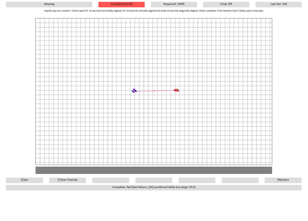

# Aliasing

This is to test the contact reporting capabilities of a Windows Precision Touchpad device, with respect to aliasing.

**Test name**

-   Test.Aliasing.json

**Core requirements tested**

-   Device.Input.Digitizer.PrecisionTouchpad.FingerSeparation

**Test purpose**

-   Verifies that the device can track and report unique, continually arriving and departing contacts without aliasing at fixed separation distances.

**Tools required**

-   PTLogo.exe

**Validation steps**

1. Launch Test.Aliasing.json.

2. Place two fingers approximately10mm apart, horizontally.

3. Alternating between the two fingers, tap the touchpad at 240 taps/minute. When tapping, hold down a contact until it is time to make another tap with that contact (in order to interleave the down times of the two contacts), rather than making light taps, one after another.

4. Verify that after tapping for 10 seconds, there is no line drawn between these contacts (see Common Errors for an example of a failure).

5. Repeat **Step 2** to **Step 5** with fingers aligned on the vertical axis.

6. Repeat **Step 2** to **Step 5** with fingers aligned on the diagonal axis.

7. Manually pass the iteration, if validation in every axis was successful.

8. Repeat **Step 2** to **Step 7** with fingers approximately 33mm apart.

**Note**  If the Precision Touchpad device has a height of less than 33mm, you should verify vertical aliasing at the maximum possible distance.

 

**Common error messages**

-   "\[20\] Positional delta too large"
    o Aliasing caused device contact swap, thus causing device to report a quick swipe.
    o The value represents the displacement distance.
    o Any displacement greater than 270 himetric units (2.7mm) will result in this error.

Here's a screenshot from the Aliasing test, showing a displacement distance that is too large.

**Passing criteria**

-   2/2 (100%) iterations must pass in order to complete with passing status.

 

 

