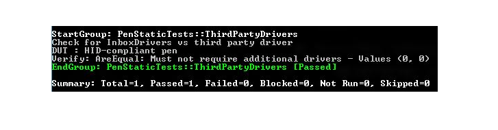
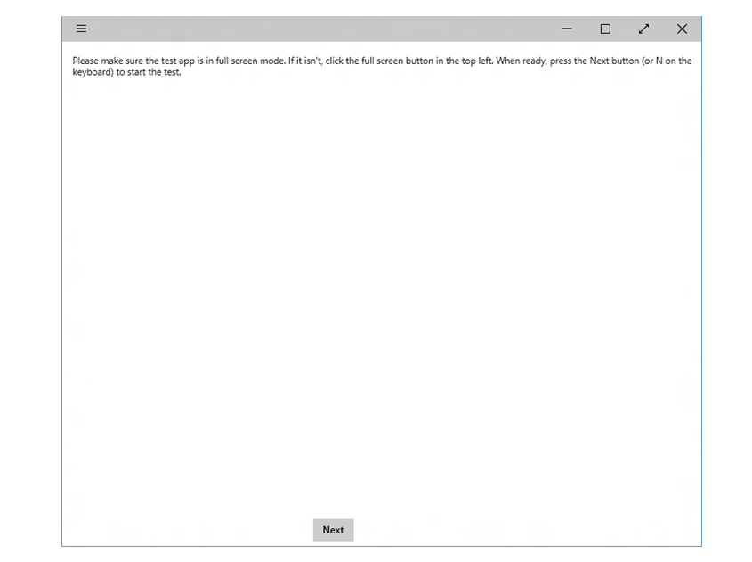

# Appendix


The appendix for the Windows Pen Validation Guide, provides information about manually running the Windows Hardware Lab Kit (HLK) tests, some points to note (following our latest content release), and answers to some frequently asked questions.

## Manual run


Depending on your testing situation, it may be necessary to run tests manually. This is also referred to as running the tests “standalone” from the command line, as opposed to running the tests through the HLK Studio. Tests that are run manually cannot be submitted for compatibility certification. So you should only run tests manually, if you have an issue that prevents you from running them through HLK Studio, or you have been instructed to do so by the Pen HLK team.

If you need to contact the Pen HLK team, you can reach them via email at pen\_qn@microsoft.com.

### Before Running Input HLK Tests

Before running the tests standalone, please make sure that you have installed the normal HLK client on the device under test, and you've obtained a developer license that is still current. Installing the HLK client will ensure that all needed prerequisites for testing are installed on the device. After the HLK client is installed and the developer license is acquired, you should be able to run all the input HLK tests standalone.

### Files required to run test

The pen test files can be found in the following locations:

-   On an x86 system:
    
    C:\\Program Files (x86)\\Windows Kits\\10\\Hardware Lab Kit\\Tests\\**x86**\\input\\Digitizer
-   On an amd64 system:
    
    C:\\Program Files (x86)\\Windows Kits\\10\\Hardware Lab Kit\\Tests\\**amd64**\\input\\Digitizer

Make sure that the pen test folder contains the files required for the TAEF test framework, as well as files for pen-specific tests. Here's a list of files that you would typically find in the pen tests folder:

-   Core pen tests
    + PenTests.dll
    + PTS.dll
    + Pen.xml
    + PenLatencyTests.wsc
    + PenStaticTests.wsc
-   Pen test tools
    + audiotouch.exe
    + stepmotor.exe
-   Test harness files
    + TAEF folder
-   Supporting files
    + wlklogannotation.dll
    + WTTlog.dll

### Running all Tests in PenTests

Use the following command to run all the tests contained in PenTests:
```
taef\\te.exe PenTests.dll
```
### Running specific tests in PenTests

To run a specific test, use the **/name** parameter, using the table ID given in pen.xml:
```
taef\\te.exe PenTests.dll /name:\*ContactAccuracy
```
### Running Latency tests using RA Tool

- Running all Tests that use the RA Tool

  Use the following command to run all tests contained in RA tool tests (audiotouch/stepmotor):
  ```
  taef\\te.exe PenLatencyTests.wsc
  ```
- Running specific tests that use RA Tool

  To run a specific test, use the **/name** parameter. For example:
  ```
  taef\\te.exe PenLatencyTests.wsc /name:\*audiotouch
  taef\\te.exe PenLatencyTests.wsc /name:\*stepmotor
  ```
### Running test for third party drivers (static test)

The following command line will run static test for third party drivers:
```
taef\\te.exe PenStaticTests.wsc
```
Here's a screenshot of the result of running the static test:



## Release notes


### Initial step to start running PenTests

The first time *PenTests.dll* is run, it may require a switch to full screen mode. Please follow the steps on the screen, to switch to full-screen mode. Here's a screenshot of the instructions for switching:



### For some devices, full screen mode may not function properly

For some devices, the full screen window may not cover the entire screen, and the test background canvas may appear to be stretched. This can be resolved by setting the scaling to 100%.

## Frequently asked questions


-   How can partners submit questions about the pen HLK and testing process?
    
    Any questions about the Pen HLK testing and validation process can be directed to the Ask Windows 10 Pen alias (pen\_qn@microsoft.com).
-   For a pen device that works on different platforms, do I need to repeat the pen HLK test, and resubmit for each system that uses the pen?
    
    Yes, our HLK certification process is done per integrated system. We do not certify standalone pen devices.
-   Can a passive stylus or any other types of pens get tested by HLK?
    
    Only active pen devices that conform to the Active Pen Implementation Guide will be capable of completing HLK testing.
-   I have a device that is running Windows 10 Mobile. Can I still use the HLK for compatibility testing?
    
    HLK tests for devices running Windows 10 Mobile are not available at this time. Until the tests are available, we will be relying on our hardware partners to attest to the fact that their devices meet the Windows 10 requirements.
-   I have a device with a diagonal screen size that is smaller than 4.5” or larger than 30”. Can I still use the HLK for compatibility testing?
    
    Unfortunately, the assistive testing jigs and some of the HLK tests only support devices with screen sizes from 4.5”-30”. If your device does not meet these size requirements, please contact us directly and we will work with you to set up a testing process so you can receive compatibility certification.
