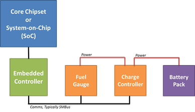
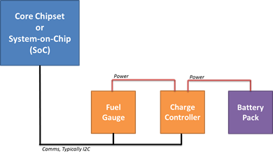
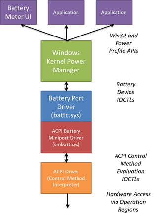

# Battery and charging

## Battery charging user experience

This topic covers recommendations for battery and charging in Windows 10. All devices running Windows have a consistent battery charging experience, regardless of form factor, instruction set, or platform architecture. As a result, users have a consistent and quality experience with battery charging.

1.  Charging always occurs when connected to the charger.

    Except for cases of battery failure, a device running Windows is always capable of charging the battery whenever it is connected to the charger.

2.  Windows can always boot when connected to the charger.

    -   Windows 10 for desktop editions (Home, Pro, Enterprise, and Education):

        If the device is in the S5 (shutdown state), it can always boot into Windows when connected to the charger, regardless of the battery charge level and presence of the battery, if the battery is removable.

    -   Windows 10 Mobile:

        A battery must be present and have enough charge level in order for the system to boot up.

3.  Hardware autonomously manages charging.

    The hardware charges the device's battery without requiring firmware, Windows, drivers, or other software running on the main CPU(s). This requirement only applies to Windows 10 for desktop editions systems. Windows 10 Mobile systems may require the support of a UEFI charging app and/or other software components in order to charge the battery.

4.  Charging stops automatically when the battery is fully charged or when a fault occurs.

    The hardware automatically stops charging when the battery is completely charged. This is done without requiring firmware, Windows, drivers, or other software running on the main CPU(s). If there is a battery or thermal fault condition, charging is also automatically stopped.

### Charging occurs when connected to the charger

Users expect their device to charge whenever it is connected to the charger. As such, the hardware must always attempt to charge the battery whenever the device is connected to the charger regardless of the power state. This expectation holds true across all of the power states including active (S0), Sleep (S3), Hibernate (S4), shutdown (S5), hard off (G2/G3) and S0 Idle. Charging may stop once the battery is fully charged or if a fault condition occurs.

We do not recommend a design that charges the battery at a reduced rate when Windows or the firmware has not been booted or running. For example, the battery may charge at a slower rate when the system is completely off and connected to the charger and charge at a faster rate when the device is booted and ACPI firmware can be used to monitor the battery periodically.

Finally, a design may charge the battery at a lower rate when the system is in a thermal condition. In this scenario, heat may be reduced by slowing or eliminating battery charging altogether. Thermal conditions are the exception in any good system design.

### Windows is always bootable when connected to AC power

-   Windows 10 for desktop editions

    Users expect they can immediately boot and use their device whenever it is connected to the charger. As such, the device must always boot and be fully useable when connected to AC power. This holds true regardless of the battery charge level, battery/charger state, and battery presence (if the battery is removable).

    If the device requires a minimum battery capacity to boot the firmware and Windows, the hardware must ensure that battery capacity is always reserved by the platform. The reserved battery capacity must not be exposed to Windows.

-   Windows 10 Mobile

    When the system is connected to AC power and the battery is present, the system should attempt to boot to the operating system, as long as the battery has sufficient charge to power the system during the boot process.

### Hardware autonomously manages charging

As specified above, users expect their device to charge when it is connected to the charger. As a result, the hardware must charge the battery without requiring firmware, Windows, drivers or other software running on the main CPU(s) as one or more of these components may not be operational or may be in a fault state at any given time. This requirement applies only to Windows 10 for desktop editions systems. Windows 10 Mobile systems may require the support of a UEFI charging app and/or other software components in order to charge the battery.

### Charging stops automatically when fully charged or when a fault occurs

The hardware automatically stops charging when the battery is completely charged or if a fault occurred. As with charging, this must be done without requiring firmware, Windows, drivers, or other software running on the main CPU(s). Further, the hardware is required to comply with all battery safety regulatory conditions.

## Power and charging indicators

Windows provides a power source and battery status indicator using icons the user can see in several places. Places include the battery system tray icon and lock screen.

A device can also have a physical indicator such as an LED indicating the charging status. This indicator must have little impact on the power consumption.

### Windows power and charging icons

Windows displays power source and charging status in three locations:

-   On the lock screen:

    Windows displays a battery icon with the power source and charge status.

-   Desktop system tray (Windows 10 for desktop editions only):

    Windows displays a battery icon with power source and charge status. When the user clicks on the battery icon, they can view information such as capacity remaining, estimated time remaining, and per-battery details (if equipped with multiple batteries).

-   Status Bar (Mobile SKU only):

    Windows displays a battery icon with power source and charge status. When the user swipes down from the top of the screen to expand the action center, they can view the actual battery percentage.

-   Battery Saver Settings:

    In the Battery Saver settings page (Settings -&gt; System -&gt; Battery Saver), Windows displays the overall battery percentage, battery status (Charging vs. Discharging) and the Estimated Remaining Time to charge/discharge.

For platforms capable of S0 Idle, if the display is visible, Windows briefly lights up the display when the system is connected to or disconnected from the charger to notify the user of a power source change.

### Platform hardware charging indicators

The icons built into Windows only address scenarios where Windows is running and the display is visible to the user. However, the on-screen indicators are not visible when the system is shutdown or S0 Idle state where the display is off. Because the user cannot see visual cues on the screen, the platform may include a physical charging indicator to indicate power is present.

The following section provides our recommendation for implementing keyboards and mice/touchpads on S0 Idle platforms with docking solutions. This section also talks about the challenges and principles along with potential solutions. Both potential solutions apply to mobile and A/C powered stationary docks.

## Exposing the power and charging subsystem to Windows

Every mobile device running Windows includes one or more batteries and a power source such as an AC adapter. Information from these subsystems conveys power management status to the user. The status includes remaining battery capacity at any time, state of the AC adapter and battery charging, and estimated remaining battery time. The power subsystem information is exposed in the Windows battery meter and other power management diagnostic utilities.

The following section provides our recommendation for implementing keyboards and mice/touchpads on S0 Idle platforms with docking solutions. This section also talks about the challenges and principles along with potential solutions. Both potential solutions apply to mobile and A/C powered stationary docks.

### Typical power subsystem hardware topologies

Generally, Windows expects one of two hardware topologies for the power and charging subsystem.

The following figure illustrates the first topology that uses the platform's Embedded Controller, which is common in existing devices running Windows. The Embedded Controller performs multiple functions in a mobile device, including power source control, battery charge management, power button/switch detection and PS/2-compatible keyboard and mouse input. The embedded controller is typically connected to the core silicon through the Low Pin Count (LPC) bus. Windows queries and is notified about power subsystem information through the ACPI embedded controller interface.

The next figure illustrates the second topology, which makes use of a battery charge controller and fuel gauge component connected directly to the platform's core silicon over a lightweight peripheral bus such as I²C. In this configuration, Windows queries and is notified about power subsystem changes through communications over the I²C bus. Instead of using a device driver for the battery or charging subsystem, the ACPI control method environment is extended with support for a Simple Peripheral (SPB) Operation Region. The SPB operation region allows the ACPI control method code to communicate to the battery charge controller and fuel gauge components connected to the core silicon over I²C.

### Battery and power subsystem driver model

Windows features a robust battery and power subsystem device driver model. The power management information is conveyed to the Windows power manager through a battery device driver, then aggregated and exposed to the Windows user interface through the battery device IRPs and a set of power management software APIs.

The battery driver model is a port/miniport model—that is, the battery model and interfaces are defined such that the new battery types can be exposed through a miniport. However, in practice, there are only two miniports that have any significant use in the Windows ecosystem - the battery miniport driver supporting the ACPI control method batteries and the HID battery miniport driver for USB-attached Uninterruptible Power Supply (UPS) devices.

All PCs are expected to expose the batteries and charging subsystem through the ACPI control method interface. The battery miniport interface should not be used for platform-specific battery charging subsystems. There are ACPI specification-defined control methods that allow Windows to poll for battery information and status. Similarly, there is an event-driven model to allow the hardware platform to notify Windows of battery and power source changes, such as a transition from AC to battery power.

### Status polling

The Windows power manager periodically requests status information from the battery including the charge capacity remaining and the current rate of drain. This request originates in the power manager, a higher-level user interface component, or application. The power manager turns the request into an I/O Request Packet (IRP) to the battery device(s). When the battery is exposed through the ACPI control method interface, the control-method battery driver (cmbatt.sys) executes the appropriate ACPI control methods. In the case of status information, the \_BST (battery status) method is executed.

The \_BST method requires the ACPI firmware to obtain current information from the power subsystem and then packages that information in a buffer with format specified by the ACPI specification. The specific code required to access the battery status either from the embedded controller or the battery charger connected through I²C is contained within the ACPI firmware and part of the code comprising the \_BST method. The net result of the \_BST method is the buffer of information required which is returned to the control-method battery driver. The control method battery driver finally converts the buffer to the format required by the battery driver and Windows power manager.

### State change notifications

The power and battery subsystem will generate several notifications to Windows for state changes, including transitions from AC to battery power. Polling by Windows for these state changes is not practical given the high frequency at which polling would be required. Therefore, the hardware platform must use an event-driven model to notify Windows when the battery state changes significantly.

When the battery status changes, including remaining capacity or charging status, the ACPI firmware issues a Notify(0x80) on the control method battery device. The Windows control method battery driver then evaluates the \_BST method and returns the updated information to the power manager.

When the battery static data changes, including last full charge capacity, design capacity and cycle count, the ACPI firmware issues a Notify(0x81) on the control method battery device. The Windows control method battery driver then evaluates the \_BIX method and returns the updated information to the power manager.

The platform interrupts the ACPI firmware environment through the System Control Interrupt (SCI) in the case of an Embedded Controller-equipped platform and through a GPIO in the case of platforms with battery subsystem hardware connected directly to the core silicon.

### ACPI operation with an embedded controller

Platforms that have their battery and power subsystem connected to the typical embedded controller use the ACPI Embedded Controller operation region to facilitate communications between the ACPI control method environment and the platform hardware.

The ACPI firmware must define the embedded controller in the ACPI namespace as described in section 12.11.1 of the ACPI specification, including:

-   A Device() node for the embedded controller.
-   A \_HID object that indicates the device is an embedded controller.
-   A \_CRS object to denote the IO resources for the embedded controller.
-   A \_GPE object that defines the SCI for the embedded controller.
-   An operation region describing the information contained within the embedded controller that can be accessed by other ACPI control method code in the namespace, including battery status and information methods.

Complete details are described in section 12 of the ACPI specification.

### Accessing battery information from the embedded controller

The ACPI control method accesses the information from the embedded controller by reading the values described in the embedded controller's operation region.

### Notifying the operating system when battery state changes

When the embedded controller detects a change in battery state, including a change in charging state or remaining capacity as specified by \_BTP, the embedded controller generates an SCI and sets the SCI\_EVT bit in the embedded controller status command (EC\_SC) register. The Windows ACPI driver will communicate with the embedded controller and issue a query command (QR\_EC) to request specific information about the notification to be issued. The embedded controller then sets a byte value corresponding to the \_QXX method to be executed. For example, the embedded controller and ACPI firmware can define value 0x33 to be an update to the battery status information. When the embedded controller sets the value 0x33 as the notification, the ACPI driver will execute the \_QXX method. The contents of the \_QXX method will typically be a Notify(0x80) on the control method battery device in the namespace.

### ACPI operation with an I²C connected charging system

Platforms may also connect their battery and power subsystem connected to the core chipset through a low-power serial bus such as I²C. In these designs, the ACPI GenericSerialBus operation region is used to communicate between the ACPI control methods and battery subsystem hardware. Connecting the battery subsystem hardware to a GPIO interrupt allows the ACPI control methods to be executed when a battery status changes.

When the battery and power subsystem hardware is connected through I²C, the ACPI firmware must define:

-   A Device() node for the GPIO controller device to which the I²C interrupt is connected, including:

    -   \_HID object describing the hardware ID of the GPIO controller.
    -   \_CSR object describing the interrupt and hardware resources of the GPIO controller.
    -   \_AEI object which maps one or more GPIO lines to ACPI event method execution. This allows ACPI methods to be executed in response to GPIO line interrupts.
-   A Device() node for the I²C controller to which the battery fuel gauge and charging hardware are connected, including:

    -   \_HID and \_CSR objects describing the hardware ID and resources of the I²C controller.
    -   A GenericSerialBus OperationRegion within the scope of the I²C device describing the virtual command registers for the I²C device.
    -   Field definitions within the GenericSerialBus OperationRegion. The field definitions allow ASL code outside of the I²C device to access the virtual command registers for the I²C device.

Describing the GPIO controller and mapping of GPIO lines to ACPI events allows the control methods for battery status and notification to be executed when a GPIO interrupt from an I²C device is raised. Describing the GenericSerialBus operation region allows the ACPI code for battery status to communicate over the I²C bus and read registers and information from the battery fuel gauge and charging subsystem.

### Accessing battery information from the charging system

The battery status can be executed by ACPI control methods by sending and receiving commands over the I²C bus to which the battery subsystem hardware is connected. The control method code backing the status and battery static information methods reads and writes data from the GenericSerialBus operation regions described in the ACPI namespace. The control method code reads the data from the fuel gauge device or static information about the battery capacity and cycle counts over the I²C bus through the GenericSerialBus operation region.

### Notifying Windows when the battery state changes

An interrupt can be generated by the battery subsystem hardware when the state changes and the interrupt is physically connected to a GPIO line on the core silicon. The GPIO line can be mapped to a specific control method execution using the \_AEI object under the GPIO controller described in ACPI. When the GPIO interrupt occurs, the Windows ACPI subsystem runs the method associated with the specific GPIO line which can in turn do a Notify() on the control method battery device, causing Windows to re-evaluate the status and static information methods to update the battery status.

### ACPI implementation of power supply object

The ACPI firmware must implement an ACPI power source device. This object must report itself with a hardware ID (\_HID) of "ACPI0003". This object must also implement the ACPI \_PSR (Power Source) method. This method returns the status of the power source and conveys if the power source is currently online (AC power) or offline (on battery power). All input power sources for the system must be multiplexed through a single \_PSR method. E.g., \_PSR must convey online if the system is powered through a DC barrel connector or a separate dock connector. Do not use multiple ACPI Power Source Devices.

The \_PSR method must only report online (AC power) when the system is connected to mains power. When the state of \_PSR changes, the platform must generate an interrupt and a Notify(0x80) on the device in the ACPI namespace. This must be performed immediately after the physical state change is detected by the platform.

### ACPI implementation of battery static information

The ACPI firmware must implement the ACPI \_BIX method for each battery that provides static information about the battery, including design capacity, cycle count, and serial number. The table below expands on the definitions of the fields described in the ACPI specification and enumerates Windows-specific requirements for this information.

<table>
<thead>
<tr class="header">
<th>Field</th>
<th>Description</th>
<th>Windows-specific requirements</th>
</tr>
</thead>
<tbody valign="top">
<tr class="odd">
<td>Revision</td>
<td>Indicates _BIX revision</td>
<td>Must be set to 0x0</td>
</tr>
<tr class="even">
<td>Power Unit</td>
<td>Determines the units reported by the hardware. Either: MA/MAh or mW/mWh.</td>
<td>Must be set to 0x0 to indicate units is mW/mWh</td>
</tr>
<tr class="odd">
<td>Design Capacity</td>
<td>Indicates the original capacity of the battery in mWh</td>
<td>Must be set to an accurate value and cannot be 0x0 or 0xFFFFFFFF</td>
</tr>
<tr class="even">
<td>Last Full Charge Capacity</td>
<td>Indicates the current full charge capacity of the battery</td>
<td>
Must be set to an accurate value and cannot be 0x0 or 0xFFFFFFFF

This value must update each time cycle count increases.
</td>
</tr>
<tr class="odd">
<td>Battery Technology</td>
<td>Indicates if the battery is rechargeable or one-time use.</td>
<td>Must be set to 0x1 to indicate the battery is rechargeable</td>
</tr>
<tr class="even">
<td>Design Voltage</td>
<td>Indicates the design voltage of the battery</td>
<td>
Must be set to the design voltage of the battery when new in mV.

Must not be set to 0x0 or 0xFFFFFFFF.
</td>
</tr>
<tr class="odd">
<td>Design capacity of Warning</td>
<td>Indicates an OEM-provided low battery warning level.</td>
<td>This value is ignored by Windows.</td>
</tr>
<tr class="even">
<td>Design capacity of Low</td>
<td>Indicates the critical battery level at which Windows must immediately Shutdown or Hibernate before the system powers off.</td>
<td>Must be set to a value between 0x0 and 5% of the battery design capacity.</td>
</tr>
<tr class="odd">
<td>Battery Capacity Granularity 1</td>
<td>Indicates the minimum amount of remaining charge change that can be detected by the hardware between the Design Capacity of Warning and Design Capacity of Low.</td>
<td>Must be set to a value no larger than 1% of the battery design capacity.</td>
</tr>
<tr class="even">
<td>Battery Capacity Granularity 2</td>
<td>Indicates the minimum amount of remaining charge change that can be detected by the hardware between Last Full Charge Capacity and Design Capacity of Warning.</td>
<td>Must be set to a value no larger than 75mW (approximately .25% of a 25Whr battery) which is (1/400) of the battery design capacity.</td>
</tr>
<tr class="odd">
<td>Cycle Count</td>
<td>Indicates the battery cycle count.</td>
<td>Must be set to a value larger than 0x0. Must not be set to 0xFFFFFFFF.</td>
</tr>
<tr class="even">
<td>Measurement Accuracy</td>
<td>Indicates the accuracy of the battery capacity measurement.</td>
<td>Must be set to 95,000 or better, indicating 95% accuracy or better.</td>
</tr>
<tr class="odd">
<td>Max Sampling Time</td>
<td>The maximum supported sampling time between two successive _BST evaluations which will show a difference in remaining capacity.</td>
<td>No specific requirement.</td>
</tr>
<tr class="even">
<td>Min Sampling Time</td>
<td>The minimum supported sampling time between two successive _BST evaluations which will show a difference in remaining capacity</td>
<td>No specific requirement.</td>
</tr>
<tr class="odd">
<td>Max Averaging Interval</td>
<td>The maximum averaging interval, in milliseconds, supported by the battery fuel gauge.</td>
<td>No specific requirement.</td>
</tr>
<tr class="even">
<td>Min Averaging Interval</td>
<td>The minimum averaging interval, in milliseconds, supported by the battery fuel gauge.</td>
<td>No specific requirement.</td>
</tr>
<tr class="odd">
<td>Model Number</td>
<td>OEM-provided battery model number</td>
<td>Must not be NULL.</td>
</tr>
<tr class="even">
<td>Serial Number</td>
<td>OEM-provided battery serial number</td>
<td>Must not be NULL.</td>
</tr>
<tr class="odd">
<td>Battery Type</td>
<td>OEM-provided battery type information</td>
<td>No specific requirement.</td>
</tr>
<tr class="even">
<td>OEM Information</td>
<td>OEM-provided information</td>
<td>No specific requirement.</td>
</tr>
</tbody>
</table>

 

### ACPI implementation of battery real-time status information

The ACPI firmware must implement the ACPI \_BST method for each battery which provides real-time status information about the battery, including remaining capacity and current rate of drain. The table below expands on the definitions of the fields described in the ACPI specification and enumerates the Windows-specific requirements for this information.

<table>
<thead>
<tr class="header">
<th>Field</th>
<th>Description</th>
<th>Windows-specific requirements</th>
</tr>
</thead>
<tbody valign="top">
<tr class="odd">
<td>Battery State</td>
<td>Indicates if the battery is currently being charged, is discharging or is in a critical state.</td>
<td>The Battery State must report charging only if the battery is charging. Likewise, the Battery State MUST report discharging only if the battery is discharging. A battery that is neither charging nor discharging must report neither bit.</td>
</tr>
<tr class="even">
<td>Battery Present Rate</td>
<td>Provides the current rate of drain in mW from the battery.</td>
<td>
Must be greater than 0x0 and less than 0xFFFFFFFF.

Must be accurate within the value of Measurement Accuracy in _BIX.
</td>
</tr>
<tr class="odd">
<td>Battery Remaining Capacity</td>
<td>Provides the remaining battery capacity in mWh.</td>
<td>
Must be greater than 0x0 and less than 0xFFFFFFFF.

Must be accurate within the value of Measurement Accuracy in _BIX
</td>
</tr>
<tr class="even">
<td>Battery Present Voltage</td>
<td>Indicates the current voltage across the terminals of the battery.</td>
<td>Must be between a value of 0x0 and 0xFFFFFFFF in mV.</td>
</tr>
</tbody>
</table>

 

When any data in \_BST changes, the platform must generate an interrupt and a Notify(0x80) on the battery device in the ACPI namespace. This must be performed immediately after the physical state change is detected by the platform. This includes any change in the Battery State field for the charging (i.e. Bit0) or discharging (i.e. Bit1) bits.

Additionally, the platform must implement the \_BTP-Battery Trip Point-method. \_BTP allows Windows to specify a remaining capacity threshold that when crossed, the platform must generate an interrupt and a Notify(0x80) on the battery device in the ACPI namespace. The \_BTP method prevents Windows from needing to poll the battery periodically.

### Battery control methods

The ACPI specification affords for device and operating system-specific control methods through the Device-Specific Method or \_DSM control method. \_DSM is described in section 9.14.1 of the ACPI specification.

Windows supports the following \_DSM methods for control-method battery devices.

### Thermal charge rate direction

<table>
<thead>
<tr class="header">
<th>Field</th>
<th>Value</th>
<th>Description</th>
</tr>
</thead>
<tbody valign="top">
<tr class="odd">
<td>UUID</td>
<td>4c2067e3-887d-475c-9720-4af1d3ed602e</td>
<td>GUID indicating extensions to the Windows control method battery driver support</td>
</tr>
<tr class="even">
<td>Revision ID</td>
<td>0x0</td>
<td>First revision of this capability</td>
</tr>
<tr class="odd">
<td>Function Index</td>
<td>0x1</td>
<td>Set battery charge throttle</td>
</tr>
<tr class="even">
<td>Arguments</td>
<td>Thermal Limit</td>
<td>
Integer value from 0 to 100 indicating the thermal charge limit.

A value of 40% indicates the battery should be charged at 40% of maximum rate.

A value of 0% indicates battery charging should be stopped until this method is called again.
</td>
</tr>
<tr class="odd">
<td>Return Value(s)</td>
<td>None</td>
<td>n/a</td>
</tr>
</tbody>
</table>

 

### User serviceable battery

<table>
<thead>
<tr class="header">
<th>Field</th>
<th>Value</th>
<th>Description</th>
</tr>
</thead>
<tbody valign="top">
<tr class="odd">
<td>UUID</td>
<td>4c2067e3-887d-475c-9720-4af1d3ed602e</td>
<td>GUID indicating extensions to the Windows control method battery driver support</td>
</tr>
<tr class="even">
<td>Revision ID</td>
<td>0x0</td>
<td>First revision of this capability</td>
</tr>
<tr class="odd">
<td>Function Index</td>
<td>0x2</td>
<td>Indicates this _DSM is for OSPM to determine if the battery device is user-serviceable or not.</td>
</tr>
<tr class="even">
<td>Arguments</td>
<td>None</td>
<td>No arguments required.</td>
</tr>
<tr class="odd">
<td>Return Value(s)</td>
<td>Package containing a single integer.</td>
<td>
0x0 if the battery is not user-serviceable and cannot be replaced by the end user, or can be replaced by the end user with additional tools.

0x1 if the battery can be replaced by the end-user without additional tools.
</td>
</tr>
</tbody>
</table>

 

### Charging watchdog required

<table>
<thead>
<tr class="header">
<th>Field</th>
<th>Value</th>
<th>Description</th>
</tr>
</thead>
<tbody valign="top">
<tr class="odd">
<td>UUID</td>
<td>4c2067e3-887d-475c-9720-4af1d3ed602e</td>
<td>GUID indicating extensions to the Windows control method battery driver support</td>
</tr>
<tr class="even">
<td>Revision ID</td>
<td>0x0</td>
<td>First revision of this capability</td>
</tr>
<tr class="odd">
<td>Function Index</td>
<td>0x3</td>
<td>Indicates this _DSM is for the OSPM to determine if the control method battery requires periodic watchdog resetting to maintain high current charging and the period at which the watchdog must be reset</td>
</tr>
<tr class="even">
<td>Arguments</td>
<td>None</td>
<td>No arguments required.</td>
</tr>
<tr class="odd">
<td>Return Value(s)</td>
<td>Package containing a single integer.</td>
<td>0x0 if the battery does not require watchdog servicing.

Values inclusive of 0x0000001e and 0x12C indicate the maximum poling interval in seconds.

All other values are ignored and are treated as 0x0 and watchdog resetting is not required.

If a valid watchdog interval is specified, Windows will execute the _BST method at an interval no longer than the watchdog value specified whenever the value of BatteryState in the _BST method is set to charging.

Dynamic update of this value is not supported.
</td>
</tr>
</tbody>
</table>

 

### 3rd Party Battery Miniport Drivers

In Windows 10, OEMs and IHVs can develop their own 3rd party battery miniport drivers to replace the Microsoft cmbatt.sys driver and communicate directly with the battery hardware. A sample battery driver is provided by Microsoft on GitHub and as part of the WDK samples kit .

### USB charging (Windows 10 for desktop editions)

Microsoft recognizes the value in providing the option to support USB charging of a mobile device. With standardization efforts such as the EU's move to standardize mobile phone chargers, USB chargers are widely available and work across a wide variety of devices including Windows Phones, MP3 players, GNSS devices, etc. Microsoft understands the value of offering a single charger that can be used to charge multiple devices including a device running Windows. Further, given the broad industry support for USB charging there are auxiliary benefits that reduce costs and environmental impact.

Beginning with Windows 8, a mobile device could be powered and/or charged through USB provided that the battery charging requirements outlined below are met. In addition, there are a number of USB-specific requirements that must be met to ensure a quality user experience.

1.  USB power/charge must be implemented entirely in the platform firmware. Support must not require an operating system, driver, or application.
2.  The device MUST NOT enumerate when connected to another device. As a result, the device will not charge when connected to a standard PC USB port as these ports are limited to 500mA by default. The only exceptions are when this port is used for debugging and for initial factory firmware programming.
3.  The device supports charging from a dedicated USB charging port. The device must charge when connected to a charger that is compliant with the [USB Battery Charging specification version 1.2](http://www.usb.org/developers/docs/devclass_docs/). The device should not draw more than 1.5A per charging standards when connected to a standard USB charger. The OEM may opt to support higher current levels provided the following conditions are met:

    -   The device automatically detects the charger type and charges at the appropriate rate for the specific charger type.
    -   The device and charger meet all relevant electrical and safety standards.
    -   The OEM ships the charger and associated cable with the device.

4.  USB charging is supported over either a standard micro-AB receptacle, USB-C (recommended) or a proprietary dock connector. A micro-B receptacle is NOT allowed on the device. If using a proprietary dock connector, the OEM must ship an appropriate cable with the device to enable charging from a standard USB charger.
5.  If the micro-AB port is implemented, the device must automatically detect the cable type, configuration, and assume the appropriate role. If a micro-B plug is inserted and debugging is not enabled on the port, the charger role should be assumed. If a micro-B plug is inserted and debugging is enabled on the port, the debug role should be assumed (i.e. charging is not supported). If a micro-A plug is inserted, the USB host role is assumed where attached USB devices is recognized by Windows.
6.  If the micro-AB port also functions as a debug port, the device must provide a means through firmware to switch between the charger and debug role. The default setting as shipped to the end user must have debug DISABLED.
7.  If the micro-AB port also functions as a debug port, the device should provide an alternative input power path through either a dedicated barrel connector or proprietary dock connector.

### USB charging (Windows 10 Mobile)

Please refer to the USB section in the [Windows Phone Hardware Development guide](https://sysdev.microsoft.com/Hardware/OEM/docs/Driver_Components/Battery).

## Platform designer and implementer checklists

You can use the following checklists to validate the platform design and system firmware adhere to the battery and charging subsystem guidance outlined.

### Battery subsystem and ACPI firmware implementation checklist

System designers should ensure they have completed the following tasks in their ACPI firmware to ensure correct reporting of battery and power subsystem information to Windows:

-   Add a Device() object for each battery device in the ACPI namespace.
-   Each battery device must provide the following control methods and objects:

    -   \_HID with a value of PNP0C0A.
    -   \_BIX-Battery Information Extended:

        Conveys the battery static information including the last full charge capacity, design capacity and cycle count.

    -   \_BST-Battery Status:

        Conveys the current battery status, including the remaining capacity, rate of drain, and charging state.

    -   \_BTP-Battery Trip Point:

        Enables an event-driven battery status model to reduce periodic work for polling. \_BTP allows Windows to specify a threshold of remaining charge capacity at which the platform should issue at Notify(0x80) on the battery device to request Windows to update the battery status information.

    -   \_STA-General Status:

        Allows Windows to know if the battery is present in the device where a battery may be removable or where there may be a battery in a portable dock.

-   Add a single Device() object for an AC adapter / Power Source in the ACPI namespace.
-   The power source device must provide the following control methods and objects:

    -   \_HID with a value of ACPI0003
    -   \_PSR-Power Source:

        Conveys if the power source is currently online (AC power) or offline (on battery power). All input power sources for the device must be multiplexed through the \_PSR method. For example, the \_PSR must convey online if the device is powered through a DC barrel connector or separate dock connector. Do not use multiple ACPI Power Source Devices.

-   The \_BIX method must support the fields and constraints described in the battery static information above:

    -   The *Revision* field must be set to 0x0.
    -   The *Power Unit* field must be set of 0x0.
    -   The *Design Capacity* and *Last Full Charge Capacity* values must be set to accurate values from the battery and charging subsystem and not set equal to 0xFFFFFFFF or 0x00000000.
    -   The *Battery Technology* field must be set to 0x1.
    -   The *Design Voltage* field must be set accurately and not equal to 0x00000000 or 0xFFFFFFFF.
    -   The *Design Capacity of Low* must be set to the minimum value required to Hibernate or Shutdown the system from a fully on state.
    -   The *Battery Capacity Granularity 1* and *Battery Capacity Granularity 2* fields must be set to a value no larger than 1% of the battery design capacity.
    -   The *Cycle Count* field must be accurately filled in from the battery subsystem.
    -   The *Measurement Accuracy* field must be set to 80,000d or better.
    -   The *Model Number and Serial Number* fields must not be set to NULL.
-   Provide a \_BST method that allows Windows to poll for real-time battery status. The fields in the \_BST method must all be returned dynamically from the underlying power and battery charging subsystem. Their accuracy must be within the value of Measurement Accuracy in the \_BIX method.
-   Provide a \_BTP method that allows Windows to specify a remaining charge capacity threshold at which the platform will interrupt Windows with a Notify(0x80) on the battery device.
-   Ensure a Notify(0x80) is only issued in response to a battery status change or \_BTP charge capacity limit trip. Do not execute a Notify(0x80) periodically.
-   When the battery level reaches the value specified in \_BIX.DesignCapacityofLow, the platform must generate a Notify(0x80) on the control method battery device.
-   For systems with multiple batteries, fully implement a control method battery device for each battery.

    -   The first battery in the namespace should be the primary battery for the system to aid in debugging purposes.
-   Implement the \_DSM method under each battery device to indicate if the battery is user-serviceable.
-   Implement the \_DSM method if a periodic watchdog reset is required during charging and Windows will guarantee periodic execution of the \_BST method within that polling window.
-   Implement the \_DSM method if battery charging rate control is required for the thermal model on the platform.

 

 

