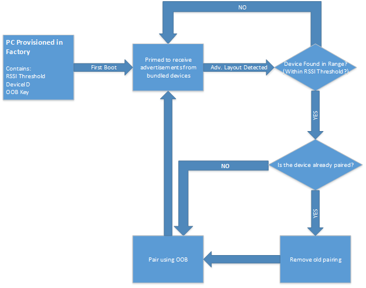

# Bluetooth LE pre-pairing
Windows 10 supports LE Bluetooth peripherals automatically pairing to a single PC, after all devices have been provisioned and enabled during the manufacturing process. Users do not need  to keep LE devices paired and connected after both the host PC and bundled devices are supplied power for the first time. These peripherals can still be used as regular Bluetooth devices, and maintain full functionality when out of range of the host PC. However, if the peripherals are unpaired and within range of the host PC, they will automatically re-pair and connect.
	
When an LE peripheral supporting this feature is supplied power for the first time, it sends out proprietary Microsoft-defined data in an undirected connectable advertisement. That advertisement is then picked up by the host PC. If the device is in range and its advertisement matches a pattern that is pre-provisioned in the host PC during manufacturing, then the device is paired. This is through Out-Of-Band Pairing which uses a separate secret OOB key that was also pre-provisioned. The distance from the host PC in which the peripheral may pair is determined by another pre-provisioned minimum RSSI value, which is represented in dB, so ranges may vary. All data pre-provisioned must be stored in UEFI to preserve this functionality on clean installs and system restores.

When a bundled device is unpaired within the range defined by the RSSI value, the Bluetooth device automatically re-pairs to Windows. Users must leave the range of the host PC, to be able to pair their device to other Bluetooth enabled PCs.

OEMs must determine on their own how to manufacture these devices. They must also guarantee security and that they will all be in the same box when shipped to customers.

## Feature requirements

### PC
- 	Windows 10 Anniversary Update
- 	UEFI Stored Variables
- 	[Microsoft-defined Bluetooth HCI commands](https://msdn.microsoft.com/en-us/library/windows/hardware/dn936814) for optimize battery life. 

### Peripheral
- Bluetooth LE
- Store for Device ID (hashed from Bluetooth Address) & TK value
- Custom Advertisement (defined below)



## UEFI on host PC

This feature is dependent on storing information to aid the pairing process in UEFI. The feature allows this functionality to persist on system recovery and clean installs. After the UEFI variables are defined, they must be locked to be read-only. 

For each device supporting automatic pairing, the host PC should program the following OOB information into its NVRAM:
- 	RSSI Threshold: Defines a distance threshold in dB for when peripherals are “out of range of the host PC”
	- 	Set as a minimum signal strength before pairing takes place
	- 	The OEM must define the appropriate threshold
- 	DeviceID: uniquely identify a supporting device and should be 8 bytes in length to avoid device conflicts.
	- 	Must be as unique as the Bluetooth Mac Address
	- 	Not related to Device ID profile. Only used to represent unique peripherals.
	- 	OOB key: The 16 byte SMP TK value is shared between the host PC and the BTH LE device.
> Note: If device ID is not unique per device, or at least per bundle, there will be conflicts if multiple devices are within range of each other. Peripherals  pair with unanticipated PCs.

## OOB info pseudocode representation
```cpp
const unsigned long BTH_LE_DEVICE_ID_SIZE = 8;
#pragma pack(push,1)
typedef struct
{
    CHAR  RssiThreshold;
    UCHAR DeviceId[BTHLE_PREPAIRING_DEVICE_ID_SIZE];
    UCHAR SmpTK[16]; // TK Max Size
} BTHLE_PREPAIRING_ENTRY;
#pragma pack(pop) 
```

## Public UEFI NVRAM interface definition
```cpp
static const LPWSTR BTH_LE_PREPAIRING_NVRAM_VAR_NAME = L"BluetoothPairingInfo";
static const LPWSTR BTH_LE_PREPAIRING_NVRAM_VAR_GUID = L"{3C901928-0243-4778-8ADC-BC2D3C6E6B0E}";
```

## Advertisement Layout of Peripherals

|Section Type [1 Byte]	| Manufacturer [2 bytes]	| MsftSectionType [4 bytes]	| Device Identifier [8 bytes]|
|-----------------------|---------------------------|---------------------------|----------------------------|
|0xff (vendor specific)	|0x0006 (MSFT)				|0x00000004 (Prepairing) 	| *device identifier* 		 |

## Security Concerns
### **During Manufacturing**
There is the potential for Man in The Middle attacks if the provisioning data is obtained. Keeping the data secure is up to the OEM. 
### **After the customer has purchased the device**
It is possible for the values stored in UEFI to be read, and then spoofed on another device. This can grant access to the system by a malicious user. To mitigate this, we have also created the MDM policy [Bluetooth/AllowPrepairing](https://msdn.microsoft.com/windows/hardware/commercialize/customize/mdm/policy-configuration-service-provider#bluetooth-allowprepairing). This policy will allow enterprise and pro deployments to disable this feature.
