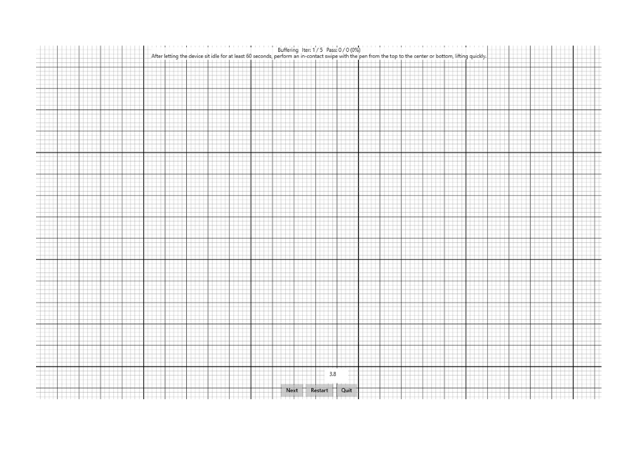

# Buffering

This is to test the data buffering behavior of a Windows pen device.

**Test name**

-   Buffering

**Core requirements tested**

-   Device.Input.Digitizer.Pen.Buffering

**Test purpose**

-   Verifies that the device has no data loss on wake from low power states.

**Tools required**

-   None.

**Validation steps**

1. Run the test case for buffering.
2. Set the pen out of range of the screen for at least 60 seconds.
3. Following the directions on the screen, you will perform a swipe with the pen across the screen:
   1. The swipe must be quick, the entire interaction (from entering hover range to leaving hover range) must be completed in less than half a second.
   2. The swipe must make contact with the screen.
   3. While in contact with the screen, the pen must make a displacement of &gt; 4mm.

Here's a screenshot from the Buffering test.

**Common error messages**

-   "Pen was not idle long enough"
    
    Occurs if the device was not left in idle state for at least 60 seconds.
-   "Stroke displacement too low"
    
    Occurs if the pen swipe did not make a displacement of &gt; 4mm.
-   "The interaction's duration was too long"
    
    Occurs if the pen swipe lasted more than half a second.

**Passing criteria**

-   1/1 test iterations must pass for test to succeed.
