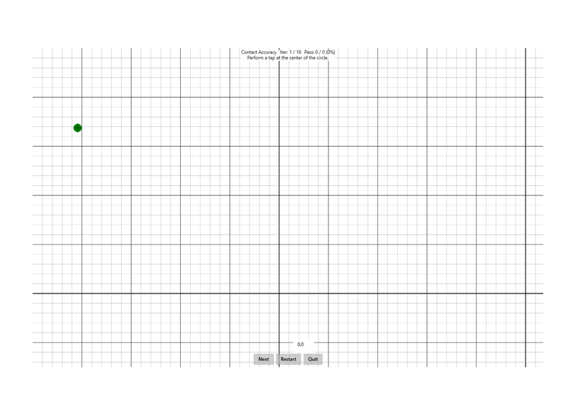

# Contact accuracy

This is to test the contact position reporting accuracy of a Windows pen device.

**Test name**

-   ContactAccuracy

**Core requirements tested**

-   Device.Input.Digitizer.Pen.Accuracy

**Test purpose**

-   Verifies that while the pen is in contact with the screen, the physical contact with the device matches the contact position that the device reports - within allowed limits.

**Tools required**

-   PT3 device with Pen holder + 150g weight.

**Validation steps**

1. Run the test case for Contact Accuracy.
2. Following the directions on the screen, tap at the center of the circle located at the cross hair. For each iteration:
   1. Tap the center of the location specified on the screen.

Here's a screenshot from the Contact Accuracy test.

**Common error messages**

-   "Contact distance from target too large:\[hm\]"
    
    Occurs if the tap is too far away from the center of the target. Distance given in hundredths of a millimeter.

**Passing criteria**

-   14/16 test iterations must pass for test success.
-   This test has an allowed tolerance of 0.1mm, therefore a recorded contact accuracy &lt;= 0.6 mm will result in a pass.
-   Any iteration that is 0.1mm beyond accepted tolerance, resulting in a recorded contact accuracy &gt;= 0.7 mm, will fail the entire test.
