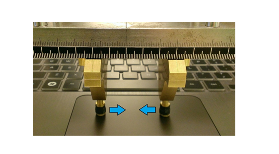
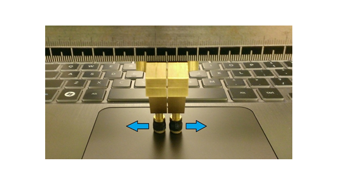
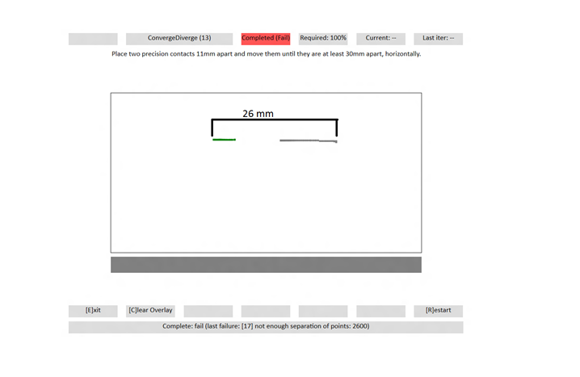
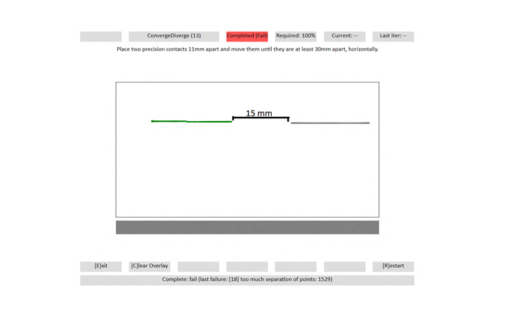

# Converge / Diverge

This is to test the contact tracking and reporting capabilities of a Windows Precision Touchpad device.

**Test name**

-   Test.ConvergeDivergeDiagonal.json

**Core requirements tested**

-   Device.Input.Digitizer.PrecisionTouchpad.FingerSeparation

**Test purpose**

-   Verifies that the device can track and report unique contacts without aliasing at continually varying separation distances.

**Tools required**

-   PT3 w/Precision Touchpad Modifications (or similar assembly for converge/diverge).
-   PTLogo.exe

**Validation steps**

1. Launch Test.ConvergeDivergeDiagonal.json in ptlogo.exe.

2. Use the converge/diverge assembly with two 7mm precision contacts.

3. Rotate the plate 45°.

4. Place these precision contacts on the digitizer surface separated by distance as instructed on screen.

5. As instructed, move contacts either towards each other (converge) or apart (diverge).
a. Every 2nd iteration, move the contacts to a new location on the touchpad.
b. Five iterations per direction for both converge and diverge (10 total).
6. If the 2 contacts remain distinct and no errors are detected, PTLogo will automatically pass the iteration and advance to the next.

- As shown in the following image, start with contacts greater than 23mm apart, and move them together until they are 8mm apart, edge to edge.

- As shown in the following image, start with contacts 9mm apart edge to edge, and move them until they are greater than 23mm apart.

**Common error messages**

When you perform this test, make sure that the widest distance between contacts is always greater than 23mm, and the smallest distance is always less than 9mm from edge to edge.

Here are some common error messages, along with their meanings.

-   "\[17\] not enough separation of points: \#\#\#\#."

    Either a converge test didn’t start with the contacts far enough apart, or a diverge test didn’t pull the contacts apart enough. The displayed value (\#\#\#\#) indicates the reported distance between the contacts.

    Here's a screenshot from the test, showing insufficient separation between points.

    

-   "\[18\] too much separation of points: \#\#\#\#."

    Either a converge test didn’t bring the contacts close enough together, or a diverge test didn’t start with the contacts close enough. The displayed value (\#\#\#\#) indicates the reported distance between the contacts.

    Here's a screenshot from the test, showing too much separation between contact points.

    

**Passing criteria**

-   A total of 30/30 (100%) iterations must pass in order to complete with passing status.

 

 

