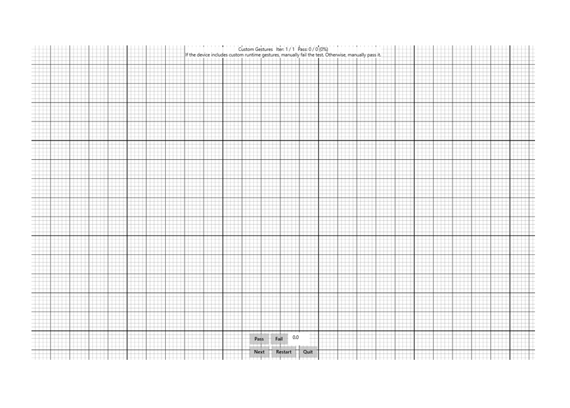

# Custom Gestures

This is a test to indicate whether or not a Windows pen device supports custom gestures.

**Test name**

-   Custom Gestures

**Core requirements tested**

-   Device.Input.Digitizer.Base.CustomGestures

**Test purpose**

-   Verifies that the pen does not have custom runtime gestures.

**Tools required**

-   None.

**Validation steps**

1. Run test case for Custom Gestures.
2. Click the "Fail" button, if your device has custom runtime gestures, otherwise click "Pass."

Here's a screenshot from the Custom Gestures test.

**Common error messages**

-   "Manually failed by user"
    
    Occurs if the operator manually Fails the test (fails the Custom Gestures requirement).

**Passing criteria**

-   1/1 test iterations must pass for the test to succeed.
