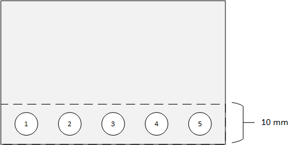

# Device Click Pressure

This is to test the button click reporting behavior (with respect to click pressure) of a Windows Precision Touchpad device.

**Test name**

-   Test.DeviceClickPressure.json

**Core requirements tested**

-   Device.Input.Digitizer.PrecisionTouchpad.Buttons

**Test purpose**

-   Verifies that the device reports button presses only when the required activation force has been exerted.

-   This test is only required for a button switch under the digitizer itself. External buttons are not subject to this requirement.

**Tools required**

-   PTLogo.exe

-   140g slug with 7mm contact area

-   190g slug with 7mm contact area

    Both slugs must maintain capacitance during testing. They should be grounded by either attaching copper wire to the top and placing the other end between 2 fingers, or by keeping 1 or 2 fingers connected to the contact *without applying or alleviating any weight to/from the slug.*

**Validation steps**

**Note**  For this test you will be verifying the activation force needed to register a button press on the touchpad in five locations for positive activation and five locations for negative activation. For the best experience, the five locations for both positive and negative testing should be selected to provide maximum coverage, however at a minimum, test locations must be within the lowest 10mm vertically of the digitizer surface.

 

Perform the following steps to run the tests.

1. Launch Test.DeviceClickPressure.json.

2. **Iteration One** (Negative Test Position 1):

a. Carefully place the 140g slug within 3mm of the bottom left corner of the digitizer surface at negative test position 1, as shown in the following diagram.

b. Verify that no button press is reported (the bar at the bottom of the screen should stay grey and not turn green). If no button press is reported, manually Pass the iteration, otherwise manually Fail the iteration.

3. **Iteration Two** (Negative Test Position 2):

a. At negative test position 2 (see the preceding diagram), repeat the steps in Iteration One.

4. **Iteration Three** (Negative Test Position 3):

a. Carefully place the 140g slug on the bottom left corner of the touchpad surface.

b. Slide the slug to negative test position 3 (see the preceding diagram).

c. Verify that no button press is reported (the bar at the bottom of the screen should stay grey and not turn green). If no button press is reported, manually Pass the iteration, otherwise manually Fail the iteration.

5. **Iteration Four** (Negative Test Position 4):

a. Repeat the steps in Iteration Three, but slide the slug from the bottom-right corner to negative test position 4 (see the preceding diagram).

6. **Iteration Five** (Negative Test Position 5):

a. Repeat the steps in Iteration Three, but slide the slug from the bottom-left corner to negative test position 5.

7. **Iteration Six** (Positive Test Position 1):

a. For a click-pad, carefully place the 190g slug within 3mm of the bottom-left corner of the digitizer surface, at positive test position 1 (see the preceding diagram).

b. For a pressure-pad, drop the 190g slug from a height of 1-2mm onto positive test position 1 (see the preceding diagram).

Make sure the slug lands flat on the surface, and not at an angle.

c. If a button press is continually reported while the slug is down, and not reported when the slug is removed, then manually Pass the iteration. Otherwise, manually Fail the iteration.

8. **Iteration Seven** (Positive Test Position 2):
a. For a click-pad, carefully place 190g slug within 3mm of the bottom-right corner of the digitizer surface, at positive test position 2 (see the preceding diagram).

b. For a pressure-pad, drop the 190g slug from a height of 1-2mm onto positive test position 2.

Make sure the slug lands flat on the surface, and not at an angle.

c. If a button press is continually reported while the slug is down, and not reported when the slug is removed, then manually Pass the iteration. Otherwise, manually Fail the iteration.

9. **Iteration Eight** (Positive Test Position 3):
a. For a click-pad, carefully place the 190g slug within 3mm of the bottom edge of the digitizer surface, at positive test position 3 (see the preceding diagram).

b. For a pressure-pad, drop the 190g slug from a height of 1-2mm onto positive test position 3.

Make sure the slug lands flat on the surface and not at an angle.

c. If a button press is continually reported while the slug is down, and not reported when the slug is removed, then manually Pass the iteration. Otherwise manually Fail the iteration.

10. **Iteration Nine** (Positive Test Position 4):
a. For a click-pad, carefully place the 190g slug within 3mm of the bottom edge of the digitizer surface, at positive test position 4 (see the preceding diagram).

b. For a pressure-pad, drop the 190g slug from a height of 1-2mm onto positive test position 4.

Make sure the slug lands flat on the surface and not at an angle.

c. If a button press is continually reported while the slug is down and not reported when the slug is removed, then manually Pass the iteration. Otherwise, manually Fail the iteration.

11. **Iteration Ten** (Positive Test Position 5):

a. For a click-pad, carefully place the 190g slug within 3mm of the bottom edge of the digitizer surface, at positive test position 5 (see the preceding diagram).
b. For a pressure-pad, drop the 190g slug from a height of 1-2mm onto positive test position 5.

Make sure the slug lands flat on the surface and not at an angle.

c. If a button press is continually reported while the slug is down and not reported when the slug is removed, then manually Pass the iteration. Otherwise, manually Fail the iteration.

**Passing criteria**

-   10/10 (100%) iterations must pass in order to complete with passing status.

 

 

