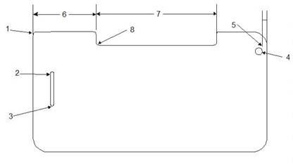

# Display

## What's new in Windows 10 for Display

This topic covers guidelines for Display components in Windows 10.

### Scaling

-   Unified scaling system. Scaling has been unified between most frameworks and between SKUs. New scale factors are: 100%, 125%, 150%, 200%, 250%, 300%, 400%, and 500%. The following will all use these scale factors:

    -   Windows 10 Universal apps (UAPs)
    -   DPI-aware Win32 apps (asset quality dependent on app)
    -   System UI on Mobile and Desktop SKU
    -   Internet Explorer content (user can override in IE)
-   Expanded scaling system for 4K and 8K devices (up to 500%)
-   Universal Windows Platform (UWP) apps with their good per-monitor scaling are first-class desktop apps
-   Lower minimum resolution for very low end devices running desktop SKU
-   More desktop UI scales on per-monitor basis

### Touch requirements

The following table lists new features related to touch.

<table>
<tbody valign="top">
<tr class="odd">
<td>Desktop and mobile use same input platform</td>
<td><ul>
<li>No need to maintain separate drivers per form factor</li>
<li>Firmware solutions always work, always up to date</li>
</ul></td>
</tr>
<tr class="even">
<td>Touch experience significantly improved</td>
<td><ul>
<li>Desktop is more touch-friendly than ever</li>
<li>Touch targeting has now been brought to mobile</li>
</ul></td>
</tr>
<tr class="odd">
<td>Lower requirements that complement Windows 10 touch experiences</td>
<td><ul>
<li>Always procure high quality components to ensure best user experience</li>
</ul></td>
</tr>
</tbody>
</table>

 

The following table lists requirements for touch-related attributes:

<table>
<thead valign="bottom">
<tr>
<th>Attribute</th>
<th>Windows 10 Requirements</th>
</tr>
</thead>
<tbody valign="top">
<tr class="even">
<td>HID Compliance</td>
<td>Required</td>
</tr>
<tr class="odd">
<td>Ghost Points</td>
<td>No ghost contacts are reported</td>
</tr>
<tr class="even">
<td>Accuracy</td>
<td>
&lt;= +/- 1mm (outside 3.5mm from edges)

&lt;= +/- 2mm (within 3.5mm of all edges)
</td>
</tr>
<tr class="odd">
<td>Move Latency</td>
<td>
For &lt;7”, &lt;= 35ms

For &gt;=7”, &lt;=25ms
</td>
</tr>
<tr class="even">
<td>Down Latency (Active)</td>
<td>
&lt;= 35ms
</td>
</tr>
<tr class="odd">
<td>Down Latency (Idle)</td>
<td>
&lt;= 150ms
</td>
</tr>
<tr class="even">
<td>Cold Boot Latency</td>
<td>
Immediately responsive once the display is active
</td>
</tr>
<tr class="odd">
<td>Resolution</td>
<td>
&gt;= Native display resolution or greater
</td>
</tr>
<tr class="even">
<td>Linearity (Moving jitter)</td>
<td>
&lt;= +/- 1mm (outside 3.5mm from edges)

&lt;= +/- 2mm (within 3.5mm of all edges)
</td>
</tr>
<tr class="odd">
<td>Stationary Jitter</td>
<td>&lt;= 0.5mm</td>
</tr>
<tr class="even">
<td>Finger Separation</td>
<td>&lt;= 8mm [Edge to Edge]</td>
</tr>
<tr class="odd">
<td>Minimum Simultaneous Contacts</td>
<td>&gt;= 5</td>
</tr>
<tr class="even">
<td>Buffering</td>
<td>&gt;= 100ms of data</td>
</tr>
<tr class="odd">
<td>Report Rate</td>
<td>
&gt;=Display Refresh Rate

&lt;=250Hz
</td>
</tr>
<tr class="even">
<td>Custom Gestures</td>
<td>Custom gestures designed to work with user interface elements are prohibited</td>
</tr>
<tr class="odd">
<td>Third party drivers</td>
<td>
Desktop: Third party drivers prohibited

Mobile: Third party drivers allowed
</td>
</tr>
</tbody>
</table>

 

### Touch implementation

### Drivers

-   Drivers built for phone and desktop continue to work on the updated touch platform
-   Driverless, firmware-based solutions ensure that touchscreens always work
-   These solutions will be seamlessly upgraded to Windows 10

### Compatibility

-   Desktop touch devices previously certified for Windows 8 and Windows 8.1 are automatically fully compatible
-   Mobile devices that met the chassis spec guidelines need to be re-tested
-   Touch solutions are backed with a hardware compatibility program that ensures a great experience

### TEST JIGS FOR TOUCH HLK

Most touch tests are identical to the existing test for Windows 8.1, with upgraded parameters:

-   Existing testing tools from Windows 8 and Windows 8.1 are still used for Touch tests:

    -   Precision Touch Testing Tool (PT3)
    -   Rotational Acoustic Tool (RA)
-   New accessory jigs to enable Touch testing:

    -   7mm slugs
    -   16mm slug

## Maintained guidelines from Windows 8.1

### Display surface

The following guidelines are provided to create a successful touch experience on touch-enabled displays.

-   Use glass or glass coatings designed to reduce fingerprints.
-   Consider anti-glare materials and LED-based illumination to ensure screen readability in outdoor and brightly lit indoor environments.
-   Choose an anti-glare material with the following characteristics:

    -   Low haze value (&lt;=6%) to minimize reduction of display clarity and contrast while providing minimal friction.
    -   Finer than the sub-pixel pitch to prevent sparkling.
-   Minimal surface friction (surface roughness of 100-500 nm (RMS). High surface friction causes the finger to skip over the surface, breaking touch contact.

### Refresh rate

On supported hardware, Windows 10 automatically and seamlessly switches the refresh rate to better match the frame rate of any full-screen videos that are playing. For example, when playing a 24fps video (film), Windows 10 switches to 24 Hz or 48 Hz. When playing a 30fps video (NTSC TV), Windows 10 switches to 30 Hz. This functionality provides two key benefits to the user:

1.  For film content (24fps), by setting the refresh rate to an integer multiple of the video frame rate, 3:2 pulldown no longer needs to be performed. Each video frame will be displayed for exactly 41.7ms – 3:2 pulldown, which is necessary at 60 Hz (since it is 2.5x the frame rate), results in a pattern of 33.3ms, 50ms, 33.3ms, 50ms, …, causing ‘film judder’.
2.  Because the optimal refresh rate can be lower than the standard 60 Hz, running at these refresh rates actually improves video playback battery life for users. Running at 48 Hz for 24 fps video improves system battery life upwards of 5%, while running at 24 Hz provides an additional 10% savings over 48 Hz.

Because the battery life savings when running at 24 Hz are so significant (measured in hours), we recommend that all portable form factors use displays that are qualified for 24 Hz and 30 Hz refresh rates when possible. Generally, this means using display panels built on the Indium-Gallium-Zinc-Oxide (IGZO) process. Amorphous Silicon-based panels (a-Si) are generally only able to support the 48 Hz and 50 Hz refresh rates (which are still valuable).

Windows 10 switches to the following refresh rates based on the underlying content in order of priority (lower refresh rates are always a higher priority since the power savings are greater there).

<table>
<tbody valign="top">
<tr>
<td>24 fps (NTSC film)</td>
<td>24 Hz, 48 Hz, 60 Hz</td>
</tr>
<tr>
<td>25 fps (PAL film)</td>
<td>25 Hz, 50 Hz, 60 Hz</td>
</tr>
<tr>
<td>29.97 fps (NTSC TV)</td>
<td>30 Hz</td>
</tr>
<tr>
<td>48 fps (very rare, some films shot at 48 fps)</td>
<td>48 Hz</td>
</tr>
<tr>
<td>50 fps (PAL TV)</td>
<td>50 Hz</td>
</tr>
<tr>
<td>59.94 fps (NTSC TV)</td>
<td>60 Hz</td>
</tr>
</table>

This feature is designed so that the lower refresh rates are triggered automatically and triggered without any visible artifacts normally associated with a mode switch.

For this feature to be engaged by Windows 10 at a particular refresh rate, the system must report support for the rate through its firmware. By reporting support for a particular refresh rate, the system is guaranteeing that the display panel can run at the corresponding refresh rate without any adverse effects (such as flicker).

### Device cover glass

This section defines the functional attributes for device cover glass that provides the user with a high quality touch-screen experience worthy of the Microsoft brand. Attributes include those that preserve and protect the surface, appearance, and device, and improve the touch functional experience.

### Cover glass for discrete applications

Discrete cover glass applications use the glass as a protective display cover on top of the touch sensing layer, but not as a physical carrier or substrate for the touch sensing layer (ITO, etc.) itself. You should conduct all tests and measurements following the conditions outlined in Cover Glass Test and Measurements.

For optimal damage resistance:

-   The cover glass should be chemically-strengthened with a minimum magnitude and depth of layer (DOL) of the compressive stress as follows. In all cases, glasses should exhibit non-frangible behavior. Frangible behavior is when the glass breaks into a large number of small pieces when hit with sufficient force:

    -   0.55 mm: ≥ 700 MPa CS and &gt; 35 microns DOL
    -   0.7 mm: ≥ 750 MPa CS and &gt; 40 microns DOL
    -   1.0 mm: ≥ 750 MPa CS and &gt; 45 microns DOL
-   4-point bend test performance (edge strength) recommendations:

    -   0.55 mm: Average peak stress = 600 MPa
    -   0.7 mm: Average peak stress = 620 MPa
    -   1.0 mm: Average peak stress = 620 MPa
-   Abraded ring-on-ring test performance (surface strength) recommendations:

    -   0.55 mm: Average load-to-failure = 30 kgf
    -   0.7 mm: Average load-to-failure = 55 kgf
    -   1.0 mm: Average load-to-failure = 100 kgf
-   The following general design guidance should apply to machined cover glass parts:

    

    <table>
        <thead valign="bottom">
            <tr><th>#</th><th>Feature</th><th>Measure</th><th>Guidance</th></tr>
        </thead>
        <tbody valign="top">
            <tr><td>1</td><td>Outer corner</td><td>Radius</td><td>&gt; 1.0 mm</td></tr>
            <tr><td>2</td><td>Slot radius</td><td>Radius</td><td>&gt; 1.5 mm</td></tr>
            <tr><td>3</td><td>Slot width</td><td>Width</td><td>&gt; 1.5 mm</td></tr>
            <tr><td>4</td><td>Min. hole diameter</td><td>Diameter</td><td>&gt; 1.5 mm</td></tr>
            <tr><td>5</td><td>Hole-to-edge distance</td><td>Diameter</td><td>&gt; 4.0 mm</td></tr>
            <tr><td>6</td><td>Width of protrusion</td><td>Width</td><td>Width &gt; Depth</td></tr>
            <tr><td>7</td><td>Width of the slot</td><td>Width</td><td>Width &gt; Depth</td></tr>
            <tr><td>8</td><td>Inner radius</td><td>Radius</td><td>&gt; 1.0 mm</td></tr>
        </tbody>
        </table> 

    **Note**   Tests conducted using a standard 1mm glass.

     

-   The indentation threshold as measured with a Vickers indenter should be ≥ 5\* kgf.
-   The Knoop scratch load to lateral cracks should be ≥ 4\* N.

High-Quality Touch Experience Recommendations:

-   Minimum dielectric constant is 7.0.
-   The Young's Modulus of the glass should be 71.5±5 GPa.
-   The coefficient of thermal expansion (CTE) should be 80±4 x 10⁻⁷ per degree C.
-   Water absorption should meet Hydrolytic Resistance Class 2 or better.

High-Quality Viewing Experience Recommendations:

-   Optical transmission as measured through 1.0 mm thick cover glass is &gt;91% nominal transmission across the 390-760 nm (visible) wavelength spectrum, with variation not to exceed ±1%.

### Cover glass for integrated touch applications

Integrated touch cover glass applications are glass covers that serve as a protective display cover and as a physical carrier or substrate for the touch sensing layer (ITO, etc.) itself. Integrated touch cover glass applications are also known as one-glass solutions (OGS). You should conduct all tests and measurements following the conditions outlined in Cover Glass Test and Measurements.

Optimal Damage Resistance Guidelines:

-   The cover glass should be chemically-strengthened with a minimum magnitude and depth of layer (DOL) of the compressive stress (CS) as follows. In all cases, glasses should exhibit non-frangible behavior. Frangible behavior is when the glass breaks into a large number of small pieces when hit with sufficient force:

    -   0.55 mm: ≥ 500 MPa CS and &gt; 25 microns DOL
    -   0.7 mm: ≥ 550 MPa CS and &gt; 37microns DOL
    -   1.0 mm: ≥ 550 MPa CS and &gt; 55 microns DOL
-   4-point bend test performance (edge strength) recommendations:

    -   0.55 mm: Average peak stress = 600 MPa, B10 &gt; 450MPa
    -   0.7 mm: Average peak stress = 620 MPa, B10 &gt; 500MPa
    -   1.0 mm: Average peak stress = 620 MPa B10 &gt; 500MPa
-   Abraded ring-on-ring test performance (surface strength) recommendations:

    -   0.55 mm: Average load-to-failure = 13 kgf
    -   0.7 mm: Average load-to-failure = 20 kgf
    -   1.0 mm: Average load-to-failure = 29 kgf
-   Refer to the figure for the machined cover glass part for general design guidance on machined cover glass parts. Holes and/or slots are not recommended on cover glass used for integrated touch applications due to compromises in edge strength.
-   The indentation threshold as measured with a Vickers indenter should be ≥ 5 kgf.
-   The Knoop scratch load to lateral cracks should be ≥ 4 N.

High-Quality Touch Experience Guidelines:

-   Minimum dielectric constant is 7.0.
-   The Young's Modulus of the glass should be 71.5±5 GPa.
-   The coefficient of thermal expansion (CTE) should be 80±4 x 10⁻⁷ per ºC.
-   Water absorption should meet Hydrolytic Resistance Class 2 or better.

High-Quality Viewing Experience Guidelines:

-   The recommended optical transmission as measured through 1.0 mm thick cover glass is &gt;91% nominal transmission across the 390-760 nm (visible) wavelength spectrum, with variation not to exceed ±1%.

### Cover glass tests and measurements

-   Make all measurements on bare glass with no coatings, films, or other types of surface treatments applied.
-   Conduct all tests in a controlled environment (23±2º C, 50±5% RH).
-   4-Point Bend

    Perform horizontal bending testing using 18mm loading spans, and 36mm support spans applying a nominal crosshead rate of 5mm/min. The preferred sample geometry is 44mmx60mm. Breaking stress is reported based on ASTM C158. Sample geometries beyond the preferred geometry may require consultation by Corning on span selection.

-   Abraded Ring-on-Ring (AROR)

    Abrasion with 90 grit Silicon Carbide @ 5psi, 5 seconds, ¼" mask; retained strength measured through Ring on Ring, ½" load ring, 1" support ring. Nominal crosshead rate of 1.2mm/min. Center the abrasion on the glass sample and place it in the center of the loading ring for testing. Breaking load is reported. The preferred sample geometry is 50mmx50mm. You can use ASTM C1499 as a reference for some aspects of the ring on ring procedure.

-   Indention

    A Vickers indenter makes a series of indents in a glass samples, stepping through a range of repeated loads and held at the maximum load for 10 seconds, samples are inspected to assess the load where &gt;50% of the indents exhibit evidence of radial cracks after a fixed period of time once the indents have been created. Loading/unloading rates = 0.2mm/min.

-   Scratch Threshold

    A Knoop indenter places a series of 10mm scratches in a sample. Repeated scratches are performed over a range of loads, samples are inspected to assess the load where &gt;50% of the scratches exhibit evidence of lateral cracks after a fixed period once the scratches have been created.

## Related topics

[Human Input Devices Design Guide](http://msdn.microsoft.com/library/windows/hardware/ff539952.aspx)

[GetSystemMetrics](http://msdn.microsoft.com/library/windows/desktop/ms724385.aspx)

[Windows Hardware Compatibility Program](../compatibility/index.md)

[HID over I2C](http://msdn.microsoft.com/library/windows/hardware/jj127208)

[Unattend settings (Windows 8.1)](http://technet.microsoft.com/library/ff699026.aspx)

 

 

