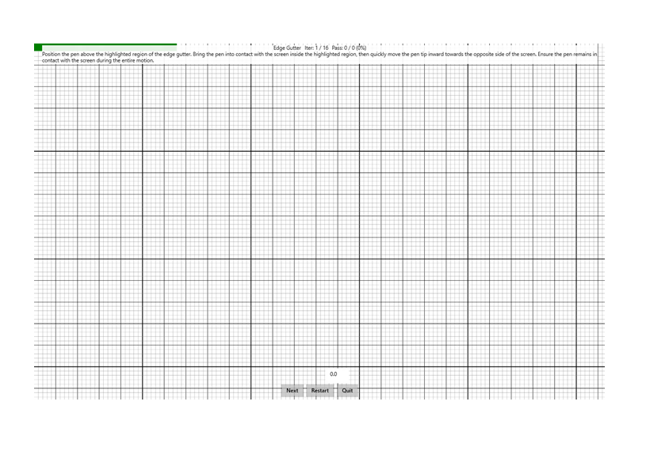

# Edge Gutter

This is to test the performance of a Windows pen device in the "gutter" along the edges of the screen.

**Test name**

-   Edge Gutter

**Core requirements tested**

-   Device.Input.Digitizer.Pen.Accuracy

**Test purpose**

-   Verifies that the pen can accurately perform swipe gestures at the edges of the screen.

**Tools required**

-   None.

**Validation steps**

1. Run the test case for Edge Gutter.
2. Position the pen anywhere above the green highlighted region on the screen. Bring the pen into contact with the screen, and then move the pen tip inwards towards the opposite side of the screen as quickly as possible.
   + Ensure that the pen remains in contact with the screen during the entire motion.

Here's a screenshot from the Edge Gutter test.

**Common error messages**

-   "Pen edge swipe did not move far enough"
    
    Occurs if the pen tip did not travel at least 4.5mm from the highlighted region during the swipe.
-   "Pen edge swipe did not move fast enough"
    
    Occurs if the pen tip did not move &gt; 4.5 mm within 900ms from the beginning of the swipe.
-   "Pen edge swipe angle too wide"
    
    Occurs if the angle of the swipe was greater than 55 degrees from the perpendicular of the edge.

**Passing criteria**

-   14/16 test iterations must pass for the test to succeed.
