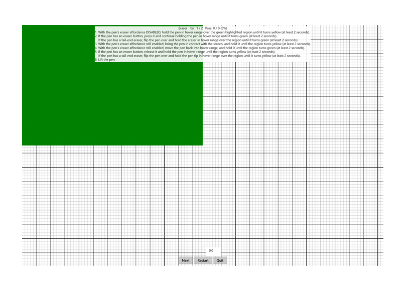

# Eraser

This is a test for the eraser feature of a Windows pen device.

**Test name**

-   Eraser

**Core requirements tested**

-   Device.Input.Digitizer.Pen.Eraser.

**Test purpose**

-   Verifies that the pen reports eraser button flag correctly.

**Tools required**

-   None (PT3 with Pen Holder optional).

**Validation steps**

1. Run the test case for Eraser.

2. With the pen's eraser affordance disabled, hold the pen in hover range over the green highlighted region until it turns yellow (at least 2 seconds).

3. Enable the pen’s eraser affordance and hold the pen in hover range until the yellow highlighted region turns green (at least 2 seconds).

   + If the pen has an eraser button, press it and continue holding the pen in hover range.
   + If the pen has a tail-end eraser, flip the pen over and hold the eraser in hover range over the region.
4. With the pen's eraser affordance still enabled, bring the pen in contact with the screen, and hold it until the green highlighted region turns yellow (at least 2 seconds).

5. With the pen's eraser affordance still enabled, move the pen back into hover range, and hold it until the yellow highlighted region turns green (at least 2 seconds).

6. Disable the pen’s eraser affordance and hold the pen in hover range until the green highlighted region turns yellow (at least two seconds).

   + If the pen has an eraser button, release it and continue holding the pen in hover range.
   + If the pen has a tail-end eraser, flip the pen over and hold the pen tip in hover range over the region.
7. Lift the pen out of hover range.

Here's a screenshot from the Eraser test.

**Common error messages**

-   "Button flags set incorrectly"
    
    Occurs if any packet contains incorrect button flags relative to the pen’s current state.
-   "Pen was not hovering or in contact for long enough"
    
    Occurs if the pen is not left hovering or in contact for the required duration.
-   "The contact did not begin/end in the correct location"
    
    Occurs if the pen stroke does not begin and end in the green rectangle.

**Passing criteria**

-   2/2 test iterations must pass for the test to succeed.
