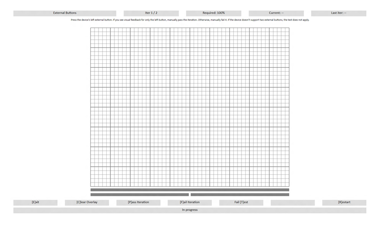

# External Buttons

This is to test that the buttons attached to a Windows Precision Touchpad device, are reported correctly.

**Test name**

-   Test.ExternalButtons.json

**Core requirements tested**

-   Device.Input.Digitizer.PrecisionTouchpad.Button

**Test purpose**

-   Verifies that the attached buttons report correctly, to provide primary and secondary click functionality for a user.

**Tools required**

-   Ruler or Micrometer
-   PTLogo.exe

**Validation steps**

1. Launch Test.ExternalButtons.json.

2. If the device does not support external buttons, pass the test manually.

3. If the device is not a click pad or a pressure pad, then visually ensure that there are two buttons available.

4. Click each button and verify that the external button images in the UI, light up as each button is pressed. Note the two extra button bars as shown in the following screenshot. These will change color when the proper button messages are received.

5. If both buttons generate the correct response, the test will pass.
**Common error messages**

-   None.

**Passing criteria**

-   1/1 (100%) iterations with each button must pass in order to complete with passing status.

 

 

