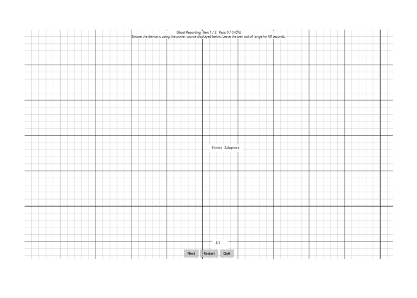

# Ghost Reporting

This is to test the ghost reporting aspect of a Windows pen device.

**Test name**

-   Pen.GhostReporting

**Core requirements tested**

-   Device.Input.Digitizer.Base.ContactReports

**Test purpose**

-   Verifies that the pen does not report ghost points.

**Tools required**

-   None.

**Validation steps**

1. Ensure that the device is using the power source.

2. Leave the pen out of range for 60 seconds.

3. Disconnect power source.

4. Leave the pen out of range for 60 seconds.

Here's a screenshot from the Ghost Reporting test.

**Common error messages**

-   "Ghost input detected"
    
    Occurs if any pen input is detected during the test.

**Passing criteria**

-   2/2 test iterations must pass for the test to succeed.
