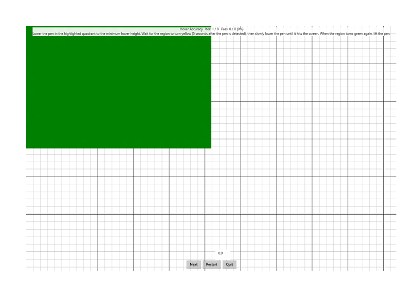

# Hover Accuracy

This is a test of the accuracy of reporting that a Windows pen device is hovering.

**Test name**

-   Pen.HoverAccuracy

**Core requirements tested**

-   Device.Input.Digitizer.Pen.Accuracy – Hover Accuracy.

**Test purpose**

-   Verifies that the pen reports hover accuracy within prescribed limits.

**Tools required**

-   PT3 with Pen holder.

**Validation steps**

1. Slowly lower the pen down to approximately 5 mm from the screen (in hover range) in the highlighted quadrant.

2. Once the quadrant turns yellow, after a couple of seconds, lower the pen as slowly as possible until it hits the screen.

3. Once the pen is in contact with the screen, the color turns green.

4. Then start moving the pen away from the screen upwards.

Here's a screenshot from the Hover Accuracy test.

**Common error messages**

-   "The contact did not begin/end in the correct location"

    Occurs if the pen stroke does not begin and end in the green rectangle.
-   "Input did not make contact with the screen"

    Occurs if the pen interaction never touches the screen.
-   "Contact distance from hover point too large”

    Occurs if the pen’s hover accuracy does not pass the requirement.

**Passing criteria**

-   7/8 test iterations must pass for the test to succeed.
-   This test has a 0.2 mm allowed tolerance, therefore a recorded hover accuracy &lt;= 1.2 mm will result in a pass.
-   Any iteration that is 0.2 mm beyond the allowed tolerance, resulting in a recorded hover accuracy &gt;= 1.4 mm, will fail the entire test.
