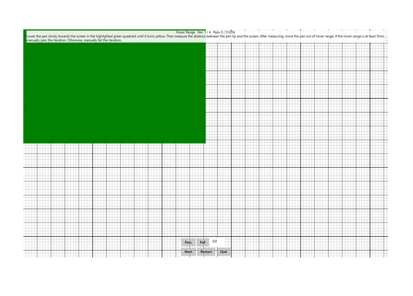

# Hover Range

This is to test the hovering range for a Windows pen device.

**Test name**

-   Pen.HoverRange

**Core requirements tested**

-   Device.Input.Digitizer.Pen.HoverRange

**Test purpose**

-   Verifies that the pen has sufficient hover range.

**Tools required**

-   PT3 tool with pen holder.
-   Ruler or caliper.

**Validation steps**

1. Lower the pen slowly towards the screen in the highlighted quadrant.

2. The color of the quadrant turns yellow once (x,y) are reported.

3. Measure the distance between the pen tip and the screen by using a ruler or caliper.

4. After measuring, move the pen out of hover range.

5. If the distance measured was equal to or more than 5 mm, hit Pass. Else hit Fail button.

Here's a screenshot of the Hover - Range test.

**Common error messages**

-   "Contact is not hovering in the correct quadrant"

    Occurs if pen input is detected in an area other than the highlighted quadrant.
-   "Manually failed by user"

    Occurs if the operator manually Fails the test (Fails the hover range requirement).

**Passing criteria**

-   4/4 test iterations must pass for the test to succeed.
