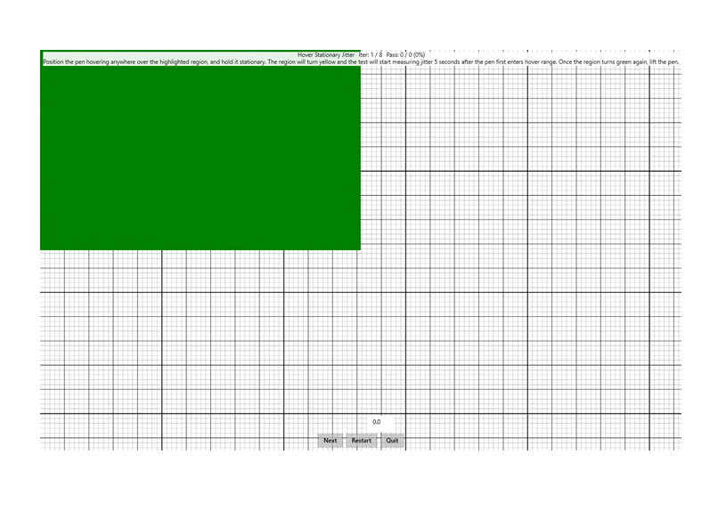

# Hover Stationary Jitter

This is to test the jitter aspect of a Windows pen device, when the device is in stationary hover.

**Test name**

-   HoverStationaryJitter

**Core requirements tested**

-   Device.Input.Digitizer.Pen.Jitter - Hover Stationary jitter.

**Test purpose**

-   Verifies that the jitter that is detected when a pen is doing a stationary hover, occurs within prescribed limits.

**Tools required**

-   PT3 with Pen holder.

**Validation steps**

1. Position the pen anywhere over the highlighted region with hover height at approximately 5 mm.

2. Wait a couple of seconds for the highlighted region to turn yellow, which will start recording the pen data.

3. Once the highlighted region turns green again, the data recording is complete.

4. Slowly move the pen away from hover range.

Here's a screenshot from the Hover Stationary Jitter test.

**Common error messages**

-   "The contact did not begin/end in the correct location."

    Occurs if the pen stroke does not begin and end in the green rectangle.
-   "Input made contact with the screen."

    Occurs if the pen interaction touches the screen.
-   "Input ended too early."

    Occurs if the pen is not held stationary in hover range for the required duration.
-   "Jitter too high."

    Occurs if the pen does not pass the hover stationary jitter requirement.

**Passing criteria**

-   7/8 test iterations must pass for test to succeed.
-   This test has a 0.10 mm allowed tolerance, therefore a recorded hover stationary jitter of &lt;= 0.6 mm will result in a pass.
-   Any iteration that is 0.15mm beyond the allowed tolerance, resulting in a recorded hover stationary jitter of &gt;= 0.7 mm, will fail the entire test.
-   Recorded value for Hover Stationary jitter is calculated as maximum hover jitter over the iteration.
