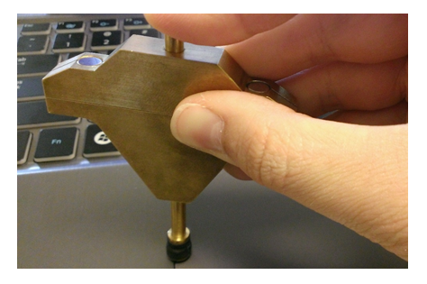

# Input Resolution

This is to validate that the Windows Precision Touchpad device is able to report at its specified resolution.

**Test name**

-   Test.InputResolution.json

**Core requirements tested**

-   Device.Input.Digitizer.PrecisionTouchpad.InputResolution

**Test purpose**

-   Verifies that the device is able to genuinely report at the resolution that it specifies, and that resolution is greater than or equal to 300DPI.

**Tools (Required)**

-   PTLogo.exe

**Tools (Optional)**

-   A 7mm diameter capacitive contact.

-   Robotic contact testing rig (recommended – task can be difficult if performed manually). Contact your robot vendor for details on operation.

**Validation steps**

Between 2 slow horizontal swipes, every logical unit of X should be hit and reported, and between 2 slow vertical swipes, every logical unit of Y should be hit and reported.

1. Launch Test.InputResolution.json.

2. Starting from the left edge of the digitizer surface, drag a single contact across the touchpad at a velocity inversely proportional to the device’s reported input resolution for the x axis from left to right, and again from right to left. See the following bullet item on *Drag Velocity* for more information.
a. *Drag Velocity*: All devices must report at greater than or equal to 125Hz for a single contact. So the following formula may be used to calculate a safe drag velocity:
Drag Velocity &lt;= 60Hz / (Logical Range for Axis / Physical Range for Axis).

For example, for a device with a logical range of 4000 for X, and a physical range of 100mm for X, a safe drag velocity would be:

60 / (4000/100) = 60 / 40 = 1.5mm/s.

b. All off-axis movement or jitter is ignored in this test. As shown in Figure 10, optionally a precision contact may be used to overcome potential friction with a human finger, but it must be kept perfectly perpendicular to the touchpad surface so the contact size does not drop far below 7mm (which could cause the device to “lose” the contact).
3. Repeat vertically. Starting above the top edge of the digitizer surface, drag a single contact down the touchpad at a velocity inversely proportional to the device’s reported input resolution for the y axis, dragging first from top edge to bottom edge, then from bottom edge to top edge. See the preceding bullet item on *Drag Velocity* for more information.

**Note**  If enough logical x/y coordinates are hit after one swipe on that axis, the iteration will pass automatically without a need to swipe in the other direction.

 

**Common error messages**

-   "\[20\] positional delta too large: \#"
    o There was a jump in coordinates between 2 subsequent reports that exceeds the permitted tolerance of 0.5mm.
    o The given value is the length of the jump.
    o This error will stop an iteration, even if only 1 swipe has been performed.
-   "\[35\] logical coordinate not found: \#"
    o Either the minimum or maximum logical value was never reported in either of the 2 passes for a given axis.
    o The value given is the X or Y logical value which was not reported (respective to the axis being validated).
-   "\[31\] Too low percent of logical coordinates found: \#"
    o The minimum percentage (95%) of all logical units required to be reported was not met for a given axis.
    o The value indicates the percentage of all logical units that were reported for a given axis.

**Passing criteria**

-   2/2 (100%) iterations must pass in order to complete with passing status.

 

 

