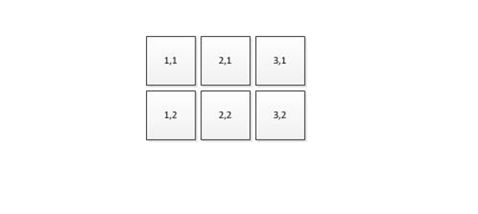

# Latency - Down

This is a test to check the time lag (latency) between a Windows pen contact with a screen, and when the contact is reported to Windows.

**Test name**

-   Down Latency

**Core requirements tested**

-   Device.Input.Digitizer.Pen.Latency – Down Latency

**Test purpose**

-   Verifies that when the pen makes initial contact with the screen, the lag between the pen being at a location, and having the location reported to Windows is within allowed limits.

**Tools required**

-   RA Tool

**Validation steps**

1. For detailed instructions for this test, see [How to measure Touch Down Latency by using an Acoustic Measurement Tool](https://msdn.microsoft.com/library/windows/hardware/dn195876).
    1. Note: when directed to contact screen with finger, use pen instead.
    2. For each tap, ensure that the pen starts within hover range (approximately 5mm above the screen), and then contacts the screen with enough force to exceed the pen's activation force. And also make sure that the contact point is more than 8mm from any edge of the screen.
    3. Only 50 taps during the collection phase are required for this class of device.

2. When performing the test, virtually divide the screen into six random regions to prepare to uniformly cover all six areas. The difference of sample counts in any two regions cannot be more than 10%; that is, if you tap 50 times for all regions, you cannot tap more than 9 times for any single region. This ensures that the latency of each region is equally represented in the final average latency.
    1. If you plan to move the microphone as you cover each region, place the microphone in the first area that you plan to tap.
    2. Alternatively, you can place the microphone near the center area (for example, between (**2,1**) and (**2,2**) in the following diagram). In this case, you must move the microphone at least one time to also cover the original placement of the microphone.

Here's a screenshot from the Down Latency test.

**Common errors**

-   During the collection phase, any palm or touch contact with the device before the pen contacts the screen, could be picked up by the microphone. Please avoid contacting the screen with anything other than the pen, and refrain from bumping the RA tool, or making loud noises during the collection phase.

**Passing criteria**

-   50 iterations between all screen regions must be collected, with a passing average pen down latency for test success.
-   This test has a 7ms allowed tolerance, therefore an average pen down latency of &lt;=42ms will result in a pass.
