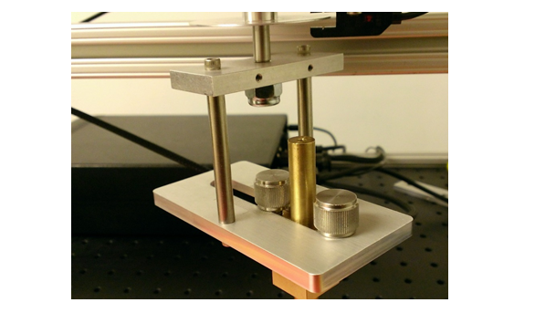

# Latency - Panning

This is to test the reporting capabilities of the Windows Precision Touchpad device, with regard to latency and panning.

**Test name**

-   Test.StepMotor.json

**Core requirements tested**

-   Device.Input.Digitizer.PrecisionTouchpad.Latency

**Test purpose**

-   Verifies that the device is able to report changes in the contact position, within the required latency window.

**Tools required**

-   RA Tool with Precision Touchpad Modifications. For vendor information about the RA tool, see [Hardware Requirements and Vendor Information](touchscreen-hardware-requirements-and-vendor-information.md).

-   ptstepmotor.exe.

**Validation steps**

1. Make sure the RA tool is fitted with the smaller, adjustable PTP bracket as shown in the following image.

2. Plug the RA tool controller into the test machine, *and then* turn on the controller. Note that if you don't perform the tasks in this step in the correct order, the controller might end up in an undefined state.

The switches on the controller should initially be set as follows:

a. Motor: off
b. Calibrate: Off
c. Mode: Tachometer
3. Adjust the radius of the circle to 12mm and position the PTP device so that the contact will stay on the digitizer surface during its full rotation.

4. Rotate the arm until the notch on the disk is 2-3mm past the sensor.

a. If it is too close to the sensor, you will get an extra data point at the beginning of the test. This is because when the motor is started, it will jerk backwards. If the notch falls under the sensor during this, it will cause erroneous data.

b. If it is too far from the sensor, Count will seem to increment by 2, instead of giving 2 increments of 1. The motor is calibrated to rotate around and pass slowly for a certain segment of the circle relative to where it started, and that slow section is expected to pass under the sensor. But if it starts too far away from the sensor, the arm will still be moving too quickly when the notch passes under the sensor.

5. Run ptstepmotor.exe.

6. Lower the contact onto the touchpad surface.

7. Press the Spacebar on the test machine & flip the Motor switch to on to begin the Calibration phase.

8. After 9 rotations (when Count on the screen equals 17), the motor will come to a complete stop for 5 seconds. Press the Spacebar during those 5 seconds to advance to Acquisition.

9. Wait for 10 rotations of the arm, then press the Spacebar to move into the Collection phase.

10. After the arm has made 10 rotations in the Collection phase, press the Spacebar one last time to close the test.

Note that, unless there’s an error, do not exit by pressing Esc. If you press Esc to exit when there is no error, the test may not finish.

For more detailed setup and test instructions, see [How to measure Touch Panning Latency](https://msdn.microsoft.com/library/windows/hardware/dn266003.aspx).

**Common errors**

-   At the beginning of the Calibration stage, if the slot on the disk is too close to the photo interrupt signal, the calibration text will appear with a count of zero (0), before the arm has rotated once.

    Be sure to position the slot 2-3mm past the photo interrupt signal.

-   When calibration executes correctly, the count should increment by 2 every rotation: once before and once after hitting the photo interrupt signal.

    o Because of this, the pause before beginning the Acquisition stage always occurs when the count = 17

    o If the count isn’t incrementing properly, abort the test. Turn off the controller, unplug and re-plug the controller into the test machine via USB, then turn the controller on again. Start test from the beginning, and verify that count is incrementing correctly.

-   At the end of the Calibration stage, the motor will pause completely for 5 seconds. During that pause, the you must press the Spacebar to advance to the Acquisition stage, otherwise an error message will be displayed.

**Passing criteria**

-   If the test records an average panning latency of less than or equal to 70.0ms, the test will result in a pass.

 

 

