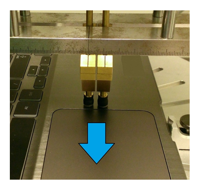
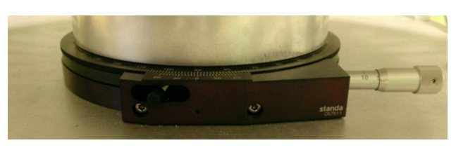
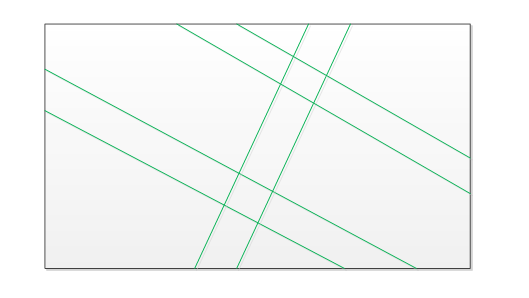
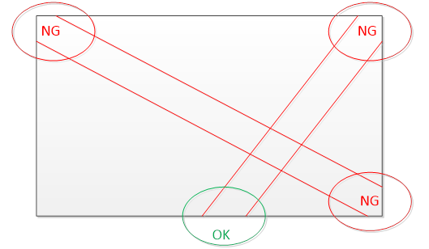
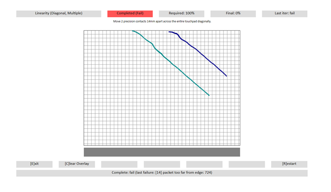
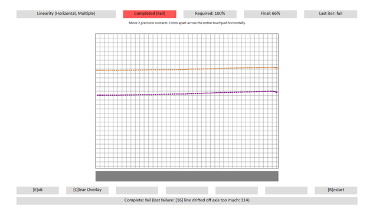

# Linearity

This is to test the linearity performance of a Windows Precision Touchpad device.

**Test names**

-   Test.LinearityDiagonal
-   Test.LinearityDiagonalMultiple

**Core requirements tested**

-   Device.Input.Digitizer.PrecisionTouchpad.FingerSeparation
-   Device.Input.Digitizer.PrecisionTouchpad.Jitter

**Test purpose**

-   Verifies that the device is able to meet the linearity requirements in all directions, at the minimum contact separation distances.

    **Note**  The mechanical pieces used for this test can be used to validate other user experience metrics by determining performance at narrower finger separations. While this additional test is not required, it is recommended.

     

**Tools required**

-   PT3 with Precision Touchpad Modifications
-   PTLogo.exe

**Validation steps**

Note that the Linearity test is broken up into 6 sub tests. These tests can be performed in any order, and it is not necessary to follow the order in which they are presented here.

1. Launch Test.LinearityDiagonal.json.

a. Unlock the Y axis on the PT3, and unlock the X axis.

Here's an image showing the axis locking levers.

b. Partially rotate the plate to allow a corner-to-corner diagonal drag (or as close to 45 degrees as possible).

c. Starting outside one of the touchpad’s corners, drag 1 precision contact to the opposite corner. Perform 5 diagonal iterations.

d. Be sure to alternate directions, and at some point rotate approximately 180 degrees to perform the opposite diagonal.

e. If no errors occur, PTLogo will automatically Pass the iteration and advance to the next.

2. Launch Test.LinearityDiagonalMultiple.json.

a. Add a 2nd 7mm precision contact to the PT3, with a center-to-center distance of 8mm between the two outer edges of the contacts (you may also set the 7mm contacts to 15mm center to center).

Here's an image showing the setup for the multiple contact test.

b. Rotate device to an angle (assuming it started at 0°). X axis should still be locked, with the Y axis unlocked.

Here's an image showing the rotation guide on the PT3 test device.

c. Drag the 2 contacts across the touchpad (relative to the digitizer surface). Perform 3 diagonal iterations, alternating directions as shown in the following diagram.

d. Rotate device approximately 180 degrees, and repeat for the last 2 iterations.

Note that, as shown in the preceding diagram, all segments involve entry of both contacts on the same edge of the digitizer and exit of both contacts on the same edge of the digitizer.

Here's a diagram showing unacceptable segments for performing the multiple-contact diagonal test.

Note that, as shown in the preceding diagram, the Not Good (NG) segment portions involve contacts that did not enter the digitizer area from the same edge. As such 3 out of 4 of the segment entries are invalid.

**Common error messages**

-   "\[14\] Packet too far from edge: \#"

    Swipe must start at the edge (or before it).

    Here's a screenshot from the test, with a blue line showing a swipe that did not start *at, or before* the edge.

    

-   "\[15\] Contact didn’t move in straight line."

    Reported path strayed from a straight line by more than the allowed tolerance (0.5mm in either direction).

-   "\[16\] Line drifted off axis too much: \#"

    The line moved in a (mostly) straight line, but was not completely horizontal, or completely vertical (the expected orientation is shown at the top of the screen). Unless caused by slight curves at the ends of the contact, this is usually a test error. Adjust the PT3 and try again.

    Use the visualization grid to help determine proper alignment. For example, in the following image, the device needs to be rotated counter-clockwise slightly.

    

-   "\[26\] No packets outside border region."

    o This means that a contact never appeared more than a few millimeters away from the edges of the touchpad.

    o This can be caused by performing a horizontal swipe too close to the top of the touchpad, for example.

-   "\[27\] Saw packet travel backwards at (\#, \#)."

    o Linearity tests are always performed by moving a contact in a consistent direction across the touchpad. Therefore, if a packet reports coordinates behind the previous packet, this is considered backwards jitter.

    o The displayed numbers (\#, \#) are the X and Y coordinates, in himetric units.

-   "\[34\] Duplicate packet: \#."

    o When contact is moving above a certain speed, each packet is expected to be at a different coordinate from the one before or the one after. So if two packets in such a situation report the exact same coordinates, they must be erroneous.

    o The displayed number (\#) is the timestamp of one of the duplicate packets.

**Passing criteria**

-   A total of 30/30 (100%) iterations must Pass in order to complete with passing status.

 

 

