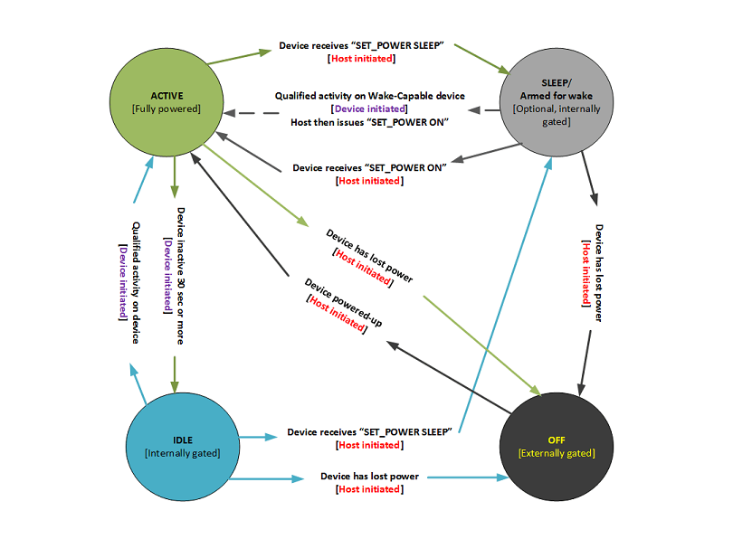
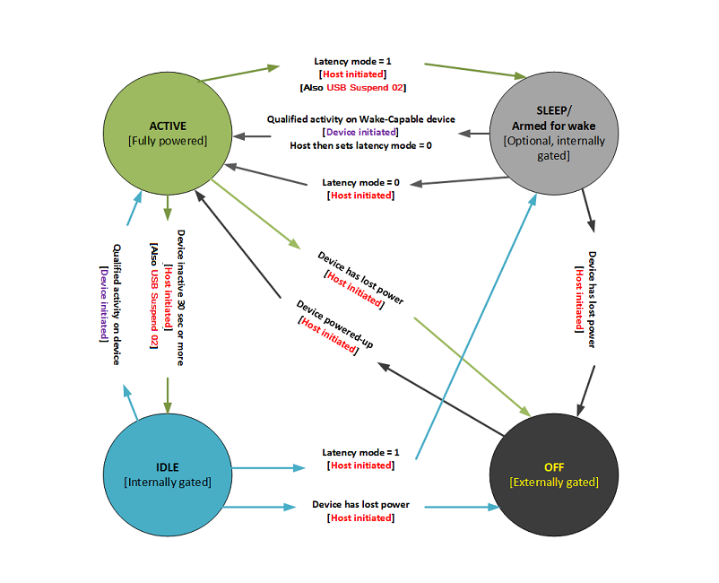

# Power Management

This topic provides information about pen power management, and discusses power consumption requirements.

## Power Consumption

Power consumption requirements for the various power modes of an integrated Windows pen are at the discretion of the OEM, or the system builder. However, Windows provides facilities to help balance power efficiency and response latency.

## I²C Devices

Integrated Windows pen devices that are connected via I²C can implement support for up to four distinct power states:

-   Active
-   Idle
-   Either Sleep, or Armed for Wake (both optional)
-   Off

The four power states are shown in the following diagram, along with the device activities that cause transitions from one state to another.

**Active State**

The **Active** state is defined as the device operating mode in which the pen is in-range of the screen surface, or the operating mode in which there has been activity within the last 30 seconds. When power is applied to a pen device, then after device boot-up is completed, the device should be ready and in the **Active** power state.

**Idle State**

The **Idle** state is defined as the device operating mode in which no activity has occurred within the last 30 seconds.

A device can elect to reduce its scan rate in this mode, to reduce power consumption while still adhering to the down latency requirement for this mode. Once the device has detected activity, it should transition back to the **Active** state.

**Sleep (Armed for Wake) State**

The **Sleep** state is defined as the operating mode that the device enters, after the host sends a HID I²C "SET\_POWER SLEEP" command to the device.

A device can elect to reduce its scan rate significantly in this mode, to reduce power consumption while still being capable of asserting an interrupt to wake the system, in response to a qualified activity. An integrated Windows pen device should ensure that interrupts are not asserted for spurious contacts, since such contacts would result in an unintended system wake. There are no down latency requirements for this mode.

The device should transition to the **Active** state after it receives a HID I²C "SET\_POWER ON" command from the host.

**Off State**

The **Off** state is defined as the operating mode in which the device has had its power completely removed. When power is applied to the device, then after device boot-up is completed, the device should be ready and in the **Active** power state. Device boot-up should complete before the computer display is initialized and enabled.

In the **Off** state a device should not consume any power.

## USB Devices

Integrated Windows pen devices that connect to the host via USB, can implement support for up to four distinct power states:

-   Active
-   Idle
-   Either Sleep, or Armed for Wake (both optional)
-   Off

The four power states are shown in the following diagram, along with the device activities that cause transitions from one state to another.

**Active State**

The **Active** state is defined as the device operating mode in which the host has not suspended the device. When power is applied to a pen device, then after device boot-up is completed, the device should be ready, and in the **Active** power state.

A device should adhere to the contact down latency, and contact move latency requirements for this mode.

**Idle State**

The **Idle** state is defined as the device operating mode in which no contact or button activity has occurred within a host-defined period, and the device has therefore been suspended. This is referred to as "*USB selective suspend*."

All integrated Windows pen devices that are connected to their host via USB, should support selective suspend. Such devices should report this capability via a [Microsoft OS descriptor](https://msdn.microsoft.com/library/windows/hardware/gg463179).

A pen device can elect to reduce its scan rate in this mode, to reduce power consumption while still adhering to the down latency requirement for this mode.

Once the device has detected qualified activity, it should signal a remote wake. Starting from the time of detection of the activity, the device should buffer at least 100ms worth of contact reports, to ensure that little to no input is lost while the USB host controller is resuming.

**Sleep (Armed for Wake) State**

The **Sleep** state is defined as the device operating mode in which the host has transitioned to S3 or *Connected Standby*. This is indicated to the pen device via the latency mode feature report, with a value of "1" indicating that maximum latency is permitted. The device should exit this high latency mode upon activity detection, and also in response to "host resume."

A device can elect to reduce its scan rate significantly in this mode, to reduce power consumption while still being capable of signaling a remote wake (in response to qualified activity) to wake the system. An integrated Windows pen should ensure that remote wake is not signaled in response to spurious contacts, which would result in an unintended system wake. There is no contact down latency requirements for this mode.

**Off State**

The **Off** state is defined as the device operating mode in which the device has had its power completely removed. When power is applied to the device, then after device boot-up is completed, the device should be ready and in the **Active** power state. Device boot-up should complete before the computer display is initialized and enabled.

In the **Off** state a pen device should not consume any power.

 

 

