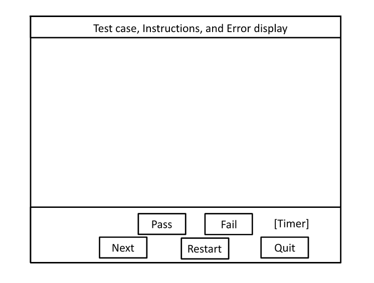

# Pen Testing Interface

This topic presents the user interface for the pen tests in the Windows Hardware Lab Kit (HLK) for Windows 10.

## UI layout

This is the layout of the UI that is used in the pen tests in the HLK.

## Buttons available in testing

-   Next
    
    This will cause the current iteration to be skipped and marked as fail and allows the user to proceed to the next iteration.
-   Restart
    
    This will cause this test to be restarted.
-   Quit
    
    This will cause the testing to be ended, remaining tests will be skipped and marked as fail.
-   Pass \[Manual result only\]
    
    This will cause the current iteration to be marked as pass.
-   Fail \[Manual result only\]
    
    This will cause the current iteration to be marked as fail.
