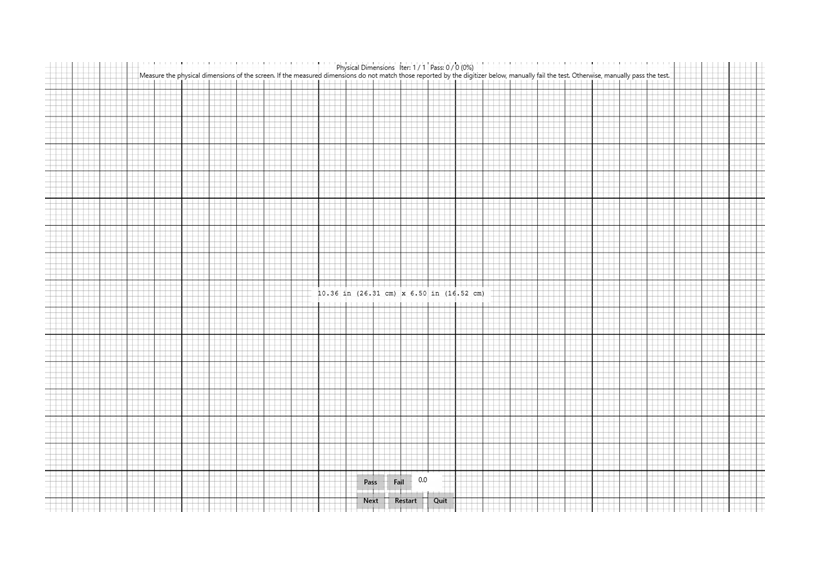

# Physical Dimensions

This is to test the accuracy of the reported screen size (its physical dimensions), by a Windows pen device.

**Test name**

-   Physical Dimensions

**Core requirements tested**

-   Device.Input.Digitizer.Pen.HIDCompliance

**Test purpose**

-   Verifies that the size of the screen reported by the device’s digitizer, matches its physical size.

**Tools required**

-   Ruler.

**Validation steps**

1. Run the test case for Physical Dimensions.

2. Using a ruler, measure the physical dimensions (width and height) of the device’s screen. If the dimensions measured do not match the values reported in the text box in the center of the screen, manually Fail the test. Otherwise, manually Pass the test.

   **Note**  Physical measurements should be accurate to +/- 2mm.

 

Here's a screenshot from the Physical Dimensions test.

**Common error messages**

-   None.

**Passing criteria**

-   1/1 test iterations must pass for test to succeed.
