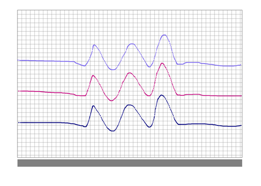
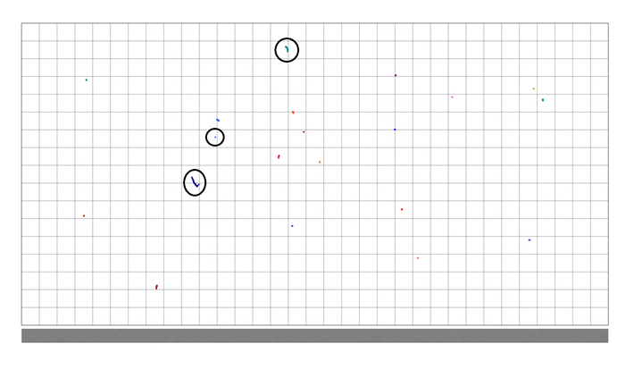
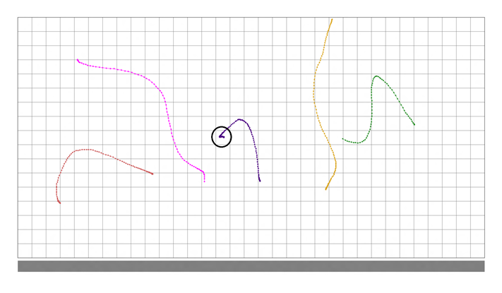
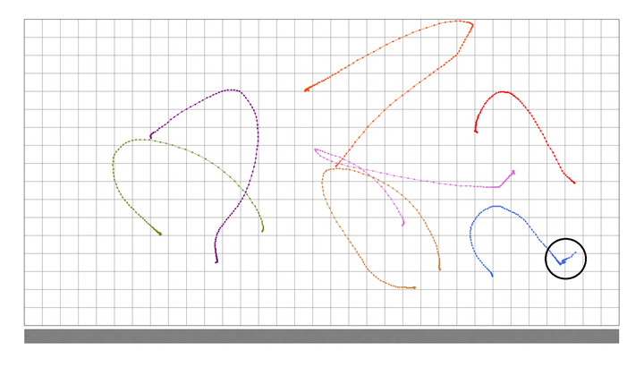

# Positional Accuracy - Manual

This is to test the positional reporting accuracy of a Windows Precision Touchpad device.

**Test name**

-   Test.PositionalAccuracyManual.json

**Core requirements tested**

-   Device.Input.Digitizer.Base.HIDCompliant

**Test purpose**

-   Verifies that the device is able to report absolute position accurately.

**Tools required**

-   PTLogo.exe

**Validation steps**

1. Launch Test.PositionalAccuracyManual.json.

2. **Iteration One:**

o Horizontally drag three fingers straight across 1/3 of touchpad.

o Without lifting, continue moving across the touchpad in a zigzag pattern.

o Without lifting, continue in a straight line across the last 1/3 of the touchpad.

o Verify that the displayed image matches physical finger movements, and then manually Pass or Fail the test accordingly.

Here's a screenshot from the test, showing traces from **Iteration One**.

3. Repeat vertically for **Iteration Two**, and then diagonally for **Iteration Three**.

4. **Iteration Four:**

o Tap 20 times randomly on the touchpad.

o Verify that the displayed image matches your taps and there is no jitter, as shown in the following screenshot. Manually Pass or Fail the test accordingly.

In the preceding screenshot, the majority of taps are fine. The top circled contact is borderline – there was travel over the contact lifetime, but not a lot. Generally, up to 1mm (half a grid line) should be considered a Pass, as long as most are like the middle circled contact. The bottom circled contact shows travel greater than half a grid, which should be considered a failure for this test.

5. **Iteration Five:**

o Draw a curved line with your finger.

o Without slowing or changing direction, lift your finger.

o Verify that the displayed image matches your curves and there is no jitter on lift, as shown in the following screenshot. Manually Pass or Fail the test accordingly.

The key issues to look for in this iteration, are the hooks that are drawn when you lift your finger. In the circled example, the contact jittered to the left by a significant amount on contact lift. Consider any hook larger than a quarter of a grid as a failure.

6. **Iteration Six:**

o Draw a curved line with your finger.

o Without lifting your finger, pause for 1 second.

o Click the physical button, and lift.

o Verify that the displayed image matches your curves and there is no jitter on lift, as shown in the following screenshot. Manually Pass or Fail the test accordingly.

In this test, there will be extra data as the physical button is clicked, so it’s harder to judge by looking at the data itself. Instead, watch the mouse cursor as you click and lift. If the cursor moves more than half a grid box as you click, consider this test a failure. In the circled example, the cursor moved significantly on click and the example should be considered a failure.

**Common error messages**

-   None.

**Passing criteria**

-   6/6 (100%) iterations must pass in order to complete with passing status.

 

 

