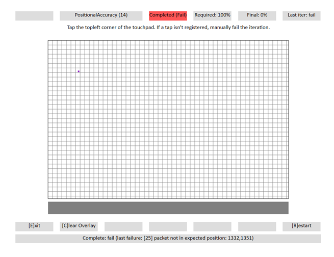

# Positional Accuracy

This is to test the positional accuracy for reporting contacts on a Windows Precision Touchpad device.

**Test name**

-   Test.PositionalAccuracy.json

**Core requirements tested**

-   Device.Input.Digitizer.PrecisionTouchpad.Accuracy

**Test purpose**

-   Verifies that the device is able to report absolute position accurately.

**Tools required**

-   PTLogo.exe

**Validation steps**

1. Launch Test.PositionalAccuracy.json.

2. Follow the directions on the screen to perform 3 taps in an indicated area on the touchpad. After each set of 3 taps, the instructions will ask you move to a different area, for a total of 15 taps. If instructions say to tap in a corner, tap as close to that corner as possible.

For each iteration, do the following:

a. Tap the location specified on the screen.

**Note**  The specified locations are calculated as 13mm square areas. For example, if the instructions say "Top Left corner" you should tap somewhere within a 13mm square region of the top-left corner of the touchpad.

 

b. If no tap is registered by the device, manually fail the iteration.

**Common error messages**

-   "\[25\] packet not in expected position: XXX, YYY"

    o Tap must occur at the location specified.

    o The given values specify the logical coordinates of where the contact was reported.

    Here's a screenshot showing a contact location that is outside the expected region.

    

**Passing criteria**

-   15/15 (100%) iterations must pass in order to complete with passing status.

 

 

