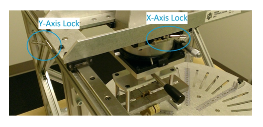
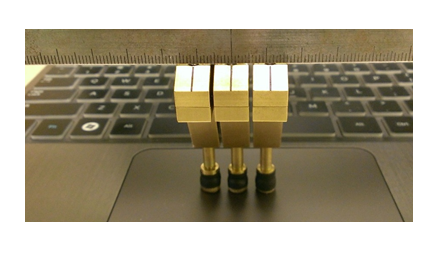
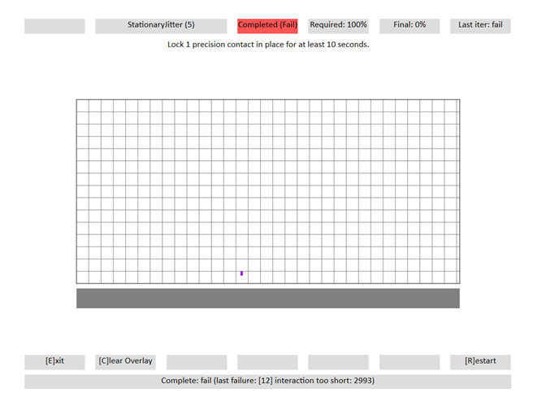
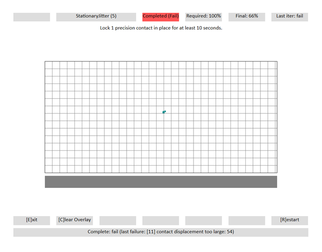

# Stationary Jitter

This is to test the stationary contact reporting abilities of a Windows Precision Touchpad device.

**Test names**

-   Test.StationaryJitter
-   Test.StationaryJitterMultiple

**Core requirements tested**

-   Device.Input.Digitizer.PrecisionTouchpad.Jitter

**Test purpose**

-   Verifies that the precision touchpad is able to accurately report a stationary contact, or multiple stationary contacts for a period of 10 seconds.

**Tools required**

-   PT3 w/Precision Touchpad Modifications
-   PTLogo.exe

**Validation steps**

1. Launch Test.StationaryJitter.json.

2. Make sure both axes are locked on the PT3, so that the contact (or contacts) can only move up and down. The following image shows the PT3 and its axis locking levers.

3. Carefully lower 1 contact straight down anywhere on the digitizer surface.

**Note**  Some PT3 tips might bounce slightly if brought down quickly. To avoid this, lower the tip slowly onto the digitizer surface.

 

4. Wait 10 seconds, using the timer in the upper-right corner of the PTLogo user interface.

5. Carefully raise the contact.

6. If no jitter is detected, PTLogo will Pass the iteration and move on to the next. Otherwise it will Fail the test and display an error.

7. Repeat for 5 iterations, each at a different location on the touchpad.

8. Launch Test.StationaryJitterMultiple.

9. Add contacts to the PT3, so that there are 3 to 5 contacts (as supported by the device) at a separation distance of 13mm edge to edge, as shown in the following image.

10. Carefully lower the contacts down anywhere on the touchpad, until all 3 contacts are visualized in PTLogo.

For pressure pads, lower the contacts until they are just above the maximum z height (1mm), and bring down quickly but smoothly until all 3 contacts are visualized in PTLogo.

11. Wait 10 seconds, using the timer in the upper-right corner of PTLogo.

12. Carefully raise the contacts.

13. If no jitter is detected, PTLogo will Pass the iteration and move on to the next. Otherwise it will fail the test and display an error.

14. Repeat for 5 iterations, each at a different location on the touchpad, but always with the contacts aligned horizontally on the digitizer surface as shown in the preceding image.

15. A second set of iterations will begin to test jitter after motion. Place 3 contacts on the touchpad and quickly move them at least 2cm, then let them sit. This must be performed within 3 seconds.

16. Wait 10 seconds for the test to validate, then raise the contacts.

17. Repeat for 5 iterations, each at a different location on the touchpad.

**Common error messages**

-   "\[12\] interaction too short: \#\#\#\#\#"

    o Contact was down for less than the required duration.

    o The displayed value (\#\#\#\#\#), is the duration of the contact in milliseconds.

    Here's a screenshot from the test, showing an interaction that was too short.

    

-   "\[11\] contact displacement too large: \#\#\#"

    o The contact moved or jittered greater than the allowed tolerance of 0.5mm.

    o The displayed value (\#\#\#) is the himetric displacement.

    Here's a screenshot from the test, showing a displacement that is too large.

    

**Passing criteria**

-   A total of 10/10 (100%) iterations must pass in order to complete with passing status.

 

 

