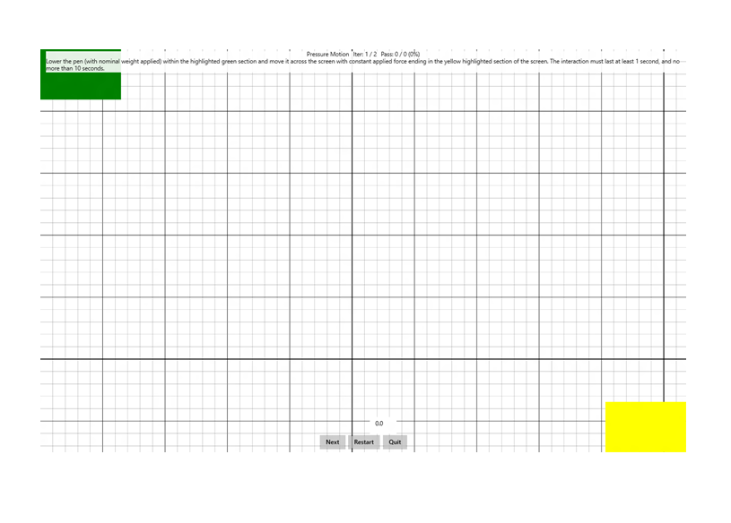

# Pressure Motion

This is to test the consistency of the pressure reporting by a Windows pen device as it moves across a screen.

**Test name**

-   PressureMotion

**Core requirements tested**

-   Device.Input.Digitizer.Pen.Pressure.

**Test purpose**

-   Verifies that the pen has a consistent level of pressure reported across the screen for given input applied force.

**Tools required**

-   PT3 with Pen holder + 150g weight.

**Validation steps**

1. Run the test case for Pressure Motion.

2. Following the directions on the screen, lower the pen (which has an applied nominal weight to it) in contact with the screen within the highlighted green section.

   -   Ensure that the pen is held in contact with the screen by the weight of the pen, holder, and applied weight, and not by a manual downward force applied to the testing jig.

3. Starting from within the green rectangle, slowly move the pen in contact with the screen, ending within the yellow rectangle. The pen must not be lifted from the screen while in motion, this should last for a minimum of 1 second, and should not take longer than 10 seconds.

Here's a screenshot from the Pressure Motion test.

**Common error messages**

-   "Pressure variation is too high."

    Occurs if the reported pressure level is beyond the allowed variance across the screen.

**Passing criteria**

-   2/2 test iterations must pass for test to succeed.
-   The test allows for reported pressure to vary by +/- 5% while moving across the screen.
