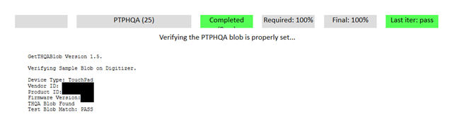

# PTPHQA

This is to test the PTPHQA reporting capabilities of a Windows Precision Touchpad device.

**Test name**

-   Test.PTPHQA

**Core requirements tested**

-   Device.Input.PrecisionTouchpad.HIDCompliance.PTPHQA

**Test purpose**

-   Verifies that the device is able to report a PTPHQA certification blob.

-   Test only checks that the usage is available. For Windows 8.1 compatibility, the device is responsible for accurately reporting its PTPHQA blob.

**Tools required**

-   PTLogo.exe

**Validation steps**

1. Launch Test.PTPHQA.json.

2. PTLogo will automatically pass, if the device correctly reports the PTPHQA usage. Conversely, the test will fail if the PTPHQA usage is incorrectly reported.

Here's a screenshot from the test, showing a passing result.

**Note**  If this is a re-certification, this test will fail and should be manually verified by entering the following command: **GetThqaBlob.exe –usage=TouchPad -verifyCertified**

 

**Common error messages**

-   None.

**Passing criteria**

-   1/1 (100%) iterations must pass in order to complete with passing status.

 

 

