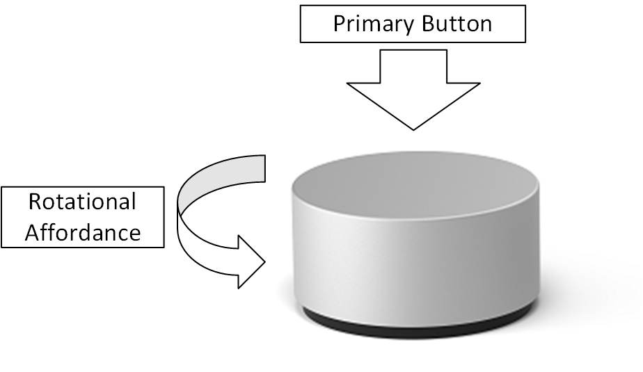

# Windows radial controller designs

This topic presents information about the radial controller devices that are compatible with Windows 10, version 1607.

## Physical design

The physical radial controller device that the user interacts with may have a variety of industrial designs. However, all compatible Windows radial controller devices have a primary button, and a rotational affordance. The following image illustrates how these affordances may be implemented. 

A radial controller may optionally report its on-screen position. The mechanism for determining the on-screen position is vendor-specific, and therefore a specific implementation is not outlined in this document. However, the method for reporting the on-screen position is standardized and detailed in the following sections.
