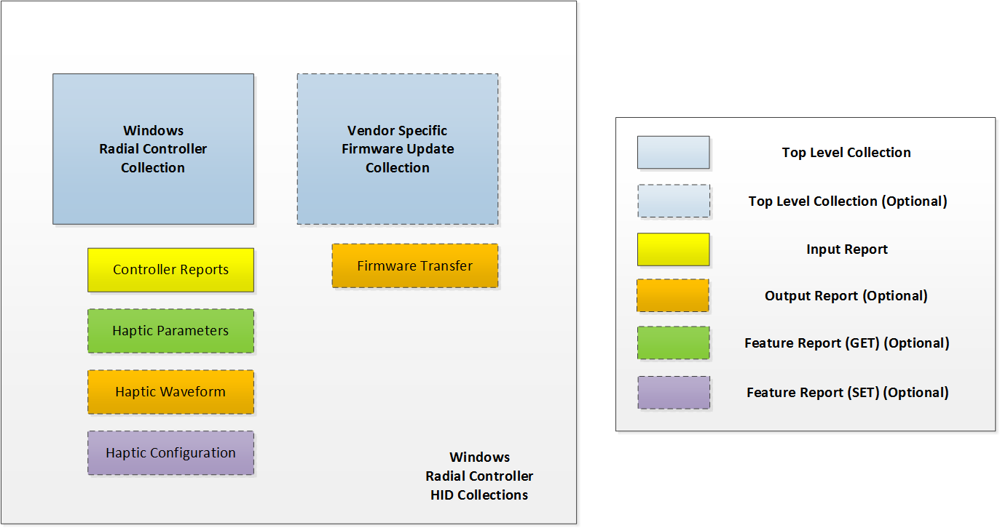

# Radial controller protocol implementation

Windows radial controller devices are expected to use the Human Interface Device (HID) protocol to communicate with the host.

A good understanding of the HID protocol is needed to be able to understand the information presented here. See the following resources for information about the HID protocol:
* [Device Class Definition for Human Interface Devices (HID)](http://www.usb.org/developers/hidpage#Class_Definitions)
* [HID Usage Tables](http://www.usb.org/developers/hidpage#HID_Usage)
* [HID Over I2C Protocol Specification](https://msdn.microsoft.com/library/windows/hardware/dn642101.aspx)

Windows includes a HID class driver and corresponding HID I²C, HID USB and HID Bluetooth-enabled miniport drivers; therefore, there is no need for any third-party mini-port drivers for Windows radial controllers unless it utilizes a bus where an inbox HID mini-port driver is not available.

A device only needs to report the usages described in this topic in the firmware for a Windows radial controller device. Windows will use the firmware and its own HID drivers to enable the device and give Windows applications access to the device.

A sample descriptor is provided in the [Sample Report Descriptors](radial-controller-sample-report-descriptors.md) section.

## Required HID top-level collections

A Windows radial controller device exposes, at a minimum, the single mandatory top-level collection, for radial controller input reporting. An optional (recommended) collection for firmware updates may also be implemented.
The following diagram shows the HID collections for a Windows radial controller device.

### Windows radial controller collection

Using the HID protocol, a Windows radial controller provides a top-level collection that appears as a System Multi-Axis Controller (Page **0x01**, Usage **0x0E**). By reporting this top-level collection and the required usages, a device appears to Windows as a radial controller.

The Windows radial controller collection provides input reporting to the host, as well as device information that pertains to those reports. The collection supports one mandatory input report for radial controller input data. An optional feature report and output report for haptic feedback may also be supported.

# In this section

| Topic | Description |
| --- | --- |
| [Radial Controller Input Reports](radial-controller-input-reports.md) | This topic details the HID input reports that are used for radial controller haptic feedback support in Windows 10, version 1607 and later operating systems. |
| [Radial Controller Output Reports](radial-controller-output-reports.md) | This topic details the HID output reports that are used for radial controller haptic feedback support in Windows 10, version 1607 and later operating systems. |
| [Radial Controller Feature Reports](radial-controller-feature-reports.md) | This topic details the HID feature reports that are used for radial controller haptic feedback support in Windows 10, version 1607 and later operating systems. |
| [Firmware Update Collection](radial-controller-firmware-update-collection.md) | This topic discusses an optional HID top-level collection that can be used for radial controller firmware updates in Windows 10, version 1607 and later operating systems. |
| [Sample Report Descriptors](radial-controller-sample-report-descriptors.md) | This topic presents a sample report descriptor and some sample descriptor excerpts for a Windows radial controller device. |
