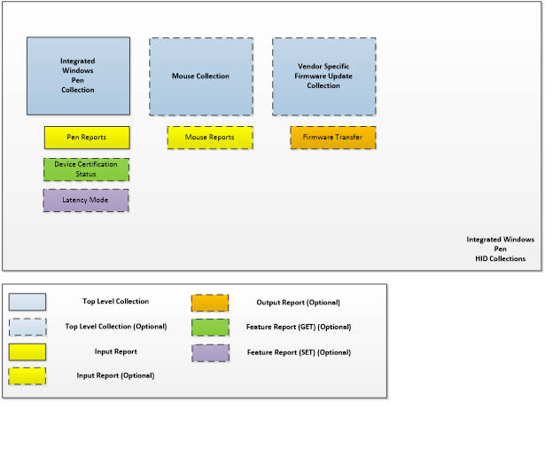
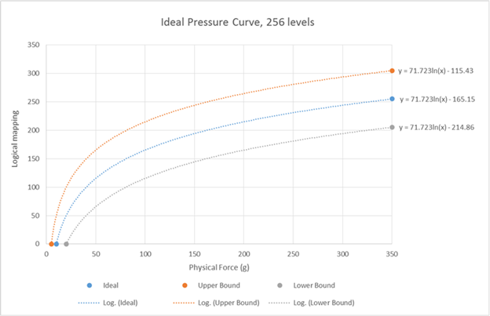
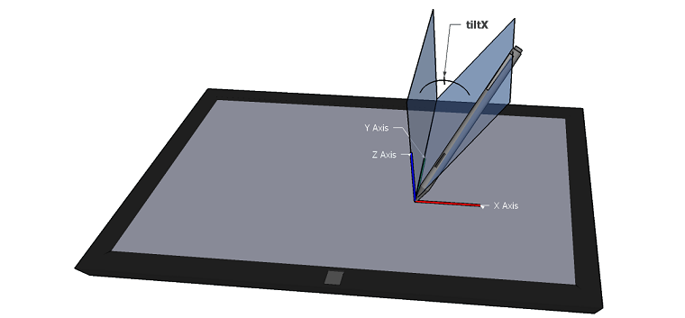
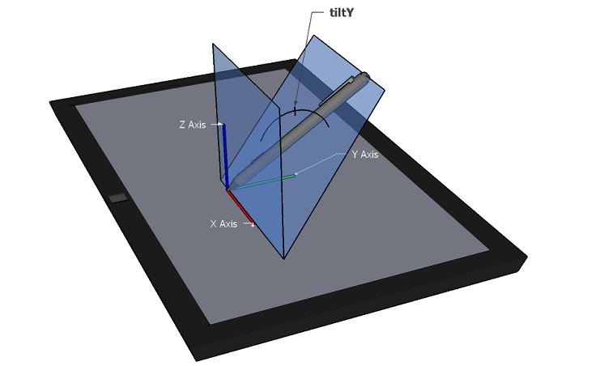

# Required HID Top-Level Collections

This topic discusses the required HID top-level collections that are used for pen reporting in Windows 10 and later operating systems.

An integrated Windows pen device should expose, at a minimum, the single mandatory top-level collection for pen reporting. An optional (but recommended) collection for firmware updates can also be implemented. And on operating systems earlier than Windows 10, an optional (dummy) mouse collection for pen cursor support can also be implemented.

The following diagram shows the HID collections for an integrated Windows pen device.

## Mouse Collection (Dummy)

An integrated Windows pen device can use the HID protocol to provide a top-level collection that appears as a generic desktop/mouse (Page **0x01**, Usage **0x02**).

The (dummy) mouse collection of an integrated Windows Pen device serves the purpose of providing the host with a HID-compliant mouse device, for the purposes of displaying a cursor on operating systems earlier than Windows 10. No actual mouse reporting is required from this collection; only the presence of the mouse collection in the descriptor. If you don't have to support operating systems earlier than Windows 10, then this collection can be omitted.

## Integrated Windows Pen Collection

An integrated Windows pen device should use the HID protocol on a Windows 10 system in such a way that the device provides a top-level collection that appears as a digitizer/integrated pen (Page **0x0D**, Usage **0x02**).

The integrated Windows pen collection serves the purpose of providing rich contact, pressure, erase and button reporting to the host. The collection can optionally support a feature report to obtain the device’s certification status. The mandatory input report is specified in detail the *Integrated Windows Pen Input Reports* section of this topic. An optional (but highly recommended) feature report can be implemented to obtain latency mode hints from the host. This optional feature can help to achieve minimal power consumption on USB devices that are armed for wake in sleep mode.

**Device Certification Status Feature Report**

If you implement the device certification status feature report, the host of the integrated Windows Pen device can use it to retrieve the device’s 256-byte blob.

The 256-bytes should be specified via a vendor-specific HID usage, in a vendor-defined usage page (Page **0xFF**, Usage **0xC5**) in the device certification status feature report.

Before a device receives a 256-byte blob that indicates its certification status, it should implement a default blob as follows:

0xfc, 0x28, 0xfe, 0x84, 0x40, 0xcb, 0x9a, 0x87, 0x0d, 0xbe, 0x57, 0x3c, 0xb6, 0x70, 0x09, 0x88, 0x07, 0x97, 0x2d, 0x2b, 0xe3, 0x38, 0x34, 0xb6, 0x6c, 0xed, 0xb0, 0xf7, 0xe5, 0x9c, 0xf6, 0xc2, 0x2e, 0x84, 0x1b, 0xe8, 0xb4, 0x51, 0x78, 0x43, 0x1f, 0x28, 0x4b, 0x7c, 0x2d, 0x53, 0xaf, 0xfc, 0x47, 0x70, 0x1b, 0x59, 0x6f, 0x74, 0x43, 0xc4, 0xf3, 0x47, 0x18, 0x53, 0x1a, 0xa2, 0xa1, 0x71, 0xc7, 0x95, 0x0e, 0x31, 0x55, 0x21, 0xd3, 0xb5, 0x1e, 0xe9, 0x0c, 0xba, 0xec, 0xb8, 0x89, 0x19, 0x3e, 0xb3, 0xaf, 0x75, 0x81, 0x9d, 0x53, 0xb9, 0x41, 0x57, 0xf4, 0x6d, 0x39, 0x25, 0x29, 0x7c, 0x87, 0xd9, 0xb4, 0x98, 0x45, 0x7d, 0xa7, 0x26, 0x9c, 0x65, 0x3b, 0x85, 0x68, 0x89, 0xd7, 0x3b, 0xbd, 0xff, 0x14, 0x67, 0xf2, 0x2b, 0xf0, 0x2a, 0x41, 0x54, 0xf0, 0xfd, 0x2c, 0x66, 0x7c, 0xf8, 0xc0, 0x8f, 0x33, 0x13, 0x03, 0xf1, 0xd3, 0xc1, 0x0b, 0x89, 0xd9, 0x1b, 0x62, 0xcd, 0x51, 0xb7, 0x80, 0xb8, 0xaf, 0x3a, 0x10, 0xc1, 0x8a, 0x5b, 0xe8, 0x8a, 0x56, 0xf0, 0x8c, 0xaa, 0xfa, 0x35, 0xe9, 0x42, 0xc4, 0xd8, 0x55, 0xc3, 0x38, 0xcc, 0x2b, 0x53, 0x5c, 0x69, 0x52, 0xd5, 0xc8, 0x73, 0x02, 0x38, 0x7c, 0x73, 0xb6, 0x41, 0xe7, 0xff, 0x05, 0xd8, 0x2b, 0x79, 0x9a, 0xe2, 0x34, 0x60, 0x8f, 0xa3, 0x32, 0x1f, 0x09, 0x78, 0x62, 0xbc, 0x80, 0xe3, 0x0f, 0xbd, 0x65, 0x20, 0x08, 0x13, 0xc1, 0xe2, 0xee, 0x53, 0x2d, 0x86, 0x7e, 0xa7, 0x5a, 0xc5, 0xd3, 0x7d, 0x98, 0xbe, 0x31, 0x48, 0x1f, 0xfb, 0xda, 0xaf, 0xa2, 0xa8, 0x6a, 0x89, 0xd6, 0xbf, 0xf2, 0xd3, 0x32, 0x2a, 0x9a, 0xe4, 0xcf, 0x17, 0xb7, 0xb8, 0xf4, 0xe1, 0x33, 0x08, 0x24, 0x8b, 0xc4, 0x43, 0xa5, 0xe5, 0x24, 0xc2

The host can request the device certification status feature report of an integrated Windows pen device at any time, after reading the report descriptor.

**Latency Mode Feature Report**

**Note**  Windows 10, version 1511 and earlier operating systems do not currently issue this HID feature report to Pen or Touchscreen devices that happen to provide support for it. However, adding support for the *Latency Mode Feature Report* to a device, will make sure that the device is ready for the future date when Windows supports it on Pen and Touchscreen devices.

 

The latency mode feature report is sent by the host to an integrated Windows pen device, to indicate when high latency is desirable for power savings and conversely, when normal latency is desired for operation. In the case of a USB-connected integrated Windows pen device, this allows the device to differentiate between being suspended for inactivity (runtime IDLE) and being suspended because the system is entering S3 or Connected Standby.

The latency mode should be indicated via the value for the latency mode usage (Page **0x0D**, Usage **0x60**) in the latency mode feature report.

| Latency mode value | Latency mode |
|--------------------|--------------|
| 0                  | Normal       |
| 1                  | High         |

 

**Integrated Windows Pen Input Reports**

The usages in the following table are used by the host to extract pen data from an input report, via the integrated Windows pen collection. The table shows all the mandatory usages and the Windows-supported optional usages for reporting about the pen.

| Member        | Description                                                        | Page | ID   | Mandatory/Optional | Required for HLK           |
|---------------|--------------------------------------------------------------------|------|------|--------------------|----------------------------|
| X             | X coordinate of contact position                                   | 0x01 | 0x30 | Mandatory          | Yes                        |
| Y             | Y coordinate of contact position                                   | 0x01 | 0x31 | Mandatory          | Yes                        |
| Tip           | Set if the pen is on the surface of the digitizer                  | 0x0D | 0x42 | Mandatory          | Yes                        |
| In-Range      | Indicates whether the pen is in-range of the digitizer             | 0x0D | 0x32 | Mandatory          | Yes                        |
| Barrel Button | State of button located on the side of the pen                     | 0x0D | 0x44 | Optional           | No, but highly recommended |
| Invert        | Indicates that the pen's orientation implies an intention to erase | 0x0D | 0x3C | Optional           | Yes                        |
| Eraser        | Indicates that the pen is erasing                                  | 0x0D | 0x45 | Optional           | Yes                        |
| Tip Pressure  | Pressure exerted on the pen tip                                    | 0x0D | 0x30 | Optional           | Yes                        |
| Scan Time     | Relative scan time per frame                                       | 0x0D | 0x56 | Optional           | No                         |
| X-Tilt        | The angle of tilt of the pen along the x-axis                      | 0x0D | 0x3D | Optional           | No                         |
| Y-Tilt        | The angle of tilt of the pen along the y-axis                      | 0x0D | 0x3E | Optional           | No                         |
| Twist         | Clockwise rotation of the pen                                      | 0x0D | 0x41 | Optional           | No                         |

 

The following table shows the mandatory report-level usages for integrated Windows pen input reports.

| Member    | Description                      | Page | ID   | Mandatory/Optional |
|-----------|----------------------------------|------|------|--------------------|
| Report ID | Integrated Windows Pen report ID | 0x0D | 0x02 | Mandatory          |

 

### Mandatory and Windows-supported optional usages

Any device that does not report all mandatory usages at either the contact or report level, will be non-functional as an integrated Windows pen device. Mandatory usages are strictly enforced by the Windows host. Where a logical maximum value has not been set, the value can be optimized to reduce descriptor size.

The following sections provide more details about the mandatory and the Windows-supported optional usages that were presented in an earlier table.

### X, Y

*X* and *Y* report the coordinates of the integrated pen. The following global items should be specified for both the *X* and *Y* usages:

-   Physical minimum & Physical maximum
-   Unit & Unit exponent
-   Logical minimum & Logical maximum (ensuring an input resolution &gt;= 150DPI)
    
    **Note**  The entire logical coordinate range should be reportable across both the *X* and *Y* axis.

     

### Pen Tip

Used to indicate when the pen tip is on the surface, or has left the surface of the digitizer. This is indicated by a main item with a report size of 1 bit. When delivering an input report, the bit should be set when the pen is on the digitizer surface, and cleared when the pen has left the surface.

When a pen is being reported for the first time in a report stream with the tip switch clear, the X/Y location being reported should be the same as the last position reported with the tip switch set.

### In-Range

Used to indicate when the pen tip (or tail-end eraser) is in-range of the digitizer. This is indicated by a main item with a report size of 1 bit. When delivering an input report, the bit should be set when the pen tip (or tail-end eraser) is on the digitizer surface or within the detectable range of the digitizer, and cleared when the pen is no longer detectable. It should be noted that In-Range should only be reported when the pen’s X/Y location can be reported reliably, and within the parameters set forth by the Pen HLK requirements for Windows 10.

When a pen is being reported with the in-range switch clear, the X/Y location being reported should be the same as the last position reported when the in-range switch was set.

### Barrel Button

Used to indicate when the button on the side of the pen is depressed. This is indicated by a main item with a report size of 1 bit. When delivering an input report, the bit should be set when this button is depressed, and cleared when the button is released.

### Invert

Used to indicate when the pen's orientation implies an intention to erase. This is indicated by a main item with a report size of 1 bit. Here are some input reporting guidelines for the different eraser implementations:

-   Tail-end eraser implementations

    When delivering an input report, the bit should be set whenever the pen is inverted, and cleared when the pen is not inverted.

-   Eraser button implementations

    When delivering an input report, the bit should be set whenever the eraser button is depressed, and the pen is in-range of the digitizer and cleared otherwise.

### Eraser

Used to indicate when the pen is erasing. This is indicated by a main item with a report size of 1 bit. Here are some input reporting guidelines for the different eraser implementations:

-   Tail-end eraser implementations

    When delivering an input report, the bit should be set whenever the pen is inverted and in-contact with the screen, and cleared otherwise.

-   Eraser button implementations

    When delivering an input report, the bit should be set whenever the eraser button is depressed and the pen tip is in-contact with the screen, and cleared otherwise.

    To avoid accidentally activating or cancelling the erase functionality in this implementation, it is highly recommended that once the pen tip is in contact with the screen, depressing or releasing the erase button should have no impact on the reporting of the eraser bit.

When a pen is being reported for the first time in a report stream with the erase switch clear, the X/Y location being reported should be the same as the last position reported when the erase switch was set.

### Scan Time

Scan Time reports relative digitizer time in 100µs units. When a device starts reporting data subsequent to a period of inactivity, the Scan Time represents the time span from the first frame that was reported till the time of the report. The first scan time received is treated as a base time for subsequent reported times. The elapsed time between reported scan times should reflect the scanning frequency of the digitizer. It is important to note that unlike other usages, the host does not allow any flexibility for the unit for the scan time usage, if it is implemented. It must be in 100µs units. The value is expected to roll over, as only 2 bytes are allocated to the counter.

### Tip Pressure

Used to indicate the pressure that is being applied to the tip of the pen. This is indicated by a main item with a report size of at least 8 bits, to accommodate a minimum of 256 distinct levels of pressure. To report additional granularity, you must use a larger report size.

The logical values of reported pressure should adhere as closely as possible to the ideal logarithmic curve shown in the following diagram. The pressure tests provided by the Pen HLK test suite for Windows 10, are designed to ensure that the reported pressure curve falls within the upper and lower bounds indicated in the diagram. While the ideal curve in the diagram, and its associated equations, are outlined for a device reporting 256 levels, they can be scaled to accommodate any number of discrete levels.

### X-Tilt

X-Tilt represents the plane angle between the Y-Z plane, the plane containing the pen transducer axis, and the Y axis.

The physical range and logical range must be specified. The physical range may be a maximum of -90 to 90 deg, however the physical minimum/maximum reported in the descriptor should correspond to the actual minimum/maximum achievable X-Tilt of the pen, in the correct unit (0x14, Degrees). The logical range must be large enough to deliver data that is accurate to at least two decimal places. Radians may also be used for the physical range. X-Tilt is positive to the right of the user in the digitizer’s native orientation.

### Y-Tilt

Y-Tilt represents the plane angle between the X-Z plane, the plane containing the pen transducer axis, and the Y axis.

The physical range and logical range must be specified. The physical range may be a maximum of -90 to 90 deg, however the physical minimum/maximum reported in the descriptor should correspond to the actual minimum/maximum achievable Y-Tilt of the pen in the correct unit (0x14, Degrees). The logical range must be large enough to deliver data that is accurate to at least two decimal places. Radians may also be used for the physical range. Y-Tilt is positive towards the user in the digitizer’s native orientation.

### Twist

Twist specifies the clockwise rotation of the pen around its own major axis.

The physical range and logical range must be specified. The physical range must be 0 to 360. The logical range must be large enough to deliver data that is accurate to at least two decimal places. Radians can also be used for the physical range. In this case, the logical range must be large enough to report values that are accurate to at least four decimal places.
