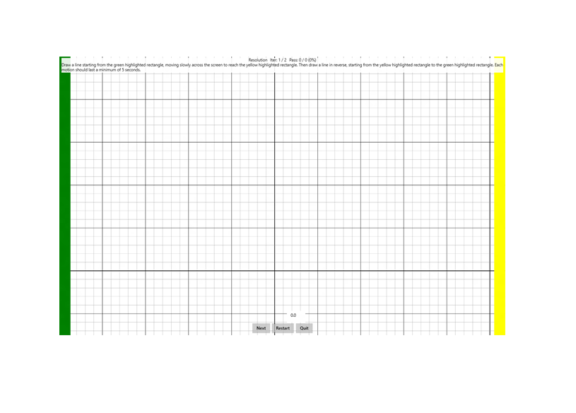

# Resolution

This is to test the reporting resolution of a Windows pen device.

**Test name**

-   Resolution

**Core requirements tested**

-   Device.Input.Digitizer.Pen.Resolution.

**Test purpose**

-   Verifies that the pen is able to genuinely report at a resolution that is higher than the display resolution, and also verifies that the reporting resolution is &gt;= 150 DPI.

**Tools required**

-   None (PT3 with Pen Holder optional).

**Validation steps**

1. Run the test case for Resolution.

2. Drag the pen as slowly as possible across the screen from any point in the green highlighted region to any point in the yellow highlighted region without lifting the pen. Then draw a line in reverse, from the yellow highlighted region back to the green highlighted region.

3. All off-axis movement or jitter is ignored, so if the PT3 cannot move smoothly at a slow pace, the pen can be moved by hand across the screen to avoid extra friction.

   -   If you use your hand to move the pen across the screen, make sure that your palm does not contact the UI buttons at the bottom of the screen.

4. The pen should always be in contact with the screen during the motion.

Here's a screenshot from the Resolution test.

**Common error messages**

-   "Failed to retrieve screen resolution."

    Occurs if the test fails to retrieve the resolution of the primary display.
-   "Resolution too low"

    Occurs if the digitizer’s resolution is less than 150 DPI.
-   "Pen resolution must be &gt;= screen resolution."

    Occurs if the digitizer’s resolution is less than the display resolution.
-   "Positional delta too large."

    Occurs if the pen stroke contains too large of a jump between subsequent packets in the axis being tested.
-   "Not enough logical coordinates found."

    Occurs if the pen stroke does not cover enough of the digitizer’s resolution.
-   "The contact did not begin/end in the correct location."

    Occurs if the pen stroke does not begin in the green rectangle and end in the yellow rectangle.
-   "The interaction’s duration was too short."

    Occurs if the pen stroke does not last the required duration.

**Passing criteria**

-   2/2 test iterations must pass for test success.
-   Between the 2 slow horizontal swipes, the majority of logical units of X should be hit and reported, and between 2 slow vertical swipes, the majority of logical units of Y should be hit and reported.
-   The percentage of logical X or Y coordinates required to be covered in each iteration scales based on the ratio of digitizer resolution to display resolution:
    + If digitizer resolution &gt;= display resolution, hitting 90% of coordinate space is required.
    + If digitizer resolution &gt;= 2x display resolution, hitting 80% of coordinate space is required.
    + If digitizer resolution &gt;= 3x display resolution, hitting 70% of coordinate space is required.
    + If digitizer resolution &gt;= 4x display resolution, hitting 60% of coordinate space is required.
    + If digitizer resolution &gt;= 5x display resolution, hitting 50% of coordinate space is required.
