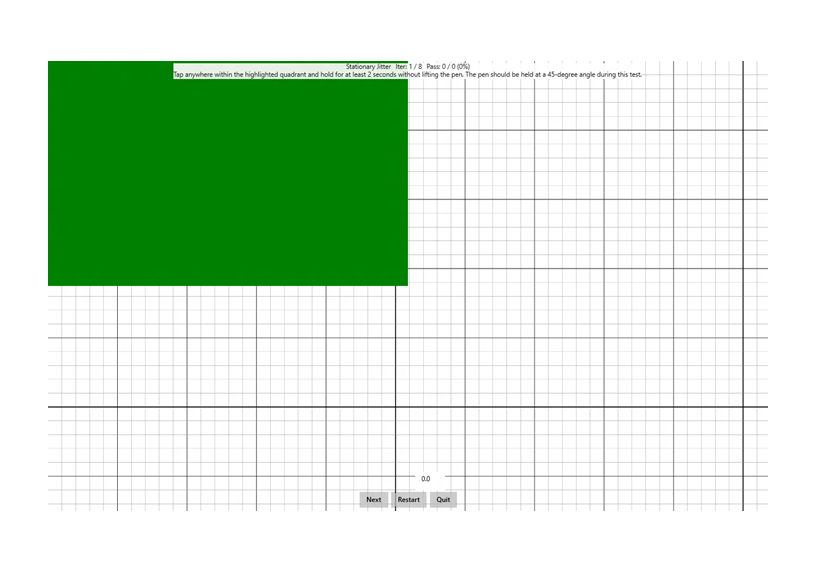

# Stationary Jitter

This is to test the position reporting accuracy (jitter) of a Windows pen device that is stationary on the screen.

**Test name**

-   StationaryJitter

**Core requirements tested**

-   Device.Input.Digitizer.Pen.Jitter – Stationary Jitter.

**Test purpose**

-   Verifies that while the pen is held perfectly stationary in contact with the screen, the contact position that the device reports is within allowed limits.

**Tools required**

-   PT3 with Pen holder + 150g.

**Validation steps**

1. Run the test case for Stationary Jitter.

2. The pen should be held at a 45 degrees angle during this test.

3. Following the directions on the screen, bring pen in contact with screen within the highlighted quadrant.

4. Hold the pen steady in this state for at least 2 seconds.

5. Ensure that activation force at all times when the pen is in contact with the screen.

Here's a screenshot from the Stationary Jitter test.

**Common error messages**

-   "Jitter too high."

    Occurs if the pen’s jitter exceeds the tolerance.
-   "The contact did not begin/end in the correct location."

    Occurs if the pen stroke does not begin and end in the green rectangle.
-   "The interaction’s duration was too short."

    Occurs if the pen stroke does not last the required duration.

**Passing criteria**

-   7/8 test iterations must pass for test success.
-   This test has a .06 mm (20%) allowed tolerance, therefore a recorded stationary jitter &lt;= 0.36 mm will result in a pass.
-   A single iteration that is more than .06 above the allowed tolerance, resulting in a stationary jitter of &gt;=0.42 mm, will fail the entire test.

    Output is derived as the max value of jitter over valid iterations.
