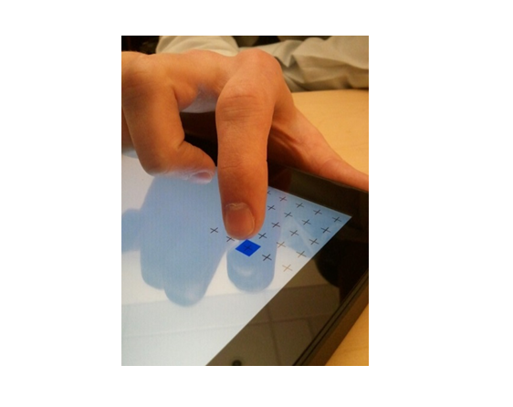
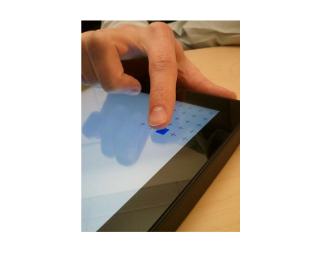

# Touch UX

This is to test the nature of the user experience for a Windows Touchscreen device.

**Test name**

UXTests.json
**Associated compatibility requirements**

-   Device.Input.Digitizer.Base.ContactReports
-   Device.Input.Digitizer.Touch.Accuracy
-   Device.Input.Digitizer.Touch.FingerSeparation
-   Device.Input.Digitizer.Touch.Jitter
-   Device.Input.Digitizer.Touch.ReportRate

**Test purpose**

Validates the Windows Touchscreen user experience that is associated with the hardware requirements. The tests are designed to run freehand.

The test ensures that all UI elements in the system can be accurately targeted by users with touch at the given resolution and scaling factor of the screen. The smaller size of the hitboxes in this test is by design as it accurately represents the resolution of the application. If the screen is super high resolution to the point where a 40px touch target (the size of the tile) is very small, then the tester needs to be able to hit the targets.

**Note**  The test is using DIPS, not physical pixels, so make sure that the test is running on a system with an appropriate scale factor for the display. If the test is run at 100% scaling, the test will be more difficult.

 

**Tools required**

None. Manual test.
**Running the test**

The Windows Touch UX Test suite combines disparate touch requirements into everyday tasks. The principle benefit of this test suite is to test the requirements together and to verify that a user can reliably complete the core Windows touch interactions.

Here's a list of the tests in the suite, along with descriptions, points to note and some recommendations.

*Tile Tap*

Tile Tap is a simple accuracy test in the context of tapping tiles on the Search screen. It appears four times: one time in each screen quadrant. To complete the test, tap each blue box as it appears. We recommend that you use a *natural tapping* motion during your internal testing.

Here's an example of a precise tapping finger position.

Here's an example of the natural (recommended) tapping finger position.

*Semantic Zoom*

Semantic zoom is an active feature in many of the default controls in the Windows SDK. For example, you can see Semantic Zoom on the Start screen, where the user can pinch and zoom to reveal different views of the application tiles.

In each iteration of the test, you are asked to zoom in or zoom out. You can accomplish these, respectively, by pulling your fingers apart or by pulling them together. There are two versions of this test: one that uses two fingers and one that uses five fingers.

*Quick Toss*

Quick toss is a punctuated panning motion that scrolls quickly through pages of content. The Quick Toss test goes through a series of iterations. In each iteration, you quickly swipe up or down the screen by using one or two fingers. (Note that speed is enforced in this test.) A quick toss that is performed too slowly will not cause a failure, but it will require you to repeat that iteration.

**Note**  When inertia is applied and the tester cannot pan the color screen accordingly (that is, a faster swipe does not make color screens scroll faster), this test should be treated as a valid fail because the user cannot pan smoothly by using the desired velocity.

 

*Keyboard*

The Keyboard test simulates quick typing on the touch keyboard. It presents four keys that must all be tapped once within one second. (This represents a typing speed of four keys per second, or roughly 48 words per minute.)

The test times out one second after the first target is pressed. If a target is missed because of a dropped touch or a sequence of taps that are interpreted as a move, the test can appear to be lagging. The following image shows you how to place your fingers on the touch screen for this test.

*Hyperlink*

The Hyperlink test asks you to tap a series of hyperlinks that are rendered at their typical size. The test is complete after all of the hyperlinks have been tapped or missed.

*Press and hold*

Press and hold is a gesture that users can employ to discover more information about a UI element. For example, if you hold a finger down on the desktop, the context menu opens. The Press and Hold test presents four squares: three gray and one blue. You must press the blue square until it turns green. Repeat until the test is complete.

*Mobar*

Users can drag the dividing line between two active displayed applications, to change the area that is allocated to either application, or to remove one application from the screen. The Mobar test validates that users can complete this activity by drawing a blue line, and then asking you to drag from any location on this line to a green box. The locations of the blue line and the green box change during the test, but the goal is always the same.

*Backstack*

The Backstack test models multitasking, whereby the user can pan left or right to reveal recently visited pages. In each iteration of the test, you must swipe left or right. You must complete each iteration to fulfill the test requirements.

*Edgy*

The Edgy test models the edge gestures that perform such actions as to display the **Action Center** or to cycle through and dismiss applications. To complete the test, swipe from the border area (or bezel) onto the visible screen area through the side of the screen that is colored blue.

**Note**  Each swipe requires a minimum speed of 20mm/s. This is the same speed threshold that is used in the operating system. If the tester does not achieve this speed, an "Unknown Reason" error message will be displayed.

 

*Select*

The Select test presents a number of tiles, one of which is colored blue. The goal is to pull up or down on the blue tile toward the gray line without passing it. The test monitors for motion that is perpendicular to the direction of the select gesture; the user sees this motion as panning.

*Rearrange*

Rearrange is a gesture that is used to move application tiles on the screen. You accomplish this by applying a dragging motion to an application tile until it breaks free.

**Command syntax**

Logo3.exe -config UXTests.json
 

 

