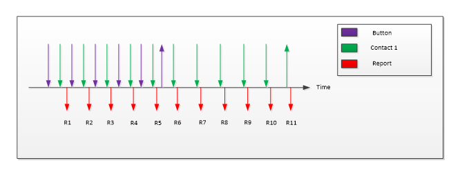
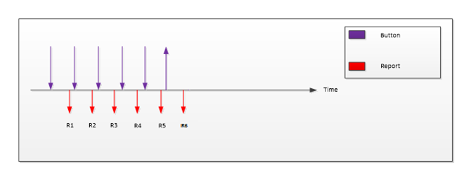

# Buttons, Report Level Usages

This topic discusses the report level usages for buttons, within the context of the [Windows Precision Touchpad Collection](touchpad-windows-precision-touchpad-collection.md).

Here's a table that shows all the mandatory usages which should be present in all Windows Precision Touchpad input reports. The table includes the usages for Buttons 1, 2 and 3.

| Member        | Description                                                                        | Page | ID   | Mandatory/Optional |
|---------------|------------------------------------------------------------------------------------|------|------|--------------------|
| Report ID     | Windows Precision Touchpad Report ID.                                              | 0x0D | 0x05 | Mandatory          |
| Scan Time     | Relative scan time.                                                                | 0x0D | 0x56 | Optional           |
| Contact Count | Total number of contacts to be reported in a given report.                         | 0x0D | 0x54 | Mandatory          |
| Button 1      | Indicates Button State for touchpad button integrated with digitizer.              | 0x09 | 0x01 | Optional           |
| Button 2      | Indicates Button State for external button for primary (default left) clicking.    | 0x09 | 0x02 | Optional           |
| Button 3      | Indicates Button State for external button for secondary (default right) clicking. | 0x09 | 0x03 | Optional           |

 

The following sections provide information about the usages for Buttons. For information about the other members (for example, *Report ID*) see [Windows Precision Touchpad Collection](touchpad-windows-precision-touchpad-collection.md).

## Button 1

The Button 1 switch specifies the up/down state of the Windows Precision Touchpad button under the digitizer. Regardless of the button type implementation (pressure or mechanical), when a button has received the required amount of activation force, its down state should be reported by setting the button bit. When the activation force that is applied to the button, falls below the required threshold, the 'up' state should be reported by clearing the button bit.

With reference to the example outlined in the preceding diagram, assume that a contact is placed on a Windows Precision Touchpad with sufficient activation force to invoke a button down. Then at some time later, the activation force is reduced such that it invokes a button up while the contact remains on the surface for some additional time. This would be reported as described in the following table.

| Report                | 1      | 2      | 3      | 4      | 5      | 6      | 7      | 8      | 9      | 10       | 11       |
|-----------------------|--------|--------|--------|--------|--------|--------|--------|--------|--------|----------|----------|
| Contact Count         | 1      | 1      | 1      | 1      | 1      | 1      | 1      | 1      | 1      | 1        | 1        |
| Button                | 1      | 1      | 1      | 1      | 1      | 0      | NR     | NR     | NR     | NR       | NR       |
| Contact 2: tip switch | 1      | 1      | 1      | 1      | 1      | 1      | 1      | 1      | 1      | 1        | 0        |
| Contact 2: X, Y       | X₁, Y₁ | X₂, Y₂ | X₃, Y₃ | X₄, Y₄ | X₅, Y₅ | X₆, Y₆ | X₇, Y₇ | X₈, Y₈ | X₉, Y₉ | X₁₀, Y₁₀ | X₁₀, Y₁₀ |

 

With reference to the example outlined in the preceding diagram, assume that a non-capacitive contact is placed on a Windows Precision Touchpad with sufficient activation force to invoke a button down. Then at some time later, the activation force is reduced such that it invokes a button up. This would be reported as described in the following table.

| Report        | 1   | 2   | 3   | 4   | 5   | 6   |
|---------------|-----|-----|-----|-----|-----|-----|
| Contact Count | 0   | 0   | 0   | 0   | 0   | 0   |
| Button        | 1   | 1   | 1   | 1   | 1   | 0   |

 

## Buttons 2 and 3 (Discrete Left and Right Clicks)

Windows Precision Touchpad device will natively support usages for buttons (left-click, and right-click) integrated with the digitizer, but additional buttons should be serviced by a 3rd party driver.

And if a device only supports external buttons, it must still use Button 2 and Button 3 to reference the external buttons.

If more than one button is present for use with the touchpad, additional button switches should be declared in the descriptor. External buttons are reported at the packet level similar to the digitizer buttons, however there are no requirements on coordinating external buttons with contact state.

**Packet Reporting Modes**

*Parallel Mode*

In Parallel mode, devices report all contact information in a single packet. Each physical contact is represented by a logical collection that is embedded in the top-level collection. This logical collection contains all the usages that the device supports for each contact. When you use Parallel mode, each of the logical collections must be identical. Because the device generally reports fewer contacts than the maximum, the number of contacts that are reported in a parallel packet should be communicated via the **Contact Count** usage.

For example, consider a device that supports three contacts. If the user has only two fingers on the digitizer, then the parallel packet will only have two valid contact data in a report that can carry data for three contacts. In this case, the **Contact Count** should be set to 2, so that the client application knows that any information about more than two contacts is not valid.

A disadvantage of reporting multiple contacts in one report is that space is wasted per report every time that there are fewer contacts than the maximum number of contacts possible. Devices can use the Hybrid mode to reduce this inefficiency.

*Hybrid Mode*

In Hybrid mode, the number of contacts that can be reported in one report is less than the maximum number of contacts that the device supports. For example, a device that supports a maximum of 4 concurrent physical contacts can set up its top-level collection to deliver a maximum of 2 contacts in one report. If 4 contact points are present, the device can break these down into 2 serial reports that deliver 2 contacts each.

When a device delivers data in this manner, the **Contact Count** usage value in the first report should reflect the total number of contacts that are being delivered in the hybrid reports. The other serial reports should have a contact count of zero (0).

*Single Finger Hybrid Reporting Mode*

The first input report for a given frame indicates the total number of contacts to be reported via the contact count usage. All subsequent input reports for the same frame should have a value of zero (0) for the contact count usage, to indicate that they are part of the previously reported frame. The scan time for all reports of a given frame should be identical.

Here's a table showing the reporting sequence for 2 contacts (in Single Finger Hybrid Reporting mode).

| Report                | 1      | 2      | 3      | 4      | 5      | 6      |
|-----------------------|--------|--------|--------|--------|--------|--------|
| Contact Count         | 2      | 0      | 2      | 0      | 2      | 0      |
| Contact ID            | 1      | 2      | 1      | 2      | 1      | 2      |
| Contact 1: X, Y       | X₁, Y₁ | NR     | X₂, Y₂ | NR     | X₃, Y₃ | NR     |
| Contact 1: tip switch | 1      | NR     | 1      | NR     | 1      | NR     |
| Contact 2: X, Y       | NR     | X₁, Y₁ | NR     | X₂, Y₂ | NR     | X₃, Y₃ |
| Contact 2: tip switch | NR     | 1      | NR     | 1      | NR     | 1      |
| Scan Time             | T₁     | T₁     | T₂     | T₂     | T₃     | T₃     |

 

USB and I²C-connected Windows Precision Touchpad devices can deliver input reports in either single-finger hybrid reporting mode, or two-finger hybrid reporting mode.

## Related topics

[Windows Precision Touchpad Collection](touchpad-windows-precision-touchpad-collection.md)

 

 

