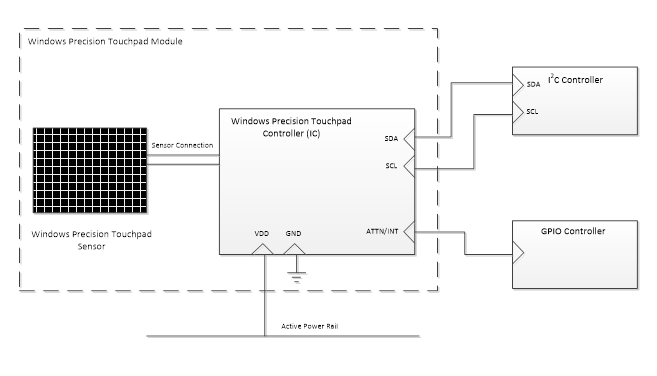

# Device Bus Connectivity

This topic discusses bus connectivity methods for a Windows Precision Touchpad device.

A Windows Precision Touchpad device can use the Microsoft-provided inbox drivers to connect to its Windows host, using either HID over USB, or HID over I²C. However you can use any other bus that you want, as long as you provide the required Windows-compatible, 3rd party HID mini-port driver for the touchpad device.

## I²C Devices

A Windows Precision Touchpad module is defined as the combination of a controller IC, a sensor and any associated mechanisms.

A Windows Precision Touchpad module that is connected to its Windows host via the I²C bus must, at a minimum, expose the following five connection pins:

-   A data line (SDA)
-   A clock line (SCL)
-   An interrupt line
-   A power supply line
-   A ground connection (GND)

The following diagram shows the I²C connecting signal lines between a Windows Precision Touchpad and its Windows host.

When connecting to an I²C controller it is important to understand the bandwidth demands of all components sharing that controller. A minimum I²C clock speed of 400 KHz is recommended for a Windows Precision Touchpad module. It is highly recommended that touch screen controllers and Windows Precision Touchpad controllers do not share the same I²C controller, as this may result in bandwidth demands that exceed bus capability.

It is recommended that the interrupt line (also referred to as the ATTN line) is connected to an On-SoC GPIO controller or an IOAPIC. If wake functionality is desired, the GPIO or IOAPIC resource to which the interrupt line is connected, must be capable of waking the SoC in order to allow the Windows Precision Touchpad to wake the system in various scenarios.

If you decide to use the wake functionality, the power line that is connected to the Windows Precision Touchpad module should not be shared with other devices which are not wake-capable. In order for wake scenarios to function successfully, the power line that is used must be energized during connected standby or S3 conditions.

## ACPI Table Entries

A Windows Precision Touchpad device that is connected to its Windows host via the I²C bus must define an entry in the ACPI table for the device to be recognized. The entry should specify the following information:

| Entry                          | Description                                                                                                                                                                                                       |
|--------------------------------|-------------------------------------------------------------------------------------------------------------------------------------------------------------------------------------------------------------------|
| ACPI Device Entry Name         | A 4-character identification unique to this ACPI table, to reference the device. For example, "TPAD".                                                                                                             |
| ACPI Hardware ID               | A 4-character + 4-number ACPI hardware ID, to reference the device. The ACPI Hardware ID will exposed in device manager. For example, "MSFT0001".                                                                 |
| Compatible ID                  | This should always be “PNP0C50” to indicate that the device is HID I²C-compatible.                                                                                                                                |
| I²C Controller                 | The I²C controller to which the device is connected, must be specified in order to communicate with it. For example, "I2C3" to represent controller \#3).                                                         |
| I²C Slave Address              | The I²C slave address for the device must be specified to allow the host to address it. For example, "0x6F".                                                                                                      |
| I²C Speed                      | The maximum speed supported by both the device and the I²C controller should be specified here to ensure good communications performance. This should not be any lower than 400KHz (or 0x61A80 in hexadecimal).   |
| GPIO Controller                | The GPIO controller to which the interrupt line of the device is connected, must be specified to allow the host to access it. For example, "GPIO0" – for controller zero (0).                                     |
| GPIO Resource or Pin           | The actual pin on the GPIO controller to which the interrupt line of the device is connected, must be specified to allow the host to associate the pin with the device. For example, "{35}" to represent pin 35). |
| GPIO Resource Type             | This defines the constraints around the GPIO resource. This should be "Exclusive" unless SoC wake is desired, in which case, this should be "ExclusiveAndWake".                                                   |
| GPIO Interrupt Assertion Type  | This defines whether the device will provide edge triggered, or level triggered interrupts. HID I²C-compliant devices should provide and indicate "Level" triggered interrupts.                                   |
| GPIO Interrupt Assertion Level | This defines the line level when the interrupt is asserted by the device. This can be specified as "ActiveLow" or "ActiveHigh".                                                                                   |

 

## USB Devices

A Windows Precision Touchpad module that is connected to its Windows host via high-speed/full-speed USB 2.0, should expose the necessary pins for host connectivity.

Connection to the host can take many forms and is at the discretion of the integrator.

Note that when connecting to a USB hub it is important to understand the bandwidth demands of all components sharing that hub. It is highly recommended that high bandwidth devices and Windows Precision Touchpad controllers do not share the same USB hub as this may result in bandwidth demands that exceed bus capability.

## USB Bridge Devices (I²C -&gt; USB)

If you decide to use a USB bridge for connecting an I²C Windows Precision Touchpad to its Windows host, then the bridge should expose the touchpad as a distinct device node with the device’s unique attributes (wVendorID, wProductID, wVersionID).

 

 

