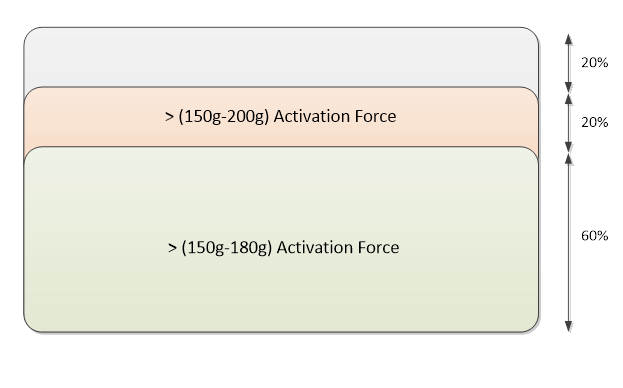

# Module Design for HLK Requirements

This topic provides guidance for designing the modules of a Windows Precision Touchpad device, to meet the requirements of the Windows Hardware Lab Kit (HLK).

The HLK requirements for touchpad devices are designed to provide a consistent user experience, with precision and reliability being high on the list. These requirements should influence all aspects of the module, including the sensor, controller IC and associated mechanisms.

## Sensor Design

The design of the sensor in the Windows Precision Touchpad module is essential for ensuring an accurate representation of the user’s finger interactions.

While a specific sensor pitch is not mandated in this implementation guide, you should note that a larger sensor pitch can introduce challenges when attempting to meet or exceed specific HLK requirements.

**Minimum Input Separation**

Related HLK requirement:

- Device.Input.Digitizer.PrecisionTouchpad.FingerSeparation
Ensuring that each unique finger contact is identified and reported is essential for consistent and reliable gesture recognition.

Windows Precision Touchpad devices should not alias contacts aligned vertically or horizontally at a minimum separation of 10mm. The devices should also not alias contacts that are aligned diagonally at a minimum separation of 8mm edge-to-edge, regardless of whether the contacts are stationary, diverging, converging or being interleaved.

## Controller IC Design

The design of the controller IC in the Windows Precision Touchpad module is essential for ensuring an accurate representation of the user’s finger interactions.

**Position Reporting**

Related HLK requirements:

- Device.Input.Digitizer.PrecisionTouchpad.Jitter
- Device.Input.Digitizer.PrecisionTouchpad.Accurary
The touchpad device should report the kinematics of the surface contacts as accurately as possible to the host. If a contact is stationary it should be reported with stationary coordinates. A moving contact should have its position accurately reported with respect to the scan time value.

**Linearity**

Related HLK requirement:

- Device.Input.Digitizer.PrecisionTouchpad.Jitter
The reporting of subtle movements by the user is an essential part of a precise and responsive user experience. However, the ability to follow the vector of a finger precisely without deviating, is just as critical.

Windows Precision Touchpad devices should maintain linearity within 0.5mm for all contacts reported across edge-to-edge travel horizontally, vertically, and diagonally. Within 3.5mm of any edge, precision touchpad devices should maintain linearity within 1.5mm for all contacts reported. The following diagram illustrates this point.

**Latency & Report Rate**

Related HLK requirements:

- Device.Input.Digitizer.PrecisionTouchpad.Latency
- Device.Input.Digitizer.PrecisionTouchpad.ReportRate
User-perceived latency significantly diminishes the experience of a Windows Precision Touchpad device, so all aspects of the system, from end-to-end, should meet or exceed specified latency goals. Providing a minimal input report rate of 125Hz for single contacts, allows precision parity with USB Mice. Reporting slightly above the display refresh rate (defined in the requirements as *10 + display refresh rate, in Hz*) ensures that Multi-finger gestures animations are animated properly without visual or behavioral glitches.

**Reliability**

Related HLK requirement:

- Device.Input.Digitizer.PrecisionTouchpad.ContactReports
The most critical aspect of a digitizer system is ensuring that spurious contacts are not reported. Spurious contacts can occur due to noise interference that is introduced to the system from a variety of sources. The Windows Precision Touchpad controller should ensure that these are never reported to the host.

A user can make contact (either intentionally or inadvertently) with a Windows Precision Touchpad at any time, and the controller must ensure that it can boot up correctly regardless of surface contacts or button state. The controller must also be able to report contacts in accordance with the HLK requirements, once all the initial contacts have been removed.

A Windows Precision Touchpad should be prepared to detect more contacts on the surface than is supported for contact reporting and tracking. While there are no requirements on the behavior of the touchpad in this scenario, recommendations include ignoring additional contacts or ending reporting for existing contacts until the contact count becomes reportable again. The device should never report more contacts than the maximum number indicated in its report descriptor. Any contacts removed from the reporting stream should have appropriate tip switches set to 'Up'.

## Mechanical Design

The design of the mechanics in the Windows Precision Touchpad module is essential to ensuring a consistent user experience.

**Button Activation Force**

Related HLK requirement:

- Device.Input.Digitizer.PrecisionTouchpad.Buttons
Regardless of button type implementation, a button down state should be reported by a Windows Precision Touchpad when a force that is greater than 150g but less than 180g, is applied to the contact area. Ideally, button down states should not be reported for forces outside the 150g – 180g range.

**Note**  To account for manufacturing variances however, device and system logo tests have been designed to allow a tolerance of +/- 10g. In other words, a Windows Precision Touchpad that reports a button down state for forces between 140g and 190g, is still considered to be within specification.

 

The best Windows Precision Touchpad devices should aim to provide uniform activation across the entire contact area (this is required for pressure-pad implementations). However, at a minimum, Windows Precision Touchpad devices should ensure that any activation force applied as illustrated by the following diagram, results in button-down reporting.

 

 

