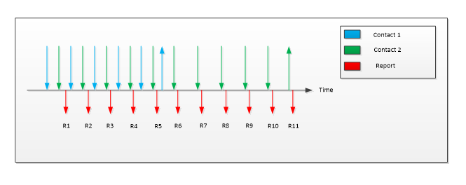

# Windows Precision Touchpad Collection


This topic discusses the top-level collection of a Windows Precision Touchpad, and explains how the collection provides HID-compliant touchpad reporting to the Windows host.

A Windows Precision Touchpad device can use the HID protocol to provide a top-level collection that appears as a digitizer/touchpad (Page **0x0D**, Usage **0x05**).

The Windows Precision Touchpad collection serves the purpose of providing rich multi-contact and button reporting to the host, as well as device information that is related to those reports. The collection should support two feature reports: one that allows the host to obtain device capabilities, and another report to obtain the device’s certification status. For an example of the mandatory input report, see [Sample Report Descriptors](touchpad-sample-report-descriptors.md).

An optional (but highly recommended) feature report may be implemented to obtain latency mode hints from the host, in order to achieve the required power consumption on USB devices in sleep mode. The following sections provide more information about the reports contained in the top-level collection for the Windows Precision Touchpad.

## Device Capabilities Feature Report


The device capabilities feature report is requested by the host of the Windows Precision Touchpad, to retrieve information about the device’s contact reporting capabilities and the device button type.

The device’s contact reporting capability is defined by the maximum number of concurrent surface contacts it can report. A Windows Precision Touchpad should support a minimum of 3 concurrent contacts, and a maximum of 5 concurrent contacts. The touchpad should report this value via the Contact Count maximum (Page **0x0D**, Usage **0x55**) in the device capabilities feature report. While reporting data, a device must not report more contacts than the Contact Count maximum. Any new contact information reported after the Contact Count maximum has been reached, will be ignored by the host.

The device’s button type is defined as either a depressible implementation (also referred to as click-pad type) or a non-depressible implementation (also referred to as pressure-pad). It is also acceptable for a Windows Precision Touchpad to have a non-button reporting digitizer surface and external buttons instead.

The button implementation type should be specified via the value for button type (Page **0x0D**, Usage **0x59**) in the device capabilities feature report. If the device has a non-button reporting digitizer surface and relies instead on external buttons only for mouse clicks, then this usage should not be reported.

The following table shows the button type usage values.

| Button type value | Implementation                 |
|-------------------|--------------------------------|
| 0                 | Depressible (Click-pad)        |
| 1                 | Non-Depressible (Pressure-pad) |

 

The host can request the device capabilities feature report of a Windows Precision Touchpad at any time after reading the report descriptor.

## Device Certification Status Feature Report


The device certification status feature report is requested by the host of the Windows Precision Touchpad to retrieve information about the device’s 256-byte blob.

Reporting a valid, certified blob to the host is optional on Windows 10, but is necessary for backward compatibility with Windows 8.1. A device that does not communicate a signed PTPHQA blob must still report (any) 256-bytes, such as the sample blob below. Devices that do not report a valid certification blob will not function on Windows 8.1. Windows will not interact with devices that use the HID Touchpad usage but do not expose a certification status in their Device Capabilities feature report.

The 256-bytes should be specified via the vendor-specific usage in a vendor-defined usage page (Page **0xFF**, Usage **0xC5**) in the Device Certification status feature report.

Prior to a device receiving a 256-byte blob indicating its certification status, it should implement a default blob as follows:

``` syntax
0xfc, 0x28, 0xfe, 0x84, 0x40, 0xcb, 0x9a, 0x87, 0x0d, 0xbe, 0x57, 0x3c, 0xb6, 0x70, 0x09, 0x88, 0x07,
0x97, 0x2d, 0x2b, 0xe3, 0x38, 0x34, 0xb6, 0x6c, 0xed, 0xb0, 0xf7, 0xe5, 0x9c, 0xf6, 0xc2, 0x2e, 0x84,
0x1b, 0xe8, 0xb4, 0x51, 0x78, 0x43, 0x1f, 0x28, 0x4b, 0x7c, 0x2d, 0x53, 0xaf, 0xfc, 0x47, 0x70, 0x1b,
0x59, 0x6f, 0x74, 0x43, 0xc4, 0xf3, 0x47, 0x18, 0x53, 0x1a, 0xa2, 0xa1, 0x71, 0xc7, 0x95, 0x0e, 0x31,
0x55, 0x21, 0xd3, 0xb5, 0x1e, 0xe9, 0x0c, 0xba, 0xec, 0xb8, 0x89, 0x19, 0x3e, 0xb3, 0xaf, 0x75, 0x81,
0x9d, 0x53, 0xb9, 0x41, 0x57, 0xf4, 0x6d, 0x39, 0x25, 0x29, 0x7c, 0x87, 0xd9, 0xb4, 0x98, 0x45, 0x7d, 
0xa7, 0x26, 0x9c, 0x65, 0x3b, 0x85, 0x68, 0x89, 0xd7, 0x3b, 0xbd, 0xff, 0x14, 0x67, 0xf2, 0x2b, 0xf0,
0x2a, 0x41, 0x54, 0xf0, 0xfd, 0x2c, 0x66, 0x7c, 0xf8, 0xc0, 0x8f, 0x33, 0x13, 0x03, 0xf1, 0xd3, 0xc1, 0x0b,
0x89, 0xd9, 0x1b, 0x62, 0xcd, 0x51, 0xb7, 0x80, 0xb8, 0xaf, 0x3a, 0x10, 0xc1, 0x8a, 0x5b, 0xe8, 0x8a,
0x56, 0xf0, 0x8c, 0xaa, 0xfa, 0x35, 0xe9, 0x42, 0xc4, 0xd8, 0x55, 0xc3, 0x38, 0xcc, 0x2b, 0x53, 0x5c,
0x69, 0x52, 0xd5, 0xc8, 0x73, 0x02, 0x38, 0x7c, 0x73, 0xb6, 0x41, 0xe7, 0xff, 0x05, 0xd8, 0x2b, 0x79,
0x9a, 0xe2, 0x34, 0x60, 0x8f, 0xa3, 0x32, 0x1f, 0x09, 0x78, 0x62, 0xbc, 0x80, 0xe3, 0x0f, 0xbd, 0x65,
0x20, 0x08, 0x13, 0xc1, 0xe2, 0xee, 0x53, 0x2d, 0x86, 0x7e, 0xa7, 0x5a, 0xc5, 0xd3, 0x7d, 0x98, 0xbe,
0x31, 0x48, 0x1f, 0xfb, 0xda, 0xaf, 0xa2, 0xa8, 0x6a, 0x89, 0xd6, 0xbf, 0xf2, 0xd3, 0x32, 0x2a, 0x9a,
0xe4, 0xcf, 0x17, 0xb7, 0xb8, 0xf4, 0xe1, 0x33, 0x08, 0x24, 0x8b, 0xc4, 0x43, 0xa5, 0xe5, 0x24, 0xc2
```

The host can request the Device Certification status feature report of a Windows Precision Touchpad at any time after reading the report descriptor.

## Latency Mode Feature Report


The Latency Mode feature report is sent by the host to a Windows Precision Touchpad to indicate when high latency is desirable for power savings, and conversely, when normal latency is desired for operation. For USB-connected Windows Precision Touchpad devices, this allows the device to differentiate between being suspended for inactivity (runtime IDLE) and being suspended because the system is entering S3 or Connected Standby.

The latency mode should be indicated using the value for the latency mode usage (Page **0x0D**, Usage **0x60**) in the latency mode feature report. The following table shows the latency mode usage values.

| Latency mode value | Latency mode   |
|--------------------|----------------|
| 0                  | Normal latency |
| 1                  | High latency   |

 

## Windows Precision Touchpad Input Reports


The host uses the usages in the following table when extracting contact data from an input report via the Windows Precision Touchpad collection. The table includes all mandatory usages, and the supported optional usages related to each unique digitizer contact that is reported.

| Member     | Description                                            | Page | ID   | Mandatory/Optional |
|------------|--------------------------------------------------------|------|------|--------------------|
| Contact ID | Uniquely identifies the contact within a given frame.  | 0x0D | 0x51 | Mandatory          |
| X          | X coordinate of contact position.                      | 0x01 | 0x30 | Mandatory          |
| Y          | Y coordinate of contact position.                      | 0x01 | 0x31 | Mandatory          |
| Tip        | Set if the contact is on the surface of the digitizer. | 0x0D | 0x42 | Mandatory          |
| Confidence | Set when a contact is too large to be a finger.        | 0x0D | 0x47 | Mandatory          |

 

The following table includes all the mandatory usages which should be present in all Windows Precision Touchpad input reports.

| Member        | Description                                                                        | Page | ID   | Mandatory/Optional |
|---------------|------------------------------------------------------------------------------------|------|------|--------------------|
| Report ID     | Windows Precision Touchpad Report ID.                                              | 0x0D | 0x05 | Mandatory          |
| Scan Time     | Relative scan time.                                                                | 0x0D | 0x56 | Optional           |
| Contact Count | Total number of contacts to be reported in a given report.                         | 0x0D | 0x54 | Mandatory          |
| Button 1      | Indicates Button State for Touchpad button integrated with digitizer.              | 0x09 | 0x01 | Optional           |
| Button 2      | Indicates Button State for external button for primary (default left) clicking.    | 0x09 | 0x02 | Optional           |
| Button 3      | Indicates Button State for external button for secondary (default right) clicking. | 0x09 | 0x03 | Optional           |

 

Any device that does not report all mandatory usages at either the contact or report level, will be non-functional as a Windows Precision Touchpad. Mandatory usages are strictly enforced by the Windows host. Where a logical maximum value has not been restricted, the value can be optimized to reduce descriptor size.

The following sections provide information about the members in the reports. For information about the Button members, see [Buttons, Report Level Usages](touchpad-buttons-report-level-usages.md).

**Contact ID**

Uniquely identifies a contact within a report for its lifecycle. The contact ID must remain constant while the contact is detected and reported by the device. Each separate concurrent contact must have a unique identifier. Identifiers can be reused once the previously associated contact is no longer detected or reported. There is no expected numeric range and the values used are only limited by the specified logical maximum in the descriptor.

**X/Y**

The X and Y values report the coordinates of a given contact. A Windows Precision Touchpad should report one point for each contact. The following global items should be specified for both the X and Y usages:

-   Logical minimum & Logical maximum (ensuring greater than or equal to 300DPI input resolution).

    **Note**  The entire logical coordinate range should be reportable across both the X and Y axis.

     

-   Physical minimum & Physical maximum (see Device Integration - Size).

-   Unit & unit exponent.

-   The coordinate 0,0 (x, y values) indicates the top left corner of the touchpad.

**Tip**

Used to indicate when the contact is on the surface, or has left the surface of the digitizer. This is indicated by a main item with a report size of 1 bit. When delivering a contact report, the bit should be set when the contact is on the digitizer surface, and cleared when the contact has left the surface.

When a contact is being reported with the tip switch clear, the (X, Y) location being reported should be the same as the last position reported with the tip switch set.



With reference to the example outlined in the preceding diagram, two contacts are placed on a Windows Precision Touchpad, then at some time later, the first contact is lifted while the second remains on the surface for some additional time. This would be reported as described in the following table.

| Report                | 1      | 2      | 3      | 4      | 5      | 6      | 7      | 8      | 9      | 10       | 11       |
|-----------------------|--------|--------|--------|--------|--------|--------|--------|--------|--------|----------|----------|
| Contact count         | 2      | 2      | 2      | 2      | 2      | 2      | 1      | 1      | 1      | 1        | 1        |
| Contact 1: tip switch | 1      | 1      | 1      | 1      | 1      | 0      | NR     | NR     | NR     | NR       | NR       |
| Contact 1: X, Y       | X₁, Y₁ | X₂, Y₂ | X₃, Y₃ | X₄, Y₄ | X₅, Y₅ | X₆, Y₆ | NR     | NR     | NR     | NR       | NR       |
| Contact 2: tip switch | 1      | 1      | 1      | 1      | 1      | 1      | 1      | 1      | 1      | 1        | 0        |
| Contact 2: X, Y       | X₁, Y₁ | X₂, Y₂ | X₃, Y₃ | X₄, Y₄ | X₅, Y₅ | X₆, Y₆ | X₇, Y₇ | X₈, Y₈ | X₉, Y₉ | X₁₀, Y₁₀ | X₁₁, Y₁₁ |

 

**Confidence**

Used to indicate that the contact is intentional. Compatibility requirements test to ensure that this bit is set to 'Off' when a contact has any dimensions (height or width) greater than 25mm, which implies it is not an unintended contact. Windows Precision Touchpad devices should not hide any contacts in firmware processing, but should forward all contacts to the host, and indicate the confidence. The host will then use confidence to track the contact as accidental.

Once a device has determined that a contact is unintentional, it should clear the confidence bit for that contact report and all subsequent reports. Until a contact has been categorized as unintentional, the device should set the confidence bit for that contact in the report.

**Scan Time**

Scan Time reports the relative digitizer time in 100µs units. The scan time represents the delta from the first frame that was reported after a device starts reporting data subsequent to a period of inactivity. The first scan time received is treated as a base time for subsequent reported times. The deltas between reported scan times should reflect the scanning frequency of the digitizer. It is important to note that unlike other usages, the host does not allow any flexibility for the unit for the scan time usage. It must be in 100µs units. The value is expected to roll over, as only 2 bytes are allocated to the counter.

The scan time value should be the same for all contacts within a frame.

**Contact Count**

This is used to indicate the number of contacts being reported in a given frame regardless of their associated tip switch.

## Related topics


[Buttons, Report Level Usages](touchpad-buttons-report-level-usages.md)

[Sample Report Descriptors](touchpad-sample-report-descriptors.md)

 

 


