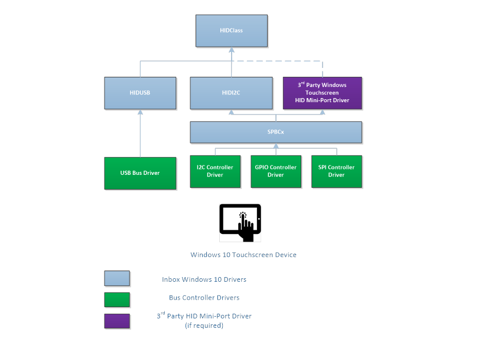
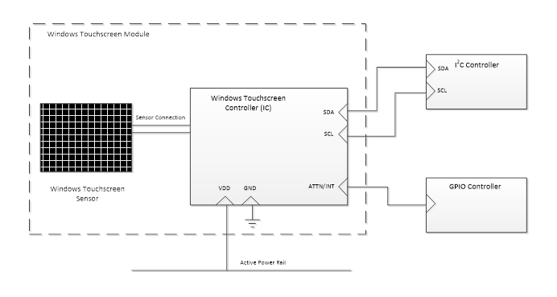

#  Device Bus Connectivity

This topic discusses bus connectivity methods for an integrated Windows touchscreen device.

An integrated Windows touchscreen device can use the Microsoft-provided inbox drivers to connect to its Windows host, using either HID over USB, or HID over I²C. However you can use any other bus that you want, as long as you provide the required Windows-compatible, 3rd party HID mini-port driver for the touchscreen device. The following diagram shows the Windows 10 driver stack for a Windows touchscreen device.

Note that for full compatibility with Windows 10 for desktop editions (Home, Pro, Enterprise, and Education), we recommend using the Windows inbox drivers whenever possible. And if you have to use a 3rd party mini-port driver, then you must add this 3rd party driver to the appropriate OEM, and System Restore images, and then make these images available for download on Windows Update.

The following sections present some examples of device configurations.

## I²C Devices

A Windows Touchscreen module is defined as the combination of a controller IC, a sensor, and any associated mechanisms.

A Windows Touchscreen module that connects to its Windows host via the I²C bus must, at a minimum, expose the following five connection pins:

-   A data line (SDA)
-   A clock line (SCL)
-   An interrupt line
-   A power supply line
-   A ground connection (GND)

The following is a diagram of the connections lines between a Windows Touchscreen device and its Windows host.

When connecting to an I²C controller, it is important to understand the bandwidth demands of all the components sharing that controller. The minimum I²C clock speed of 400 KHz is recommended for a Windows Touchscreen device.

We recommend connecting the interrupt line (also referred to as an ATTN line) to an On-SoC GPIO controller, or to an IOAPIC. The GPIO or IOAPIC resource to which the interrupt line is connected, should be capable of (and configured for) waking the SoC. The wake-up capability allows the Windows Touchscreen to wake the system in various scenarios.

If you decide to use the wake functionality, the power line that is connected to the Windows Touchscreen device should not be shared with other devices which are not wake-capable. In order for wake scenarios to function properly, the power line that is used must be energized during connected standby/S3 conditions.

**ACPI Table Entries**

A Windows Touchscreen device that is connected via I²C must define an entry in the Advanced Configuration and Power Interface (ACPI) table of the host, for the device to be recognized by the host. For more information about ACPI, see [Advanced Configuration and Power Interface Specification](http://www.acpi.info/spec.md).

The ACPI table entry should specify the following information:

| Entry                          | Description                                                                                                                                                                                                                                           |
|--------------------------------|-------------------------------------------------------------------------------------------------------------------------------------------------------------------------------------------------------------------------------------------------------|
| ACPI Device Entry Name         | A 4-character identification unique to the ACPI table, to reference the device. For example, “TOUC”.                                                                                                                                                  |
| ACPI Hardware ID               | A 4-character + 4-number ACPI hardware ID, to reference the device. This is exposed in device manager. For example, “MSFT0001”.                                                                                                                       |
| Compatible ID                  | This should always be “PNP0C50” to indicate that the device is HID I²C compatible.                                                                                                                                                                    |
| I²C Controller                 | Specifies an I²C controller on the Windows host. This controller is used to connect the Touchscreen to the Windows host, and makes it possible for the Touchscreen and the host to communicate. For example, “I2C3” – to indicate I²C controller \#3. |
| I²C Slave Address              | Specifies the I²C slave address for the device. The host uses this address to single out the Touchscreen device on the I²C bus for communication. For example, “0x6F”.                                                                                |
| I²C Speed                      | Specifies the maximum speed supported by both the device and the I²C controller. Specifying the speed in the ACPI table ensures reliable communication. This speed should not be any lower than 400KHz (0x61A80).                                     |
| GPIO Controller                | The GPIO controller to which the interrupt line of the Touchscreen device is connected. This tells the host where to "listen" for interrupt signals. For example, “GPIO0” – to indicate GPIO controller \#0.                                          |
| GPIO Resource/Pin              | The GPIO controller pin to which the interrupt line of the Touchscreen device is connected. The host then associates this specific GPIO pin with interrupt signals from the Touchscreen. For example, “{35}” – to indicate pin 35.                    |
| GPIO Resource Type             | Defines the constraints around the GPIO resource. This entry for the ACPI table, should be set to “Exclusive” unless you want to select SoC wake. If you decide to select SoC Wake, then set this entry to “ExclusiveAndWake”.                        |
| GPIO Interrupt Assertion Type  | Defines the type of triggering that the Touchscreen device will provide for its interrupts. This can either be "Edge-triggered", or "Level-triggered." HID I²C-compliant devices should use “Level-triggered" interrupts.                             |
| GPIO Interrupt Assertion Level | Defines the voltage level on the interrupt line, when the interrupt is asserted by the device. This can be specified as “ActiveLow” or “ActiveHigh”.                                                                                                  |

 

## USB Devices

A high-speed/full-speed integrated Windows Touchscreen device that is connected via USB 2.0, should expose the necessary pins for host connectivity.

Connection to the host can take many forms and is at the discretion of the integrator.

Note that, when connecting to a USB hub, it is important to understand the bandwidth demands of all the components that share the hub. It is highly recommended that high-bandwidth devices, and Windows Touchscreen controllers do not share the same USB hub, as this may result in bandwidth demands that exceed bus capability.

 

 

