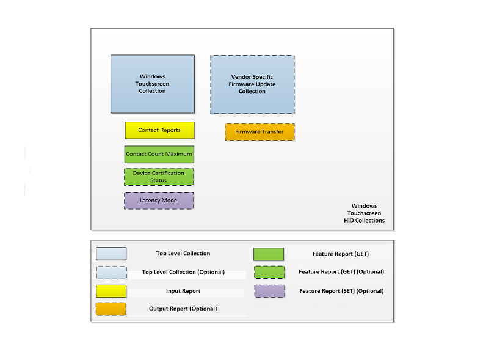
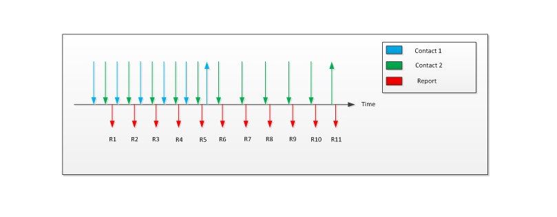

# Required HID Top-Level Collections


This topic discusses the required HID top-level collections that are used for Touchscreen reporting in Windows 10 and later operating systems.

A Windows Touchscreen device should expose, at a minimum, the single mandatory top-level collection for touch reporting. An optional (but recommended) collection for firmware updates can also be implemented.

The following diagram shows the HID collections for a Windows Touchscreen device.



## Windows Touchscreen Collection


In Windows 10 a Touchscreen device can use the HID protocol to provide a top-level collection that appears as a digitizer/touchscreen (Page **0x0D**, Usage **0x04**).

The Windows Touchscreen collection provides multi-contact reporting to the host, as well as device information that pertains to those reports. The collection should support one mandatory input report with contact information, and one feature report with the maximum number of contacts that the digitizer supports. An optional (but highly recommended) feature report can be implemented to obtain latency mode hints from the host, to achieve reduced power consumption on USB devices in sleep mode. Lastly, an optional (but recommended) feature report can be implemented to communicate certification status.

**Windows Touchscreen Input Reports**

Contact Level Usages includes all mandatory usages and supported optional usages that pertain to each unique digitizer contact that is reported. The host uses the following usages (via the Windows Touchscreen collection) to extract contact data from an input report.

<table>
<colgroup>
<col width="20%" />
<col width="20%" />
<col width="20%" />
<col width="20%" />
<col width="20%" />
</colgroup>
<thead>
<tr class="header">
<th>Member</th>
<th>Description</th>
<th>Page</th>
<th>ID</th>
<th>Mandatory/Optional</th>
</tr>
</thead>
<tbody>
<tr class="odd">
<td>Contact ID</td>
<td>Uniquely identifies the contact within a given frame.</td>
<td>0x0D</td>
<td>0x51</td>
<td>Mandatory</td>
</tr>
<tr class="even">
<td>X</td>
<td>X coordinate of contact position.</td>
<td>0x01</td>
<td>0x30</td>
<td><p>Mandatory for T</p>
<p>Optional for C</p></td>
</tr>
<tr class="odd">
<td>Y</td>
<td>Y coordinate of contact position.</td>
<td>0x01</td>
<td>0x31</td>
<td><p>Mandatory for T</p>
<p>Optional for C</p></td>
</tr>
<tr class="even">
<td>Tip</td>
<td>Set, if the contact is on the surface of the digitizer.</td>
<td>0x0D</td>
<td>0x42</td>
<td>Mandatory</td>
</tr>
<tr class="odd">
<td>Confidence</td>
<td>Set, when a contact is too large to be a finger.</td>
<td>0x0D</td>
<td>0x47</td>
<td>Optional</td>
</tr>
<tr class="even">
<td>Width</td>
<td>Width of bounding box around a contact.</td>
<td>0x0D</td>
<td>0x48</td>
<td>Optional</td>
</tr>
<tr class="odd">
<td>Height</td>
<td>Height of bounding box around a contact.</td>
<td>0x0D</td>
<td>0x49</td>
<td>Optional</td>
</tr>
<tr class="even">
<td>Pressure</td>
<td>Amount of pressure the user is applying to the contact point.</td>
<td>0x0D</td>
<td>0x30</td>
<td>Optional</td>
</tr>
<tr class="odd">
<td>Azimuth</td>
<td>The counter-clockwise rotation of the cursor about the Z-axis.</td>
<td>0x0D</td>
<td>0x3F</td>
<td>Optional</td>
</tr>
</tbody>
</table>

 

The following table shows all the mandatory report level usages that should be present in all input reports for a Windows Touchscreen device.

| Member        | Description                                                   | Page | ID   | Mandatory/Optional |
|---------------|---------------------------------------------------------------|------|------|--------------------|
| Report ID     | Windows Touchscreen Report ID.                                | 0x0D | 0x05 | Mandatory          |
| Scan Time     | Relative scan time per frame.                                 | 0x0D | 0x56 | Optional           |
| Contact Count | Total number of contacts that are reported in a given report. | 0x0D | 0x54 | Mandatory          |

 

Any device that does not report all mandatory usages at either the contact or report level, will be non-functional as a Windows Touchscreen device. Mandatory usages are strictly enforced by the Windows host. Where a logical maximum value has not been restricted, it can be optimized to reduce descriptor size.

*Contact ID*

Contact ID uniquely identifies a contact in a report for its lifecycle. The contact ID must remain constant while the contact is detected and reported by the device. Each separate concurrent contact must have a unique identifier. Identifiers can be reused after the previously associated contact is no longer detected or reported. There is no expected numeric range and the values that are used are only limited by the specified logical maximum in the descriptor.

*X/Y*

X and Y report the coordinates of a given contact. A device can report two points for each contact. The first point (known as T) is considered to be the point that the user intended to touch, while the second point (known as C) is considered to be the center of the contact. Devices that are capable of reporting T and C should have a usage array of two X values and two Y values. The values in the first position in the arrays are interpreted as the coordinates for T and the values in the second position are interpreted as the coordinates for C. The report count for both usages is 2, to indicate the presence of a usage array.

Devices that report C must also report the Width and Height usages. The host uses C to build the bounding rectangle around the contact. If the device only reports one X and Y pair, the host uses that pair for T and C. The sample touch descriptor includes usage arrays for both X and Y.

A device that reports only T, must not have a usage array for the X and Y properties. In other words, the report count for each usage is 1 as indicated in the following extracts from the sample descriptor. The excerpts also illustrate the difference between a device that supports only T, and a device that supports T and C.

``` syntax
    0x05, 0x01,                         //       USAGE_PAGE (Generic Desk..
    0x26, 0xff, 0x0f,                   //       LOGICAL_MAXIMUM (4095)         
    0x75, 0x10,                         //       REPORT_SIZE (16)             
    0x55, 0x0e,                         //       UNIT_EXPONENT (-2)           
    0x65, 0x13,                         //       UNIT(Inch,EngLinear)                  
    0x09, 0x30,                         //       USAGE (X)                    
    0x35, 0x00,                         //       PHYSICAL_MINIMUM (0)         
    0x46, 0xb5, 0x04,                   //       PHYSICAL_MAXIMUM (1205)
    0x95, 0x01,                         //       REPORT_COUNT (1)         
    0x81, 0x02,                         //       INPUT (Data,Var,Abs)         
    0x46, 0x8a, 0x03,                   //       PHYSICAL_MAXIMUM (906)
    0x09, 0x31,                         //       USAGE (Y)                    
    0x81, 0x02,                         //       INPUT (Data,Var,Abs)
```

A device that supports T and C, uses usage arrays for reporting the X and Y values. The report count for both X and Y is 2.

``` syntax
    0x05, 0x01,                         //       USAGE_PAGE (Generic Desk..
    0x26, 0xff, 0x0f,                   //       LOGICAL_MAXIMUM (4095)         
    0x75, 0x10,                         //       REPORT_SIZE (16)             
    0x55, 0x0e,                         //       UNIT_EXPONENT (-2)           
    0x65, 0x13,                         //       UNIT(Inch,EngLinear)                  
    0x09, 0x30,                         //       USAGE (X)                    
    0x35, 0x00,                         //       PHYSICAL_MINIMUM (0)         
    0x46, 0xb5, 0x04,                   //       PHYSICAL_MAXIMUM (1205)
    0x95, 0x02,                         //       REPORT_COUNT (2)         
    0x81, 0x02,                         //       INPUT (Data,Var,Abs)         
    0x46, 0x8a, 0x03,                   //       PHYSICAL_MAXIMUM (906)
    0x09, 0x31,                         //       USAGE (Y)                    
    0x81, 0x02,                         
```

**Note**  These examples take advantage of the HID rule that global items stay the same for every main item, until they are changed. This allows both X and Y usages to share just one entry for the report count.

 

The following global items must be specified for the X and Y usages:

-   Logical minimum

-   Logical maximum

-   Physical minimum

-   Physical maximum

-   Unit

-   Unit Exponent

The physical range for the device and the units must be accurately reported. If the information is inaccurate, the device will not work correctly. Devices must also report data within the logical range that is specified in the report descriptor. Any reported value outside this range will be considered as invalid data and the value will be changed to the nearest boundary value (logical minimum or logical maximum).

*Tip*

The tip switch is used to indicate when the contact is on the surface or has left the surface of the digitizer. This is indicated by a main item with a report size of 1 bit. When delivering a contact report, the bit should be set when the contact is on the digitizer surface, and cleared when the contact has left the surface.

When a contact is being reported with the tip switch clear, the X/Y location that is reported should be the same as the last position that was reported with the tip switch set.



As shown in the preceding diagram, two contacts are placed on a Windows Touchscreen. Sometime later, the first contact is lifted while the second remains on the surface. This would be reported as described in the following table.

| Report                | 1      | 2      | 3      | 4      | 5      | 6      | 7      | 8      | 9      | 10       | 11       |
|-----------------------|--------|--------|--------|--------|--------|--------|--------|--------|--------|----------|----------|
| Contact count         | 2      | 2      | 2      | 2      | 2      | 2      | 1      | 1      | 1      | 1        | 1        |
| Contact 1: tip switch | 1      | 1      | 1      | 1      | 1      | 0      | NR     | NR     | NR     | NR       | NR       |
| Contact 1: X, Y       | X₁, Y₁ | X₂, Y₂ | X₃, Y₃ | X₄, Y₄ | X₅, Y₅ | X₆, Y₆ | NR     | NR     | NR     | NR       | NR       |
| Contact 2: tip switch | 1      | 1      | 1      | 1      | 1      | 1      | 1      | 1      | 1      | 1        | 0        |
| Contact 2: X, Y       | X₁, Y₁ | X₂, Y₂ | X₃, Y₃ | X₄, Y₄ | X₅, Y₅ | X₆, Y₆ | X₇, Y₇ | X₈, Y₈ | X₉, Y₉ | X₁₀, Y₁₀ | X₁₁, Y₁₁ |

 

The preceding table shows the report sequence for two contacts with separated lift (Two-Finger Hybrid).

*Confidence*

Confidence is a suggestion from the device about whether the touch contact was an intended, or an accidental touch. If you are confident that the touch is intended, then set the confidence usage to 1 (true) for the duration of the interaction, including lift (when the tip switch is cleared). Your device should reject accidental touches as thoroughly as it can while the latency stays within the required range. If you are not certain that the touch is intended, and your device did not reject the touch as accidental, then change the confidence usage to 0 (false), allowing the operating system to cancel the touch contact as needed. If your device always rejects accidental touches, you do not need to include the confidence usage.

*Width and Height*

The Width and Height usages represent the width and height of the bounding box around the touch contact. The reported values should never be zero (0) except when an “UP” event is being reported, in which case they should be zero (0).

*Pressure*

Pressure is a measurement of the force that the finger exerts against the digitizer surface. There are no restrictions on the range allowed for pressure.

*Azimuth*

Azimuth specifies the counter-clockwise rotation of the cursor around the Z-axis through a full circular range. The physical range and logical range must be specified. The physical range must be 0 to 360 while the logical range must be large enough to deliver data that is accurate to at least two decimal places. Radians can also be used for the physical range. In this case, the logical range must be large enough to report values that are accurate to at least 4 decimal places.

*Scan time*

Scan Time reports relative digitizer time in 100µs units. It represents the delta from the first frame that was reported after a device starts reporting data subsequent to a period of inactivity. The first scan time received is treated as a base time for subsequent reported times. The deltas between reported scan times should reflect the scanning frequency of the digitizer. It is important to note that unlike other usages, the host does not allow any flexibility for the unit for the scan time usage if it is implemented. It must be in 100µs units. The value is expected to roll over, as only 2 bytes are allocated to the counter.

The scan time value should be the same for all contacts within a frame.

*Contact count*

Contact count is used to indicate the number of contacts that are being reported in a given frame, regardless of the tip switches with which the contacts are associated.

**Windows Touchscreen Feature Reports**

The host uses the following usages (via the Windows Touchscreen collection) to extract contact data from an input report.

*Contact Count Maximum Feature Report*

This report specifies the total number of contacts that a multi-touch device supports. A Windows Touchscreen device should report this value via specification of the contact count maximum (Page **0x0D**, Usage **0x55**) in the contact count maximum feature report. While reporting data, a device must not report more contacts than the contact count maximum. Any new contact information reported after the contact count maximum has been reached will be ignored by the host.

*Device Certification Status Feature Report*

When a device passes the compatibility requirements, Microsoft will issue a cryptographically signed binary blob (known as a THQA blob) to the device’s manufacturer . The manufacturer will place this blob into the device’s firmware prior to production. When a touch device attempts to connect, the signature will be verified by the Windows operating system. Windows will only do this for devices that expose the THQA feature report in their descriptor.

**Note**  Reporting a valid certified blob to the host is optional in Windows 10, but is necessary for backwards compatibility with Windows 8 and Windows 8.1. A device with a THQA blob will include the phrase “Full Windows Touch Support" in the control panel. A device without a certified THQA blob will indicate the phrase “Windows Touch Support” in the control panel.

 

The blob itself will consist of 256 bytes of binary data, and should be reported as illustrated by the following HID descriptor. Device manufacturers should be sure that before they issue the signed binary blob from Microsoft, the sample blob provided below is presented to Windows instead.

``` syntax
    0x06, 0x00, 0xff,                   //     USAGE_PAGE (Vendor Defined)  
    0x09, 0xC5,                         //     USAGE (Vendor Usage 0xC5)    
    0x15, 0x00,                         //     LOGICAL_MINIMUM (0)          
    0x26, 0xff, 0x00,                   //     LOGICAL_MAXIMUM (0xff) 
    0x75, 0x08,                         //     REPORT_SIZE (8)             
    0x96, 0x00, 0x01,                   //     REPORT_COUNT (0x100 (256
```

The following is the sample blob in clear text.

``` syntax
0xfc, 0x28, 0xfe, 0x84, 0x40, 0xcb, 0x9a, 0x87, 0x0d, 0xbe, 0x57, 0x3c, 0xb6, 0x70, 0x09, 0x88,
0x07, 0x97, 0x2d, 0x2b, 0xe3, 0x38, 0x34, 0xb6, 0x6c, 0xed, 0xb0, 0xf7, 0xe5, 0x9c, 0xf6, 0xc2,
0x2e, 0x84, 0x1b, 0xe8, 0xb4, 0x51, 0x78, 0x43, 0x1f, 0x28, 0x4b, 0x7c, 0x2d, 0x53, 0xaf, 0xfc,
0x47, 0x70, 0x1b, 0x59, 0x6f, 0x74, 0x43, 0xc4, 0xf3, 0x47, 0x18, 0x53, 0x1a, 0xa2, 0xa1, 0x71,
0xc7, 0x95, 0x0e, 0x31, 0x55, 0x21, 0xd3, 0xb5, 0x1e, 0xe9, 0x0c, 0xba, 0xec, 0xb8, 0x89, 0x19,
0x3e, 0xb3, 0xaf, 0x75, 0x81, 0x9d, 0x53, 0xb9, 0x41, 0x57, 0xf4, 0x6d, 0x39, 0x25, 0x29, 0x7c,
0x87, 0xd9, 0xb4, 0x98, 0x45, 0x7d, 0xa7, 0x26, 0x9c, 0x65, 0x3b, 0x85, 0x68, 0x89, 0xd7, 0x3b,
0xbd, 0xff, 0x14, 0x67, 0xf2, 0x2b, 0xf0, 0x2a, 0x41, 0x54, 0xf0, 0xfd, 0x2c, 0x66, 0x7c, 0xf8,
0xc0, 0x8f, 0x33, 0x13, 0x03, 0xf1, 0xd3, 0xc1, 0x0b, 0x89, 0xd9, 0x1b, 0x62, 0xcd, 0x51, 0xb7,
0x80, 0xb8, 0xaf, 0x3a, 0x10, 0xc1, 0x8a, 0x5b, 0xe8, 0x8a, 0x56, 0xf0, 0x8c, 0xaa, 0xfa, 0x35,
0xe9, 0x42, 0xc4, 0xd8, 0x55, 0xc3, 0x38, 0xcc, 0x2b, 0x53, 0x5c, 0x69, 0x52, 0xd5, 0xc8, 0x73,
0x02, 0x38, 0x7c, 0x73, 0xb6, 0x41, 0xe7, 0xff, 0x05, 0xd8, 0x2b, 0x79, 0x9a, 0xe2, 0x34, 0x60,
0x8f, 0xa3, 0x32, 0x1f, 0x09, 0x78, 0x62, 0xbc, 0x80, 0xe3, 0x0f, 0xbd, 0x65, 0x20, 0x08, 0x13,
0xc1, 0xe2, 0xee, 0x53, 0x2d, 0x86, 0x7e, 0xa7, 0x5a, 0xc5, 0xd3, 0x7d, 0x98, 0xbe, 0x31, 0x48,
0x1f, 0xfb, 0xda, 0xaf, 0xa2, 0xa8, 0x6a, 0x89, 0xd6, 0xbf, 0xf2, 0xd3, 0x32, 0x2a, 0x9a, 0xe4,
0xcf, 0x17, 0xb7, 0xb8, 0xf4, 0xe1, 0x33, 0x08, 0x24, 0x8b, 0xc4, 0x43, 0xa5, 0xe5, 0x24, 0xc2
```

*Latency Mode Feature Report*

**Note**  Windows 10, version 1511 and earlier operating systems do not currently issue this HID feature report to Pen or Touchscreen devices that happen to provide support for it. However, adding support for the *Latency Mode Feature Report* to a device, will make sure that the device is ready for the future date when Windows supports it on Pen and Touchscreen devices.

 

The latency mode feature report is sent by the host to a Windows Touchscreen device, to indicate when high latency is desirable for power savings, and conversely, when normal latency is desired for operation. For USB-connected Windows Touchscreen devices, this allows the device to differentiate between being suspended for inactivity (runtime IDLE), and being suspended because the system is entering S3 or Connected Standby.

The latency mode should be indicated via the value for the latency mode usage (Page **0x0D**, Usage **0x60**) in the latency mode feature report.

| Latency mode value | Latency mode   |
|--------------------|----------------|
| 0                  | Normal latency |
| 1                  | High latency   |

 

## Firmware Update Collection (Optional)


A Windows Touchscreen device can use the HID protocol to provide a vendor-specific top-level collection for performing device firmware, and vendor configuration updates.

The vendor-specific firmware update collection can provide an output report for transferring the firmware payload from the host to the device.

This is highly advantageous as it allows for firmware updates to be performed without requiring a driver on the host. It is mandatory for the *wVersionID* device attribute to be incremented after a firmware upgrade.

A Windows Touchscreen device should be able to recover from a firmware update that failed due to power loss (or some other error), if you shut down, and then reapply its power supply. It is highly recommended that basic functionality be available even after a failed firmware update.

 

 


