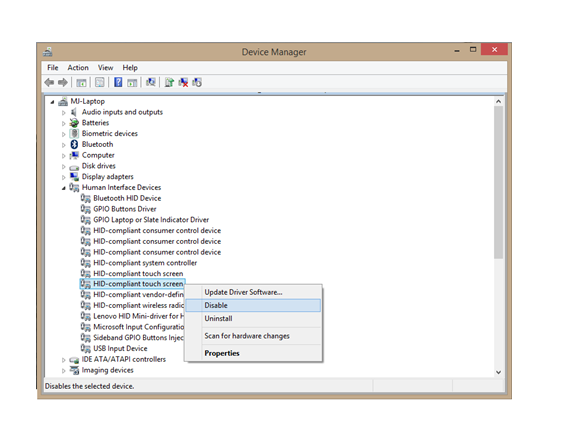

# Touchscreen Validation Overview

This topic presents a brief overview of the assumed device test conditions for Touchscreen device validation.

In order to ensure that all Windows Hardware Lab Kit (HLK) tests run successfully, it is important to follow the guidelines in this document as closely as possible.

This Touchscreen Validation Guide makes the following assumptions about the test environment of the device:

-   HLK tests are being run on a device with Windows 10 installed.
    - Only the Windows 10 for desktop editions (Home, Pro, Enterprise, and Education) are supported by the HLK tests at this time.
-   Device under test has a diagonal screen size of 4.5” - 30.”

-   Device reports HID usages as described in the [Protocol Implementation](touchscreen-protocol-implementation.md) section of the *Touchscreen Implementation Guide*.

-   Testing setup has all the required equipment that is detailed in [Hardware Requirements and Vendor Information](touchscreen-hardware-requirements-and-vendor-information.md).

-   Each HLK test is performed according to the General Testing Guidelines, as well as any notes and instructions that are specific to that test.

-   A test system that has multiple Touchscreen devices, has only one of them enabled - the one under test - and all others disabled. Use Device Manager to make this configuration, as shown in the following screenshot.

    **Note**  The HLK tests will NOT work properly if a system has more than one touchscreen enabled!

     

    

If your device or testing setup does not meet the criteria outlined in the preceding list, you will not be able to successfully perform the Windows 10 HLK tests for your Touchscreen device.

 

 

