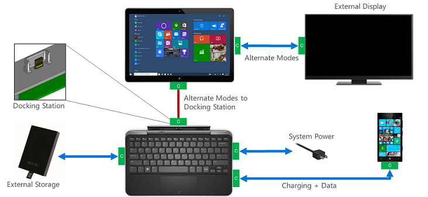
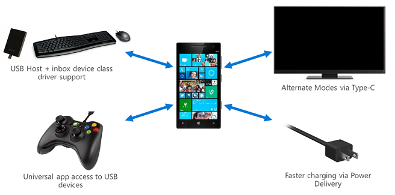

# Universal Serial Bus (USB)

This document provides recommendations for the design and development of USB components, including minimum hardware requirements, Windows Hardware Compatibility Program requirements, and other recommendations that build on those requirements. The goal of this document is to enable ecosystem partners to build a device with optimized USB functionality.

## Minimum hardware requirements for USB

USB is optional for all devices and computers that run Windows 10. Windows 10 supports the following USB controllers:

-   Function controllers

-   Host controllers

-   [Dual-role OTG controllers](https://msdn.microsoft.com/library/windows/hardware/dn957036.aspx)

For the complete set of hardware requirements for Windows 10, see [Minimum hardware requirements](https://msdn.microsoft.com/library/windows/hardware/dn915086.aspx).

## Windows Hardware Compatibility Program requirements for USB

The [System.Fundamentals.SystemUSB.SystemExposesUSBPort](https://msdn.microsoft.com/library/windows/hardware/dn932827.aspx#systemfundamentalssystemusbsystemexposesusbport) Windows Hardware Compatibility Program requirement has a table that lists which USB controller types are recommended, supported, or not supported.

The following table summarizes all of the [Windows Hardware Compatibility Program](https://msdn.microsoft.com/library/windows/hardware/dn922588.aspx) requirements for USB, with a link to more details about each requirement. The Windows Hardware Compatibility Program leverages tests in the Windows [Hardware Lab Kit](https://msdn.microsoft.com/library/windows/hardware/dn930814.aspx) (HLK), which OEMs can use to help diagnose issues early in the development process, ensure driver compatibility with Windows, and optionally certify devices or systems. New tests in the HLK can validate Dual Role and Function mode on any Windows 10 edition.

| Requirement                                                                                                                                                                                     | Description                                                                                                                                          |
|-------------------------------------------------------------------------------------------------------------------------------------------------------------------------------------------------|------------------------------------------------------------------------------------------------------------------------------------------------------|
| [ExternalUSBonCSisEHCIorXHCI](https://msdn.microsoft.com/library/windows/hardware/dn932827.aspx#systemfundamentalssystemusbexternalusboncsisehciorxhci)                                         | External USB ports on a system that support connected standby must be EHCI or xHCI.                                                                  |
| [SuperSpeedCapableConnectorRequirements](https://msdn.microsoft.com/library/windows/hardware/dn932827.aspx#systemfundamentalssystemusbsuperspeedcapableconnectorrequirements)                   | Each exposed SuperSpeed capable connector supports SuperSpeed, high, full and low speed USB devices routed through its xHCI controller.              |
| [SystemExposesUSBPort](https://msdn.microsoft.com/library/windows/hardware/dn932827.aspx#systemfundamentalssystemusbsystemexposesusbport)                                                       | Systems are recommended to expose at least one user-accessible USB port. If a USB port is exposed, this section covers requirements for it.          |
| [TestedUsingMicrosoftUsbStack](https://msdn.microsoft.com/library/windows/hardware/dn932827.aspx#systemfundamentalssystemusbtestedusingmicrosoftusbstack)                                       | Systems with xHCI Controllers must be tested with Microsoft's xHCI Stack installed.                                                                  |
| [USBDevicesandHostControllersWorkAfterPowerCycle](https://msdn.microsoft.com/library/windows/hardware/dn932827.aspx#systemfundamentalssystemusbusbdevicesandhostcontrollersworkafterpowercycle) | All USB devices and host controllers work properly upon resume from sleep, hibernation or restart without a forced reset of the USB host controller. |
| [XhciBiosHandoffFollowsSpec](https://msdn.microsoft.com/library/windows/hardware/dn932827.aspx#systemfundamentalssystemusbxhcibioshandofffollowsspec)                                           | xHCI BIOS handoff follows section 4.2.2.1 of the XHCI specification.                                                                                 |
| [XHCIControllersMustHaveEmbeddedInfo](https://msdn.microsoft.com/library/windows/hardware/dn932827.aspx#systemfundamentalssystemusbxhcicontrollersmusthaveembeddedinfo)                         | Systems with xHCI controllers must have embedded ACPI information for port routing.                                                                  |
| [XhciSupportsMinimum31Streams](https://msdn.microsoft.com/library/windows/hardware/dn932827.aspx#systemfundamentalssystemusbxhcisupportsminimum31streams)                                       | xHCI controller must support at least 31 primary streams per endpoint.                                                                               |

 

## New USB features in Windows 10

Windows 10 supports:

-   Dual Role controllers, which can function as either a USB Host or a USB Device. For example, a phone can connect to a PC as a USB device or it can connect to other USB peripherals as a USB host.

-   USB Type C, a new flip-able, reversible USB connector approximately the same size as a USB micro-B connector. In addition, USB Type-C introduces new support for the following features:

    -   USB 3.1 Gen 2 (10Gb/s)
    -   Power Delivery, enabling devices and systems to provide and consume up to 20V, 5A.
    -   Alternate Modes, enabling non-USB protocols such as DisplayPort, Thunderbolt, or MHL to use the USB Type-C connector.
    -   Billboard error message
-   USB 2.0, 3.0, and now USB 3.1, allowing OEMs to easily choose from a wide variety of controllers and peripherals.

-   [Universal drivers](https://msdn.microsoft.com/library/windows/hardware/dn941241.aspx) can be built for USB peripherals that run on all Windows 10 Devices, from Internet-of-Things (IOT) to servers.

Partners are recommended to test these new features by using the [Hardware Lab Kit](https://msdn.microsoft.com/library/windows/hardware/dn930814.aspx) and to visit the [USB Core Team blog](http://blogs.msdn.com/b/usbcoreblog/) for updated info about features and HLK tests, including these posts related to Windows 10:

-   [USB tests in the Windows 10 Hardware Lab Kit (HLK)](http://blogs.msdn.com/b/usbcoreblog/archive/2015/05/15/usb-tests-in-the-windows-10-hardware-lab-kit-hlk.aspx)

-   [New in Windows 10: USB Dual Role, Type-C, SuperSpeedPlus, and much more…](http://blogs.msdn.com/b/usbcoreblog/archive/2015/05/11/new-in-windows-10-usb-dual-role-type-c-superspeedplus-and-much-more.aspx)

-   [New in Windows 10: USB Dual Role on Mobile](http://blogs.msdn.com/b/usbcoreblog/archive/2015/05/11/new-in-windows-10-usb-dual-role-on-mobile.aspx)

### USB scenarios for Windows 10 devices

Windows 10 enables hardware vendors to innovate and build great Dual Role and USB Type-C systems. A few examples of the new scenarios enabled by new USB features in Windows 10 are illustrated below:

-   Replace proprietary docking connectors with industry standard USB Type-C connector

-   Faster charging via USB Type-C current and/or Power Delivery

-   Allow for external USB peripherals to charge the system

-   Output video/audio over USB Type-C using Alternate Modes

-   Connect USB peripherals to Windows Mobile devices

-   Write Universal Applications that can interact with custom USB peripherals

Figure 1 Example of new USB scenarios for a Windows 10 Desktop system

Figure 2 Example of new USB scenarios for a Windows 10 Mobile device

## New Guidelines for USB for Windows 10

-   In general, USB should “just work” with minimal user interaction.
-   Hardware/firmware is expected to make the initial policy decisions introduced with the Dual Role, Power Delivery, and Alternate Mode features.
-   Windows will make policy adjustments to improve the user experience and help the user to troubleshoot issues if things go wrong.
-   Partners should ensure their new USB hardware (such as systems, hubs, cables, or accessories) can interoperate with other new USB hardware coming to or already on the market. We encourage participation in USB-IF-hosted interoperability and compliance events.
-   We recommend supporting the DisplayPort Alternate Mode for outputting video/audio over USB Type-C.
-   For systems with multiple USB ports that have different USB capabilities, we recommend making it clear to the customer which ports have which capabilities. For example, an icon imprinted next to the USB port can be used to show that the port supports Alternate Modes and Power Delivery.
-   Partners should follow the latest ACPI spec for how to properly describe their USB ports, such as the \_UPC and \_PLD methods.

## Maintained guidelines for USB from Windows 8.1

These guidelines from Windows 8.1 are maintained for Windows 10.

## Hardware

For improved power efficiency and performance, it is recommended USB Host Controllers are at least USB 3.0 compatible with an XHCI controller integrated into the SoC or chipset. The operating system supports standard EHCI and XHCI 1.0 controllers, including debug registers. If the host controller is not fully compatible with the published standard specifications, the deviations must be documented and support for the host controller is determined on a case-by-case basis. In addition, the debug capability is important for XHCI host controllers.

| USB Host Controller Interface                          | Remarks                                              |
|--------------------------------------------------------|------------------------------------------------------|
| XHCI 1.0+Errata or higher (including debug capability) | Required per the Windows HLK starting from June 2012 |
| EHCI                                                   | Supported                                            |
| UHCI/OHCI Companion Controllers                        | Not-supported                                        |

 

## Related topics

[USB Core Team blog](http://blogs.msdn.com/b/usbcoreblog/)

[Enabling New USB Connectivity Scenarios](https://channel9.msdn.com/Events/WinHEC/2015/WHT200)

[Building New Apps for USB Accessories](https://channel9.msdn.com/events/Build/2015/3-81)

[Windows 10: What's new for USB](https://msdn.microsoft.com/library/windows/hardware/dn957037.aspx)

[Building great USB 3.0 devices](http://channel9.msdn.com/events/BUILD/BUILD2011/HW-773T)

[Integrating with the Windows Device Experience](http://channel9.msdn.com/events/BUILD/BUILD2011/APP-408T)

[Running Windows from an External USB drive with Windows To Go](http://channel9.msdn.com/events/BUILD/BUILD2011/HW-245T)

[Universal Serial Bus (USB) Drivers](http://go.microsoft.com/fwlink/?LinkId=227351)

[Setting Up a USB 3.0 Connection in Visual Studio](http://go.microsoft.com/fwlink/?LinkId=227376)

[Setting Up a USB 3.0 Connection Manually](http://go.microsoft.com/fwlink/?LinkId=227380)

[USB Reference](http://msdn.microsoft.com/library/windows/hardware/ff540134.aspx)