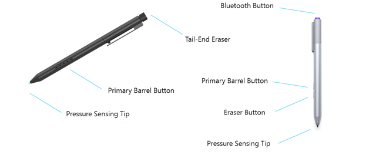

# Windows Pen Designs

This topic presents information about the pen devices that are compatible with Windows 10.

## Physical Design

The physical pen device that the user interacts with may have a variety of industrial designs. However all compatible integrated Windows 10 pen devices have a pressure sensitive tip and an erase *affordance*. The erase affordance can be implemented as a physical button on the pen, or as a tail-end eraser (similar to a traditional pencil). The following image illustrates these potential implementations; a pen with a tail-end eraser on the left and a pen with an eraser button on the right.

For information about the erase affordance, the optional barrel button, and how to report pressure, see [Windows Pen States](windows-pen-states.md).

## Button Placement

If implementing a Bluetooth button to support the quick launch features of Windows Ink Workspace, please ensure that the button is placed at the tail-end of the pen device as shown in the above figure.

**Note**  Bluetooth buttons should not be placed on the side of the barrel, nor should barrel buttons utilized for selection or erase be overloaded with functionality that depends on the pen’s position/state, as this typically leads to a subpar user experience.  

 

## Bluetooth Button Implimentation

To implement a tail-end Bluetooth button, the device will report 3 distinct keyboard combinations corresponding to 3 distinct button actions via a HID Bluetooth LE keyboard device exposed to the host. The actions and corresponding keyboard combinations are outlined below:

| Bluetooth Button Action | Key Combination to Report |
|-------------------------|---------------------------|
| Single-click            | WIN+F20                   |
| Double-clock            | WIN+F19                   |
| Press and hold          | WIN+F18                   |

 

 

 

